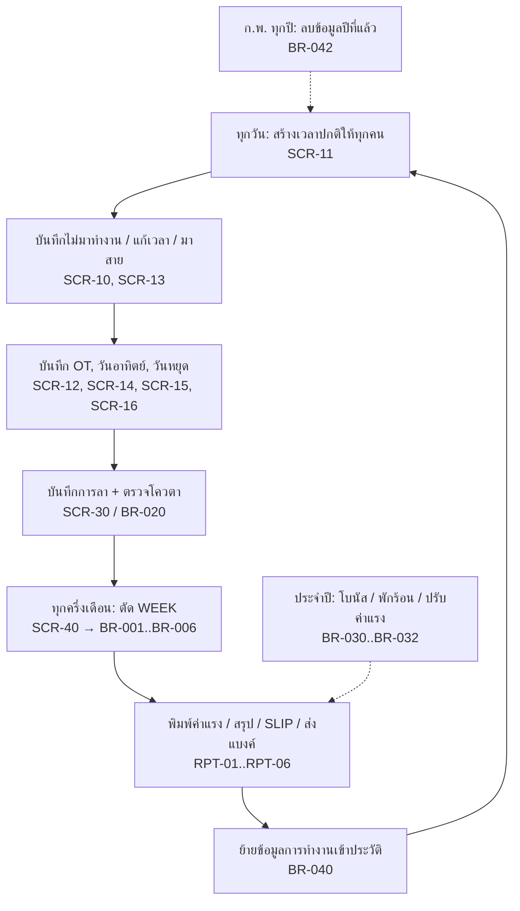

# ระบบพนักงานและค่าแรง (พนักงาน.accdb)

> สถานะ: **สเปคระบบเดิม — ถอดครบจากไฟล์แล้ว และตรวจตาม review-checklist แล้ว, รอผู้ใช้ตอบคำถามกลุ่ม ก.** — อัปเดตล่าสุด 2026-10-05
> ที่มา: `source/พนักงาน.accdb` (149 MB) — ถอดจากตาราง 143, คิวรี 641, มาโคร 108, ฟอร์ม 97, รายงาน 75, โมดูล VBA 1 ตัว (ยังไม่ได้สัมภาษณ์ผู้ใช้)

**ขอบเขตของเอกสารชุดนี้ (D-03):** บรรยาย *การทำงานของโปรแกรมเดิม* ให้ครบถ้วน ส่วนการออกแบบระบบใหม่จะพิจารณาภายหลัง
- ข้อที่ขึ้นต้นด้วย "ข้อเสนอสำหรับระบบใหม่" และหัวข้อ "ระบบใหม่" ใน non-functional / acceptance เป็นเพียงบันทึกไว้ ยังไม่ใช่ข้อตกลง
- ชั้นเอกสาร:
  1. ไฟล์ระดับบน (business-rules, screens, reports …) — การตีความทางธุรกิจ พร้อมอ้างอิงที่มา
  2. [legacy/](legacy/README.md) — ข้อเท็จจริงดิบของโปรแกรมเดิม สร้างอัตโนมัติ ครบทุกชิ้น:
     - ตาราง/ฟิลด์ทุก property
     - SQL ทุกคิวรี พร้อมว่าใครเรียกใช้
     - ทุกขั้นของมาโคร
     - ทุก control/สูตร/ป้ายข้อความของฟอร์มและรายงาน
     - VBA ทั้งหมด

## วัตถุประสงค์
ระบบ HR และค่าแรงของโรงงาน (ผลิตผ้าเบรก/ผ้าคลัทช์/ไดคาสท์) ใช้เก็บประวัติพนักงาน บันทึกเวลาทำงานรายวัน, OT, การลา และใบเตือน จากนั้นคำนวณค่าแรงทุก "WEEK" (งวดครึ่งเดือน) ออกสลิปและรายงานส่งธนาคาร
งานประจำปีที่ระบบรองรับคือคำนวณโบนัส ค่าพักร้อน และการปรับค่าแรง โดยอิงจากสถิติการลาและใบเตือน

## ผู้ใช้
| บทบาท | ทำอะไรในระบบ | ความถี่ |
|---|---|---|
| เจ้าหน้าที่บุคคล (HR) 🔍 | ทำทุกฟังก์ชัน ระบบไม่มีการ login หรือแบ่งสิทธิ์ | ทุกวัน |

❓ Q-01: มีผู้ใช้กี่คน และใครบ้าง ระบบใหม่ต้องแบ่งสิทธิ์หรือไม่ (เช่น หัวหน้าแผนกบันทึกลา, HR คำนวณค่าแรง)

## ขอบเขต
**ทำ:**
- ทะเบียนพนักงานและแผนก
- บันทึกเวลาทำงาน, OT, วันอาทิตย์/วันหยุด, การขาดงาน, การมาสาย
- บันทึกการลาพร้อมตรวจโควตา และบันทึกใบเตือน
- ตัด WEEK: คำนวณค่าแรงงวดครึ่งเดือน รวมกรณีพิเศษช่วงปีใหม่ที่ตัดเป็น 2 ช่วง
- สลิปเงินเดือน, รายงานส่งธนาคาร (ทหารไทย = ค่าแรง, กสิกรไทย = OT), รายงานสรุปค่าแรงรายแผนกและรายเดือน
- โบนัส, ค่าพักร้อน, ปรับค่าแรงประจำปี, การประเมินผล
- เอกสารพิมพ์: ใบลา, ใบลาออก, หนังสือรับรองการทำงานและเงินเดือน, หนังสือเกษียณ/ปลดออก, ใบอนุมัติบรรจุ, สัญญาจ้าง, ทะเบียนผู้ประกันตน, แบบ คร.2
- การย้ายข้อมูลเก่าไปตารางประวัติ และการลบข้อมูลรายปี

**ไม่ทำ (Out of scope) ในระบบเดิม:**
- ไม่มีการดึงข้อมูลจากเครื่องสแกนนิ้ว/ตอกบัตร เวลาเข้า-ออกทุกค่าคีย์มือ (✅ ไม่พบ import ใด ๆ ในโค้ด)
- ไม่หักประกันสังคม/ภาษี/เงินกู้ ยอดสุทธิในสลิปเท่ากับยอดรวมรายได้ (✅ คิวรี SLIP ไม่เติมช่อง `SO_S`, `TAX`, `INS`) — ❓ Q-02
- ไม่สร้างไฟล์ส่งธนาคารเอง (✅ ไม่พบ TransferText/OutputTo) ผู้ใช้ export รายงานเป็น Excel แล้วใช้ template ของธนาคารสร้างไฟล์ตามคู่มือ RPT-06 (INT-01, INT-02) — ❓ Q-03
- ไม่มี login, audit log หรือการแบ่งสิทธิ์

## Workflow หลัก

งวด WEEK: งวดครึ่งเดือน (เดือนละ 2 งวด) พนักงานรายเดือนได้ `SALARY/2` ต่องวด · วันจ่ายเป็นวันที่ 1 หรือ 16 เท่านั้น ✅ (คู่มือธนาคาร RPT-06) · งวดล่าสุดคือ `27/08/2026 – 11/09/2026` จ่าย `16/09/2026` ❓ Q-04: วันตัดงวดของแต่ละเดือนคือวันไหน (เช่น 12–26 และ 27–11)

## Constraints / Tech stack
- ระบบใหม่: ❓ Q-05 ยังไม่กำหนด tech stack
- ภาษาที่แสดงผล: ไทย
- วันที่: Access เก็บเป็น Date (ค.ศ. ภายใน) แต่แสดงเป็น พ.ศ. ตาม locale ไทย (🔍 ฟิลด์ `CODE` มีค่าแบบ `11/9/25698:00:00WD010`)
- เงิน: บาท ปัดเป็นจำนวนเต็ม (ดู BR-003)

## เอกสารในโฟลเดอร์นี้
| ไฟล์ | เรื่อง | สถานะ | ❓ ค้าง |
|---|---|---|---|
| [glossary.md](glossary.md) | คำศัพท์ | ถอดครบ | – |
| [data-model.md](data-model.md) | ตาราง ฟิลด์ ความสัมพันธ์ (143 ตาราง: ย้าย 29, ไม่ย้าย 114 พร้อมหลักฐาน) | ถอดครบ — ทุกฟิลด์ของกลุ่ม A–C | Q-08, Q-09, Q-11, Q-12, Q-14, Q-15, Q-16, Q-44 |
| [business-rules.md](business-rules.md) | กฎธุรกิจ BR-001…BR-073 ครอบคลุมทุก flow ในเมนูและ flow ที่ไม่มีทางเข้า | ถอดครบ | ดู open-questions ก. |
| [screens.md](screens.md) | แผนผังเมนูครบ 116 รายการ + หน้าจอ SCR-xx | ถอดครบ (control ทุกตัวอยู่ใน legacy/forms) | Q-01, Q-12, Q-36, Q-38 |
| [reports.md](reports.md) | รายงาน RPT-xx ครอบคลุม 75 รายงาน | ถอดครบ (เลย์เอาต์อยู่ใน legacy/reports) | Q-02, Q-12, Q-39, Q-40 |
| [integrations.md](integrations.md) | ส่งธนาคาร ttb/กสิกร, ประกันสังคม, คร.2 (INT-01…INT-07) | ถอดครบ | Q-02, Q-03, Q-37, Q-41, Q-42 |
| [non-functional.md](non-functional.md) | สิทธิ์ ปริมาณ รูปแบบข้อมูล Audit การย้ายข้อมูล การพิมพ์ | ข้อมูลระบบเดิม + บันทึกสำหรับระบบใหม่ | Q-01, Q-33, Q-40, Q-43 |
| [acceptance.md](acceptance.md) | เกณฑ์ตรวจรับ AC-xx | ร่าง (ใช้ตอนสร้างระบบใหม่) | – |
| [open-questions.md](open-questions.md) | คำถามค้าง + การตัดสินใจ | ก. ความเข้าใจระบบเดิม · ข. ระบบใหม่ 16 ข้อ (พักไว้) | – |
| [legacy/](legacy/README.md) | เอกสารอ้างอิงระบบเดิมทั้งหมด (สร้างอัตโนมัติ, ครบ 143 ตาราง / 641 คิวรี / 108 มาโคร / 97 ฟอร์ม / 75 รายงาน / VBA) | ครบ — SQL ตรงกับไฟล์ทุกคิวรี | – |

ความครอบคลุมวัตถุของระบบเดิม (ตรวจ 2026-10-05 เทียบกับ `source/พนักงาน.accdb`):
- ตาราง 143, ฟอร์ม 97, รายงาน 75, มาโคร 108 — ทุกชิ้นถูกอ้างในไฟล์ระดับบนอย่างน้อยหนึ่งครั้ง หรืออยู่ในรายการ "ไม่มีทางเข้า/ไม่ย้าย" พร้อมหลักฐาน
- คิวรี 641 — ทุกตัวอยู่ใน [legacy/queries.md](legacy/queries.md) จัดตามมาโคร (flow) ที่เรียกใช้ ซึ่งแต่ละ flow อ้างใน BR-xxx; คิวรีที่ไม่ถูกเรียก 98 ตัว (78 ไม่มีใครเรียก + 20 ถูกเรียกเฉพาะจากคิวรีที่ไม่ถูกใช้) อยู่ใน [legacy/queries/_ไม่ถูกเรียกใช้.md](legacy/queries/_ไม่ถูกเรียกใช้.md) ❓ Q-12
- SQL ใน legacy ตรงกับไฟล์ต้นฉบับทุกคิวรี
