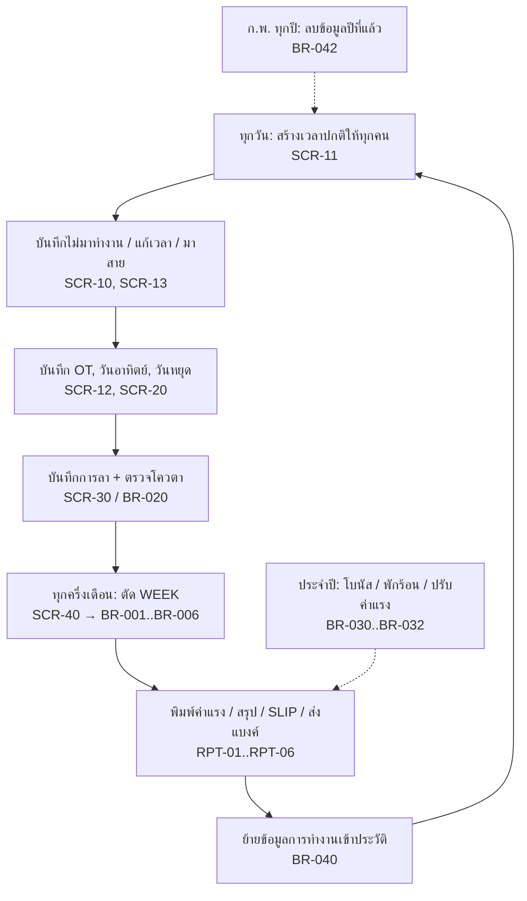

# ระบบพนักงานและค่าแรง (พนักงาน.accdb)

> สถานะ: **สเปคระบบเดิม — ถอดครบจากไฟล์แล้ว, รอผู้ใช้ตอบคำถามกลุ่ม ก.** — อัปเดตล่าสุด 2026-10-04
> ที่มา: `source/พนักงาน.accdb` (149 MB) — ถอดจากตาราง 143, คิวรี 641, มาโคร 108, ฟอร์ม 97, รายงาน 75, โมดูล VBA 1 ตัว (ยังไม่ได้สัมภาษณ์ผู้ใช้)

**ขอบเขตของเอกสารชุดนี้ (D-03):** บรรยาย *การทำงานของโปรแกรมเดิม* ให้ครบถ้วน ส่วนการออกแบบระบบใหม่จะพิจารณาภายหลัง
- ข้อที่ขึ้นต้นด้วย "ข้อเสนอสำหรับระบบใหม่" และหัวข้อ "ระบบใหม่" ใน non-functional / acceptance เป็นเพียงบันทึกไว้ ยังไม่ใช่ข้อตกลง
- ชั้นเอกสาร:
  1. ไฟล์ระดับบน (business-rules, screens, reports …) — การตีความทางธุรกิจ พร้อมอ้างอิงที่มา
  2. [legacy/](legacy/README.md) — ข้อเท็จจริงดิบของโปรแกรมเดิม สร้างอัตโนมัติ ครบทุกชิ้น:
     - ตาราง/ฟิลด์ทุก property
     - SQL ทุกคิวรี พร้อมว่าใครเรียกใช้
     - ทุกขั้นของมาโคร
     - ทุก control/สูตร/ป้ายข้อความของฟอร์มและรายงาน
     - VBA ทั้งหมด

## วัตถุประสงค์
ระบบ HR และค่าแรงของโรงงาน (ผลิตผ้าเบรก/ผ้าคลัทช์/ไดคาสท์) ใช้เก็บประวัติพนักงาน บันทึกเวลาทำงานรายวัน, OT, การลา และใบเตือน จากนั้นคำนวณค่าแรงทุก "WEEK" (งวดครึ่งเดือน) ออกสลิปและรายงานส่งธนาคาร
งานประจำปีที่ระบบรองรับคือคำนวณโบนัส ค่าพักร้อน และการปรับค่าแรง โดยอิงจากสถิติการลาและใบเตือน

## ผู้ใช้
| บทบาท | ทำอะไรในระบบ | ความถี่ |
|---|---|---|
| เจ้าหน้าที่บุคคล (HR) 🔍 | ทำทุกฟังก์ชัน ระบบไม่มีการ login หรือแบ่งสิทธิ์ | ทุกวัน |

❓ Q-01: มีผู้ใช้กี่คน และใครบ้าง ระบบใหม่ต้องแบ่งสิทธิ์หรือไม่ (เช่น หัวหน้าแผนกบันทึกลา, HR คำนวณค่าแรง)

## ขอบเขต
**ทำ:**
- ทะเบียนพนักงานและแผนก
- บันทึกเวลาทำงาน, OT, วันอาทิตย์/วันหยุด, การขาดงาน, การมาสาย
- บันทึกการลาพร้อมตรวจโควตา และบันทึกใบเตือน
- ตัด WEEK: คำนวณค่าแรงงวดครึ่งเดือน รวมกรณีพิเศษช่วงปีใหม่ที่ตัดเป็น 2 ช่วง
- สลิปเงินเดือน, รายงานส่งธนาคาร (ทหารไทย = ค่าแรง, กสิกรไทย = OT), รายงานสรุปค่าแรงรายแผนกและรายเดือน
- โบนัส, ค่าพักร้อน, ปรับค่าแรงประจำปี, การประเมินผล
- เอกสารพิมพ์: ใบลา, ใบลาออก, หนังสือรับรองการทำงานและเงินเดือน, หนังสือเกษียณ/ปลดออก, ใบอนุมัติบรรจุ, สัญญาจ้าง, ทะเบียนผู้ประกันตน, แบบ คร.2
- การย้ายข้อมูลเก่าไปตารางประวัติ และการลบข้อมูลรายปี

**ไม่ทำ (Out of scope) ในระบบเดิม:**
- ไม่มีการดึงข้อมูลจากเครื่องสแกนนิ้ว/ตอกบัตร เวลาเข้า-ออกทุกค่าคีย์มือ (✅ ไม่พบ import ใด ๆ ในโค้ด)
- ไม่หักประกันสังคม/ภาษี/เงินกู้ ยอดสุทธิในสลิปเท่ากับยอดรวมรายได้ (✅ คิวรี SLIP ไม่เติมช่อง `SO_S`, `TAX`, `INS`) — ❓ Q-02
- ไม่สร้างไฟล์ส่งธนาคาร มีแค่รายงานพิมพ์ (✅ ไม่พบ TransferText/OutputTo) — ❓ Q-03
- ไม่มี login, audit log หรือการแบ่งสิทธิ์

## ภาพรวม workflow หลัก

งวด WEEK (🔍 อนุมานจากข้อมูลจริง): งวดล่าสุดคือ `27/08/2026 – 11/09/2026` และจ่ายวันที่ `16/09/2026` พนักงานรายเดือนได้ `SALARY/2` ต่องวด จึงเป็นงวดครึ่งเดือน (เดือนละ 2 งวด) ❓ Q-04: วันตัดงวดของแต่ละเดือนคือวันไหน (เช่น 12–26 และ 27–11)

## Constraints / Tech stack
- ระบบใหม่: ❓ Q-05 ยังไม่กำหนด tech stack
- ภาษาที่แสดงผล: ไทย
- วันที่: Access เก็บเป็น Date (ค.ศ. ภายใน) แต่แสดงเป็น พ.ศ. ตาม locale ไทย (🔍 ฟิลด์ `CODE` มีค่าแบบ `11/9/25698:00:00WD010`)
- เงิน: บาท ปัดเป็นจำนวนเต็ม (ดู BR-003)

## สารบัญ + ความครบถ้วน
| ส่วน | สถานะ | ❓ ค้าง |
|---|---|---|
| [glossary.md](glossary.md) | ถอดครบ | – |
| [data-model.md](data-model.md) | ถอดครบ (ฟิลด์ทุกตารางอยู่ใน legacy/tables.md) | – |
| [business-rules.md](business-rules.md) | ถอดครบทุก flow ในเมนู + flow ที่ไม่มีทางเข้า (BR-001…BR-073) | ดู open-questions ก. |
| [screens.md](screens.md) | ถอดครบ (รายละเอียด control อยู่ใน legacy/forms) | – |
| [reports.md](reports.md) | ถอดครบ (เลย์เอาต์/สูตรทุกช่องอยู่ใน legacy/reports) | – |
| [integrations.md](integrations.md) | ถอดครบ | – |
| [non-functional.md](non-functional.md) | ข้อมูลระบบเดิม + บันทึกสำหรับระบบใหม่ | – |
| [acceptance.md](acceptance.md) | ร่าง (ใช้ตอนสร้างระบบใหม่) | – |
| [open-questions.md](open-questions.md) | ก. ความเข้าใจระบบเดิม 29 ข้อ · ข. ระบบใหม่ 16 ข้อ (พักไว้) | 45 |
| [legacy/](legacy/README.md) | เอกสารอ้างอิงระบบเดิมทั้งหมด (สร้างอัตโนมัติ) | – |
