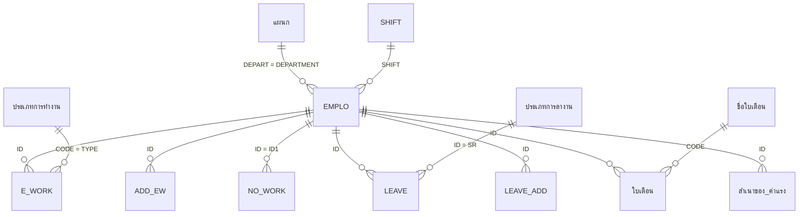

# Data Model — ระบบพนักงานและค่าแรง

ระบบเดิมมี 143 ตาราง แต่ตารางที่เป็น **ข้อมูลจริง** มีไม่ถึง 20 ตาราง ที่เหลือแบ่งเป็น 3 กลุ่ม:
- **ตารางพารามิเตอร์ 1 แถว**: เก็บค่าที่ผู้ใช้กรอกในฟอร์ม เช่น ช่วงวันที่ แล้วให้คิวรีอ่านไปใช้
- **ตารางพักผลลัพธ์**: ถูกล้างแล้วเติมใหม่ทุกครั้งที่รันมาโคร
- **ตารางสำเนา/ทดลอง** ที่เลิกใช้แล้ว

ระบบใหม่ควรมีเฉพาะกลุ่ม A (ข้อมูลหลัก) และกลุ่ม B (ประวัติ) กลุ่ม C–D ให้แทนด้วยพารามิเตอร์ของฟังก์ชันหรือการคำนวณแบบ on-the-fly 🔍

✅ ไม่มีการประกาศ Relationship ใด ๆ ในไฟล์ และตารางเกือบทั้งหมดไม่มีคีย์หลัก ความสัมพันธ์ด้านล่างทั้งหมดจึงอนุมานจาก JOIN ในคิวรี

## สรุปการจัดกลุ่มตาราง

| กลุ่ม | ตาราง | ระบบใหม่ |
|---|---|---|
| **A. ข้อมูลหลัก/ธุรกรรมปัจจุบัน** | EMPLO, แผนก, SHIFT, E_WORK, NO_WORK, OT, LEAVE, ใบเตือน, HOLIDAY, SUNDAY, บันทึกการประเมินผล 🔍 | ย้ายไป |
| **B. ประวัติ (archive)** | ADD_EW (528,745 แถว), LEAVE_ADD (42,240), ใบเตือนADD (301), สำเนาของ ค่าแรง (16,792 = ประวัติค่าแรงทุกงวด) | ย้ายไป (รวมกับตารางปัจจุบันได้ ดู NF-05) |
| **C. Lookup** | ประเภทพนักงาน, ประเภทการทำงาน, ประเภทการลางาน, ได้ค่าแรง, ชื่อใบเตือน, ชื่อลูกค้า, TITLE, เพศ, เวลาพัก, หน้าที่การทำงาน, วุฒิการศึกษา11, สถานพยาบาล, ตำแหน่ง, ฝ่าย, ผู้จัดการฝ่าย, YES,NO | ย้ายไปเป็น enum/master |
| **D. พารามิเตอร์ 1 แถว** | ตั้งวันที่ตัดWEEK, ลางานทั้งแผนก (มีพารามิเตอร์โบนัส/ปรับค่าแรง), วันทำงาน, รหัส1, รหัสพนักงาน, เลือกแผนกที่พิมพ์, วันที่ลบการลางาน, ตั้งวันที่*, ตาราง3 (ลายเซ็น) ฯลฯ | ไม่ย้าย ยกเว้นค่าตั้งค่าที่ต้องจำ (ดู T-Settings) |
| **E. ตารางพักผล** | เวลาทำงาน, ค่าแรง, ค่าแรง1, SLIP, PAYROLL, EMPLOYEE*, เงิน*ส่งแบ็งค์, พิมพ์ลางานทั้งแผนก10, สรุปการลางาน, พักร้อน, ปรับค่าแรง*, สรุปค่าแรง* ฯลฯ | ไม่ย้าย (คำนวณใหม่) |
| **F. ของเก่า/สำเนา/ไม่ใช้** | `สำเนาของ *` (ยกเว้น สำเนาของ ค่าแรง), EMPLO1–3, EMPLOที่ลาออกแล้ว, LEAVE1–3, LEAVE_A/B, E_WORK_A, E_WORKเปล่า, SLIP8/9, ตาราง1/2, คำนวณเวลาทำงาน0*, Name AutoCorrect Save Failures ฯลฯ | ไม่ย้าย ❓ Q-12 |

รายการตารางทั้งหมดพร้อมทุก property ของฟิลด์ (Format, Default, Validation, Lookup ฯลฯ) และเนื้อหาของตาราง lookup/พารามิเตอร์ทุกแถว อยู่ใน [legacy/tables.md](legacy/tables.md)

---

## A. ข้อมูลหลัก

### T-EMPLO — ทะเบียนพนักงาน
หน้าที่: หนึ่งแถวต่อพนักงานหนึ่งคน รวมคนที่ลาออกแล้ว (จะถูกลบหลังลาออก 3 ปี, BR-043)
จำนวนแถว: 443 (ทำงานอยู่ 105 = รายเดือน 22 + รายวัน 83)
✅ ไม่มี PK ในตาราง แต่ทุกคิวรีใช้ `ID` เป็นคีย์ ระบบใหม่ให้ `ID` เป็น PK

| ฟิลด์ | ชนิด | ขนาด | Null | ความหมาย / กฎ |
|---|---|---|---|---|
| ID | Text | 4 | ไม่ | PK, ตัวพิมพ์ใหญ่ (BR-050), รูปแบบ `<รหัสแผนก><เลข 3 หลัก>` 🔍 |
| NAME | Text | 255 | ไม่ | คำนำหน้า+ชื่อ+นามสกุลภาษาไทย ในช่องเดียว (คั่นด้วยช่องว่าง 2 ตัว) — ถูกลบแถวถ้าว่าง (BR-051) |
| SEX | Text | 3 | ไม่ | `M`/`F` (lookup T-เพศ) — ใช้ตรวจสิทธิ์ลาคลอด (BR-020) |
| BORN | Date | | | วันเกิด — ใช้หนังสือเกษียณ 🔍 |
| ID_CODE | Text | 15 | | เลขบัตรประชาชน 13 หลัก |
| ID_S | Text | 15 | | เลขประกันสังคม = คัดลอกจาก ID_CODE อัตโนมัติ (BR-052) |
| PER_ADD | Text | 255 | | ที่อยู่ตามทะเบียนบ้าน |
| ADDRESS | Text | 255 | | ที่อยู่ปัจจุบัน (กรอก 34/105) |
| ID_PLACE, ID_DATE | Text, Date | | | สถานที่/วันออกบัตร |
| START | Date | | ไม่ | วันเริ่มงาน — ใช้คำนวณอายุงาน, ทดลองงาน, โบนัส, พักร้อน, ปรับค่าแรง |
| RESIGN | Date | | ใช่ | วันลาออก ว่าง = ทำงานอยู่ ✅ (ดู BR-005 เรื่องการตีความในค่าแรง) |
| MEM | Text | 255 | | เหตุผลลาออก (เช่น "กลับบ้าน", "ลาบวช") และถูกใช้เป็น flag ชั่วคราว `Y` ตอนลบ (BR-043) |
| NO | Text | 4 | | ลำดับที่ 🔍 (ใช้ในรายงาน) |
| POINT | Text | 12 | | วุฒิการศึกษา (ป.4, ป.6, ม.3, ปวช., ปวส., ปริญญาตรี…) |
| DEPARTMENT | Text | 50 | | ชื่อแผนก (FK → T-แผนก.DEPART **โดยชื่อ** ไม่ใช่รหัส) |
| SECTION | Text | 50 | | ฝ่าย — คัดลอกจาก แผนก.SECTION เมื่อเลือกแผนก (BR-052) |
| POSITION | Text | 18 | | พนักงาน / พนักงานขับรถ / รองหัวหน้า / หัวหน้า |
| WORK | Text | 255 | | หน้าที่/เครื่องจักร เช่น "D11 ฉีดก้ามเบรก" |
| CLAS | Text | 3 | ไม่ | `1` รายเดือน, `2` รายวัน (BR-002) |
| SALARY | Double | | | เงินเดือน (รายวัน = 0) |
| SA_DAY | Double | | | ค่าแรงต่อวัน; รายเดือน = Round(SALARY/30, 2) (BR-052) |
| SHIFT | Text | 3 | | FK → T-SHIFT (ปัจจุบันทุกคน = `D`) |
| HOT1 | Text | 1 | | `Y`/`N` ได้ค่า HOT (ปัจจุบันทุกคน `N`) ❓ Q-08 |
| POINT_1 | Long | | | ค่าแรงต่องวดแบบกำหนดเอง (ว่างทุกคน) ❓ Q-09 |
| ACC | Text | 10 | | เลขบัญชีธนาคารทหารไทย (รับค่าแรง) |
| ACC2 | Text | 255 | | เลขบัญชีกสิกรไทย (รับ OT) |
| NAME TITLE, NAME ENGLISH | Text | | | คำนำหน้า/ชื่ออังกฤษ (ใช้กับไฟล์ธนาคารกสิกร) — คำนำหน้ามีทั้ง `Mrs` และ `Mrs.` (ปัญหาข้อมูล) |
| HOSPITAL | Text | 255 | | โรงพยาบาลประกันสังคม |
| NATION, TELEPHONE | Text | | | |
| GRED_2 | Text | 50 | | flag ชั่วคราว `NO` = ไม่มาทำงานวันนี้ (BR-012) |
| DATE_1, DATE_2, DATE_3, POINT_2, GRED_1, photo | | | | ว่างทุกแถวที่ทำงานอยู่ — 🔍 เลิกใช้ (DATE_3 ใช้ในฟอร์มสัญญาจ้าง = START+118) |

### T-แผนก — แผนก
21 แถว ไม่มี PK ใช้ `DEPART` (ชื่อ) เป็นคีย์ในทางปฏิบัติ

| ฟิลด์ | ความหมาย |
|---|---|
| SUF | ลำดับ 🔍 |
| DEPART | ชื่อแผนก (ไดคาสท์, ตกแต่ง, อัดผ้าเบรก, ฝนผ้าเบรก, ประกอบ, ผ้าคลัทช์และดิสเบรก, ซ่อมบำรุง, บุคคลและธุรการ, สโตร์, ประกันคุณภาพ, แม่พิมพ์, บรรจุ, จัดซื้อและการเงิน …) |
| CODE | ตัวอักษรนำหน้ารหัสพนักงาน + `*` เช่น `D*` ใช้กรอง LIKE |
| SECTION | ฝ่าย (ผลิต, วิศวกรรม, บุคคลและธุรการ, สโตร์, ประกันคุณภาพ, จัดซื้อและการเงิน) |
| SUPER, MANAGER, FACTORY MANAGER | ชื่อหัวหน้า/ผู้จัดการ (ใช้พิมพ์ในเอกสาร) |
| SHIFT | กะเริ่มต้นของแผนก 🔍 |

### T-SHIFT — กะทำงาน
| SHIFT | W_IN | W_OUT | พัก (STOP–START) | OT (O_IN–O_OUT) | REST_T (นาที) |
|---|---|---|---|---|---|
| A, C, D, G | 08:00 | 17:00 | 12:00–13:00 | 17:20–20:10 | 60 |
| B | 20:10 | 05:10 (+1) | 00:10–01:10 | 05:30–08:10 | 60 |
| E | 08:00 | 17:00 | 12:00–13:00 | – | 60 |
| F | 17:00 | 02:00 (+1) | 21:00–22:00 | – | 60 |
มีอีกประมาณ 40 แถวที่ `SHIFT` ว่าง เก็บเฉพาะช่วงเวลา (O_IN/O_OUT) สำเร็จรูป เช่น 17:20–20:10, 05:10–13:40 — 🔍 ใช้เป็นตัวเลือกเวลาใน combo ของฟอร์มบันทึกเวลา/OT (ค่าทั้งหมดดู [legacy/tables.md](legacy/tables.md#t-SHIFT))
✅ เวลาข้ามเที่ยงคืนเก็บเป็นวันที่ 1899-12-31 (Access time serial) — ระบบใหม่ต้องรองรับกะข้ามวัน

### T-E_WORK — เวลาทำงาน (ปัจจุบัน)
หนึ่งแถว = การทำงานหนึ่งรายการของพนักงานหนึ่งคนในหนึ่งวันต่อหนึ่งประเภท 1,451 แถว (เฉพาะงวดปัจจุบัน ที่เก่ากว่าย้ายไป ADD_EW)

| ฟิลด์ | ชนิด | ความหมาย / กฎ |
|---|---|---|
| DATE | Date | วันที่ทำงาน |
| ID | Text | FK → EMPLO.ID (ตัวพิมพ์ใหญ่) แถวที่ ID ว่างจะถูกลบ (BR-051) |
| W_IN, W_OUT | Date(เวลา) | เวลาเข้า-ออก (ค่าเริ่มต้นจากกะ) |
| REST_T | Long | นาทีพัก (0,10,…,60) |
| TYPE | Text | `W`,`O1`,`S`,`O2`,`H`,`O3` (glossary) |
| WORK_T | Double | คำนวณตอนตัด WEEK (BR-001): `W` = วัน (≤1), อื่น ๆ = ชั่วโมง |
| LATE | Date(เวลา) | **เวลาเข้างานจริง** เมื่อมาสาย (คีย์มือ) ว่าง = ไม่สาย ✅ ใช้นับจำนวนครั้งมาสาย |
| MARK | Text | ใช้หลายความหมาย: รหัสลูกค้างานรับจ้าง (`Y`,`S`,`L`,`P`), flag ชั่วคราว `DE`/`y` ตอนลบ/ย้าย — ❓ Q-11 |
| CODE | Text | คีย์กันซ้ำ = `DATE & W_IN & TYPE & ID` (รูปแบบวันที่ตาม locale) ใช้ลบแถวซ้ำ (BR-007) |

คีย์ธรรมชาติที่ระบบใหม่ควรบังคับ unique: (DATE, ID, TYPE, W_IN) 🔍

### T-ADD_EW — ประวัติเวลาทำงาน
โครงสร้างเหมือน E_WORK (แต่ LATE เป็น Text) 528,745 แถว ข้อมูลตั้งแต่ 1899-12-30 (ข้อมูลผิด) ถึง 2026-08-26 — ดู [ปัญหาคุณภาพข้อมูล](#ปัญหาคุณภาพข้อมูลที่พบ)

### T-NO_WORK — ไม่มาทำงาน
หนึ่งแถว = พนักงานหนึ่งคนไม่มาทำงานหนึ่งวัน (ปี 2026: 2,107 แถว) ใช้เพื่อ **ไม่สร้าง** เวลาปกติให้คนนั้นในวันนั้น (BR-010) และพิมพ์รายงานขาดงาน
| ฟิลด์ | ความหมาย |
|---|---|
| DATE1 | วันที่ |
| ID1 | รหัสพนักงาน (แถวที่ว่างถูกลบ) |
| W_IN, W_OUT, WORK_T, TYPE | ค่าคงที่ (08:00, 17:00, 1, `A`) — 🔍 ไม่มีความหมาย |
| LATE, REMARK | ว่าง (REMARK ใช้เป็น flag `DEL` ตอนลบรายปี) |

### T-OT — ใบขออนุมัติทำ OT (พักข้อมูล)
DATE, DEPART, ID, NAME, W_IN, W_OUT, TYPE, REST_T, MEMO (งานที่ทำ)
กรอกรายการ OT ของวันนั้นแล้วพิมพ์ใบขออนุมัติ แล้วคัดลอกเข้า E_WORK (BR-012) ตารางถูกล้างทุกครั้งที่เริ่มรอบใหม่

### T-LEAVE — การลา (ปัจจุบัน)
หนึ่งแถว = การลาหนึ่งครั้ง 2,079 แถว (ข้อมูลปีปัจจุบัน ปีก่อนย้ายไป LEAVE_ADD 42,240 แถว)

| ฟิลด์ | ชนิด | ความหมาย / กฎ |
|---|---|---|
| DATE | Date | วัน-เวลาที่บันทึก (default `Now()`) |
| ID | Text | FK → EMPLO.ID |
| FROM_D, TO_D | Date | วันเริ่ม-สิ้นสุดการลา |
| FROM_T, TO_T | Date(เวลา) | เวลาเริ่ม-สิ้นสุด (08:00–17:00) |
| SUM_D | Single | จำนวนวันลา **คีย์มือ** หน่วย 1/8 วัน (0.125 = 1 ชม.) — ❓ Q-13 ระบบใหม่คำนวณจากเวลาเองได้ไหม |
| SR | Text | ประเภทการลา `1`–`16` (T-ประเภทการลางาน) |
| SAL | Text | `Y` ได้ค่าแรง / `N` ไม่ได้ |
| REMARK | Text | เหตุผล/อาการ |
| SALA_DAY | Single | ค่าแรงต่อวัน ณ วันที่บันทึก (snapshot จาก EMPLO) |
| PAY | Single | ค่าแรงที่ได้ระหว่างลา = SUM_D × SALA_DAY (BR-021) |
| MARK | Text | flag ชั่วคราว (`A` ลบ, `Y` ย้าย) |
| CODE_A | Text | คีย์กันซ้ำ = `FROM_D & TO_D & FROM_T & ID` (BR-007) |

### T-ใบเตือน — ใบเตือน (ปัจจุบัน)
DATE, ID, NAME, DEPART (คัดลอกจาก EMPLO ตอนบันทึก), CODE (1–4), CODE_NAME (คัดลอกชื่อ), REMARK
ประวัติใน ใบเตือนADD (301 แถว)

### T-HOLIDAY / T-SUNDAY — ปฏิทิน
- HOLIDAY (DATE, ITEM = ชื่อวันหยุด) — กรอกเอง ปีละ ~15 วัน
- SUNDAY (DATE, ITEM) — วันหยุดประจำสัปดาห์ กรอกเองหรือกด "เพิ่ม" ทีละ 4 สัปดาห์ (BR-014)

### T-สำเนาของ ค่าแรง — ประวัติค่าแรงทุกงวด
ID, NAME, W, TT_OT, PAY_W, PAY_OT, FROM_DATE, TO_DATE, SUNDAY, HOLIDAY, PAY_D, HOT, OT, MARK — เขียนทับงวดเดิมทุกครั้งที่คำนวณซ้ำ (BR-006) ใช้ทำรายงานสรุปรายเดือน/ปี

### T-บันทึกการประเมินผล — 🔍 ยังไม่ได้วิเคราะห์โครงสร้าง ❓ Q-14

---

## T-Settings — ค่าตั้งค่าที่ต้องจำข้ามรอบ (ระบบใหม่)
ระบบเดิมเก็บในตารางพารามิเตอร์ 1 แถว ระบบใหม่ควรมีตารางตั้งค่า:

| ค่า | ค่าปัจจุบัน | ใช้ใน |
|---|---|---|
| ตัวคูณโบนัสรายเดือน `PAY_M` | 0.5 (เดือน) | BR-030 |
| ตัวคูณโบนัสรายวัน `PAY_D` | 13 (วัน) | BR-030 |
| ขั้นปรับค่าแรงตามอายุงาน `STEP1..STEP5` (%) | 2.83, 2.83, 4, 5, 6 | BR-032 |
| เพดานวันลาสำหรับโบนัส/ปรับค่าแรง `TTL` | 25 | BR-032 |
| ลายเซ็นบนสลิป | รูปใน ตาราง3.SIGN | RPT-04 |
| ค่าธรรมเนียมโอนต่อรายการ | 10 บาท (hard-code) | RPT-06 |

## ความสัมพันธ์ (อนุมานจาก JOIN — ไม่มีการบังคับ referential integrity)

🔍 เมื่อลบพนักงาน (BR-043) ระบบเดิมไม่ลบเวลา/ลา/ใบเตือนของคนนั้น จึงเหลือแถวกำพร้า ❓ Q-15 ระบบใหม่จะลบตาม (cascade) หรือเก็บไว้

## ข้อมูลอ้างอิง (lookup) — ค่าทั้งหมด
- **ประเภทพนักงาน**: `1` รายเดือน, `2` รายวัน
- **ประเภทการทำงาน**: `W` ทำงานปกติ, `O1` OT วันปกติ, `S` ทำงานวันอาทิตย์, `O2` OT วันอาทิตย์, `H` ทำงานวันหยุด, `O3` OT วันหยุด
- **ประเภทการลา**: `1` ลากิจ, `2` ลาป่วยมีใบแพทย์, `3` ลาป่วยไม่มีใบแพทย์, `4` ลาคลอด, `5` ลาอุบัติเหตุในงาน, `6` ลาพักร้อน, `7` ลาอื่นๆ, `8` ขาดงาน, `9` ลากิจฉุกเฉิน, `10` ลาเพื่อระดมพล, `11` ลาเพื่อการศึกษาฝึกอบรมของบริษัท, `12` ลาทำหมัน, `13` ลากิจโดยไม่ได้แจ้งก่อนล่วงหน้า, `14` ลากิจเกินกำหนด, `15` ลาเพื่อการศึกษาฝึกอบรมส่วนตัว, `16` ลาป่วยเป็นโรคระบาด
- **ได้ค่าแรง**: `Y` ได้ค่าแรง, `N` ไม่ได้ค่าแรง
- **ใบเตือน**: `1` ใบเตือนด้วยวาจา, `2` ใบเตือนเป็นหนังสือ, `3` พักงานโดยไม่จ่ายค่าจ้าง ไม่เกิน 7 วัน, `4` เลิกจ้าง
- **ลูกค้า (งานรับจ้าง)**: `Y` ยามาดะ, `S` สยามยูไนเต็ด, `L` แอล ที เวิร์ค, `P` โปรฟิวส์
- **คำนำหน้า**: Mr.=นาย, Mrs.=นาง, Miss=นางสาว
- **เวลาพัก**: 0, 10, 20, 30, 40, 50, 60 นาที

## ปัญหาคุณภาพข้อมูลที่พบ
| # | ปัญหา | ผลต่อการย้ายข้อมูล |
|---|---|---|
| DQ-1 | ADD_EW มีวันที่ 1899-12-30 (วันที่ว่าง/ศูนย์) | กรองหรือแก้ก่อนย้าย |
| DQ-2 | ไม่มี PK เลย — ข้อมูลซ้ำได้ (มีขั้นตอนลบซ้ำ BR-007) | ต้อง dedupe ก่อนบังคับ unique |
| DQ-3 | `NAME TITLE` มีทั้ง `Mrs` และ `Mrs.` | normalize |
| DQ-4 | ชื่อไทยเก็บคำนำหน้า+ชื่อ+สกุลในช่องเดียว คั่นด้วยช่องว่างไม่เท่ากัน | ❓ Q-16 แยกฟิลด์ไหม |
| DQ-5 | แผนกอ้างด้วยชื่อ (ข้อความ) ไม่ใช่รหัส | map เป็น FK |
| DQ-6 | หลังลบพนักงาน (BR-043) มีแถวกำพร้าในตารางประวัติ | ตัดสินใจตาม Q-15 |
| DQ-7 | E_WORK.LATE เป็น Date แต่ ADD_EW.LATE เป็น Text | แปลงชนิด |
