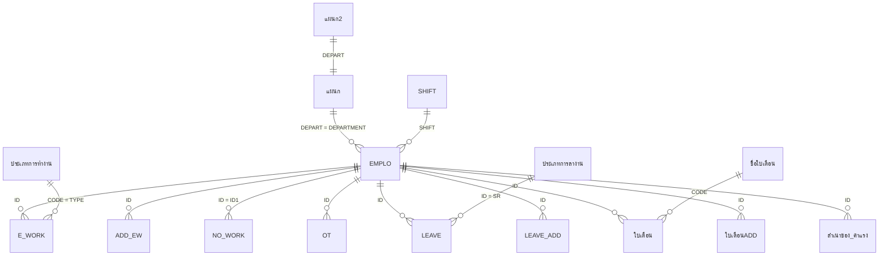

# Data Model — ระบบพนักงานและค่าแรง

ไฟล์นี้บอกว่าข้อมูลแต่ละตาราง/ฟิลด์ **คืออะไร** ส่วนขั้นตอนที่ระบบทำกับข้อมูลอยู่ใน business-rules.md (อ้างด้วย BR-xxx)
ทุกตัวเลขจำนวนแถวและช่วงวันที่มาจาก `source/พนักงาน.accdb` ณ 2026-10-04
รายละเอียดดิบของทุกตาราง (ทุก property ของฟิลด์: Format, Validation, Lookup, Caption) และเนื้อหาของตาราง lookup/พารามิเตอร์ทุกแถว อยู่ใน `source/_extract/พนักงาน/legacy/`tables.md (ไม่อยู่ใน git) — ค่าของตาราง lookup ทุกแถวอยู่ในหัวข้อ "ข้อมูลอ้างอิง" ด้านล่าง

ข้อเท็จจริงทั้งระบบ:
- ✅ ไม่มีการประกาศ Relationship ระหว่างตารางของผู้ใช้เลย (มีแค่ของตารางระบบ MSysNavPane) จึงไม่มี referential integrity และไม่มี cascade
- ✅ ไม่มีตารางใดมี Primary Key — มีแต่ index ไม่ unique คอลัมน์ Key ด้านล่างจึงบอก index ที่มีจริง และคีย์ที่ใช้ในทางปฏิบัติ (🔍)
- ✅ ไม่มีฟิลด์ใดตั้ง Required = Yes ในตารางกลุ่ม A–C ค่าบังคับทั้งหมดเกิดจากฟอร์ม/มาโครลบแถวว่าง (BR-051) — คอลัมน์ Null จึงเป็น "ได้" ตามโครงสร้างจริง
- วันที่เก็บเป็น Date/Time (ค.ศ. ภายใน) แสดงผล พ.ศ. ตาม locale ไทยของ Windows; ฟิลด์ "เวลา" เก็บเป็นวันที่ 1899-12-30 + เวลา (ข้ามเที่ยงคืน = 1899-12-31)

## สารบัญตาราง

ระบบเดิมมี 143 ตาราง ย้ายไประบบใหม่ 29 ตาราง (กลุ่ม A–C) จำนวนตามกลุ่ม: A 10, B 4, C 15, D 17, E 49, F 48 — ตาราง D–F ทุกตัวพร้อมหลักฐานอยู่ใน [ตารางที่ไม่ย้าย](#ตารางที่ไม่ย้าย)

| ID | ตาราง | กลุ่ม | หน้าที่ | แถว / ข้อมูลล่าสุด |
|---|---|---|---|---|
| T-EMPLO | EMPLO | A | ทะเบียนพนักงาน (รวมคนลาออก) | 443 (ทำงานอยู่ 105) / เริ่มงานล่าสุด 2026-08-13 |
| T-แผนก | แผนก | A | แผนก × กะ พร้อมหัวหน้า/ผู้จัดการ | 21 |
| T-SHIFT | SHIFT | A | เวลากะ และช่วงเวลาสำเร็จรูป | 43 |
| T-E_WORK | E_WORK | A | เวลาทำงานงวดปัจจุบัน | 1,451 / 2026-08-27…2026-09-12 |
| T-NO_WORK | NO_WORK | A | วันที่พนักงานไม่มาทำงาน | 20,260 / ปี 2019–2026 |
| T-OT | OT | A | รายการใบขออนุมัติ OT ที่กำลังกรอก | 2 / 2026-09-11 |
| T-LEAVE | LEAVE | A | การลารอบปัจจุบัน | 2,079 / บันทึกล่าสุด 2026-09-12 |
| T-ใบเตือน | ใบเตือน | A | ใบเตือนรอบปัจจุบัน | 44 / 2026-01-06…2026-09-01 |
| T-HOLIDAY | HOLIDAY | A | วันหยุดประเพณี | 45 / 2023-12-05…2026-12-31 |
| T-SUNDAY | SUNDAY | A | วันหยุดประจำสัปดาห์ | 104 / 2025-01-05…2026-12-27 |
| T-ADD_EW | ADD_EW | B | ประวัติเวลาทำงาน | 528,745 / 2016…2026-08-26 |
| T-LEAVE_ADD | LEAVE_ADD | B | ประวัติการลา | 42,240 / บันทึก 2008-01-03…2026-01-07 |
| T-ใบเตือนADD | ใบเตือนADD | B | ประวัติใบเตือน | 301 / 2007-01-04…2025-11-18 |
| T-สำเนาของ ค่าแรง | สำเนาของ ค่าแรง | B | ผลค่าแรงทุกงวด | 16,792 / งวด 2020-12-27…2026-08-27 |
| T-ประเภทพนักงาน | ประเภทพนักงาน | C | ค่า CLAS | 2 |
| T-ประเภทการทำงาน | ประเภทการทำงาน | C | ค่า TYPE ของเวลาทำงาน | 6 |
| T-ประเภทการลางาน | ประเภทการลางาน | C | ค่า SR | 16 |
| T-ได้ค่าแรง | ได้ค่าแรง | C | ค่า SAL | 2 |
| T-ชื่อใบเตือน | ชื่อใบเตือน | C | ระดับใบเตือน | 4 |
| T-ชื่อลูกค้า | ชื่อลูกค้า | C | ลูกค้างานรับจ้าง | 4 |
| T-TITLE | TITLE | C | คำนำหน้าอังกฤษ/ไทย | 3 |
| T-เพศ | เพศ | C | เพศ | 2 |
| T-เวลาพัก | เวลาพัก | C | นาทีพัก | 7 |
| T-วุฒิการศึกษา11 | วุฒิการศึกษา11 | C | วุฒิการศึกษา | 9 |
| T-ตำแหน่ง | ตำแหน่ง | C | ตำแหน่ง | 3 |
| T-ฝ่าย | ฝ่าย | C | ฝ่าย | 7 |
| T-ผู้จัดการฝ่าย | ผู้จัดการฝ่าย | C | ตำแหน่งผู้อนุมัติบรรจุ | 7 |
| T-YES,NO | YES,NO | C | ค่า HOT1 | 2 |
| T-แผนก2 | แผนก2 | C | อัตรากำลังต่อแผนก | 15 |

---

## A. ข้อมูลหลัก/ธุรกรรม

## T-EMPLO — ทะเบียนพนักงาน
หน้าที่: หนึ่งแถวต่อพนักงานหนึ่งคน รวมคนที่ลาออกแล้ว (338 คน) — ระบบเดิมควรลบคนที่ลาออกเกิน 3 ปี (BR-043) แต่ยังมีค้าง 176 คน
จำนวนแถวปัจจุบัน: 443 (ทำงานอยู่ 105 = รายเดือน 22 + รายวัน 83)

| ฟิลด์ | ชนิด | ขนาด | Null | Default | Key | ความหมาย / กฎ |
|---|---|---|---|---|---|---|
| ID | Text | 4 | ได้ |  | index (ไม่ unique) | รหัสพนักงาน ใช้เป็นคีย์ในทุกคิวรี แปลงเป็นตัวพิมพ์ใหญ่ (BR-050) รูปแบบ `<ตัวอักษรแผนก><เลข 3 หลัก>` เช่น `D385` (ตัวอักษรตาม T-แผนก.CODE) 🔍 · ✅ ไม่มีค่าซ้ำในข้อมูลปัจจุบัน |
| NAME | Text | 255 | ได้ |  |  | คำนำหน้า+ชื่อ+นามสกุลภาษาไทยในช่องเดียว (คั่นด้วยช่องว่าง 2 ตัว) · แถวที่ NAME ว่างถูกลบตอนปิดฟอร์ม (BR-051) จึงเป็นค่าบังคับในทางปฏิบัติ |
| SEX | Text | 3 | ได้ |  |  | `M` ชาย / `F` หญิง (T-เพศ) ใช้ตรวจสิทธิ์ลาคลอด (BR-020) |
| BORN | Date/Time |  | ได้ |  |  | วันเกิด ใช้คำนวณอายุในหนังสือรับรอง/แบบฟอร์มรับพนักงาน (BR-070, BR-072) |
| ID_CODE | Text | 15 | ได้ |  | index (ไม่ unique) | เลขบัตรประชาชน 13 หลัก (ไม่มี validation) |
| PER_ADD | Text | 255 | ได้ |  |  | ที่อยู่ตามทะเบียนบ้าน |
| ID_PLACE | Text | 255 | ได้ |  | index (ไม่ unique) | สถานที่ออกบัตรประชาชน |
| ID_DATE | Date/Time |  | ได้ |  | index (ไม่ unique) | วันออกบัตรประชาชน |
| ADDRESS | Text | 255 | ได้ |  |  | ที่อยู่ปัจจุบัน (กรอก 34 จาก 105 คนที่ทำงานอยู่) |
| START | Date/Time |  | ได้ |  |  | วันเริ่มงาน ใช้คำนวณอายุงาน ทดลองงาน โบนัส พักร้อน ปรับค่าแรง ค่าชดเชย · ✅ ไม่มีคนทำงานอยู่ที่ค่าว่าง |
| NO | Text | 4 | ได้ |  |  | ลำดับที่ 🔍 (ใช้ในรายงาน) |
| POINT | Text | 12 | ได้ |  |  | วุฒิการศึกษา (T-วุฒิการศึกษา11) |
| DEPARTMENT | Text | 50 | ได้ |  |  | ชื่อแผนก อ้าง T-แผนก.DEPART **ด้วยชื่อ** · ✅ ทุกคนที่ทำงานอยู่มีชื่อแผนกตรงกับ T-แผนก |
| POSITION | Text | 18 | ได้ |  |  | ตำแหน่ง: พนักงาน (89), พนักงานขับรถ (1), รองหัวหน้า (6), หัวหน้า (9) — combo ใช้ T-ตำแหน่ง ซึ่งไม่มี "พนักงานขับรถ" (พิมพ์เองได้) |
| CLAS | Text | 3 | ได้ |  |  | ประเภทพนักงาน `1` รายเดือน, `2` รายวัน (T-ประเภทพนักงาน) · สูตรค่าแรงมีกิ่ง `3` ที่ไม่มีในข้อมูล (BR-003 ง) |
| SALARY | Double |  | ได้ | 0 |  | เงินเดือน (รายวัน = 0) |
| SA_DAY | Double |  | ได้ | 0 |  | ค่าแรงต่อวัน · รายเดือนคำนวณจาก SALARY (BR-052) · รายวันกรอกเอง |
| ID_S | Text | 15 | ได้ |  | index (ไม่ unique) | เลขประกันสังคม = คัดลอกจาก ID_CODE อัตโนมัติ (BR-052) |
| ACC | Text | 10 | ได้ |  |  | เลขบัญชีธนาคารทหารไทย (รับค่าแรง) |
| SHIFT | Text | 3 | ได้ |  |  | กะ (T-SHIFT) ปัจจุบันทุกคน = `D` |
| HOT1 | Text | 1 | ได้ |  |  | `Y`/`N` ได้ค่า HOT (T-YES,NO) ปัจจุบันทุกคน `N` ❓ Q-08 |
| RESIGN | Date/Time |  | ได้ |  |  | วันลาออก ว่าง = ยังทำงานอยู่ (BR-005, BR-044) |
| SECTION | Text | 50 | ได้ |  |  | ฝ่าย — คัดลอกจาก แผนก.SECTION เมื่อเลือกแผนก (BR-052) |
| HOSPITAL | Text | 255 | ได้ |  |  | โรงพยาบาลประกันสังคม (combo แสดงค่าที่เคยกรอกใน EMPLO ไม่ได้อ่าน T-สถานพยาบาล) |
| WORK | Text | 255 | ได้ |  |  | หน้าที่/เครื่องจักร เช่น "D11 ฉีดก้ามเบรก" (combo แสดงค่าที่เคยกรอก) |
| DATE_1 | Date/Time |  | ได้ |  |  | วันประเมินทดลองงานครั้งที่ 1 (BR-055) ว่างทุกคนที่ทำงานอยู่ |
| DATE_2 | Date/Time |  | ได้ |  |  | วันประเมินครั้งที่ 2 (BR-055) ว่างทุกคน |
| POINT_1 | Long |  | ได้ |  |  | คะแนนประเมินครั้งที่ 1 (BR-055) **และ** ถูกใช้เป็นค่าแรงต่องวดแบบกำหนดเองใน BR-003 ⚠ ว่างทุกคน ❓ Q-09 |
| POINT_2 | Long |  | ได้ |  |  | คะแนนประเมินครั้งที่ 2 (BR-055) |
| DATE_3 | Date/Time |  | ได้ |  |  | วันบรรจุ (BR-055) / วันครบทดลองงาน = START + 118 ในฟอร์มสัญญาจ้าง (BR-053) |
| GRED_1 | Text | 50 | ได้ |  |  | เกรดประเมินครั้งที่ 1 (BR-055) — มีค่าแล้วคนนั้นไม่อยู่ในรายงานค่าแรงสิ้นเดือน (BR-063) ❓ Q-44 |
| GRED_2 | Text | 50 | ได้ |  |  | เกรดประเมินครั้งที่ 2 (BR-055) **และ** flag ชั่วคราว `NO` = ไม่มาทำงานวันนี้ ถูกล้างทุกครั้งที่เปิดใบขอ OT (BR-012) |
| MEM | Text | 255 | ได้ |  |  | เหตุผลลาออก/หมายเหตุประเมิน (BR-044, BR-055) **และ** flag `Y` ตอนลบพนักงาน (BR-043) |
| NATION | Text | 50 | ได้ | "ไทย" |  | สัญชาติ |
| photo | OLE Object |  | ได้ |  |  | รูปพนักงาน 🔍 ว่างทุกคนที่ทำงานอยู่ |
| ACC2 | Text | 255 | ได้ |  |  | เลขบัญชีกสิกรไทย (รับ OT / โบนัส) |
| NAME TITLE | Text | 255 | ได้ |  |  | คำนำหน้าภาษาอังกฤษ (T-TITLE) ใช้ในรายงานส่งกสิกร — มีทั้ง `Mrs` และ `Mrs.` (DQ-3) |
| NAME ENGLISH | Text | 255 | ได้ |  |  | ชื่อ-สกุลภาษาอังกฤษ ใช้ในรายงานส่งกสิกร |
| TELEPHONE | Text | 255 | ได้ |  |  | เบอร์โทรศัพท์ |

Index: ID, ID_CODE, ID_DATE, ID_PLACE, ID_S (ไม่ unique ทั้งหมด) · คีย์ในทางปฏิบัติ: ID 🔍

## T-แผนก — แผนก
หน้าที่: หนึ่งแถว = หนึ่งแผนกในหนึ่งกะ (ไม่ใช่หนึ่งแถวต่อแผนก) มีชื่อแผนกไม่ซ้ำ 15 ชื่อ
จำนวนแถวปัจจุบัน: 21

| ฟิลด์ | ชนิด | ขนาด | Null | Default | Key | ความหมาย / กฎ |
|---|---|---|---|---|---|---|
| SUF | Long |  | ได้ |  |  | ลำดับการแสดงผล 1–21 |
| DEPART | Text | 50 | ได้ |  |  | ชื่อแผนก — **ซ้ำได้** เพราะหนึ่งแถว = หนึ่งแผนกต่อหนึ่งกะ (เช่น ไดคาสท์มี 3 แถว: กะ A, B, D) |
| CODE | Text | 50 | ได้ |  | index (ไม่ unique) | ตัวอักษรนำหน้ารหัสพนักงาน + `*` เช่น `D*` ใช้กรองแบบ LIKE ⚠ แถว 21 "อัดผ้าเบรก" ใช้ `A*` ซ้ำกับ ประกอบ (DQ-8) |
| SECTION | Text | 255 | ได้ |  |  | ฝ่าย (T-ฝ่าย) |
| SUPER | Text | 50 | ได้ |  |  | ชื่อหัวหน้าแผนก (พิมพ์ในเอกสาร) |
| MANAGER | Text | 50 | ได้ |  |  | ชื่อผู้จัดการ (พิมพ์ในเอกสาร) |
| SHIFT | Text | 50 | ได้ |  |  | กะของแถวนี้ — ใช้ JOIN กับ EMPLO.SHIFT ในแบบฟอร์มรับพนักงาน (BR-072) |
| FACTORY MANAGER | Text | 255 | ได้ |  |  | ชื่อผู้จัดการโรงงาน (พิมพ์ในหนังสือรับรอง BR-070) |

Index: CODE (ไม่ unique) · คีย์ในทางปฏิบัติ: (DEPART, SHIFT) 🔍 — combo แผนกใน SCR-02 ใช้ `SELECT DISTINCT DEPART`

## T-SHIFT — กะทำงาน
หน้าที่: เวลามาตรฐานของกะ ใช้สร้างเวลาปกติ (BR-010) และเป็นตัวเลือกเวลาใน combo
จำนวนแถวปัจจุบัน: 43 (มีรหัสกะ 7 แถว ที่เหลือ SHIFT ว่าง)

| ฟิลด์ | ชนิด | ขนาด | Null | Default | Key | ความหมาย / กฎ |
|---|---|---|---|---|---|---|
| SHIFT | Text | 3 | ได้ |  |  | รหัสกะ `A`–`G` · ~40 แถวที่ว่างใช้เก็บช่วงเวลาสำเร็จรูปเป็นตัวเลือกใน combo เวลา 🔍 |
| W_IN | Date/Time |  | ได้ |  |  | เวลาเข้างาน (เก็บเป็นเวลาบนวันที่ 1899-12-30) |
| W_OUT | Date/Time |  | ได้ |  |  | เวลาออก ข้ามเที่ยงคืนเก็บเป็น 1899-12-31 |
| STOP | Date/Time |  | ได้ |  |  | เวลาเริ่มพัก |
| START | Date/Time |  | ได้ |  |  | เวลาเลิกพัก |
| O_IN | Date/Time |  | ได้ |  |  | เวลาเริ่ม OT |
| O_OUT | Date/Time |  | ได้ |  |  | เวลาเลิก OT (ข้ามคืน = 1899-12-31) |
| REST_T | Long |  | ได้ | 0 |  | นาทีพัก (T-เวลาพัก) |

| SHIFT | W_IN–W_OUT | พัก STOP–START | OT O_IN–O_OUT | REST_T |
|---|---|---|---|---|
| A, C, D, G | 08:00–17:00 | 12:00–13:00 | 17:20–20:10 | 60 |
| B | 20:10–05:10 (+1) | 00:10–01:10 | 05:30–08:10 | 60 |
| E | 08:00–17:00 | 12:00–13:00 | – | 60 |
| F | 17:00–02:00 (+1) | 21:00–22:00 | – | 60 |

## T-E_WORK — เวลาทำงาน (ปัจจุบัน)
หน้าที่: หนึ่งแถว = งานหนึ่งประเภทของพนักงานหนึ่งคนในหนึ่งวัน เก็บเฉพาะงวดปัจจุบัน งวดก่อนหน้าย้ายไป T-ADD_EW (BR-040)
จำนวนแถวปัจจุบัน: 1,451 (2026-08-27…2026-09-12: W 1,424, O1 26, TYPE ว่าง 1)

| ฟิลด์ | ชนิด | ขนาด | Null | Default | Key | ความหมาย / กฎ |
|---|---|---|---|---|---|---|
| DATE | Date/Time |  | ได้ |  |  | วันที่ทำงาน |
| ID | Text | 4 | ได้ |  | index (ไม่ unique) | รหัสพนักงาน → EMPLO.ID (ตัวพิมพ์ใหญ่) แถวที่ ID ว่างถูกลบ (BR-051) |
| W_IN | Date/Time |  | ได้ |  |  | เวลาเข้า (ค่าเริ่มต้นจากกะ BR-010) |
| W_OUT | Date/Time |  | ได้ |  |  | เวลาออก (ข้ามคืน = 1899-12-31) |
| WORK_T | Double |  | ได้ |  |  | เขียนตอนตัด WEEK (BR-001): `W` = วัน (≤ 1), อื่น ๆ = ชั่วโมง |
| TYPE | Text | 2 | ได้ |  |  | `W`,`O1`,`S`,`O2`,`H`,`O3` (T-ประเภทการทำงาน) |
| LATE | Date/Time |  | ได้ |  |  | **เวลาเข้างานจริง** เมื่อมาสาย (คีย์มือ) ว่าง = ไม่สาย ใช้นับจำนวนครั้งมาสาย (BR-066) |
| REST_T | Long |  | ได้ | 0 |  | นาทีพัก (T-เวลาพัก) |
| MARK | Text | 2 | ได้ |  |  | รหัสลูกค้างานรับจ้าง `Y`/`S`/`L`/`P` (BR-009) และ flag ชั่วคราว `Y`/`DE` ตอนลบ (BR-015, BR-042) ❓ Q-11 |
| CODE | Text | 50 | ได้ |  | index (ไม่ unique) | คีย์กันซ้ำ = `DATE & W_IN & TYPE & ID` (BR-007) |

Index: CODE, ID (ไม่ unique) · คีย์ธรรมชาติในทางปฏิบัติ: (DATE, ID, TYPE, W_IN) 🔍 — ซ้ำได้ ระบบเดิมลบซ้ำตอนตัด WEEK (BR-007)

## T-NO_WORK — ไม่มาทำงาน
หน้าที่: หนึ่งแถว = พนักงานหนึ่งคนไม่มาทำงานหนึ่งวัน ใช้เพื่อ **ไม่สร้าง** เวลาปกติให้คนนั้น (BR-010) และพิมพ์รายงานไม่มาทำงาน (BR-061)
จำนวนแถวปัจจุบัน: 20,260 (ปี 2020–2025 ปีละ 2,600–3,450 แถว, 2026: 2,080) — ไม่เคยถูกลบรายปีตั้งแต่ 2019 (BR-042)

| ฟิลด์ | ชนิด | ขนาด | Null | Default | Key | ความหมาย / กฎ |
|---|---|---|---|---|---|---|
| DATE1 | Date/Time |  | ได้ |  |  | วันที่ไม่มาทำงาน |
| ID1 | Text | 4 | ได้ |  | index (ไม่ unique) | รหัสพนักงาน → EMPLO.ID (แถวที่ว่างถูกลบ BR-011) |
| W_IN | Date/Time |  | ได้ |  |  | ค่าคงที่ 08:00 ทุกแถว (ใช้แยกกะกลางวัน/กลางคืนใน BR-061) |
| W_OUT | Date/Time |  | ได้ |  |  | ค่าคงที่ 17:00 🔍 ไม่ถูกใช้ |
| WORK_T | Double |  | ได้ |  |  | ค่าคงที่ 1 🔍 ไม่ถูกใช้ |
| TYPE | Text | 2 | ได้ |  |  | ค่าคงที่ `A` 🔍 ไม่ถูกใช้ |
| LATE | Text | 2 | ได้ |  |  | ว่าง 🔍 ไม่ถูกใช้ |
| REMARK | Text | 255 | ได้ |  |  | หมายเหตุ (แสดงในรายงานไม่มาทำงาน) และ flag `DEL` ตอนลบรายปี (BR-042) |

Index: ID1 (ไม่ unique)

## T-OT — ใบขออนุมัติทำ OT
หน้าที่: พักรายการ OT ที่กำลังกรอกสำหรับพิมพ์ใบขออนุมัติ แล้วคัดลอกเข้า T-E_WORK (BR-012) ถูกล้างทุกครั้งที่เริ่มรอบใหม่
จำนวนแถวปัจจุบัน: 2 (2026-09-11)

| ฟิลด์ | ชนิด | ขนาด | Null | Default | Key | ความหมาย / กฎ |
|---|---|---|---|---|---|---|
| DATE | Date/Time |  | ได้ |  |  | วันที่ทำ OT |
| DEPART | Text | 255 | ได้ |  |  | แผนก (combo จาก ตาราง แผนก1) |
| ID | Text | 4 | ได้ |  | index (ไม่ unique) | รหัสพนักงาน |
| NAME | Text | 255 | ได้ |  |  | ชื่อ (เติมจาก EMPLO) |
| W_IN | Date/Time |  | ได้ |  |  | เวลาเริ่ม |
| W_OUT | Date/Time |  | ได้ |  |  | เวลาเลิก |
| TYPE | Text | 2 | ได้ |  |  | ประเภท `O1`/`S`/`O2`/`H`/`O3` |
| REST_T | Long |  | ได้ | 0 |  | นาทีพัก |
| MEMO | Text | 255 | ได้ |  |  | งานที่ทำ (พิมพ์ในใบขออนุมัติ) |

Index: ID (ไม่ unique)

## T-LEAVE — การลา (ปัจจุบัน)
หน้าที่: หนึ่งแถว = การลาหนึ่งครั้ง เก็บรอบปัจจุบัน รอบก่อนย้ายไป T-LEAVE_ADD (BR-040) — โควตาลานับจากตารางนี้ (BR-020)
จำนวนแถวปัจจุบัน: 2,079 (FROM_D 2026-01-05…2026-10-01)

| ฟิลด์ | ชนิด | ขนาด | Null | Default | Key | ความหมาย / กฎ |
|---|---|---|---|---|---|---|
| DATE | Date/Time |  | ได้ |  |  | วัน-เวลาที่บันทึก (ฟอร์มตั้ง default `Now()`) |
| ID | Text | 4 | ได้ |  | index (ไม่ unique) | รหัสพนักงาน → EMPLO.ID |
| FROM_D | Date/Time |  | ได้ |  |  | วันเริ่มลา |
| TO_D | Date/Time |  | ได้ |  |  | วันสิ้นสุดลา |
| FROM_T | Date/Time |  | ได้ | 08:00 |  | เวลาเริ่มลา |
| TO_T | Date/Time |  | ได้ | 17:00 |  | เวลาสิ้นสุดลา |
| SUM_D | Single |  | ได้ |  |  | จำนวนวันลา **คีย์มือ** หน่วย 1/8 วัน (0.125 = 1 ชม.) — แถวที่ว่างถูกลบตอนปิดฟอร์ม (BR-020, BR-051) ❓ Q-13 |
| SR | Text | 50 | ได้ |  |  | ประเภทการลา `1`–`16` (T-ประเภทการลางาน) · ข้อมูลปัจจุบันมี 1,2,3,5,6,8,13,14 |
| SAL | Text | 2 | ได้ |  |  | `Y` ได้ค่าแรง / `N` ไม่ได้ (T-ได้ค่าแรง) ตรวจโควตา BR-020 |
| REMARK | Text | 28 | ได้ |  |  | เหตุผล/อาการ (ยาวสูงสุด 28 ตัวอักษร) |
| MARK | Text | 50 | ได้ |  |  | flag ชั่วคราว (`A` ลบ, `Y` ย้าย) |
| SALA_DAY | Single |  | ได้ | 0 |  | ค่าแรงต่อวัน ณ วันบันทึก (คัดลอกจาก EMPLO.SA_DAY) |
| PAY | Single |  | ได้ | 0 |  | ค่าแรงระหว่างลา = SUM_D × SALA_DAY (BR-021) |
| CODE_A | Text | 50 | ได้ |  | index (ไม่ unique) | คีย์กันซ้ำ = `FROM_D & TO_D & FROM_T & ID` (BR-007) |

Index: CODE_A, ID (ไม่ unique) · คีย์ธรรมชาติในทางปฏิบัติ: (ID, FROM_D, TO_D, FROM_T) 🔍 (BR-007)

## T-ใบเตือน — ใบเตือน (ปัจจุบัน)
หน้าที่: หนึ่งแถว = ใบเตือนหนึ่งใบ รอบก่อนย้ายไป T-ใบเตือนADD (BR-040)
จำนวนแถวปัจจุบัน: 44 (CODE 1: 28, 2: 1, 3: 1, ว่าง: 14)

| ฟิลด์ | ชนิด | ขนาด | Null | Default | Key | ความหมาย / กฎ |
|---|---|---|---|---|---|---|
| DATE | Date/Time |  | ได้ |  |  | วันที่ออกใบเตือน |
| ID | Text | 50 | ได้ |  | index (ไม่ unique) | รหัสพนักงาน → EMPLO.ID |
| NAME | Text | 255 | ได้ |  |  | ชื่อ (คัดลอกจาก EMPLO ตอนบันทึก) |
| DEPART | Text | 255 | ได้ |  |  | แผนก (คัดลอกจาก EMPLO) — ใช้กรอง `= DEP` ใน BR-032/BR-067 |
| CODE | Text | 50 | ได้ |  | index (ไม่ unique) | ระดับใบเตือน `1`–`4` (T-ชื่อใบเตือน) · 14 จาก 44 แถวว่าง (DQ-9) |
| CODE_NAME | Text | 255 | ได้ |  | index (ไม่ unique) | ชื่อระดับ (คัดลอกจาก T-ชื่อใบเตือน) |
| REMARK | Text | 255 | ได้ |  |  | รายละเอียดความผิด |

Index: CODE, CODE_NAME, ID (ไม่ unique)

## T-HOLIDAY — วันหยุดประเพณี
หน้าที่: หนึ่งแถว = วันหยุดประเพณีหนึ่งวัน กรอกเองปีละ ~15 วัน ใช้นับ HOLI ในงวด (BR-002)
จำนวนแถวปัจจุบัน: 45 (2023-12-05…2026-12-31)

| ฟิลด์ | ชนิด | ขนาด | Null | Default | Key | ความหมาย / กฎ |
|---|---|---|---|---|---|---|
| DATE | Date/Time |  | ได้ |  |  | วันหยุดประเพณี (แถวที่ DATE ว่างถูกลบ BR-051) |
| ITEM | Text | 46 | ได้ |  |  | ชื่อวันหยุด และ flag `DEL` ตอนลบรายปี (BR-042) |

## T-SUNDAY — วันหยุดประจำสัปดาห์
หน้าที่: หนึ่งแถว = วันหยุดประจำสัปดาห์หนึ่งวัน กรอกเองหรือสร้างล่วงหน้า (BR-014) ใช้นับ SUN ในงวด (BR-002)
จำนวนแถวปัจจุบัน: 104 (2025-01-05…2026-12-27)

| ฟิลด์ | ชนิด | ขนาด | Null | Default | Key | ความหมาย / กฎ |
|---|---|---|---|---|---|---|
| DATE | Date/Time |  | ได้ |  |  | วันหยุดประจำสัปดาห์ |
| ITEM | Text | 10 | ได้ | "วันอาทิตย์" |  | ป้าย (default "วันอาทิตย์") — BR-014 สร้างวันถัดไปแยกตามค่า ITEM · flag `DEL` ตอนลบรายปี (BR-042) |

---

## B. ประวัติ (archive)

## T-ADD_EW — ประวัติเวลาทำงาน
หน้าที่: เวลาทำงานงวดที่ผ่านแล้ว ย้ายมาจาก T-E_WORK (BR-040) ย้ายกลับได้
จำนวนแถวปัจจุบัน: 528,745 (ปี 2016: 441 แถว, 2017–2025: ปีละ 45,000–69,000, 2026: 28,611, ปี 1899: 1 แถว = DQ-1)
โครงสร้างเหมือน T-E_WORK ทุกฟิลด์ ยกเว้น LATE

| ฟิลด์ | ชนิด | ขนาด | Null | Default | Key | ความหมาย / กฎ |
|---|---|---|---|---|---|---|
| DATE | Date/Time |  | ได้ |  |  | เหมือน T-E_WORK |
| ID | Text | 4 | ได้ |  | index (ไม่ unique) | เหมือน T-E_WORK |
| W_IN | Date/Time |  | ได้ |  |  | เหมือน T-E_WORK |
| W_OUT | Date/Time |  | ได้ |  |  | เหมือน T-E_WORK |
| WORK_T | Double |  | ได้ |  |  | เหมือน T-E_WORK |
| TYPE | Text | 2 | ได้ |  |  | เหมือน T-E_WORK |
| LATE | Text | 2 | ได้ |  |  | **Text(2)** ต่างจาก E_WORK (Date) — ค่าเวลามาสายถูกตัดเหลือ 2 ตัวอักษรเมื่อย้ายมา (DQ-7) |
| REST_T | Long |  | ได้ | 0 |  | เหมือน T-E_WORK |
| MARK | Text | 2 | ได้ |  |  | เหมือน T-E_WORK · flag `DE` ตอนลบรายปี (BR-042) |
| CODE | Text | 50 | ได้ |  | index (ไม่ unique) | เหมือน T-E_WORK |

## T-LEAVE_ADD — ประวัติการลา
หน้าที่: การลารอบก่อน ๆ ย้ายมาจาก T-LEAVE (BR-040) ไม่ถูกลบรายปี (BR-042)
จำนวนแถวปัจจุบัน: 42,240 (บันทึก 2008-01-03…2026-01-07)
โครงสร้างเหมือน T-LEAVE ทุกฟิลด์ (default ของ FROM_T/TO_T ไม่ได้ตั้งไว้)

| ฟิลด์ | ชนิด | ขนาด | Null | Default | Key | ความหมาย / กฎ |
|---|---|---|---|---|---|---|
| DATE | Date/Time |  | ได้ |  |  | เหมือน T-LEAVE |
| ID | Text | 4 | ได้ |  | index (ไม่ unique) | เหมือน T-LEAVE |
| FROM_D | Date/Time |  | ได้ |  |  | เหมือน T-LEAVE |
| TO_D | Date/Time |  | ได้ |  |  | เหมือน T-LEAVE |
| FROM_T | Date/Time |  | ได้ |  |  | เหมือน T-LEAVE |
| TO_T | Date/Time |  | ได้ |  |  | เหมือน T-LEAVE |
| SUM_D | Single |  | ได้ | 0 |  | เหมือน T-LEAVE |
| SR | Text | 50 | ได้ |  |  | เหมือน T-LEAVE |
| SAL | Text | 2 | ได้ |  |  | เหมือน T-LEAVE |
| REMARK | Text | 28 | ได้ |  |  | เหมือน T-LEAVE |
| MARK | Text | 50 | ได้ |  |  | เหมือน T-LEAVE |
| SALA_DAY | Single |  | ได้ | 0 |  | เหมือน T-LEAVE |
| PAY | Single |  | ได้ | 0 |  | เหมือน T-LEAVE |
| CODE_A | Text | 50 | ได้ |  | index (ไม่ unique) | เหมือน T-LEAVE |

## T-ใบเตือนADD — ประวัติใบเตือน
หน้าที่: ใบเตือนรอบก่อน ๆ ย้ายมาจาก T-ใบเตือน (BR-040) ไม่ถูกลบรายปี
จำนวนแถวปัจจุบัน: 301 (2007-01-04…2025-11-18)
โครงสร้างเหมือน T-ใบเตือน ทุกฟิลด์

| ฟิลด์ | ชนิด | ขนาด | Null | Default | Key | ความหมาย / กฎ |
|---|---|---|---|---|---|---|
| DATE | Date/Time |  | ได้ |  |  | เหมือน T-ใบเตือน |
| ID | Text | 50 | ได้ |  | index (ไม่ unique) | เหมือน T-ใบเตือน |
| NAME | Text | 255 | ได้ |  |  | เหมือน T-ใบเตือน |
| DEPART | Text | 255 | ได้ |  |  | เหมือน T-ใบเตือน |
| CODE | Text | 50 | ได้ |  | index (ไม่ unique) | เหมือน T-ใบเตือน |
| CODE_NAME | Text | 255 | ได้ |  | index (ไม่ unique) | เหมือน T-ใบเตือน |
| REMARK | Text | 255 | ได้ |  |  | เหมือน T-ใบเตือน |

## T-สำเนาของ ค่าแรง — ประวัติค่าแรงทุกงวด
หน้าที่: ผลค่าแรงต่อพนักงานต่องวด เขียนทุกครั้งที่คำนวณ และทับงวดเดิมเมื่อคำนวณซ้ำ (BR-006) ใช้ทำรายงานหลายงวด (BR-062, BR-063)
จำนวนแถวปัจจุบัน: 16,792 (งวด 2020-12-27…2026-08-27)

| ฟิลด์ | ชนิด | ขนาด | Null | Default | Key | ความหมาย / กฎ |
|---|---|---|---|---|---|---|
| ID | Text | 4 | ได้ |  | index (ไม่ unique) | รหัสพนักงาน |
| NAME | Text | 50 | ได้ |  |  | ชื่อ |
| W | Long |  | ได้ | 0 |  | วันทำงาน (BR-002) |
| TT_OT | Long |  | ได้ | 0 |  | ชั่วโมงวันหยุด S+O2+H+O3 (BR-004) |
| PAY_W | Long |  | ได้ | 0 |  | ค่าแรงปกติ (BR-003) |
| PAY_OT | Long |  | ได้ | 0 |  | ค่าล่วงเวลา/วันหยุด (BR-004) |
| FROM_DATE | Date/Time |  | ได้ |  |  | วันเริ่มงวด |
| TO_DATE | Date/Time |  | ได้ |  |  | วันสิ้นงวด |
| SUNDAY | Long |  | ได้ | 0 |  | จำนวนวันหยุดประจำสัปดาห์ในงวด |
| HOLIDAY | Long |  | ได้ | 0 |  | จำนวนวันหยุดประเพณีในงวด |
| PAY_D | Date/Time |  | ได้ |  |  | วันจ่าย |
| MARK | Text | 1 | ได้ |  |  | flag `D` ตอนลบรายปี (BR-042) |
| HOT | Double |  | ได้ | 0 |  | ค่า HOT (BR-003 ค) |
| OT | Long |  | ได้ | 0 |  | ชั่วโมง O1 |

Index: ไม่มี · คีย์ธรรมชาติในทางปฏิบัติ: (ID, FROM_DATE) 🔍

---

## C. Lookup

ค่าทั้งหมดของแต่ละ lookup อยู่ใน [ข้อมูลอ้างอิง](#ข้อมูลอ้างอิง-lookup--master)

## T-ประเภทพนักงาน — ประเภทพนักงาน
หน้าที่: ตัวเลือกของ EMPLO.CLAS (combo ใน SCR-02) · 2 แถว

| ฟิลด์ | ชนิด | ขนาด | Null | Default | Key | ความหมาย / กฎ |
|---|---|---|---|---|---|---|
| TYPE | Text | 50 | ได้ |  |  | รหัส |
| EXPER | Text | 50 | ได้ |  |  | คำอธิบาย |

## T-ประเภทการทำงาน — ประเภทการทำงาน
หน้าที่: ตัวเลือกของ E_WORK.TYPE / OT.TYPE · 6 แถว

| ฟิลด์ | ชนิด | ขนาด | Null | Default | Key | ความหมาย / กฎ |
|---|---|---|---|---|---|---|
| CODE | Text | 5 | ได้ |  | index (ไม่ unique) | รหัส TYPE |
| NAME | Text | 50 | ได้ |  |  | คำอธิบาย |

## T-ประเภทการลางาน — ประเภทการลา
หน้าที่: ตัวเลือกของ LEAVE.SR และชื่อประเภทในรายงานการลา · 16 แถว

| ฟิลด์ | ชนิด | ขนาด | Null | Default | Key | ความหมาย / กฎ |
|---|---|---|---|---|---|---|
| ID | Text | 2 | ได้ |  | index (ไม่ unique) | รหัส SR |
| DISCRIPTION | Text | 100 | ได้ |  |  | ชื่อประเภทการลา |

## T-ได้ค่าแรง — ได้/ไม่ได้ค่าแรง
หน้าที่: ตัวเลือกของ LEAVE.SAL · 2 แถว

| ฟิลด์ | ชนิด | ขนาด | Null | Default | Key | ความหมาย / กฎ |
|---|---|---|---|---|---|---|
| IDD | Text | 1 | ได้ |  | index (ไม่ unique) | รหัส |
| NAMED | Text | 20 | ได้ |  |  | คำอธิบาย |

## T-ชื่อใบเตือน — ระดับใบเตือน
หน้าที่: ตัวเลือกของ ใบเตือน.CODE (เติม CODE_NAME) · 4 แถว

| ฟิลด์ | ชนิด | ขนาด | Null | Default | Key | ความหมาย / กฎ |
|---|---|---|---|---|---|---|
| CODE | Text | 50 | ได้ |  | index (ไม่ unique) | รหัส |
| CODE_NAME | Text | 255 | ได้ |  | index (ไม่ unique) | ชื่อระดับ |

## T-ชื่อลูกค้า — ลูกค้างานรับจ้าง
หน้าที่: ตัวเลือกของ E_WORK.MARK และหัวรายงานค่าแรงตามลูกค้า (BR-009) · 4 แถว

| ฟิลด์ | ชนิด | ขนาด | Null | Default | Key | ความหมาย / กฎ |
|---|---|---|---|---|---|---|
| CODE | Text | 50 | ได้ |  | index (ไม่ unique) | รหัส MARK |
| NAME | Text | 255 | ได้ |  |  | ชื่อลูกค้า |

## T-TITLE — คำนำหน้า
หน้าที่: ตัวเลือกของ EMPLO.[NAME TITLE] · 3 แถว

| ฟิลด์ | ชนิด | ขนาด | Null | Default | Key | ความหมาย / กฎ |
|---|---|---|---|---|---|---|
| TITLE | Text | 255 | ได้ |  |  | คำนำหน้าอังกฤษ |
| TITLE THAI | Text | 255 | ได้ |  |  | คำนำหน้าไทย |

## T-เพศ — เพศ
หน้าที่: ตัวเลือกของ EMPLO.SEX และคำไทยในรายงาน · 2 แถว

| ฟิลด์ | ชนิด | ขนาด | Null | Default | Key | ความหมาย / กฎ |
|---|---|---|---|---|---|---|
| SEX | Text | 50 | ได้ |  |  | รหัส |
| THAI | Text | 50 | ได้ |  |  | คำไทย |

## T-เวลาพัก — นาทีพัก
หน้าที่: ตัวเลือกของ REST_T ในฟอร์มเวลาทำงาน/OT/กะ · 7 แถว

| ฟิลด์ | ชนิด | ขนาด | Null | Default | Key | ความหมาย / กฎ |
|---|---|---|---|---|---|---|
| REST_T | Long |  | ได้ | 0 |  | นาที |
| UNIT | Text | 50 | ได้ |  |  | หน่วย ("นาที") |

## T-วุฒิการศึกษา11 — วุฒิการศึกษา
หน้าที่: ตัวเลือกของ EMPLO.POINT · 9 แถว

| ฟิลด์ | ชนิด | ขนาด | Null | Default | Key | ความหมาย / กฎ |
|---|---|---|---|---|---|---|
| NAME | Text | 50 | ได้ |  |  | วุฒิ |

## T-ตำแหน่ง — ตำแหน่ง
หน้าที่: ตัวเลือกของ EMPLO.POSITION (พิมพ์ค่าอื่นได้) · 3 แถว

| ฟิลด์ | ชนิด | ขนาด | Null | Default | Key | ความหมาย / กฎ |
|---|---|---|---|---|---|---|
| ID | Text | 255 | ได้ |  | index (ไม่ unique) | ชื่อตำแหน่ง |

## T-ฝ่าย — ฝ่าย
หน้าที่: ตัวเลือกของ EMPLO.SECTION และ แผนก.SECTION · 7 แถว

| ฟิลด์ | ชนิด | ขนาด | Null | Default | Key | ความหมาย / กฎ |
|---|---|---|---|---|---|---|
| TYPE | Text | 255 | ได้ |  |  | ชื่อฝ่าย |

## T-ผู้จัดการฝ่าย — ผู้อนุมัติ
หน้าที่: ตัวเลือกผู้อนุมัติในใบอนุมัติบรรจุ (BR-071) · 7 แถว

| ฟิลด์ | ชนิด | ขนาด | Null | Default | Key | ความหมาย / กฎ |
|---|---|---|---|---|---|---|
| NAME | Text | 255 | ได้ |  |  | ตำแหน่งผู้อนุมัติ |

## T-YES,NO — ได้/ไม่ได้
หน้าที่: ตัวเลือกของ EMPLO.HOT1 · 2 แถว

| ฟิลด์ | ชนิด | ขนาด | Null | Default | Key | ความหมาย / กฎ |
|---|---|---|---|---|---|---|
| ID | Text | 1 | ได้ |  | index (ไม่ unique) | รหัส |
| NAMED | Text | 6 | ได้ |  |  | คำอธิบาย |

## T-แผนก2 — อัตรากำลังต่อแผนก
หน้าที่: จำนวนคนตามแผนของแต่ละแผนก แสดงเทียบกับจำนวนจริงในหน้าจอแก้ไขพนักงาน (BR-054) · 15 แถว (ทั่วไป และ ตกแต่ง2 ไม่มีค่า QTY)

| ฟิลด์ | ชนิด | ขนาด | Null | Default | Key | ความหมาย / กฎ |
|---|---|---|---|---|---|---|
| SUF | Long |  | ได้ | 0 |  | ลำดับ |
| DEPART | Text | 50 | ได้ |  |  | ชื่อแผนก (ตรงกับ T-แผนก.DEPART) |
| QTY | Long |  | ได้ | 0 |  | อัตรากำลัง (จำนวนคนตามแผน) แสดงเทียบกับจำนวนจริง (BR-054) |

---

## ความสัมพันธ์

ทั้งหมดอนุมานจาก JOIN ในคิวรีและ RowSource ของ combo (🔍) — ระบบเดิมไม่บังคับและไม่มี cascade

| แม่ (1) | ลูก (N) | ฟิลด์ | บังคับ | Cascade | ที่มา |
|---|---|---|---|---|---|
| T-แผนก | T-EMPLO | แผนก.DEPART = EMPLO.DEPARTMENT (+ SHIFT ในแบบฟอร์มรับพนักงาน) | ไม่ | ไม่ | combo SCR-02, คิวรี `เกษียณ2`, BR-072 |
| T-SHIFT | T-EMPLO | SHIFT | ไม่ | ไม่ | BR-010 |
| T-EMPLO | T-E_WORK | ID | ไม่ | ไม่ (ลบพนักงานแล้วแถวยังอยู่) | `คำนวณเวลาทำงาน*` |
| T-EMPLO | T-ADD_EW | ID | ไม่ | ไม่ | `ย้ายข้อมูลการทำงาน` |
| T-EMPLO | T-NO_WORK | EMPLO.ID = NO_WORK.ID1 | ไม่ | ไม่ | `แมโคร2` |
| T-EMPLO | T-OT | ID | ไม่ | ไม่ | ฟอร์ม OT |
| T-EMPLO | T-LEAVE | ID | ไม่ | ไม่ | `สรุปการลา*` |
| T-EMPLO | T-LEAVE_ADD | ID | ไม่ | ไม่ | `ย้ายข้อมูลวันลา1` |
| T-EMPLO | T-ใบเตือน | ID | ไม่ | ไม่ | ฟอร์ม ใบเตือน |
| T-EMPLO | T-ใบเตือนADD | ID | ไม่ | ไม่ | `ย้ายข้อมูลใบเตือน1` |
| T-EMPLO | T-สำเนาของ ค่าแรง | ID | ไม่ | ไม่ | `คำนวณค่าแรง83`, `พิมพ์ค่าแรงสิ้นเดือน*` |
| T-ประเภทการลางาน | T-LEAVE | ประเภทการลางาน.ID = LEAVE.SR | ไม่ | ไม่ | `พิมพ์ใบลางาน*` |
| T-ประเภทการทำงาน | T-E_WORK | ประเภทการทำงาน.CODE = E_WORK.TYPE | ไม่ | ไม่ | combo ฟอร์ม E_WORK |
| T-ชื่อใบเตือน | T-ใบเตือน | CODE | ไม่ | ไม่ | combo ฟอร์ม ใบเตือน |
| T-ชื่อลูกค้า | T-E_WORK | ชื่อลูกค้า.CODE = E_WORK.MARK | ไม่ | ไม่ | ฟอร์ม ตั้งวันที่ตัดWEEK1 |
| T-แผนก2 | T-แผนก | DEPART | ไม่ | ไม่ | `เพศพนักงานทั้งหมด` |

พฤติกรรมเมื่อลบ/แก้แถวแม่ในระบบเดิม:
- ลบพนักงาน (BR-043): แถวลูกในเวลา/ลา/ใบเตือน/ประวัติค่าแรง **ยังอยู่** กลายเป็นแถวกำพร้า ❓ Q-15
- เปลี่ยนชื่อแผนกใน T-แผนก: EMPLO.DEPARTMENT ไม่เปลี่ยนตาม (อ้างด้วยข้อความ)
- ลบแผนก: มีแค่การลบแถวที่ DEPART ว่าง (BR-051) ไม่มีการลบแผนกที่มีพนักงาน

## ข้อมูลอ้างอิง (lookup / master)
- **T-ประเภทพนักงาน**: `1` รายเดือน, `2` รายวัน
- **T-ประเภทการทำงาน**: `W` ทำงานปกติ, `O1` OT วันปกติ, `S` ทำงานวันอาทิตย์, `O2` OT วันอาทิตย์, `H` ทำงานวันหยุด, `O3` OT วันหยุด
- **T-ประเภทการลางาน**: `1` ลากิจ, `2` ลาป่วยมีใบแพทย์, `3` ลาป่วยไม่มีใบแพทย์, `4` ลาคลอด, `5` ลาอุบัติเหตุในงาน, `6` ลาพักร้อน, `7` ลาอื่นๆ, `8` ขาดงาน, `9` ลากิจฉุกเฉิน, `10` ลาเพื่อระดมพล, `11` ลาเพื่อการศึกษาฝึกอบรมของบริษัท, `12` ลาทำหมัน, `13` ลากิจโดยไม่ได้แจ้งก่อนล่วงหน้า, `14` ลากิจเกินกำหนด, `15` ลาเพื่อการศึกษาฝึกอบรมส่วนตัว, `16` ลาป่วยเป็นโรคระบาด
- **T-ได้ค่าแรง**: `Y` ได้ค่าแรง, `N` ไม่ได้ค่าแรง
- **T-ชื่อใบเตือน**: `1` ใบเตือนด้วยวาจา, `2` ใบเตือนเป็นหนังสือ, `3` พักงานโดยไม่จ่ายค่าจ้าง ไม่เกิน 7 วัน, `4` เลิกจ้าง
- **T-ชื่อลูกค้า**: `Y` ยามาดะ, `S` สยามยูไนเต็ด, `L` แอล ที เวิร์ค, `P` โปรฟิวส์
- **T-TITLE**: `Mr.` นาย, `Mrs.` นาง, `Miss` นางสาว
- **T-เพศ**: `F` หญิง, `M` ชาย
- **T-เวลาพัก**: 0, 10, 20, 30, 40, 50, 60 (นาที)
- **T-วุฒิการศึกษา11**: ป.3, ป.4, ป.6, ม.3, ม.ศ.5, ม.6, ปวช., ปวส., ปริญญาตรี
- **T-ตำแหน่ง**: พนักงาน, รองหัวหน้า, หัวหน้า
- **T-ฝ่าย**: ผลิต, ประกันคุณภาพ, บุคคลและธุรการ, วิศวกรรม, สโตร์, ทั่วไป, บัญชีและการเงิน (⚠ T-แผนก ใช้ "จัดซื้อและการเงิน" ซึ่งไม่อยู่ในรายการนี้)
- **T-ผู้จัดการฝ่าย**: ผู้จัดการบริหารทั่วไป, ผู้จัดการฝ่ายประกันคุณภาพ, ผู้จัดการฝ่ายวิศวกรรม, ผู้จัดการฝ่ายวางแผนและควบคุมการผลิต, ผู้จัดการฝ่ายบรรจุและสโตร์, ผู้จัดการโรงงาน, รองผู้จัดการโรงงาน
- **T-YES,NO**: `N` ไม่ได้, `Y` ได้
- **T-แผนก2 (QTY)**: จัดซื้อและการเงิน 1, ซ่อมบำรุง 2, ไดคาสท์ 14, ตกแต่ง 28, บรรจุ 14, บุคคลและธุรการ 4, ประกอบ 21, ประกันคุณภาพ 3, ผ้าคลัทช์และดิสเบรก 8, ฝนผ้าเบรก 11, แม่พิมพ์ 5, สโตร์ 5, อัดผ้าเบรก 15, ทั่วไป (ว่าง), ตกแต่ง2 (ว่าง)
- **T-แผนก (master)**:

| SUF | DEPART | CODE | SECTION | SHIFT |
|---|---|---|---|---|
| 1 | จัดซื้อและการเงิน | F* | จัดซื้อและการเงิน | D |
| 2 | ซ่อมบำรุง | M* | วิศวกรรม | D |
| 3 | ไดคาสท์ | D* | ผลิต | A |
| 4 | ตกแต่ง | T* | ผลิต | D |
| 5 | ทั่วไป | L* | ทั่วไป | D |
| 6 | บรรจุ | P* | ผลิต | D |
| 7 | บุคคลและธุรการ | O* | บุคคลและธุรการ | D |
| 8 | ประกอบ | A* | ผลิต | D |
| 9 | ประกันคุณภาพ | Q* | ประกันคุณภาพ | D |
| 10 | ผ้าคลัทช์และดิสเบรก | K* | ผลิต | D |
| 11 | ฝนผ้าเบรก | G* | ผลิต | D |
| 12 | แม่พิมพ์ | Z* | วิศวกรรม | D |
| 13 | สโตร์ | S* | สโตร์ | D |
| 14 | อัดผ้าเบรก | B* | ผลิต | B |
| 15 | ตกแต่ง2 | U* | ผลิต | D |
| 16 | ไดคาสท์ | D* | ผลิต | B |
| 17 | อัดผ้าเบรก | B* | ผลิต | A |
| 18 | ตกแต่ง | T* | ผลิต | A |
| 19 | ตกแต่ง | T* | ผลิต | B |
| 20 | ไดคาสท์ | D* | ผลิต | D |
| 21 | อัดผ้าเบรก | A* | ผลิต | D |

ค่าที่เป็น flag ภายในฟิลด์ (ไม่มีตาราง lookup):
- E_WORK/ADD_EW.MARK: `Y`/`S`/`L`/`P` ลูกค้า (BR-009), `Y` ระหว่างลบเวลา (BR-015), `DE` ระหว่างลบรายปี (BR-042)
- LEAVE.MARK: `A` ระหว่างลบการลา, `Y` ระหว่างย้ายข้อมูล (BR-022, BR-040)
- NO_WORK.REMARK / HOLIDAY.ITEM / SUNDAY.ITEM: `DEL` ระหว่างลบรายปี (BR-042)
- สำเนาของ ค่าแรง.MARK: `D` ระหว่างลบรายปี (BR-042)
- EMPLO.MEM: `Y` ระหว่างลบพนักงาน (BR-043) · EMPLO.GRED_2: `NO` ไม่มาทำงานวันนี้ (BR-012)

## ปัญหาคุณภาพข้อมูลที่พบ
| # | ปัญหา | ผลต่อการย้ายข้อมูล |
|---|---|---|
| DQ-1 | ADD_EW มี 1 แถววันที่ 1899-12-30 (วันที่ว่าง/ศูนย์) | กรองหรือแก้ก่อนย้าย |
| DQ-2 | ไม่มี PK เลย ข้อมูลเวลา/ลาซ้ำได้ (มีขั้นตอนลบซ้ำ BR-007) | ต้อง dedupe ก่อนบังคับ unique |
| DQ-3 | `NAME TITLE` มีทั้ง `Mrs` และ `Mrs.` | normalize |
| DQ-4 | ชื่อไทยเก็บคำนำหน้า+ชื่อ+สกุลในช่องเดียว คั่นด้วยช่องว่างไม่เท่ากัน | ❓ Q-16 แยกฟิลด์ไหม |
| DQ-5 | แผนกอ้างด้วยชื่อ (ข้อความ) ไม่ใช่รหัส และ T-แผนก มีชื่อซ้ำตามกะ | map เป็น FK ของแผนก (ไม่ใช่แถวแผนก×กะ) |
| DQ-6 | หลังลบพนักงาน (BR-043) มีแถวกำพร้า — ปัจจุบัน E_WORK 1 แถว, LEAVE 1 แถว ไม่มี ID ใน EMPLO | ตัดสินใจตาม Q-15 |
| DQ-7 | E_WORK.LATE เป็น Date แต่ ADD_EW.LATE เป็น Text(2) — เวลามาสายในประวัติถูกตัดทิ้ง | ประวัติมาสายก่อนงวดปัจจุบันกู้ไม่ได้ |
| DQ-8 | T-แผนก แถว SUF 21 "อัดผ้าเบรก" ใช้ CODE `A*` ซ้ำกับ "ประกอบ" | ตรวจกับผู้ใช้ก่อนใช้ CODE เป็นกฎ |
| DQ-9 | ใบเตือน 14 จาก 44 แถว CODE ว่าง | ไม่ถูกนับในรายงาน/สูตรที่กรอง CODE (BR-032, BR-065, BR-067) |
| DQ-10 | NO_WORK.DATE1 ผิดปี 37 แถว (ปี 256, 1982, 2003, 2564 — คีย์ พ.ศ. ลงช่อง ค.ศ.) และว่าง 7 แถว | แก้หรือทิ้งก่อนย้าย |
| DQ-11 | T-แผนก1 (RowSource ของฟอร์ม OT) ขาดแผนก ซ่อมบำรุง และ บุคคลและธุรการ | ระบบใหม่ใช้ T-แผนก แหล่งเดียว |
| DQ-12 | LEAVE 1 แถว SR ว่าง, E_WORK 1 แถว TYPE ว่าง | ไม่ถูกนับในสูตรใด — ทิ้งหรือแก้ |

## ฟิลด์/ตารางที่เลิกใช้
| ฟิลด์/ตาราง | หลักฐาน | ระบบใหม่ |
|---|---|---|
| NO_WORK.W_OUT, WORK_T, TYPE, LATE | ค่าคงที่ทุกแถว ไม่มีคิวรีใดใช้ในการคำนวณ | ทิ้ง |
| EMPLO.photo | ว่างทุกคนที่ทำงานอยู่ | ❓ Q-12 |
| EMPLO.DATE_1, DATE_2, POINT_1, POINT_2, GRED_1 | ว่างทุกคนที่ทำงานอยู่ (ฟิลด์ประเมินผล BR-055) | ❓ Q-14 |
| E_WORK.MARK (รหัสลูกค้า) | ADD_EW ไม่มีแถวที่ MARK มีค่าตั้งแต่ 2025 | ❓ Q-11 |
| ตาราง D–F ทั้งหมด | ดู [ตารางที่ไม่ย้าย](#ตารางที่ไม่ย้าย) | ไม่ย้าย |

## ตารางที่ไม่ย้าย

เกณฑ์: D = ตารางที่ฟอร์มเขียนค่า 1 แถวแล้วคิวรีอ่าน · E = ถูกล้างแล้วเติมใหม่ทุกครั้งที่รันมาโคร (ขั้นตอนที่เติมคือ business rule ที่อ้างไว้ใน BR) · F = สำเนา/ทดลอง/ข้อมูลหยุดนาน/ไม่มีอะไรที่ใช้งานอ้างถึง ❓ Q-12
"เขียนโดย" ระบุชนิดคิวรี (DEL ลบ, APP เพิ่ม, UPD แก้, MAKE สร้างตาราง) · "เขียนโดย/อ่านโดย" นับเฉพาะคิวรีที่ถูกเรียกใช้จริง (ไม่นับคิวรีในแถว "ไม่ถูกเรียกใช้" ของดัชนีวัตถุเดิม ท้าย business-rules.md) · ค่าในตาราง D ที่ต้องจำข้ามรอบสรุปไว้ในหัวข้อถัดไป

| กลุ่ม / เหตุผล | ตาราง | หลักฐาน |
|---|---|---|
| D. พารามิเตอร์ 1 แถว | ตั้งวันที่ตัดWEEK | ค่าที่ต้องจำ: งวดล่าสุด FROM_DA/TO_DA/PAY_D และ DAY (BR-008) — ดู "ค่าตั้งค่าที่ระบบเดิมจำข้ามรอบ" · 1 แถว · FROM_DA = 2026-08-27 · เขียนโดย `UPD คำนวณค่าแรง81` · อ่านโดย `คำนวณค่าแรง1`, `คำนวณค่าแรง2ช่วง`, `คำนวณเวลาทำงาน1` (+13) |
| D. พารามิเตอร์ 1 แถว | ตั้งวันที่พิมพ์ค่าแรงสิ้นเดือน | ⚠ ถูก JOIN แบบไม่มีเงื่อนไขในคิวรี `ลบพนักงานที่ลาออกแล้ว` (BR-043) · 1 แถว · F_D = 2026-07-27 · อ่านโดย `พิมพ์ค่าแรงสิ้นเดือน3`, `พิมพ์ค่าแรงสิ้นเดือน4`, `พิมพ์ค่าแรงสิ้นเดือน7` (+7) |
| D. พารามิเตอร์ 1 แถว | ตั้งวันที่พิมพ์ค่าแรงแต่ละเดือน | 1 แถว · F_D = 2024-01-16 · เขียนโดย `UPD ค่าแรงแต่ละเดือน`, `UPD ค่าแรงแต่ละเดือน1` · อ่านโดย `ค่าแรงแต่ละเดือน3`, `ฟอร์ม ตั้งวันที่พิมพ์ค่าแรงแต่ละเดือน`, `ฟอร์ม ตั้งวันที่พิมพ์รวมค่าแรง` (+3) |
| D. พารามิเตอร์ 1 แถว | ตั้งวันที่ลบข้อมูลปีที่แล้ว | 1 แถว · TO_DATE = 2019-12-26 · เขียนโดย `UPD ตั้งวันที่ลบข้อมูลปีที่แล้ว11`, `UPD ตั้งวันที่ลบข้อมูลปีที่แล้ว5`, `UPD ตั้งวันที่ลบข้อมูลปีที่แล้ว7` (+1) · อ่านโดย `ตั้งวันที่ลบข้อมูลปีที่แล้ว1`, `ตั้งวันที่ลบข้อมูลปีที่แล้ว3`, `ฟอร์ม ตั้งวันที่ลบข้อมูลปีที่แล้ว` |
| D. พารามิเตอร์ 1 แถว | ตาราง3 | ค่าที่ต้องจำ: รูปลายเซ็น (SIGN) พิมพ์บนสลิป · 1 แถว · อ่านโดย `SLIP2`, `SLIP22`, `SLIP2ช่วงที่1` (+22) |
| D. พารามิเตอร์ 1 แถว | รหัส1 | 1 แถว · อ่านโดย `ฟอร์ม รหัส1`, `รวมวันลา1`, `สรุปการลา00` (+4) |
| D. พารามิเตอร์ 1 แถว | รหัสพนักงาน | 1 แถว · DATE_R = 2026-08-19 · อ่านโดย `พิมพ์ใบลางาน1`, `พิมพ์ใบลางาน10`, `พิมพ์ใบลางาน4` (+6) |
| D. พารามิเตอร์ 1 แถว | ลางานทั้งแผนก | ค่าที่ต้องจำ: PAY_M, PAY_D, STEP1–5, TTL (BR-030, BR-032) · 1 แถว · FORM = 2026-01-01 · อ่านโดย `ขาดงาน`, `คำนวณพักร้อน1`, `คำนวณพักร้อน8` (+20) |
| D. พารามิเตอร์ 1 แถว | วันทำงาน | UPDATE โดยคิวรีย้ายข้อมูลกลับ (เขียนค่า DAT) · 1 แถว · DAT = 2026-09-12 · เขียนโดย `UPD ย้ายข้อมูลการทำงานกลับ1`, `UPD ย้ายข้อมูลการลางานกลับ1` · อ่านโดย `ทำล่วงเวลาจริง`, `ฟอร์ม ตั้งวันที่ย้ายข้อมูลใบเตือน`, `ฟอร์ม ตั้งวันที่ส่งข้อมูล` (+29) |
| D. พารามิเตอร์ 1 แถว | วันที่ช่วงเวลาทำงาน | 1 แถว · อ่านโดย `พิมพ์บัตรพนักงาน`, `ฟอร์ม วันที่ช่วงเวลาทำงาน` |
| D. พารามิเตอร์ 1 แถว | วันที่ลบการลางาน | 1 แถว · DATE_K = 2010-10-11 · อ่านโดย `ขาดงาน2`, `พิมพ์หนังสือรับรองเงินเดือน`, `ฟอร์ม วันทำงาน4` (+7) |
| D. พารามิเตอร์ 1 แถว | วันที่สิ้นปี | สร้างใหม่ทุกครั้งที่พิมพ์ใบลา (BR-065) · 1 แถว · TO_DATE = 2026-12-31 · เขียนโดย `DEL พิมพ์ใบลางาน12`, `APP พิมพ์ใบลางาน13` · อ่านโดย `พิมพ์ใบลางาน14` |
| D. พารามิเตอร์ 1 แถว | สรุปชั่วโมงการทำงาน1 | 1 แถว · FROM_DAY = 2020-07-27 · อ่านโดย `ฟอร์ม สรุปชั่วโมงการทำงาน1`, `สรุปชั่วโมงการทำงาน`, `สรุปชั่วโมงการทำงาน2` |
| D. พารามิเตอร์ 1 แถว | เกษียณ | ค่าที่ต้องจำ: วันชดเชยตามอายุงาน 6 ขั้น + ข้อความ (BR-070) · 1 แถว · อ่านโดย `ฟอร์ม เกษียณ`, `เกษียณ2` |
| D. พารามิเตอร์ 1 แถว | เลือกแผนกที่พิมพ์ | 1 แถว · อ่านโดย `คำนวณค่าแรง73`, `คำนวณค่าแรง73ช่วงที่1`, `คำนวณค่าแรง73ช่วงที่2` (+5) |
| D. พารามิเตอร์ 1 แถว | แบบฟอร์มการรับพนักงาน | 1 แถว · DATE_1 = 2026-08-11 · อ่านโดย `ฟอร์ม สัญญาจ้างแรงงาน`, `ฟอร์ม แบบ คร2`, `ฟอร์ม แบบฟอร์มการรับพนักงาน` (+3) |
| D. พารามิเตอร์ 1 แถว | ใบอนุมัติบรรจุพนักงาน | ข้อมูลกรอกในฟอร์ม SCR-06 (ผู้อนุมัติ, DATE1/DATE2) ใช้พิมพ์ครั้งเดียว · 1 แถว · START = 2026-05-04 · เขียนโดย `DEL ใบอนุมัติบรรุจพนักงาน1` · เขียนโดยคิวรีที่ไม่ถูกเรียก `ใบอนุมัติบรรุจพนักงาน11` · อ่านโดย `ฟอร์ม ใบอนุมัติบรรจุพนักงาน`, `รายงาน ใบขอบรรจุเป็นพนักงานประจำ`, `รายงาน ใบอนุมัติบรรจุพนักงาน` (+5) |
| E. ตารางพักผล | EMPLOYEE | 105 แถว · เขียนโดย `DEL ค่าแรงส่งแบงค์1`, `APP ค่าแรงส่งแบงค์2`, `APP ค่าแรงส่งแบงค์ทั้ง2ช่วง2` · เขียนโดยคิวรีที่ไม่ถูกเรียก `Query10` · อ่านโดย `ค่าแรงส่งแบงค์33`, `ค่าแรงส่งแบงค์รวมโบนัส2` |
| E. ตารางพักผล | EMPLOYEEค่าพักร้อน | 8 แถว · เขียนโดย `APP คำนวณพักร้อน10`, `DEL คำนวณพักร้อน9` |
| E. ตารางพักผล | EMPLOYEEรวม | 222 แถว · เขียนโดย `DEL ค่าแรงส่งแบงค์รวมโบนัส1`, `APP ค่าแรงส่งแบงค์รวมโบนัส2`, `APP ค่าแรงส่งแบงค์รวมโบนัส3` · อ่านโดย `ค่าแรงส่งแบงค์รวมโบนัส4` |
| E. ตารางพักผล | EMPLOYEEโบนัส | 116 แถว · เขียนโดย `DEL พิมพ์ลางานทั้งแผนก2`, `APP พิมพ์ลางานทั้งแผนก22` · อ่านโดย `SLIP22`, `SLIP33`, `SLIP44` (+2) |
| E. ตารางพักผล | E_WORK_A | 1,455 แถว · DATE 2026-08-27…2026-09-12 · เขียนโดย `DEL คัดลอกเวลาทำงาน`, `APP คัดลอกเวลาทำงาน1` |
| E. ตารางพักผล | EmployeeเงินOTส่งแบ็งค์รวมโบนัส | 163 แถว · เขียนโดย `DEL เงินOTส่งแบงค์รวมโบนัส1`, `APP เงินOTส่งแบงค์รวมโบนัส3`, `APP เงินOTส่งแบงค์รวมโบนัส4` · อ่านโดย `เงินOTส่งแบงค์รวมโบนัส5` |
| E. ตารางพักผล | HOLIDAY1 | 1 แถว · เขียนโดย `APP คำนวณเวลาทำงาน181`, `DEL คำนวณเวลาทำงาน1811`, `UPD สรุปค่าแรงช่วงที่2ปรับปรุง` · อ่านโดย `Query6`, `สรุปค่าแรงช่วงที่1ปรับปรุง` |
| E. ตารางพักผล | LEAVE_A | 2,079 แถว · DATE 2017-04-26…2026-09-12 · เขียนโดย `DEL คัดลอกเวลาลางาน`, `APP คัดลอกเวลาลางาน1` |
| E. ตารางพักผล | LEAVE_B | 2,079 แถว · DATE 2017-04-26…2026-09-12 · เขียนโดย `DEL ลบข้อมูลซ้ำ7`, `APP ลบข้อมูลซ้ำ8` · อ่านโดย `ลบข้อมูลซ้ำ10` |
| E. ตารางพักผล | NO_WORK1 | 11 แถว · DATE1 = 2026-09-11 · เขียนโดย `APP ไม่มาทำงาน1`, `APP ไม่มาทำงาน2`, `DEL ไม่มาทำงาน3` · อ่านโดย `รายงาน NO_WORK1`, `ไม่มาทำงานวันนี้2` |
| E. ตารางพักผล | PAYROLL | 105 แถว · เขียนโดย `DEL ค่าแรงส่งแบงค์22`, `APP ค่าแรงส่งแบงค์33`, `DEL ค่าแรงส่งแบงค์รวมโบนัส6` (+1) · เขียนโดยคิวรีที่ไม่ถูกเรียก `Query1` |
| E. ตารางพักผล | SLIP | 105 แถว · DATE = 2026-09-16 · เขียนโดย `DEL SLIP1`, `APP SLIP2`, `APP SLIP22` (+23) · เขียนโดยคิวรีที่ไม่ถูกเรียก `แบบสอบถาม8` · อ่านโดย `รายงาน พิมพ์SLIP` |
| E. ตารางพักผล | SUNDAY1 | 1 แถว · เขียนโดย `APP คำนวณเวลาทำงาน191`, `DEL คำนวณเวลาทำงาน1911` · อ่านโดย `สรุปค่าแรง3`, `สรุปค่าแรงช่วงที่1ปรับปรุง`, `สรุปค่าแรงช่วงที่2ปรับปรุง` |
| E. ตารางพักผล | ค่าแรง | 105 แถว · FROM_DATE = 2026-08-27 · เขียนโดย `APP คำนวณค่าแรง5`, `APP คำนวณค่าแรง6`, `APP คำนวณค่าแรง61` (+3) · อ่านโดย `คำนวณค่าแรง72`, `คำนวณค่าแรง83`, `ค่าแรงส่งแบงค์` (+4) |
| E. ตารางพักผล | ค่าแรง1 | 105 แถว · FROM_DATE = 2026-08-27 · เขียนโดย `APP คำนวณค่าแรง72`, `DEL คำนวณค่าแรง74` · อ่านโดย `คำนวณค่าแรง73` |
| E. ตารางพักผล | ค่าแรง1ช่วงที่1 | 117 แถว · FROM_DATE = 2024-12-27 · เขียนโดย `APP คำนวณค่าแรง72ช่วงที่1`, `DEL คำนวณค่าแรง74ช่วงที่1` · อ่านโดย `คำนวณค่าแรง73ช่วงที่1` |
| E. ตารางพักผล | ค่าแรง1ช่วงที่2 | 119 แถว · FROM_DATE = 2026-02-27 · เขียนโดย `APP คำนวณค่าแรง72ช่วงที่2`, `DEL คำนวณค่าแรง74ช่วงที่2` · อ่านโดย `คำนวณค่าแรง73ช่วงที่2` |
| E. ตารางพักผล | ค่าแรงช่วงที่1 | 117 แถว · FROM_DATE = 2024-12-27 · เขียนโดย `APP คำนวณค่าแรง5ช่วงที่1`, `APP คำนวณค่าแรง61ช่วงที่1`, `APP คำนวณค่าแรง6ช่วงที่1` (+6) · อ่านโดย `คำนวณค่าแรง72ช่วงที่1`, `คำนวณค่าแรง83ช่วงที่1`, `สรุปค่าแรงช่วง1+2_2` (+1) |
| E. ตารางพักผล | ค่าแรงช่วงที่1+2 | 239 แถว · เขียนโดย `DEL สรุปค่าแรงช่วง1+2_1`, `APP สรุปค่าแรงช่วง1+2_2`, `APP สรุปค่าแรงช่วง1+2_3` · อ่านโดย `สรุปค่าแรงช่วง1+2_4` |
| E. ตารางพักผล | ค่าแรงช่วงที่2 | 119 แถว · FROM_DATE = 2026-02-27 · เขียนโดย `APP คำนวณค่าแรง5ช่วงที่2`, `APP คำนวณค่าแรง61ช่วงที่2`, `APP คำนวณค่าแรง6ช่วงที่2` (+5) · อ่านโดย `คำนวณค่าแรง72ช่วงที่2`, `คำนวณค่าแรง83ช่วงที่2`, `สรุปค่าแรงช่วง1+2_3` (+2) |
| E. ตารางพักผล | ค่าแรงส่งแบงค์10 | 105 แถว · PAY_D = 2026-09-16 · เขียนโดย `DEL ค่าแรงส่งแบงค์11`, `APP ค่าแรงส่งแบงค์12`, `APP ค่าแรงส่งแบงค์ทั้ง2ช่วง3` (+2) · อ่านโดย `รายงาน ค่าแรงส่งแบงค์`, `รายงาน ค่าแรงส่งแบงค์2`, `รายงาน ค่าแรงส่งแบงค์ทั้ง2ช่วง` (+3) |
| E. ตารางพักผล | จำนวนพนักงาน | 1 แถว · เขียนโดย `APP แบบสอบถาม22`, `DEL แบบสอบถาม23` |
| E. ตารางพักผล | บันทึกเวลาทำงาน | 1,451 แถว · DATE 2026-08-27…2026-09-12 · เขียนโดย `DEL ลบข้อมูลซ้ำ2`, `APP ลบข้อมูลซ้ำ3` · อ่านโดย `ลบข้อมูลซ้ำ5` |
| E. ตารางพักผล | ปรับค่าแรง | 107 แถว · เขียนโดย `DEL พิมพ์ลางานทั้งแผนกSUM`, `APP พิมพ์ลางานทั้งแผนกSUM311`, `APP พิมพ์ลางานทั้งแผนกSUM411` |
| E. ตารางพักผล | ปรับค่าแรง(รายวัน) | 84 แถว · START 1990-02-19…2026-06-24 · เขียนโดย `DEL พิมพ์ลางานทั้งแผนกSUM4111`, `APP พิมพ์ลางานทั้งแผนกSUM41111` · อ่านโดย `ปรับค่าแรงรายวัน` |
| E. ตารางพักผล | ปรับค่าแรง(รายเดือน) | 23 แถว · START 1989-10-02…2024-08-22 · เขียนโดย `DEL พิมพ์ลางานทั้งแผนกSUM3111`, `APP พิมพ์ลางานทั้งแผนกSUM31111` · อ่านโดย `ปรับค่าแรงรายเดือน` |
| E. ตารางพักผล | พักร้อน | 18 แถว · เขียนโดย `DEL คำนวณพักร้อน41`, `APP คำนวณพักร้อน5`, `APP คำนวณพักร้อน6` · อ่านโดย `คำนวณพักร้อน7` |
| E. ตารางพักผล | พิมพ์ลางานทั้งแผนก10 | 486 แถว · เขียนโดย `APP ใบอนุมัติบรรจุพนักงาน12`, `APP ใบอนุมัติบรรจุพนักงาน14`, `APP ใบอนุมัติบรรจุพนักงาน16` (+32) · เขียนโดยคิวรีที่ไม่ถูกเรียก `พิมพ์ลางานทั้งแผนก121`, `พิมพ์ลางานทั้งแผนกL31` · อ่านโดย `พิมพ์ลางานทั้งแผนก`, `พิมพ์ลางานทั้งแผนกSUM1`, `ใบอนุมัติบรรจุพนักงาน17` |
| E. ตารางพักผล | พิมพ์สรุปการลางาน | 79 แถว · F_D = 2023-12-27 · เขียนโดย `APP พิมพ์สรุปการลางาน100`, `DEL พิมพ์สรุปการลางาน31`, `APP พิมพ์สรุปการลางาน51` (+15) · เขียนโดยคิวรีที่ไม่ถูกเรียก `พิมพ์สรุปการลางาน3`, `พิมพ์สรุปการลางาน4` · อ่านโดย `พิมพ์สรุปการลางาน11`, `พิมพ์สรุปการลางาน12` |
| E. ตารางพักผล | พิมพ์สรุปการลางาน20 | 15 แถว · เขียนโดย `APP พิมพ์สรุปการลางาน12`, `DEL พิมพ์สรุปการลางาน32` · อ่านโดย `รายงาน พิมพ์สรุปการลางาน2`, `รายงาน พิมพ์สรุปการลางาน21` |
| E. ตารางพักผล | ลางานจ่ายค่าแรง | 7 แถว · เขียนโดย `DEL พิมพ์สรุปการลางาน69`, `APP พิมพ์สรุปการลางาน70`, `APP พิมพ์สรุปการลางาน71` (+13) · อ่านโดย `พิมพ์สรุปการลางาน78` |
| E. ตารางพักผล | วุฒิการศึกษา22 | 2 แถว · เขียนโดย `APP วุฒิการศึกษา1`, `APP วุฒิการศึกษา2`, `DEL วุฒิการศึกษา4` · อ่านโดย `วุฒิการศึกษา3` |
| E. ตารางพักผล | สรุปการลางาน | 2 แถว · เขียนโดย `APP สรุปการลา2`, `APP สรุปการลา3`, `DEL สรุปการลา5` · อ่านโดย `สรุปการลา4` |
| E. ตารางพักผล | สรุปการลางาน0 | 137 แถว · เขียนโดย `APP สรุปการลา02`, `APP สรุปการลา03`, `DEL สรุปการลา05` · อ่านโดย `สรุปการลา04` |
| E. ตารางพักผล | สรุปค่าแรง1 | 13 แถว · FROM_DATE = 2026-08-27 · เขียนโดย `DEL สรุปค่าแรง2`, `APP สรุปค่าแรง3`, `UPD สรุปค่าแรง5` · อ่านโดย `ค่าแรงส่งแบงค์1002`, `สรุปค่าแรง4` |
| E. ตารางพักผล | สรุปค่าแรง1ช่วงที่1 | 13 แถว · FROM_DATE = 2024-12-27 · เขียนโดย `DEL สรุปค่าแรง2ช่วงที่1`, `APP สรุปค่าแรง3ช่วงที่1` · อ่านโดย `รายงาน สรุปค่าแรงช่วงที่1`, `สรุปค่าแรงช่วง1+2_11`, `สรุปค่าแรงช่วง1+2_7` |
| E. ตารางพักผล | สรุปค่าแรง1ช่วงที่1+2 | 26 แถว · เขียนโดย `DEL สรุปค่าแรงช่วง1+2_6`, `APP สรุปค่าแรงช่วง1+2_7`, `APP สรุปค่าแรงช่วง1+2_8` · อ่านโดย `สรุปค่าแรงช่วง1+2_9` |
| E. ตารางพักผล | สรุปค่าแรง1ช่วงที่1+2_1 | 13 แถว · FROM_DATE = 2024-12-27 · เขียนโดย `DEL สรุปค่าแรงช่วง1+2_10`, `APP สรุปค่าแรงช่วง1+2_11` · อ่านโดย `สรุปค่าแรงช่วง1+2_13` |
| E. ตารางพักผล | สรุปค่าแรง1ช่วงที่2 | 13 แถว · FROM_DATE = 2026-01-12 · เขียนโดย `DEL สรุปค่าแรง2ช่วงที่2`, `APP สรุปค่าแรง3ช่วงที่2` · อ่านโดย `รายงาน สรุปค่าแรงช่วงที่2`, `สรุปค่าแรงช่วง1+2_11`, `สรุปค่าแรงช่วง1+2_8` |
| E. ตารางพักผล | สรุปค่าแรงแต่ละเดือน | 1 แถว · MO = 2024-11-26 · เขียนโดย `DEL ค่าแรงแต่ละเดือน2`, `APP ค่าแรงแต่ละเดือน4` · อ่านโดย `ค่าแรงแต่ละเดือน1`, `รายงาน สรุปค่าแรงแต่ละเดือน` |
| E. ตารางพักผล | สรุปค่าแรงแต่ละเดือน2024 | 156 แถว · เขียนโดย `APP สรุปค่าแรงแต่ละเดือน11`, `DEL สรุปค่าแรงแต่ละเดือน11111`, `APP สรุปค่าแรงแต่ละเดือน13` (+10) · อ่านโดย `สรุปค่าแรงแต่ละเดือน26` |
| E. ตารางพักผล | สรุปบัญชีคำนวณค่าจ้าง | 1 แถว · MOUNT = 2026-08-26 · เขียนโดย `DEL พิมพ์ค่าแรงสิ้นเดือน`, `UPD พิมพ์ค่าแรงสิ้นเดือน7`, `DEL พิมพ์ค่าแรงสิ้นเดือน8` (+16) · อ่านโดย `รายงาน สรุปค่าแรงประจำเดือน`, `รายงาน สรุปบัญชีคำนวณค่าจ้าง` |
| E. ตารางพักผล | สำเนาของ HOLIDAY1 | 1 แถว · เขียนโดย `APP Query6`, `DEL Query7` · อ่านโดย `สรุปค่าแรง3` |
| E. ตารางพักผล | เงินOTส่งแบ็งค์ | 11 แถว · เขียนโดย `DEL เงินOTส่งแบ็งค์1`, `APP เงินOTส่งแบ็งค์2`, `APP เงินOTส่งแบ็งค์3` · อ่านโดย `รายงาน เงินOTส่งแบ็งค์กสิกร`, `เงินOTส่งแบงค์รวมโบนัส4` |
| E. ตารางพักผล | เงินOTส่งแบ็งค์รวมโบนัส | 101 แถว · เขียนโดย `DEL เงินOTส่งแบงค์รวมโบนัส2`, `APP เงินOTส่งแบงค์รวมโบนัส6` · อ่านโดย `รายงาน เงินOTรวมโบนัสส่งแบ็งค์กสิกร` |
| E. ตารางพักผล | เงินเดือนส่งแบ็งค์ | 105 แถว · เขียนโดย `DEL เงินเดิอนส่งแบ็งค์1`, `APP เงินเดือนส่งแบ็งค์2`, `APP เงินเดือนส่งแบ็งค์3` · อ่านโดย `รายงาน เงินเดือนส่งแบ็งค์ทหารไทย` |
| E. ตารางพักผล | เพศพนักงาน | 21 แถว · เขียนโดย `APP เพศพนักงานชาย`, `APP เพศพนักงานหญิง`, `DEL ลบเพศพนักงาน` · อ่านโดย `เพศพนักงานทั้งหมด` |
| E. ตารางพักผล | เวลาทำงาน | 300 แถว · เขียนโดย `APP คำนวณค่าแรง01`, `APP คำนวณเวลาทำงาน10`, `APP คำนวณเวลาทำงาน100` (+15) · เขียนโดยคิวรีที่ไม่ถูกเรียก `คำนวณเวลาทำงาน121`, `คำนวณเวลาทำงาน207` · อ่านโดย `คำนวณเวลาทำงาน13` |
| E. ตารางพักผล | ใบเตือนด้วยวาจา | 1 แถว · เขียนโดย `APP พิมพ์ใบลางาน5`, `APP พิมพ์ใบลางาน6`, `DEL พิมพ์ใบลางาน7` (+1) · อ่านโดย `พิมพ์ใบลางาน9` |
| F. สำเนา/เลิกใช้ | EMPLO1 | 0 แถว · ไม่มีคิวรี/ฟอร์ม/รายงานที่ใช้งานอ้างถึง |
| F. สำเนา/เลิกใช้ | EMPLO2 | 0 แถว · ไม่มีคิวรี/ฟอร์ม/รายงานที่ใช้งานอ้างถึง |
| F. สำเนา/เลิกใช้ | EMPLO3 | สำเนา EMPLO เก่า 1,447 แถว · 1,447 แถว · BORN 1949-01-01…2010-06-15 · ไม่มีคิวรี/ฟอร์ม/รายงานที่ใช้งานอ้างถึง |
| F. สำเนา/เลิกใช้ | EMPLOYEE1 | 388 แถว · เขียนโดยคิวรีที่ไม่ถูกเรียก `แบบสอบถาม15` · ไม่มีคิวรี/ฟอร์ม/รายงานที่ใช้งานอ้างถึง |
| F. สำเนา/เลิกใช้ | EMPLOที่ลาออกแล้ว | ปลายทางของการสำรองก่อนลบพนักงาน แต่มาโครลบไม่ได้เรียกคิวรีนี้ (BR-043) · 0 แถว · เขียนโดยคิวรีที่ไม่ถูกเรียก `ลบพนักงานที่ลาออกแล้ว1`, `ลบพนักงานที่ลาออกแลัว3` · ไม่มีคิวรี/ฟอร์ม/รายงานที่ใช้งานอ้างถึง |
| F. สำเนา/เลิกใช้ | E_WORKเปล่า | 0 แถว · ไม่มีคิวรี/ฟอร์ม/รายงานที่ใช้งานอ้างถึง |
| F. สำเนา/เลิกใช้ | LEAVE1 | 413 แถว · DATE 2009-12-07…2010-02-27 · ไม่มีคิวรี/ฟอร์ม/รายงานที่ใช้งานอ้างถึง |
| F. สำเนา/เลิกใช้ | LEAVE2 | 1,810 แถว · DATE 2012-11-30…2013-09-12 · ไม่มีคิวรี/ฟอร์ม/รายงานที่ใช้งานอ้างถึง |
| F. สำเนา/เลิกใช้ | LEAVE3 | 2,017 แถว · DATE 2012-11-30…2013-10-19 · ไม่มีคิวรี/ฟอร์ม/รายงานที่ใช้งานอ้างถึง |
| F. สำเนา/เลิกใช้ | NO_OT | ฟอร์ม NO_OT เปิดจากปุ่มใน SCR-11 แต่ข้อมูลหยุดปี 2015 ❓ Q-38 · 3 แถว · DATE1 2007-07-16…2015-03-05 · เขียนโดยคิวรีที่ไม่ถูกเรียก `แบบสอบถาม12` · อ่านโดย `ฟอร์ม NO_OT`, `ฟอร์ม NO_OT1` |
| F. สำเนา/เลิกใช้ | Name AutoCorrect Save Failures | 1 แถว · Time = 2019-01-23 · ไม่มีคิวรี/ฟอร์ม/รายงานที่ใช้งานอ้างถึง |
| F. สำเนา/เลิกใช้ | PAY | โครง ID/NAME/PAY/ACC คล้ายรายการโอนเงินเก่า · 142 แถว · ไม่มีคิวรี/ฟอร์ม/รายงานที่ใช้งานอ้างถึง |
| F. สำเนา/เลิกใช้ | SLIP8 | 0 แถว · ไม่มีคิวรี/ฟอร์ม/รายงานที่ใช้งานอ้างถึง |
| F. สำเนา/เลิกใช้ | SLIP9 | 136 แถว · DATE = 2008-01-16 · ไม่มีคิวรี/ฟอร์ม/รายงานที่ใช้งานอ้างถึง |
| F. สำเนา/เลิกใช้ | Switchboard Items | ตารางเมนูของ Switchboard — โครงเมนูถอดไว้ใน screens.md แล้ว · 116 แถว · อ่านโดย `ฟอร์ม Switchboard` |
| F. สำเนา/เลิกใช้ | ความล้มเหลวในการบันทึกการแก้ไขชื่ออัตโนมัติ | 1 แถว · เวลา = 2024-06-28 · ไม่มีคิวรี/ฟอร์ม/รายงานที่ใช้งานอ้างถึง |
| F. สำเนา/เลิกใช้ | คำนวณเวลาทำงาน | 0 แถว · เขียนโดยคิวรีที่ไม่ถูกเรียก `คำนวณเวลาทำงาน205`, `คำนวณเวลาทำงาน206` · ไม่มีคิวรี/ฟอร์ม/รายงานที่ใช้งานอ้างถึง |
| F. สำเนา/เลิกใช้ | คำนวณเวลาทำงาน0 | 0 แถว · เขียนโดยคิวรีที่ไม่ถูกเรียก `คำนวณเวลาทำงาน302`, `คำนวณเวลาทำงาน303` · ไม่มีคิวรี/ฟอร์ม/รายงานที่ใช้งานอ้างถึง |
| F. สำเนา/เลิกใช้ | คำนวณเวลาทำงาน00 | 0 แถว · เขียนโดยคิวรีที่ไม่ถูกเรียก `คำนวณเวลาทำงาน2000`, `คำนวณเวลาทำงาน201` · ไม่มีคิวรี/ฟอร์ม/รายงานที่ใช้งานอ้างถึง |
| F. สำเนา/เลิกใช้ | คำนวณเวลาทำงาน000 | 3 แถว · DATE 2022-05-14…2022-05-26 · เขียนโดยคิวรีที่ไม่ถูกเรียก `คำนวณเวลาทำงาน4000`, `คำนวณเวลาทำงาน401` · ไม่มีคิวรี/ฟอร์ม/รายงานที่ใช้งานอ้างถึง |
| F. สำเนา/เลิกใช้ | คำนวณเวลาทำงาน0000 | 0 แถว · เขียนโดยคิวรีที่ไม่ถูกเรียก `คำนวณเวลาทำงาน404`, `คำนวณเวลาทำงาน405` · ไม่มีคิวรี/ฟอร์ม/รายงานที่ใช้งานอ้างถึง |
| F. สำเนา/เลิกใช้ | คำนวณเวลาทำงาน00000 | 0 แถว · เขียนโดยคิวรีที่ไม่ถูกเรียก `คำนวณเวลาทำงาน407`, `คำนวณเวลาทำงาน408` · ไม่มีคิวรี/ฟอร์ม/รายงานที่ใช้งานอ้างถึง |
| F. สำเนา/เลิกใช้ | คำร้องขอบันทึกเวลา | 0 แถว · ไม่มีคิวรี/ฟอร์ม/รายงานที่ใช้งานอ้างถึง |
| F. สำเนา/เลิกใช้ | ค่าแรงส่งแบงค์101 | 134 แถว · PAY_D = 2008-06-16 · ไม่มีคิวรี/ฟอร์ม/รายงานที่ใช้งานอ้างถึง |
| F. สำเนา/เลิกใช้ | ตาราง1 | 2 แถว · ไม่มีคิวรี/ฟอร์ม/รายงานที่ใช้งานอ้างถึง |
| F. สำเนา/เลิกใช้ | ตาราง2 | 103 แถว · ไม่มีคิวรี/ฟอร์ม/รายงานที่ใช้งานอ้างถึง |
| F. สำเนา/เลิกใช้ | พนักงาน | โครง ID/NAME/SA_DAY/SALALY 🔍 สำเนาข้อมูลพนักงานเก่า · 166 แถว · ไม่มีคิวรี/ฟอร์ม/รายงานที่ใช้งานอ้างถึง |
| F. สำเนา/เลิกใช้ | พนักงานที่ลาออก | 0 แถว · ไม่มีคิวรี/ฟอร์ม/รายงานที่ใช้งานอ้างถึง |
| F. สำเนา/เลิกใช้ | รหัส | 1 แถว · ไม่มีคิวรี/ฟอร์ม/รายงานที่ใช้งานอ้างถึง |
| F. สำเนา/เลิกใช้ | สถานพยาบาล | lookup ที่ไม่มีใครใช้ (combo โรงพยาบาลอ่านค่าจาก EMPLO เอง) · 8 แถว · ไม่มีคิวรี/ฟอร์ม/รายงานที่ใช้งานอ้างถึง |
| F. สำเนา/เลิกใช้ | สรุปค่าแรง11 | 0 แถว · ไม่มีคิวรี/ฟอร์ม/รายงานที่ใช้งานอ้างถึง |
| F. สำเนา/เลิกใช้ | สำเนาของ EMPLO | 0 แถว · เขียนโดยคิวรีที่ไม่ถูกเรียก `Query2` · ไม่มีคิวรี/ฟอร์ม/รายงานที่ใช้งานอ้างถึง |
| F. สำเนา/เลิกใช้ | สำเนาของ EMPLOที่ลาออกแล้ว | 0 แถว · ไม่มีคิวรี/ฟอร์ม/รายงานที่ใช้งานอ้างถึง |
| F. สำเนา/เลิกใช้ | สำเนาของ PAYROLL | 0 แถว · ไม่มีคิวรี/ฟอร์ม/รายงานที่ใช้งานอ้างถึง |
| F. สำเนา/เลิกใช้ | สำเนาของ SLIP | 0 แถว · ไม่มีคิวรี/ฟอร์ม/รายงานที่ใช้งานอ้างถึง |
| F. สำเนา/เลิกใช้ | สำเนาของ ค่าแรงช่วงที่2 | 0 แถว · เขียนโดยคิวรีที่ไม่ถูกเรียก `ค่าแรงส่งแบงค์ช่วงที่21`, `ค่าแรงส่งแบงค์ช่วงที่22` · ไม่มีคิวรี/ฟอร์ม/รายงานที่ใช้งานอ้างถึง |
| F. สำเนา/เลิกใช้ | สำเนาของ ค่าแรงส่งแบงค์10 | 0 แถว · ไม่มีคิวรี/ฟอร์ม/รายงานที่ใช้งานอ้างถึง |
| F. สำเนา/เลิกใช้ | สำเนาของ สรุปค่าแรง1 | 0 แถว · ไม่มีคิวรี/ฟอร์ม/รายงานที่ใช้งานอ้างถึง |
| F. สำเนา/เลิกใช้ | สำเนาของ สำเนาของ SLIP | 0 แถว · ไม่มีคิวรี/ฟอร์ม/รายงานที่ใช้งานอ้างถึง |
| F. สำเนา/เลิกใช้ | สำเนาของ ใบเตือน | 0 แถว · ไม่มีคิวรี/ฟอร์ม/รายงานที่ใช้งานอ้างถึง |
| F. สำเนา/เลิกใช้ | หน้าที่การทำงาน | lookup ที่ไม่มีใครใช้ (combo หน้าที่อ่านค่าจาก EMPLO เอง) · 57 แถว · ไม่มีคิวรี/ฟอร์ม/รายงานที่ใช้งานอ้างถึง |
| F. สำเนา/เลิกใช้ | เดือน | combo DATE_QTY ในฟอร์ม ลางานทั้งแผนก ใช้เลือกจำนวนวันทำงานของเดือน แต่ข้อมูลเป็นปี พ.ศ. 2553 ทั้งหมด (ไม่ได้อัปเดต) · 13 แถว · อ่านโดย `ฟอร์ม ลางานทั้งแผนก` |
| F. สำเนา/เลิกใช้ | เวลาทำงาน1 | 0 แถว · ไม่มีคิวรี/ฟอร์ม/รายงานที่ใช้งานอ้างถึง |
| F. สำเนา/เลิกใช้ | แบบฟอร์มการรับพนักงาน1 | 1 แถว · BORN = 1983-06-11 · ไม่มีคิวรี/ฟอร์ม/รายงานที่ใช้งานอ้างถึง |
| F. สำเนา/เลิกใช้ | แผนก1 | สำเนาเก่าของ T-แผนก (ขาด ซ่อมบำรุง, บุคคลและธุรการ) แต่ยังเป็น RowSource ของช่องแผนกใน ฟอร์ม OT — ระบบใหม่ใช้ T-แผนก แทน · 18 แถว · อ่านโดย `ฟอร์ม OT`, `ฟอร์ม แผนก1` |
| F. สำเนา/เลิกใช้ | แผนก3 | 13 แถว · ไม่มีคิวรี/ฟอร์ม/รายงานที่ใช้งานอ้างถึง |
| F. สำเนา/เลิกใช้ | ใบลางาน | 0 แถว · ไม่มีคิวรี/ฟอร์ม/รายงานที่ใช้งานอ้างถึง |
| F. สำเนา/เลิกใช้ | ใบเตือนเป็นหนังสือ | 0 แถว · ไม่มีคิวรี/ฟอร์ม/รายงานที่ใช้งานอ้างถึง |

## ค่าตั้งค่าที่ระบบเดิมจำข้ามรอบ
ค่าที่อยู่ในตาราง D แต่มีความหมายเป็นการตั้งค่าที่คงอยู่ข้ามรอบการใช้งาน (ระบบใหม่ต้องมีที่เก็บค่าเหล่านี้)

| ค่า | ตารางเดิม | ค่าปัจจุบัน | ใช้ใน |
|---|---|---|---|
| ตัวคูณโบนัสรายเดือน `PAY_M` | ลางานทั้งแผนก | 0.5 (เดือน) | BR-030 |
| ตัวคูณโบนัสรายวัน `PAY_D` | ลางานทั้งแผนก | 13 (วัน) | BR-030 |
| ขั้นปรับค่าแรงตามอายุงาน `STEP1..STEP5` (%) | ลางานทั้งแผนก | 2.83, 2.83, 4, 5, 6 | BR-032 |
| เพดานวันลาสำหรับปรับค่าแรง `TTL` | ลางานทั้งแผนก | 25 | BR-032 |
| วันชดเชยตามอายุงาน 6 ขั้น + ข้อความ | เกษียณ | 30, 90, 180, 240, 300, 400 วัน | BR-070 |
| ลายเซ็นบนสลิป | ตาราง3.SIGN | รูปภาพ | RPT-04 |
| งวดล่าสุด FROM_DA–TO_DA, วันจ่าย PAY_D | ตั้งวันที่ตัดWEEK | 2026-08-27–2026-09-11, จ่าย 2026-09-16 | BR-001..BR-006 |
| ค่าธรรมเนียมโอนต่อรายการ | (hard-code ในคิวรี) | 10 บาท | BR-033, BR-060 |
