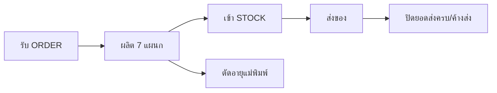

# ผลผลิตและ ORDER

> สถานะ: **ร่าง** — อัปเดตล่าสุด 2026-10-04
> ที่มา: `source/ผลผลิตและORDER.accdb` (600 MB, MS Access) — ถอดด้วย `.claude/skills/reengineering-access/scripts/extract_access.py`
> ผู้ใช้แจ้ง: ใช้งานทุกวัน; ยังไม่ทราบวัตถุประสงค์และส่วนที่เลิกใช้ (Q-01, Q-02)

## วัตถุประสงค์
🔍 อนุมาน (จากโครงสร้างตารางและชื่อ query): ระบบงานประจำวันของโรงงานผลิตผ้าเบรก/ผ้าคลัทช์ ครอบคลุม 4 งานที่เชื่อมกัน
1. **รับ ORDER ลูกค้า** — บันทึกใบสั่งซื้อ ราคา ส่วนลด ยอดสุทธิ พนักงานขาย
2. **ส่งของและติดตามยอดค้างส่ง** — บันทึกการส่ง แยกส่งครบ/ส่งไม่ครบ
3. **บันทึกผลผลิตรายแผนก** — 7 แผนก บันทึกเครื่องจักร กะ เวลา จำนวนดี/เสีย พนักงาน แม่พิมพ์
4. **สต็อกสินค้าและการใช้งานแม่พิมพ์** — รับเข้า/ตัดจ่าย ยกยอดต้นงวด

และรายงานสรุป: ส่งออกรายเดือน, ยอดขายตามเซล/สินค้า, ผลผลิตประจำเดือน, ของเสียสะสม, เป้าหมายคุณภาพ, NCR

## ผู้ใช้
| บทบาท | ทำอะไรในระบบ | ความถี่ |
|---|---|---|
| ❓ (Q-03) | | ทุกวัน |

## ขอบเขต
**ทำ:** ❓ รอยืนยันหลังวิเคราะห์เมนูหลัก (Q-02)

**ไม่ทำ (Out of scope):** ❓

## Workflow หลัก
🔍 อนุมาน:

## Constraints / Tech stack
❓ ยังไม่กำหนด (Q-04)

## ขนาดระบบเดิม
| วัตถุ | จำนวน |
|---|---|
| ตาราง | 113 — ใช้งานจริง ~34 (ไม่มีการประกาศ relationship เลย) |
| Query | 804 (SELECT 377, APPEND 209, UPDATE 123, DELETE 93) |
| ฟอร์ม | 151 (export ได้ 11 — ที่เหลือมี VBA ซึ่งถูกปิดไว้ระหว่างดึงข้อมูล) |
| รายงาน | 386 |
| Macro / Module | 460 / 2 |
| เมนูหลัก (Switchboard) | 17 หน้าเมนู, ~100 รายการ |
| ข้อมูลล่าสุด | ก.ย. 2026 (ORDER, ส่งออก, ผลผลิตทุกแผนก) |

## เอกสารในโฟลเดอร์นี้
| ไฟล์ | เรื่อง | สถานะ | ❓ ค้าง |
|---|---|---|---|
| [glossary.md](glossary.md) | คำศัพท์ | ยังไม่เริ่ม | |
| [data-model.md](data-model.md) | ตาราง ฟิลด์ ความสัมพันธ์ | ร่าง — รอยืนยัน | 18 |
| [business-rules.md](business-rules.md) | กฎธุรกิจ BR-xxx | ยังไม่เริ่ม (มีรายการ ID แล้ว) | |
| [screens.md](screens.md) | หน้าจอ SCR-xx | ยังไม่เริ่ม | |
| [reports.md](reports.md) | รายงาน RPT-xx | ยังไม่เริ่ม | |
| [integrations.md](integrations.md) | import/export | ยังไม่เริ่ม | |
| [non-functional.md](non-functional.md) | สิทธิ์ การย้ายข้อมูล | ยังไม่เริ่ม | |
| [acceptance.md](acceptance.md) | เกณฑ์ตรวจรับ AC-xx | ยังไม่เริ่ม | |
| [open-questions.md](open-questions.md) | คำถามค้าง + การตัดสินใจ | กำลังเขียน | 26 |
