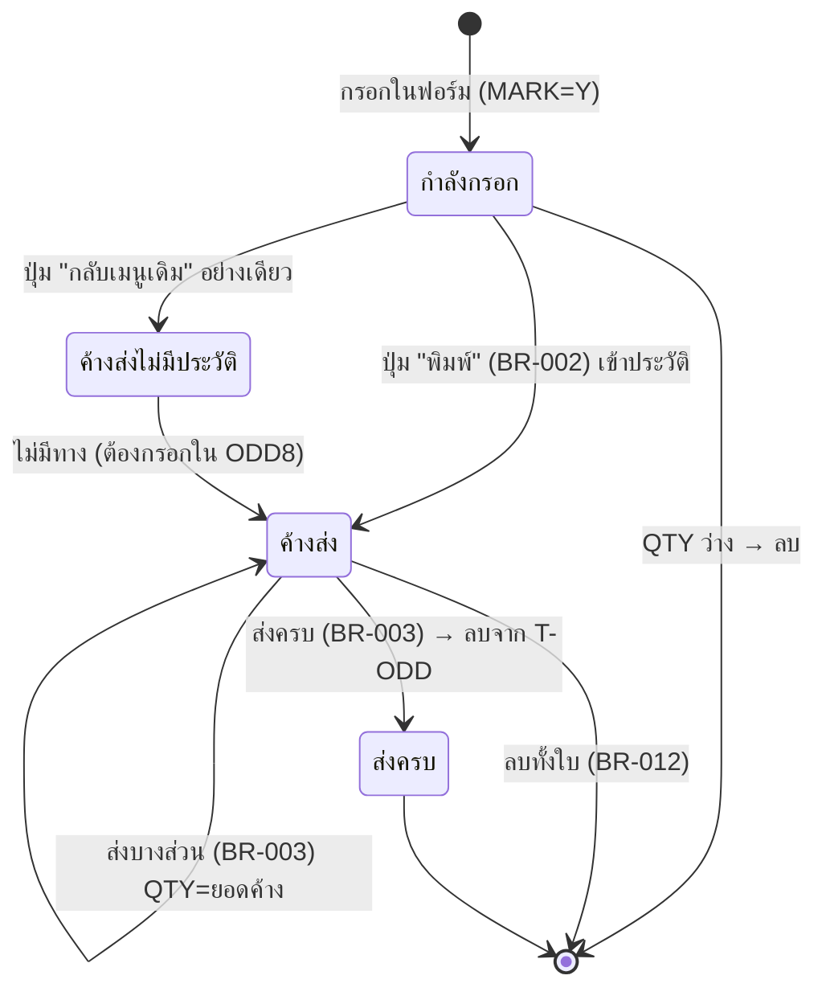
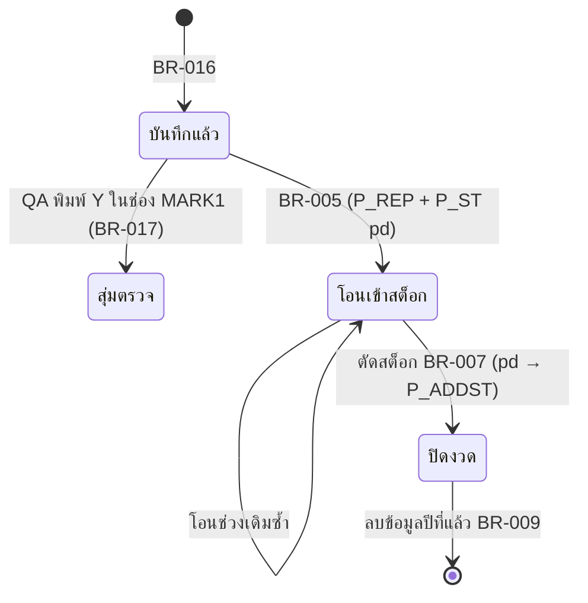

# Business Rules — ผลผลิตและ ORDER

> สถานะ: **ร่าง — รอยืนยัน** · อัปเดต 2026-10-05
> ที่มา: macro 460 ตัว + SQL ของ query + นิยามฟอร์ม/ปุ่ม และซอร์ส VBA ที่กู้จากตารางระบบ `MSysAccessStorage` (`source/_extract/ผลผลิตและORDER/recovered/`) + ตรวจกับข้อมูลจริง (อ่านอย่างเดียว)
> สถานะ "✅ จากโค้ด" = อ่านจากโค้ดเดิมโดยตรง แต่ผู้ใช้ยังไม่ยืนยันความหมายทางธุรกิจ
> ระบบเดิม**ไม่ใช้ transaction** — macro รัน query ทีละตัว ถ้าหยุดกลางทาง ข้อมูลค้างครึ่งทางได้ทุกขั้นตอนด้านล่าง
> ไฟล์นี้บรรยายพฤติกรรมเดิมตามจริง การตัดสินใจคง/แก้อยู่ใน [open-questions.md](open-questions.md) หมวด ข.

## การปัดเศษที่ใช้ในโปรแกรม
ไม่พบ `Round()`, `Format()`, `CCur()` ใน query/macro — ยอดเงินและจำนวนเป็น Double ไม่ปัดเศษ

| ID | ฟังก์ชันเดิม | พฤติกรรม + ตัวอย่าง | ใช้ที่ |
|---|---|---|---|
| RND-A | ไม่ปัด (Double) | เก็บทศนิยมเต็มความละเอียด เช่น 0.07×61×1.1+2 = 6.697 | BR-004, BR-010 |
| RND-B | `Int(x)` | ปัดลงเป็นจำนวนเต็ม (ค่าบวก) เช่น `Int(250/4)` = 62 | BR-008 |

---

# ORDER

## BR-001 — การออกเลขที่ ORDER (SALE ORDER ใหม่)
สถานะ: ✅ จากโค้ด (ยังไม่ยืนยันกับผู้ใช้)
ที่มา: ฟอร์ม `รับORDER` (combo `Combo38` ← ตาราง `เซล1`, ผูก `เลือกเซล.ID`) ปุ่ม "เปิดฟอร์ม" → macro `รับORDER1` → query `เลขที่ORDER1`..`เลขที่ORDER9`, `เลขที่ORDER3` · ตาราง `MAX_REF_NO` · ฟอร์ม `ODD1` event Load

**กฎ:** เลขที่ ORDER รูปแบบ `SS-YY-NNNN` แยกลำดับตามรหัสเซล (SS) และปี (YY)
1. ผู้ใช้เลือกเซลจากรายการใน `เซล1` (`00*` ออฟฟิศ … `11*` เซลออนไลน์) → ค่า pattern `SS*` เก็บใน `เลือกเซล.ID`
2. กด "เปิดฟอร์ม" → หาเลขมากที่สุดที่ `LIKE` pattern จาก **2 แหล่ง** แล้วเอาค่ามากกว่า (เปรียบเทียบแบบข้อความ):
   - T-เลขที่ใบORDER (เลขที่เคยออกแล้ว)
   - T-ODD (ORDER ที่ยังค้างส่ง)
3. แยกส่วน: `SS` = 2 ตัวแรก, `YY` = ตัวที่ 4–5, `NNNN` = 4 ตัวท้าย
4. ถ้า `YY` = 2 หลักท้ายของปีปัจจุบัน → `NNNN` = เลขเดิม + 1 เติม 0 ข้างหน้าให้ครบ 4 หลัก; ถ้าไม่เท่า (ขึ้นปีใหม่) → `YY` = ปีปัจจุบัน, `NNNN` = `0001`
5. เปิดฟอร์ม `รับORDER1` (แสดงผลการคำนวณ) และ `ODD1` — event Load ของ `ODD1` ใส่ `REF_NO` = เลขใหม่ (`Expr9`) และ `SALE_ID` = `SS` (`Expr1`) ให้อัตโนมัติ (ผู้ใช้แก้ได้)

**ปีปัจจุบัน** = `Right(Date(),2)` คือ 2 ตัวท้ายของวันที่ที่แปลงเป็นข้อความตาม regional setting ของ Windows — เครื่องที่ใช้อยู่ตั้งเป็น พ.ศ. (ปี 2026 → `69`)

**เหตุผล:** ❓ Q-48 — 🔍 แยกลำดับตามเซลเพื่อให้รู้ว่าใบไหนของเซลใด และนับใหม่ทุกปี
**เงื่อนไขก่อน:** เลือกเซลในฟอร์ม `รับORDER` แล้ว
**ผลลัพธ์:** ฟอร์ม `ODD1` เปิดพร้อม `REF_NO` และ `SALE_ID`
**ถ้าผิดเงื่อนไข:** ไม่มีการตรวจ — ถ้าไม่พบเลขเดิม `REF_NO` ว่าง (ตัวอย่าง #3)

| # | Input | Expected |
|---|---|---|
| 1 | เซล `06`, เลขมากสุด `06-69-0420`, วันนี้ ต.ค. 2026 (พ.ศ. 2569) | `06-69-0421` (ตรงกับข้อมูลจริงใน `sale oder.no`) |
| 2 | เซล `08`, เลขมากสุด `08-68-0538`, วันนี้ ม.ค. 2026 | `08-69-0001` |
| 3 | เซลที่ยังไม่เคยมีเลข | ไม่มีค่า Max → `REF_NO` ว่าง ผู้ใช้ต้องพิมพ์เอง |

⚠ ข้อสังเกต
- ปีขึ้นกับ regional setting — ถ้าเครื่องตั้งเป็น ค.ศ. จะได้ `26` แทน `69`
- เลขไม่ถูกจองตอนออก — จะถูกบันทึกเข้า T-เลขที่ใบORDER ตอนบันทึก (BR-002) ผู้ใช้ 2 คนออกเลขพร้อมกันได้เลขเดียวกัน
- ถ้า `NNNN` เกิน 9999 ผลเป็นค่าว่าง (ไม่เกิดในข้อมูลจริง สูงสุดต่อเซลต่อปี ~3,800)
- ORDER เก่า/ใบสั่งของลูกค้าเอง (ฟอร์ม `ODD11`) ไม่ผ่านกฎนี้ — ผู้ใช้พิมพ์เลขเอง เช่น `24/2564`

## BR-002 — การรับ ORDER และบันทึกประวัติ
สถานะ: ✅ จากโค้ด (ยังไม่ยืนยันกับผู้ใช้)
ที่มา: ฟอร์ม `ODD1` (ใบใหม่) / `ODD11` (ใบเก่า) + ฟอร์มย่อย `ODD` · macro `ปรับปรุงORDER2`, `ปรับปรุงORDER1`, `ปรับปรุงORDER11` · VBA ของ `ODD1`, `ODD11`, `ODD`

**การกรอก (ค่าที่ฟอร์มเติมให้):**
| เหตุการณ์ | ผล |
|---|---|
| เปิด `ODD1` | `REF_NO`, `SALE_ID` จาก BR-001 |
| ค่าเริ่มต้น `OD_DATE` | วันนี้ (`Date()`) |
| เข้าช่อง / แก้ `OD_DATE` | `DATE_DL` (กำหนดส่ง) = `OD_DATE + 7` วัน |
| เลือกลูกค้า `CUS_ID` | `CUS_N` = ชื่อ, `SALE_ID` = `P_CUS.SALE_ID`, `DUERE_D` = `P_CUS.CREDIT`, `REMARK` = `P_CUS.REMARK` (ชื่อ+ที่อยู่สำหรับพิมพ์) |
| ฟอร์มย่อยต่อบรรทัด: เลือกสินค้า `PD_C` | `PD_N`, `U_NAME` จาก T-P_NAME (ราคา**ไม่**ดึงมา — ผู้ใช้พิมพ์ `U_PRICE` เอง) |
| แก้ `U_PRICE` (ก่อนบันทึกช่อง) | `AMOUNT = QTY × U_PRICE` (BR-004) |
| บรรทัดใหม่ | `MARK` = `"Y"` (ค่าเริ่มต้นในฟอร์มย่อย) |

**ปุ่มและสิ่งที่บันทึก:**
| ฟอร์ม / ปุ่ม | macro | ขั้นที่ทำ (ตารางด้านล่าง) |
|---|---|---|
| `ODD1` "พิมพ์" | `ปรับปรุงORDER2` | 1–8 ครบ แล้วเปิดฟอร์ม `พิมพ์ใบ sale order` → ปุ่ม "พิมพ์" → RPT-01 |
| `ODD1` "กลับเมนูเดิม" | `ปรับปรุงORDER1` | 1, 2, 3, 7 — **ไม่**เข้าประวัติ ไม่แก้ที่อยู่ลูกค้า |
| `ODD1` "พิมพ์ฟอร์มเปล่า" | (VBA) | พิมพ์รายงาน `ใบ sale order1` (แบบฟอร์มเปล่า) |
| `ODD11` "กลับเมนูเดิม" | `ปรับปรุงORDER11` | 1, 2, 4, 5, 7 — ไม่บันทึกเลขเข้าทะเบียน ไม่แก้ลูกค้า ไม่พิมพ์ |

| ขั้น | query | ผล |
|---|---|---|
| 1 | `ลบORDER1` (รัน 2 ครั้ง) | ลบบรรทัดใน T-ODD ที่ `QTY` ว่าง |
| 2 | `ปรับปรุงORDER` | ตั้ง `UND_QTY = QTY` **ทุกแถวของ T-ODD** |
| 3 | `ปรับปรุงORDER1` | บันทึก `Max(REF_NO)` ของแถว `MARK = Y` เข้า T-เลขที่ใบORDER |
| 4 | `ปรับปรุงORDER11` | คัดลอกทุกแถว `MARK = Y` จาก T-ODD เข้า T-ORDER (ประวัติ) ทุกฟิลด์ |
| 5 | `ปรับปรุงORDER12` | ล้าง `MARK` ใน T-ORDER |
| 6 | `ปรับปรุงORDER121` | เขียน `ODD.REMARK` กลับไปที่ `P_CUS.REMARK` ของลูกค้า |
| 7 | `ปรับปรุงORDER2` | ล้าง `MARK` ใน T-ODD |
| 8 | เปิดฟอร์ม `พิมพ์ใบ sale order` | ผู้ใช้กดพิมพ์ RPT-01 |

**เหตุผล:** ❓ Q-48 — 🔍 T-ODD เปลี่ยนตามการส่ง จึงเก็บสำเนาใน T-ORDER ไว้ทำรายงานยอดรับ ORDER
**เงื่อนไขก่อน:** มีบรรทัด `MARK = Y` ใน T-ODD
**ผลลัพธ์:** ตามตารางขั้นตอน — ORDER เข้า T-ODD, T-ORDER, ทะเบียนเลข
**ถ้าผิดเงื่อนไข:** ไม่มี validation (BR-011) — บรรทัดที่ `QTY` ว่างถูกลบเงียบ ๆ

| # | Input | Expected |
|---|---|---|
| 1 | ใบใหม่ 3 บรรทัด + บรรทัดเปล่า 1 บรรทัด → กด "พิมพ์" | T-ODD เหลือ 3 บรรทัด `MARK` ว่าง; T-ORDER +3 แถว; T-เลขที่ใบORDER +1 เลข; เปิดหน้าพิมพ์ |
| 2 | ใบใหม่ → กด "กลับเมนูเดิม" โดยไม่กด "พิมพ์" | T-ODD มีบรรทัด, เลขเข้าทะเบียน แต่ **T-ORDER ไม่มี** → ไม่ปรากฏในรายงานการรับ ORDER |
| 3 | กด "พิมพ์" แล้ว "กลับเมนูเดิม" | เหมือน #1 (ขั้น 3 ซ้ำไม่มีผลเพราะไม่มี `MARK = Y` เหลือ) |
| 4 | ลูกค้าแก้ที่อยู่ในช่องหมายเหตุ แล้วกด "พิมพ์" | `P_CUS.REMARK` เปลี่ยนตาม |

⚠ ข้อสังเกต
- กรณี #2 ทำให้ ORDER ค้างส่งไม่มีในประวัติ — ตรวจข้อมูลปัจจุบันแล้ว ORDER ค้างส่งทุกใบมีในประวัติ (ผู้ใช้กด "พิมพ์" เสมอ)
- ขั้น 2 รีเซ็ต `UND_QTY` ของ ORDER ค้างส่งทุกใบ — ไม่มีผลเพราะหลังส่งบางส่วน `QTY` ถูกลดให้เท่ายอดค้างอยู่แล้ว (BR-003)
- ไม่มีการตรวจ: จำนวน > 0, ราคา > 0, เลขซ้ำ, ลูกค้า/สินค้าต้องเลือกจากรายการ (combo ไม่ได้บังคับ limit-to-list ในส่วนที่เห็น)

## BR-004 — มูลค่ารายการ ORDER และการส่ง
สถานะ: ✅ จากโค้ด + ตรวจกับข้อมูล
ที่มา: VBA ฟอร์ม `ODD` (`U_PRICE_BeforeUpdate`), `ODD3/5/7/9` (`QTY`/`U_PRICE` AfterUpdate), `บันทึกส่งออก2` (`DL_QTY_BeforeUpdate`), `แก้ไขODDส่งออก1/2/5` · query `ส่งไม่ครบ3`

**กฎ:**
| ค่า | สูตร | คำนวณเมื่อ |
|---|---|---|
| `AMOUNT` (รับ ORDER) | `QTY × U_PRICE` | แก้ช่องราคา `U_PRICE` เท่านั้น (ฟอร์ม `ODD`) |
| `AMOUNT` (แก้ ORDER, SCR-06) | `QTY × U_PRICE` | แก้ `QTY` หรือ `U_PRICE` |
| `AMOUNT` (หลังส่งบางส่วน) | `ยอดค้าง × U_PRICE` | BR-003 ขั้น 4 |
| `DL_NET` (บันทึกการส่ง) | `U_PRICE × DL_QTY` | แก้ `DL_QTY` |
| `DL_NET` (แก้รายการส่ง) | `DL_QTY × U_PRICE` | แก้ `DL_QTY` หรือ `U_PRICE` |

- ไม่มีส่วนลด ไม่มี VAT ไม่ปัดเศษ (RND-A) — `DISC_2`, `DISC_3` ว่างทุกแถว; `DISC_PS` = จำนวนกล่อง, `NET` = เดือน (data-model)
- ราคาไม่ดึงจาก `P_NAME.U_PRICE` — ผู้ใช้พิมพ์ทุกบรรทัด

**เหตุผล:** ❓ Q-48
**เงื่อนไขก่อน:** มีจำนวนและราคาในบรรทัด
**ผลลัพธ์:** `AMOUNT`/`DL_NET` ตามตาราง
**ถ้าผิดเงื่อนไข:** ค่าว่างใน `QTY` หรือ `U_PRICE` → ผลคูณว่าง (Null) ไม่มีข้อความเตือน

| # | Input | Expected |
|---|---|---|
| 1 | กรอก QTY 100 แล้ว U_PRICE 45.5 | AMOUNT 4,550 |
| 2 | กรอก U_PRICE 45.5 ก่อน แล้วค่อยแก้ QTY เป็น 100 | AMOUNT = ค่าเดิมตอนกรอกราคา (QTY ตอนนั้น) ⚠ |
| 3 | ส่ง DL_QTY 40 ราคา 45.5 | DL_NET 1,820 |

⚠ ข้อสังเกต (❓ Q-50): ตอนรับ ORDER ถ้าแก้จำนวนหลังกรอกราคา `AMOUNT` ไม่คำนวณใหม่ (#2) — 🔍 สาเหตุของ 2,364 แถวใน T-ORDER ที่ `AMOUNT ≠ QTY × U_PRICE` ❓ Q-39

## BR-012 — แก้ไขและลบ ORDER
สถานะ: ✅ จากโค้ด (ยังไม่ยืนยันกับผู้ใช้)
ที่มา: เมนู 9 → ฟอร์ม `ODD2` (ย่อย `ODD3`), `ODD4` (`ODD5`), `ODD6` (`ODD7`), `ODD8` (`ODD9`) · `ลบORDER` · macro `ลบORDER`, `ลบORDER1/2/3` · embedded macro ปุ่มปิดของ `ODD8` → query `ลบORDER11`

**กฎ:**
| เมนู | ฟอร์ม | ตารางที่แก้ | เลือกด้วย | ปุ่ม "กลับเมนูเดิม" |
|---|---|---|---|---|
| เลือกตามเลขที่ ORDER | `ODD2` | **T-ODD** (ค้างส่ง) | เลขที่ | macro `ลบORDER1` — ลบบรรทัด `QTY` ว่าง |
| เลือกตามวันที่ ORDER | `ODD4` | T-ODD | วันที่ ORDER | macro `ลบORDER2` (= `ลบORDER1`) |
| เลือกตามรหัสลูกค้า | `ODD6` | T-ODD | ลูกค้า | macro `ลบORDER3` (= `ลบORDER1`) |
| แก้ไข ORDER ที่เซลรับมาทั้งหมด | `ODD8` | **T-ORDER (ประวัติ)** | เลขที่ | ปิดฟอร์ม → query `ลบORDER11` — ลบแถว T-ORDER ที่ `AMOUNT` ว่าง |

- แก้จำนวน/ราคา → `AMOUNT` คำนวณใหม่ (BR-004); เลือกลูกค้า/สินค้า → เติมชื่อ/หน่วย
- **ลบบรรทัด:** ล้าง `QTY` (T-ODD) หรือ `AMOUNT` (T-ORDER) แล้วกด "กลับเมนูเดิม" (BR-021)
- **ลบทั้งใบ:** ใน `ODD2` ปุ่ม "ลบORDER เปิดฟอร์ม" → ฟอร์ม `ลบORDER` เลือกเลขที่ → ปุ่ม "ลบORDERใบนี้" → macro `ลบORDER`:
  1. ลบทุกบรรทัดใน T-ODD ที่ `REF_NO` = เลขนั้น
  2. ลบเลขนั้นออกจาก T-เลขที่ใบORDER (เลขนั้นจึงถูกออกใหม่ได้ตาม BR-001)

**เหตุผล:** ❓ Q-48
**เงื่อนไขก่อน:** ORDER อยู่ใน T-ODD (เมนู 9 ข้อ 1–3) หรือ T-ORDER (ข้อ 4)
**ผลลัพธ์:** แถวถูกแก้/ลบตามตาราง
**ถ้าผิดเงื่อนไข:** ไม่มีการยืนยันก่อนลบทั้งใบ; ไม่ตรวจว่ามีการส่งไปแล้วบางส่วน

| # | Input | Expected |
|---|---|---|
| 1 | `ODD2` แก้ QTY บรรทัด 2 จาก 100 → 80, ราคา 10 | T-ODD: QTY 80, AMOUNT 800; T-ORDER ไม่เปลี่ยน |
| 2 | `ODD2` ล้าง QTY บรรทัด 3 แล้วกด "กลับเมนูเดิม" | บรรทัด 3 ถูกลบจาก T-ODD |
| 3 | ลบทั้งใบ `02-69-0189` | T-ODD ไม่มีใบนี้; เลขออกใหม่ได้; T-ORDER ยังมี |

⚠ ข้อสังเกต
- แก้ T-ODD ไม่แก้ T-ORDER และกลับกัน — ถ้าต้องการให้ประวัติตรง ผู้ใช้ต้องแก้ทั้ง 2 เมนู ❓ Q-32
- ลบทั้งใบไม่ลบ T-ORDER — ใบที่ยกเลิกยังนับในรายงานการรับ ORDER จนกว่าจะลบใน `ODD8`

---

# ส่งของ

## BR-003 — บันทึกการส่งของ
สถานะ: ✅ จากโค้ด + ยืนยันด้วยข้อมูล (การส่งตั้งแต่ ก.ค. 2021 มี `MARK` = `a`/`b` ทั้งหมด)
ที่มา: เมนู "บันทึกการส่งออก" → ฟอร์ม `บันทึกส่งออก1` (ย่อย `บันทึกส่งออก2` ← T-ODD) ปุ่ม "บันทึก" → macro `ส่งไม่ครบ`

**การกรอก:** เลือกเลขที่ ORDER จาก combo (`ผสม7` — รายการ `REF_NO` ใน T-ODD) → ฟอร์มย่อยแสดงบรรทัดค้างส่ง ผู้ใช้กรอกในบรรทัดที่ส่ง: `DL_DATE`, `INV_NO`, `INV_SUF`, `DL_QTY`, `LOT` (แปลงเป็นตัวพิมพ์ใหญ่อัตโนมัติ), `DISC_PS` (จำนวนกล่อง) — `DL_NET` คำนวณเมื่อแก้ `DL_QTY` (BR-004)

**ปุ่ม "บันทึก"** (macro `ส่งไม่ครบ`) ทำกับ **ทุกบรรทัดใน T-ODD ที่ `DL_QTY` ไม่ว่าง** (ไม่จำกัดเฉพาะใบที่เลือก):

| ขั้น | query | ผล |
|---|---|---|
| 1 | `ส่งไม่ครบ` | `MARK` = `a` ถ้า `QTY − DL_QTY = 0` (ส่งครบ) มิฉะนั้น `b` (ส่งไม่ครบ) |
| 2 | `ส่งไม่ครบ1` | แถว `b`: `UND_QTY = QTY − DL_QTY` |
| 3 | `ส่งไม่ครบ2` | คัดลอกแถวเข้า T-ODDส่งออก (ประวัติการส่ง) พร้อม `MARK` a/b และ `DISC_PS` |
| 4 | `ส่งไม่ครบ3` | แถว `b`: `QTY = UND_QTY`, `AMOUNT = UND_QTY × U_PRICE` |
| 5 | `ส่งไม่ครบ4` | แถว `b`: ล้างช่องการส่ง (`DL_DATE`, `INV_NO`, `INV_SUF`, `DL_QTY`, `DL_NET`, `MARK`, `LOT`) — บรรทัดค้างส่งต่อ |
| 6 | `ส่งไม่ครบ5` | ลบแถว `a` ออกจาก T-ODD (ส่งครบแล้ว) |
| 7 | `ส่งไม่ครบ6` | ลบแถวใน T-ODDส่งออก ที่ `DL_QTY = 0` |
| 8 | `ส่งออกเข้าSTOCK1`..`5` | ตัดสต็อก — **ไม่มีผล** ดู ⚠ |
| 9 | เปิดฟอร์ม `บันทึกส่งออก1` ใหม่ | |

**เหตุผล:** ❓ Q-48 — 🔍 เก็บประวัติทุกครั้งที่ส่ง และเก็บยอดค้างไว้ส่งครั้งถัดไป
**เงื่อนไขก่อน:** บรรทัดใน T-ODD มี `DL_QTY`
**ผลลัพธ์:** ตามตารางขั้นตอน
**ถ้าผิดเงื่อนไข:** ไม่มีการตรวจ (ตัวอย่าง #3, #4) ❓ Q-51

| # | Input (บรรทัด ORDER) | Expected |
|---|---|---|
| 1 | QTY 100, ส่ง 100 | T-ODDส่งออก +1 แถว `MARK=a`, DL_QTY 100; บรรทัดหายจาก T-ODD |
| 2 | QTY 100, ส่ง 40, U_PRICE 10 | T-ODDส่งออก +1 แถว `MARK=b`, DL_QTY 40, DL_NET 400; T-ODD เหลือ QTY 60, AMOUNT 600, UND_QTY 60 |
| 3 | QTY 100, ส่ง 120 | `b`; T-ODD เหลือ QTY −20 ⚠ ไม่มีการกันส่งเกิน |
| 4 | DL_QTY = 0 | แถว `b` ถูกบันทึกแล้วลบออกจาก T-ODDส่งออก ทันที; T-ODD ไม่เปลี่ยน |

⚠ ข้อสังเกต
- **การส่งของไม่ตัดสต็อก** — ขั้น 8 เลือกเฉพาะแถว T-ODDส่งออก ที่ `MARK = "AB"` แต่ขั้น 3 บันทึก `a`/`b` จึงไม่มีแถวเข้า T-P_ST ตรวจแล้ว: ไม่มีรายการ `de` ในสมุดสต็อกตั้งแต่ 2022 ❓ Q-27
- ไม่มีการตรวจส่งเกินจำนวน วันที่ส่ง หรือเลขบิลซ้ำ (ไม่พบในโค้ด)

## BR-013 — บันทึกส่งครบทั้งใบ (วิธีเดิม — เลิกใช้)
สถานะ: ✅ จากโค้ด — **ไม่มีทางเข้าแล้ว**: ฟอร์ม `ORDERส่งครบ` ไม่ถูกเปิดจากเมนูหรือปุ่มใด (โค้ดใน `บันทึกส่งออก1` ที่เคยเปิดฟอร์มนี้ไม่ได้ผูกกับปุ่มแล้ว); ข้อมูลในตาราง `ORDERส่งครบ` ล่าสุด 2008; แถวประวัติการส่งที่ `MARK` ว่างส่วนใหญ่ปี 2020–2021
ที่มา: macro `ส่งครบORDER` · ฟอร์ม `ORDERส่งครบ`

**กฎ (เพื่ออธิบายข้อมูลเก่า):** กรอกเลขที่ ORDER, เลขที่บิล, Lot, จำนวนกล่อง แล้ว:
1. ทุกบรรทัดของ ORDER นั้นใน T-ODD: ใส่ `DL_DATE`, `INV_NO`, `INV_SUF`, `DL_QTY`, `DL_NET`, `LOT` จากฟอร์ม
2. คัดลอกเข้า T-ODDส่งออก ด้วย `MARK = "AB"` → ลบบรรทัดออกจาก T-ODD → ลบแถว `DL_QTY = 0`
3. ตัดสต็อก: สร้างรายการใน T-P_ST สำหรับทุกแถว `MARK = AB` ที่รหัสสินค้าไม่ขึ้นต้น `sp`: `DATE = DL_DATE`, `REF_NO = INV_NO`, `SUF_NO = INV_SUF`, `QTY = −DL_QTY`, `ID = CUS_ID`, `MARK = "de"` แล้วล้าง `MARK` ใน T-ODDส่งออก

ระบบใหม่: ไม่ต้องสร้าง (❓ Q-07) — ใช้เพียงตีความข้อมูลเก่า

## BR-014 — แก้ไขและลบรายการส่งของ
สถานะ: ✅ จากโค้ด
ที่มา: เมนู 10 → ฟอร์ม `แก้ไขODDส่งออก` (ย่อย `แก้ไขODDส่งออก1`), `แก้ไขODDส่งออก3` (`…2`), `แก้ไขODDส่งออก4` (`…5`) · macro `ลบรายการส่งออก1/2/3`

**กฎ:** เลือกเลขที่บิล / เลขที่ ORDER / วันที่ส่ง → ฟอร์มย่อยแก้ T-ODDส่งออก โดยตรง; แก้ `DL_QTY` หรือ `U_PRICE` → `DL_NET = DL_QTY × U_PRICE` (BR-004)
**ลบ:** ล้าง `CUS_ID` หรือ `DL_DATE` แล้วกด "กลับเมนูเดิม" → macro ลบแถวที่ `CUS_ID` ว่าง และแถวที่ `DL_DATE` ว่าง (BR-021)

**เหตุผล:** ❓ Q-48
**เงื่อนไขก่อน:** มีรายการใน T-ODDส่งออก
**ผลลัพธ์:** แถวถูกแก้/ลบ; `DL_NET` คำนวณใหม่
**ถ้าผิดเงื่อนไข:** ไม่มีการยืนยัน; ยอดค้างใน T-ODD ไม่ถูกคืน ❓ Q-57

| # | Input | Expected |
|---|---|---|
| 1 | แก้ DL_QTY 40 → 50, ราคา 10 | DL_NET 500 |
| 2 | ล้าง `DL_DATE` แล้วกด "กลับเมนูเดิม" | แถวการส่งถูกลบ; ยอดค้างใน T-ODD ไม่เพิ่ม |

⚠ ข้อสังเกต: การแก้/ลบรายการส่ง **ไม่คืนยอดค้างส่งให้ T-ODD** — ถ้าลบการส่งที่ผิด บรรทัด ORDER ที่ถูกลบไปแล้ว (ส่งครบ) ไม่กลับมา ต้องกรอก ORDER ใหม่เอง

---

# ผลผลิต

## BR-015 — เลขที่ใบรายงานผลผลิต
สถานะ: ✅ จากโค้ด + ข้อมูล
ที่มา: macro `REF_NO<แผนก>` (เมนู "บันทึกผลผลิต") → ฟอร์ม `REF_NO<แผนก>2` ← query `REF_NO<แผนก>2`, `REF_NO<แผนก>1` → ฟอร์ม `P_REP<แผนก>1` event Load

**กฎ:** เลขที่ใบรายงานรูปแบบ `LYYNNN` — `L` = ตัวอักษรแผนก, `YY` = ปี พ.ศ. 2 หลัก, `NNN` = ลำดับ 3 หลัก
- เลขถัดไป = 3 ตัวแรกของเลขมากสุดใน T-REF_NO<แผนก> + (3 ตัวท้าย + 1 เติม 0 ให้ครบ 3 หลัก)
- ฟอร์ม `P_REP<แผนก>1` ตอนเปิด ใส่เลขนี้ลง `REF_NO` ให้อัตโนมัติ (ผู้ใช้แก้ได้)
- **ไม่ตรวจปี** — ต่างจาก BR-001 เลขไม่ขึ้นปีใหม่อัตโนมัติ 🔍 ต้นปีผู้ใช้แก้เลขแรกของปีเอง (`D69001`) แล้วเลขถัดไปต่อจากนั้น

| แผนก | ตัวอักษร | ตาราง | เลขล่าสุด (ต.ค. 2026) |
|---|---|---|---|
| ไดคาสท์ | D | REF_NOไดคาสท์ | D69205 |
| ตกแต่ง | T | REF_NOตกแต่ง | T70023 ⚠ |
| อัดผ้าเบรก | B | REF_NOอัดผ้าเบรค | B69205 |
| ฝนผ้าเบรก | G | REF_NOฝนผ้าเบรค | G69205 |
| ผ้าคลัทช์และดิสเบรก | K | REF_NOผ้าคลัทช์ | K69205 |
| ประกอบ | A | REF_NOประกอบ | A69204 |
| บรรจุ | P | REF_NOบรรจุ | P69207 |

**เหตุผล:** ❓ Q-48 — 🔍 เลขที่ใบใช้เป็นใบโอนสินค้าระหว่างแผนกและอ้างอิงในสต็อก
**เงื่อนไขก่อน:** ทะเบียน T-REF_NO<แผนก> มีเลขอย่างน้อย 1 เลข
**ผลลัพธ์:** ฟอร์มเติมเลขถัดไป
**ถ้าผิดเงื่อนไข:** ทะเบียนว่าง → เลขแนะนำว่าง ผู้ใช้พิมพ์เอง

| # | Input (เลขมากสุด) | Expected |
|---|---|---|
| 1 | `D69205` | `D69206` |
| 2 | `D69999` | `D691000` ⚠ 7 ตัวอักษร (ไม่เกิดในข้อมูลจริง) |

⚠ ข้อสังเกต
- ตัวอักษรของเลขที่ใบรายงาน (`D T B G K A P`) ไม่ตรงกับ prefix ใน T-แผนก (`D T B G A K X`) สำหรับแผนกบรรจุ (`P` vs `X`) ❓ Q-36
- ทะเบียน `REF_NOตกแต่ง` มี `T70001`–`T70023` (ปี 70 ยังไม่ถึง) ทำให้เลขที่แนะนำถัดไปเป็น `T70024`; ฟอร์ม `P_REPตกแต่ง1` มีตัวกรองค้าง `REF_NO <> "T69211"` ❓ Q-33

## BR-016 — บันทึกใบรายงานผลผลิต
สถานะ: ✅ จากโค้ด + ยืนยันด้วยข้อมูล
ที่มา: ฟอร์ม `P_REP<แผนก>1` (ย่อย `P_REP<แผนก>2`) · macro `บันทึก<แผนก>`, `บันทึกผลผลิต<n>` · VBA ของทั้งสองฟอร์ม

**การกรอก:** หัวใบ: วันที่, เลขที่ใบ (BR-015), เครื่อง (`MC_NO`) — ค่าเริ่มต้นเครื่อง: ตกแต่ง `T01`, ประกอบ `A01`, บรรจุ `P01`; แผนกอื่นว่าง · บรรทัด: ลำดับ, สินค้า, กะ, ชั่วโมง (`TT_T`), Lot วัตถุดิบ 1/2, **จำนวนดี** (`QTY`), **เสีย** (`NG`), พนักงาน, แม่พิมพ์, Lot ผลผลิต

| เหตุการณ์ (ฟอร์มย่อย) | ผล |
|---|---|
| เลือกสินค้า `PD_C` | `PD_N`, `U_NAME` จาก T-P_NAME; แผนกไดคาสท์ / อัดผ้าเบรก / ผ้าคลัทช์และดิสเบรก เติม `MOULD` = `P_NAME.MOULD` ด้วย |
| แก้ `NG` | `TOTAL` (**จำนวนรวม**) = `QTY + NG` |

ตรวจข้อมูลแล้ว: ทุกแถวที่มีของเสียตั้งแต่ 2024 `TOTAL = QTY + NG` (P_REP 8,625/8,632)

| ปุ่ม | macro | ผล |
|---|---|---|
| บันทึก | `บันทึก<แผนก>` | 1) บันทึก `Max(REF_NO)` ของ T-P_REP<แผนก> เข้า T-REF_NO<แผนก> 2) ลบบรรทัด `QTY` ว่าง 3) เปิดฟอร์มใหม่สำหรับใบถัดไป |
| กลับเมนูเดิม | `บันทึกผลผลิต<n>` (ไดคาสท์ `11`, ตกแต่ง `1`, อัดผ้าเบรก `002`, ฝนผ้าเบรก `6`, ผ้าคลัทช์ `10`, ประกอบ `111`, บรรจุ `8`) | ลบบรรทัดที่ `QTY` ว่าง **และ**บรรทัดที่ `DATE` ว่าง — **ไม่**บันทึกเลขเข้าทะเบียน |
| พิมพ์รายงาน | (VBA) เปิดฟอร์ม `รายงานผลผลิต<แผนก>` | RPT-10 |

`LOT` = `YYMMDD` (ค.ศ.) + รหัสเครื่อง + `-` + กะ + `/` + ลำดับ เช่น `260903B35-A/1` — ผู้ใช้พิมพ์เอง (ไม่มีโค้ดสร้าง)

**เหตุผล:** ❓ Q-48
**เงื่อนไขก่อน:** ฟอร์มเปิดจากเมนูบันทึกผลผลิต (BR-015)
**ผลลัพธ์:** บรรทัดใน T-P_REP<แผนก>; เลขใบเข้าทะเบียน
**ถ้าผิดเงื่อนไข:** ไม่มี validation; บรรทัดที่ `QTY` หรือ `DATE` ว่างถูกลบ ❓ Q-49

| # | Input | Expected |
|---|---|---|
| 1 | QTY 980, NG 20 | TOTAL 1,000 |
| 2 | กรอก NG 20 ก่อน แล้วแก้ QTY 980 | TOTAL = 0 + 20 = 20 ⚠ (คำนวณเฉพาะตอนแก้ NG) |
| 3 | NG ไม่กรอก | TOTAL ว่าง → สต็อกไม่ได้รับ (BR-005) ⚠ |

⚠ ข้อสังเกต
- `TOTAL` คำนวณเฉพาะเมื่อแก้ `NG` (#2, #3) ❓ Q-49 — พบ `TOTAL` ว่าง 40 แถวใน P_REP ตั้งแต่ 2024
- ปุ่ม "บันทึก" ใช้เลขมากสุดของ**ทั้งตาราง** ไม่ใช่ของใบที่เพิ่งบันทึก

## BR-017 — จำนวนสุ่มตรวจคุณภาพ (QA)
สถานะ: ✅ จากโค้ด
ที่มา: เมนู QA → ฟอร์ม `P_REP6<แผนก>` (ย่อย `P_REP5<แผนก>` ← T-P_REP<แผนก>) · query `P_REP6<แผนก>` · ปุ่มพิมพ์ต่อรุ่น 256 ปุ่ม

**กฎ:**
1. QA เลือกวันที่ → ฟอร์มย่อยแสดงบรรทัดผลผลิตของวันนั้น (แก้ไขได้ทุกช่อง — ฟอร์มย่อยคำนวณ `TOTAL = QTY + NG` เมื่อแก้ `QTY` หรือ `NG`)
2. พิมพ์ `Y` ลงช่อง "พิมพ์" (`MARK1`) ของบรรทัดที่จะตรวจ — คำแนะนำบนฟอร์ม: "ใส่ Y ลงในช่องพิมพ์เมื่อต้องการพิมพ์ เสร็จแล้วลบ Y ออกด้วย"
3. กดปุ่มรุ่นสินค้า (เช่น "C100,WAVE") → macro รัน query `P_REP6<แผนก>` (แถว `MARK1 = "y"` ไม่สนตัวพิมพ์) และพิมพ์ใบตรวจของรุ่นนั้น (RPT-20) พร้อมจำนวนสุ่ม:

| QTY (จำนวนดีของ Lot) | จำนวนสุ่ม |
|---|---|
| ≤ 50 | 5 |
| 51–150 | 20 |
| 151–280 | 32 |
| 281–500 | 50 |
| 501–1,200 | 80 |
| 1,201–3,200 | 125 |
| 3,201–10,000 | 200 |
| 10,001–35,000 | 315 |
| > 35,000 | 500 |

4. QA ลบ `Y` ออกเอง

**เหตุผล:** ❓ Q-48 — 🔍 ระบบคุณภาพ (เอกสาร WI-QA) กำหนดจำนวนสุ่มตามขนาด Lot
**เงื่อนไขก่อน:** มีบรรทัดผลผลิตในวันที่เลือก
**ผลลัพธ์:** ใบตรวจพร้อมจำนวนสุ่ม
**ถ้าผิดเงื่อนไข:** ไม่มีบรรทัด `Y` → ใบตรวจว่าง ❓ Q-58

| # | Input | Expected |
|---|---|---|
| 1 | QTY 150 | 20 |
| 2 | QTY 151 | 32 |

⚠ ข้อสังเกต: ถ้าไม่ลบ `Y` ใบตรวจครั้งถัดไปจะรวมบรรทัดเก่า; 🔍 ปุ่มรุ่นไม่ได้ส่งเงื่อนไขกรองรุ่นให้รายงาน — ใบตรวจน่าจะแสดงทุกบรรทัดที่ติด `Y` บนแม่แบบของรุ่นที่กด
🔍 ช่วง 51 ขึ้นไปตรงกับขนาดตัวอย่างของมาตรฐาน ANSI Z1.4 ระดับตรวจทั่วไป II แต่ช่วง ≤ 50 ใช้ 5 ตัวเดียว — ❓ Q-35

## BR-019 — แก้ไข ย้าย และลบผลผลิตที่โอนแล้ว
สถานะ: ✅ จากโค้ด
ที่มา: เมนู "แก้ไขผลผลิต" → ฟอร์ม `P_REP4` (ย่อย `P_REP2`, เลือกเลขที่ใบ), `P_REP6` (ย่อย `P_REP5`, เลือกวันที่) · macro `บันทึกผลผลิต2/3`, `ย้ายข้อมูลผลผลิต`, `ลบผลผลิต`

**กฎ:**
- **แก้ไข:** ฟอร์มแก้ **T-P_REP** (สำเนาที่โอนแล้ว) ไม่ใช่ T-P_REP<แผนก> · ลบบรรทัด: ล้าง "จำนวนดี" (`QTY`) ตามคำแนะนำบนฟอร์ม "ถ้าต้องการลบรายการใดให้ลบจำนวนดีออกไม่ให้มีตัวเลขเหลือ" → ปุ่ม "กลับเมนูเดิม" ลบแถว `QTY` ว่าง · ฟอร์มย่อยเติมชื่อสินค้าเมื่อเลือกรหัส แต่**ไม่**คำนวณ `TOTAL` ใหม่
- **ย้าย** (เมนู STOCK → "ย้ายข้อมูลผลผลิต", ฟอร์ม `วันที่` ปุ่ม "ย้าย"): คัดลอกแถว T-P_REP ที่ `DATE` ≤ วันที่ที่เลือก เข้าตาราง `P_REP1` แล้วลบออกจาก T-P_REP
- **ลบตามเครื่องหมาย** (macro `ลบผลผลิต`, ฟอร์ม `P_REP3`): ไม่มีทางเข้าแล้ว

**เหตุผล:** ❓ Q-48
**เงื่อนไขก่อน:** ผลผลิตถูกโอนเข้า T-P_REP แล้ว (BR-005)
**ผลลัพธ์:** T-P_REP ถูกแก้/ย้าย/ลบ
**ถ้าผิดเงื่อนไข:** ไม่มีการตรวจ; การแก้ถูกทับเมื่อโอนช่วงเดิมซ้ำ ❓ Q-54

| # | Input | Expected |
|---|---|---|
| 1 | `P_REP4` ล้างจำนวนดีของบรรทัด แล้วกด "กลับเมนูเดิม" | แถวหายจาก T-P_REP; ยังอยู่ใน T-P_REP<แผนก> และ T-P_ST |
| 2 | ย้ายข้อมูลวันที่ 2020-12-31 | แถว T-P_REP ≤ 2020-12-31 ย้ายไป `P_REP1` |

⚠ ข้อสังเกต
- การแก้ใน T-P_REP ไม่ไปถึง T-P_REP<แผนก> และไม่แก้สต็อก — ถ้าโอนช่วงนั้นซ้ำ (BR-005) ค่าที่แก้หาย ❓ Q-54
- `P_REP1` ว่าง และ T-P_REP มีข้อมูลตั้งแต่ 2020 → 🔍 การย้ายไม่ได้ใช้ หรือ `P_REP1` ถูกล้าง ❓ Q-07

## BR-020 — % ของเสียเทียบเป้าหมายคุณภาพ (รายงานผลผลิตประจำเดือน)
สถานะ: ✅ จากโค้ด
ที่มา: ฟอร์ม `รายงานผลผลิต` ปุ่ม "พิมพ์ผลผลิตประจำเดือน" → ฟอร์ม `วันที่ส่งออก1` (ช่วงวันที่; แก้ `TO_DATE` แล้ว `MONTH = TO_DATE`) → macro `ผลผลิตประจำเดือน` → query `ผลผลิตประจำเดือน1`..`47` → RPT-16 · macro `ผลผลิตประจำปี` ไม่มีทางเข้าแล้ว

**กฎ:**
1. จาก T-P_REP ช่วงวันที่ที่เลือก รวม `QTY` (จำนวนดี) และ `NG` (เสีย) แยกตามกลุ่ม (แผนก × ชนิดผลผลิต) โดยจับกลุ่มจาก prefix รหัสสินค้าหรือรหัสเครื่อง **ที่เขียนตายตัวใน query** เช่น

| แผนก (DEPARTMENT) | ชนิด (PD_N) | เงื่อนไข | เป้า % (QO) |
|---|---|---|---|
| ไดคาสท์ | ก้ามเบรก | รหัสสินค้า `G1*` | 1.2 |
| ตกแต่ง | ก้ามเบรก | `G3*` + เครื่อง `T01` | 0.16 |
| อัดผ้าเบรก | ผ้าเบรก | `G5*` | 1.2 |
| อัดผ้าเบรก | ดิสเบรก | `GD5*`, `GD6*` | 1.2 |
| ฝนผ้าเบรก | ผ้าเบรก | `G6*` | 0.3 |
| ประกอบ | ก้ามเบรก | เครื่อง `A01` | 0.35 |
| ผ้าคลัทช์และดิสเบรก | คลัทช์ | `G9*` | 1.2 |
| ผ้าคลัทช์และดิสเบรก | ดิสเบรก | `GD7*`, `GD8*` | 0.6 |
| บรรจุ | ก้ามเบรกกล่อง, ก้ามเบรกสกินแพ็ค, ดิสเบรกกล่อง, ดิสเบรกสกินแพ็ค, คลัทช์ตกแต่ง, คลัทช์กล่อง, คลัทช์สกินแพค | (query 22–47) | ไม่มี |
| ไดคาสท์ | คลัทช์ฉีด | (query 35) | ไม่มี |
| ผ้าคลัทช์และดิสเบรก | ไม้ก๊อก | (query 43) | ไม่มี |
| ผู้รับจ้าง `บจก.ดีไซด์` / `คุณไพโรจน์` | ฉีดก้ามเบรก / แต่งก้ามเบรก | (query 29 / 31) | ไม่มี |

2. `% ของเสีย = Sum(NG) / (Sum(QTY) + Sum(NG)) × 100` = ของเสีย ÷ จำนวนรวม (RND-A)
3. รายงานเทียบกับเป้า 0.8% (ค่าตายตัวในรายงาน) และ QO ของแต่ละกลุ่ม

**เหตุผล:** ❓ Q-48 — 🔍 วัดผลเทียบวัตถุประสงค์คุณภาพของแต่ละแผนก
**เงื่อนไขก่อน:** โอนผลผลิตของช่วงวันที่นั้นแล้ว (BR-005)
**ผลลัพธ์:** ตารางพัก `ผลผลิตประจำเดือน` + RPT-16
**ถ้าผิดเงื่อนไข:** กลุ่มที่ไม่มีผลผลิตไม่แสดง; ถ้า QTY+NG = 0 → หารด้วยศูนย์ แสดง error ในช่อง %

| # | Input | Expected |
|---|---|---|
| 1 | ดี 9,880, เสีย 120 | 1.2% |
| 2 | ไดคาสท์ ก้ามเบรก (G1*) ส.ค. 2026: ดี 87,354, เสีย 173.5 | 0.198% (ข้อมูลจริง) — ต่ำกว่าเป้า 1.2 |
| 3 | ดี 0, เสีย 0 | หารด้วยศูนย์ |

⚠ ข้อสังเกต
- เป้า QO ในรายงาน **ไม่ได้อ่านจาก** T-วัตถุประสงค์คุณภาพ แต่เขียนตายตัวใน query (ฝนผ้าเบรก 0.3 ใน query vs 0.1 ในตาราง) ❓ Q-12
- การจัดกลุ่มเขียนตายตัว — สินค้า/เครื่องใหม่ที่ไม่ตรง pattern จะไม่ปรากฏในรายงาน
- ใช้ T-P_REP (โอนแล้ว) — ผลผลิตที่ยังไม่โอนไม่อยู่ในรายงาน

---

# สต็อก

## BR-006 — สมุดสต็อกและยอดคงเหลือ
สถานะ: ✅ จากโค้ด + ข้อมูล
ที่มา: T-P_ST · query `STOCKแผนก`, `STOCKแผนก1`, `รหัสสินค้ารายการSTOCK2/3` · ฟอร์ม `แก้ไขSTOCK` (ย่อย `P_ST6`), `เพิ่มSTOCK`

**กฎ:** สต็อกเก็บเป็นสมุดรายการ (ledger) ใน T-P_ST หนึ่งแถว = หนึ่งการเคลื่อนไหว `QTY` บวก = เข้า ลบ = ออก
**ยอดคงเหลือของสินค้า** = ผลรวม `QTY` ทุกแถวใน T-P_ST ของรหัสนั้น (ยอดยกมา + การเคลื่อนไหวหลังวันตัดสต็อก) — ไม่มีตารางยอดคงเหลือแยก

| ชนิดรายการ (`MARK`) | `REF_NO` | ที่มา | เครื่องหมาย |
|---|---|---|---|
| (ว่าง), `REF_NO = stock` | `stock` | ยอดยกมา (BR-007) | ± |
| `pd` | เลขที่ใบรายงานผลผลิต | โอนผลผลิต (BR-005) | + |
| `tr` | เลขที่ใบเบิก | เบิกเพื่อผลิต (BR-018) | − |
| `de` | เลขที่บิล | ส่งของวิธีเดิม (BR-013) — ไม่เกิดแล้ว | − |
| ข้อความอิสระ / ว่าง | ผู้ใช้พิมพ์ | เพิ่มด้วยมือ (ด้านล่าง) | ± ตามที่พิมพ์ |

**แก้ไขด้วยมือ** (เมนู "เพิ่มและแก้ไขSTOCK"):
- ฟอร์ม `แก้ไขSTOCK`: เลือกสินค้า (รายการ = สินค้าที่มียอดยกมา `REF_NO = STOCK`) → แสดงทุกรายการของสินค้านั้นใน T-P_ST พร้อมยอดรวม (`=Sum(QTY)`) แก้ได้ทุกช่อง
- ปุ่ม "เพิ่มSTOCK" → ฟอร์ม `เพิ่มSTOCK` เพิ่มแถวใหม่: วันที่, เลขที่, ลำดับ, รหัสสินค้า, จำนวน (ใส่เครื่องหมายเอง), พนักงาน (`ID`), หมายเหตุ (ผูกกับช่อง `MARK`)

**รายงาน:** STOCK ตามกลุ่ม (RPT-11) รวมยอดของรหัสที่ `LIKE` pattern จาก T-รหัสสินค้าย่อ แสดงเฉพาะ ≠ 0 · STOCK CARD (RPT-12) แยกช่อง "เข้า" (`QTY ≥ 0`) / "ออก" (`QTY < 0`) + คงเหลือสะสม

**เหตุผล:** ❓ Q-48
**เงื่อนไขก่อน:** —
**ผลลัพธ์:** ยอดคงเหลือ = Σ QTY
**ถ้าผิดเงื่อนไข:** ยอดติดลบได้ ไม่มีข้อความเตือน

| # | Input | Expected |
|---|---|---|
| 1 | ยอดยกมา 500, pd +200, tr −300 | คงเหลือ 400 |
| 2 | เพิ่มมือ QTY −50, หมายเหตุ "เสียหาย" | คงเหลือ 350; `MARK` = "เสียหาย" |

⚠ ข้อสังเกต
- สต็อกครอบคลุม**ทั้งงานระหว่างผลิตและสินค้าสำเร็จรูป** แต่การส่งให้ลูกค้าไม่ตัดสต็อก (BR-003) ❓ Q-27
- ช่อง `MARK` ใช้ทั้งเป็นชนิดรายการและหมายเหตุ — ถ้าพิมพ์ `pd` เองในการเพิ่มมือ รายการจะถูกลบตอนโอนผลผลิตช่วงนั้น (BR-005 ขั้น 2)
- ยอดติดลบได้ ไม่มีการกัน

## BR-005 — โอนผลผลิตเข้าสต็อก
สถานะ: ✅ จากโค้ด
ที่มา: เมนู STOCK → "โอนผลผลิตเข้าSTOCK" → ฟอร์ม `วันที่โอนผลผลิต` (ช่วงวันที่ `F_DATE`–`T_DATE`) ปุ่ม → macro `วันที่โอนผลผลิต1`

**กฎ:** โอนผลผลิตทุกแผนกในช่วงวันที่ที่เลือก **แบบลบแล้วสร้างใหม่** (รันซ้ำช่วงเดิมได้ ผลเหมือนเดิม):
1. ลบแถว T-P_REP ในช่วงวันที่
2. ลบรายการ `pd` ใน T-P_ST ในช่วงวันที่
3. คัดลอกแถวทั้งหมดในช่วงวันที่จาก T-P_REP ของ 7 แผนก เข้า T-P_REP
4. สร้างรายการใน T-P_ST จาก T-P_REP ช่วงวันที่: `DATE`, `REF_NO`, `SUF_NO`, `PD_C`, **`QTY = TOTAL` (จำนวนรวม = ดี + เสีย)**, `ID = EMP_ID`, `MARK = "pd"`

**เหตุผล:** ❓ Q-48 — 🔍 แผนกบันทึกแยกตาราง แล้วรวมศูนย์ทีเดียวเพื่อทำสต็อกและรายงาน
**เงื่อนไขก่อน:** ผลผลิตของช่วงวันที่ถูกบันทึกครบแล้ว
**ผลลัพธ์:** T-P_REP และรายการ `pd` ใน T-P_ST ของช่วงนั้นถูกสร้างใหม่
**ถ้าผิดเงื่อนไข:** ไม่มีการตรวจว่าช่วงวันที่ทับงวดที่ตัดสต็อกแล้ว (เกิดจริง — ดู ⚠) ❓ Q-47

| # | Input | Expected |
|---|---|---|
| 1 | บรรทัด QTY (ดี) 980, NG 20, TOTAL 1,000 | สต็อก +1,000 ⚠ |
| 2 | แก้ใบรายงานวันที่ 10 ส.ค. แล้วโอน 1–31 ส.ค. อีกครั้ง | ข้อมูล ส.ค. ใน T-P_REP/T-P_ST ถูกแทนด้วยค่าใหม่ ไม่ซ้ำ |
| 3 | บรรทัดที่ `TOTAL` ว่าง (ไม่ได้กรอก NG) | รายการสต็อก QTY ว่าง → ไม่เพิ่มยอด ⚠ |

⚠ ข้อสังเกต
- **สต็อกรับจำนวนรวมรวมของเสีย** (`TOTAL = QTY + NG`, BR-016) ไม่ใช่จำนวนดี ❓ Q-17
- การแก้ผลผลิตในเมนู "แก้ไขผลผลิต" (SCR-11) แก้ T-P_REP (สำเนา) — ถ้าโอนช่วงนั้นซ้ำ ค่าที่แก้จะถูกทับด้วยค่าจาก T-P_REP<แผนก>
- ถ้าช่วงวันที่ครอบวันที่ตัดสต็อกไปแล้ว (BR-007) รายการ `pd` จะซ้ำกับที่ย้ายเข้า T-P_ADDST แล้ว → ต้องใช้ "ตัดสต็อกซ้ำ"
- งานแผนกก่อนหน้าที่ถูกใช้เป็นวัตถุดิบของแผนกถัดไป **ไม่ถูกตัดออกจากสต็อกอัตโนมัติ** — ต้องเบิก (BR-018)
- **เกิดจริง:** T-P_ST มีรายการ `pd` ลงวันที่ 2025-12-01..30 จำนวน 1,462 แถว (1,124,437 หน่วย) ที่มีอยู่แล้วใน T-P_ADDST (ปิดงวด 2025-12-31 และรวมในยอดยกมาแล้ว) — ยอดคงเหลือปัจจุบันนับผลผลิต ธ.ค. 2025 ซ้ำ 🔍 เกิดจากโอนช่วงที่ครอบ ธ.ค. หลังตัดสต็อก ❓ Q-47
- โอนล่าสุด: รายการ `pd` ถึง 2026-08-31

## BR-018 — เบิกเพื่อผลิต
สถานะ: ✅ จากโค้ด + ข้อมูล (ยังใช้อยู่: รายการ `tr` 4,658 แถวในปี 2026)
ที่มา: เมนู ผลผลิต → "เบิกเพื่อผลิต,แก้ไขใบเบิกและพิมพ์รายงาน" → ฟอร์ม `P_ST2` (หัว) + ย่อย `P_ST1` (บรรทัด) ← T-P_ST · macro `เบิกผลผลิต`

**กฎ:**
- หัวใบเบิก: วันที่ (`DATE`), เลขที่ (`REF_NO` เลขล้วน เช่น `4343`), พนักงาน (`ID`) — ฟอร์มย่อยเชื่อมด้วย `DATE; REF_NO; ID` จึงคัดลอก 3 ค่านี้ลงทุกบรรทัด
- บรรทัด: ลำดับ, รหัสสินค้า, จำนวน**เป็นบวก**, `MARK` ค่าเริ่มต้น `"tr"`
- ปุ่ม "ใบต่อไป" → macro `เบิกผลผลิต`: 1) ลบแถวที่ `QTY` ว่าง 2) แถว `tr` ที่ `QTY > 0` → `QTY = −QTY` 3) เปิดใบใหม่
- ปุ่ม "แก้ไข" → ฟอร์ม `P_ST4` เลือกเลขที่ใบเบิก (`MARK = TR`) → แก้บรรทัดใน `P_ST5`
- ปุ่ม "พิมพ์รายงาน" → ฟอร์ม `รายงานใบเบิก` (ช่วงวันที่) → RPT-18

**เหตุผล:** ❓ Q-48
**เงื่อนไขก่อน:** มีสินค้าในสต็อก (ไม่ตรวจ)
**ผลลัพธ์:** รายการ `tr` ติดลบใน T-P_ST
**ถ้าผิดเงื่อนไข:** ไม่มีการตรวจ ❓ Q-52

| # | Input | Expected |
|---|---|---|
| 1 | กรอก 700 แล้วกด "ใบต่อไป" | เก็บ −700 |
| 2 | กรอก −700 | เก็บ −700 (ไม่กลับซ้ำ) |
| 3 | กรอกแล้วกด "กลับเมนูเดิม" โดยไม่กด "ใบต่อไป" | เก็บ +700 ⚠ สต็อกเพิ่มแทนลด จนกว่าจะมีคนกด "ใบต่อไป" ครั้งถัดไป (macro กลับเครื่องหมายทุกแถว `tr` ที่ยังเป็นบวก) |

⚠ ข้อสังเกต: ตัวอย่าง #3 ❓ Q-52; ไม่ตรวจยอดคงเหลือพอหรือไม่; ไม่มีทะเบียนเลขที่ใบเบิก (พิมพ์เอง)

## BR-007 — ตัดสต็อกสิ้นงวด (ยกยอด)
สถานะ: ✅ จากโค้ด + ข้อมูล
ที่มา: เมนู ผลผลิต → "ตัดSTOCKสิ้นเดือน" → "ตัด STOCK ครั้งแรก" (ฟอร์ม `วันที่ตัดSTOCK` ปุ่ม **"พิมพ์"** → macro `ตัดSTOCK`) และ "ตัด STOCK ซ้ำ" (ฟอร์ม `วันที่ตัดSTOCK1` ปุ่ม **"พิมพ์"** → macro `ตัดSTOCK1`) — ⚠ ปุ่มชื่อ "พิมพ์" แต่ตัดสต็อกจริงก่อนพิมพ์ ไม่มีหน้ายืนยัน · พารามิเตอร์ใน `วันที่ตัดSTOCK`: `FROM_DATE` = วันตัดงวดนี้, `TO_DATE` = วันตัดงวดก่อน

**กฎ — ตัดครั้งแรก** (`FROM_DATE` = วันสิ้นงวด เช่น 2025-12-31):
1. คัดลอกรายการ T-P_ST ที่ `DATE` ≤ `FROM_DATE` และไม่ใช่ยอดยกมา (`REF_NO` ≠ `stock`) เข้า T-P_ADDST (ประวัติ)
2. รวม `QTY` ตามสินค้าของทุกรายการ ≤ `FROM_DATE` (รวมยอดยกมาเดิม) = ยอดคงเหลือใหม่
3. ลบรายการ ≤ `FROM_DATE` ทั้งหมดออกจาก T-P_ST
4. ใส่ยอดคงเหลือใหม่ลง T-P_ST: `DATE = FROM_DATE`, `REF_NO = "stock"` (ทุกสินค้า รวมที่ยอด 0)
5. ลบยอดยกมาวันเดียวกันที่เคยมีใน T-ต้นงวดP_ST แล้วใส่ชุดใหม่ (เก็บยอดยกมาทุกงวดไว้)
6. พิมพ์ RPT-13 (มูลค่า = จำนวน × `P_NAME.FML` — BR-010)

**กฎ — ตัดซ้ำ** (แก้งวดที่ตัดไปแล้ว — เมนูกำหนดให้ "โอนผลผลิตเข้าSTOCKก่อน"):
1. ลบยอดยกมา (`stock`) ปัจจุบันใน T-P_ST
2. นำยอดยกมาของงวดก่อน (`TO_DATE`) จาก T-ต้นงวดP_ST กลับเข้า T-P_ST
3. ลบยอดยกมาของงวดนี้ (`FROM_DATE`) ออกจาก T-ต้นงวดP_ST
4. ทำขั้น 1–6 ของตัดครั้งแรก

**เหตุผล:** ❓ Q-48 — 🔍 จำกัดขนาด T-P_ST และเก็บยอดยกมารายเดือนไว้ดูย้อนหลัง
**เงื่อนไขก่อน:** โอนผลผลิตถึงวันตัดงวดแล้ว; ตั้ง `FROM_DATE`/`TO_DATE`
**ผลลัพธ์:** ยอดยกมาใหม่ใน T-P_ST และ T-ต้นงวดP_ST; รายการเก่าย้ายไป T-P_ADDST
**ถ้าผิดเงื่อนไข:** ไม่มีหน้ายืนยันและไม่ตรวจวันที่ ❓ Q-53

| # | Input | Expected |
|---|---|---|
| 1 | ยกมา 31 ต.ค. = 500, pd พ.ย. +200, tr พ.ย. −300 → ตัด 30 พ.ย. | T-P_ST เหลือ `stock` 30 พ.ย. = 400; P_ADDST +2 แถว; ต้นงวด 30 พ.ย. = 400 |
| 2 | ตัดครั้งแรก 30 พ.ย. ซ้ำสองรอบ | รอบสองไม่มีรายการ ≤ 30 พ.ย. เหลือนอกจากยอดยกมา → ยอดยกมาเท่าเดิม |
| 3 | หลังตัด 31 ธ.ค. โอนผลผลิตช่วง 1–31 ธ.ค. อีกครั้ง | รายการ `pd` ของ ธ.ค. กลับเข้า T-P_ST → ยอดคงเหลือนับซ้ำ (เกิดจริง — BR-005 ⚠) |

⚠ ข้อสังเกต
- **ตัดซ้ำทำให้ยอดผิดได้:** รายการ `tr` และรายการแก้มือของงวดที่ถูกย้ายเข้า T-P_ADDST ตอนตัดครั้งแรกไม่ถูกนำกลับ — การโอนผลผลิตใหม่สร้างได้เฉพาะ `pd` ยอดคงเหลือจากตัดซ้ำจึงไม่หักการเบิก และ T-P_ADDST ได้รายการ `pd` ซ้ำ ❓ Q-29
- ตัดครั้งแรกซ้ำวันเดิมสองครั้งไม่ทำให้ยอดเพิ่ม (ขั้น 5 ลบของเดิม) แต่ T-P_ADDST ไม่มีรายการซ้ำเพราะรายการถูกลบจาก T-P_ST แล้ว
- รายงาน/ข้อมูล: ตัดทุกสิ้นเดือน (ขาดบางเดือน) ล่าสุด **2025-12-31** — ปี 2026 ยังไม่ได้ตัด ❓ Q-31
- ไม่มีการกันตัดย้อนหลังหรือตัดข้ามงวด

---

# แม่พิมพ์

## BR-008 — นับการใช้งานแม่พิมพ์และยอดสะสม
สถานะ: ✅ จากโค้ด + ข้อมูล
ที่มา: เมนู "แม่พิมพ์และรหัสเครื่องจักร" → "ตัดSTOCKแม่พิมพ์" → ฟอร์ม `วันที่ตัดพิมพ์` ปุ่ม "พิมพ์" → macro `ตัดพิมพ์` · ตัดซ้ำ: ปุ่มที่สองบนฟอร์มเดียวกัน → ฟอร์ม `วันที่ตัดพิมพ์ซ้ำ` ปุ่ม "พิมพ์" → macro `ตัดพิมพ์ซ้ำ` · พารามิเตอร์ใน `วันที่ตัดพิมพ์`: `FROM_DATE` (ต้นงวด), `CUT_DATE` (วันตัด), `TO_DATE` (วันตัดงวดก่อน — ใช้ตอนตัดซ้ำ)

**กฎ — จำนวนครั้งที่ใช้แม่พิมพ์:** จาก T-P_REP<แผนก> ช่วง `FROM_DATE`–`CUT_DATE` ที่บรรทัดมีแม่พิมพ์ (`MOULD`):

| แผนก | แม่พิมพ์ (prefix) | ครั้งที่ใช้ |
|---|---|---|
| ไดคาสท์ | `BF*`, `D0*`, `CF*` | `Int(QTY / QTYS)` (RND-B) |
| อัดผ้าเบรก | `BL*`, `DB*` | `Int(QTY / QTYS)` |
| ผ้าคลัทช์และดิสเบรก | `CA*`, `CB*`, `CC*`, `CP*` | ⚠ อ้างฟิลด์ `QTY` ที่ query ต้นทางไม่มี — 🔍 Access จะถามค่าตอนรัน ❓ Q-34 |

`QTYS` = จำนวนชิ้นต่อการฉีด 1 ครั้ง (T-รหัสพิมพ์) · ใช้ `QTY` (**จำนวนดีเท่านั้น**) ไม่ใช่ `TOTAL` ⚠ ชอตที่ได้ของเสียไม่ถูกนับเป็นการใช้งานแม่พิมพ์ · `MOULD` ในบรรทัดผลผลิตเติมจาก `P_NAME.MOULD` อัตโนมัติ (BR-016)

**กฎ — ตัดยอด:**
1. ลบการใช้งานใน T-การใช้งานของพิมพ์0 ที่ `DAY` ≥ `FROM_DATE` แล้วสร้างใหม่จากผลผลิต (รันซ้ำได้)
2. ลบยอดสะสม `CUT_DATE` เดิมใน T-ตันงวดการใช้งานของพิมพ์0
3. ยอดสะสม = ผลรวมการใช้งานทุกแถว ≤ `CUT_DATE` (รวมยอดยกมา `ST`) ต่อแม่พิมพ์ **เฉพาะแม่พิมพ์ที่ยังใช้อยู่** (`OUT_DATE` ว่าง) → บันทึกเข้า T-ตันงวดการใช้งานของพิมพ์0 วันที่ `CUT_DATE`
4. ลบแถว ≤ `CUT_DATE` จาก T-การใช้งานของพิมพ์0 แล้วใส่ยอดสะสมกลับเป็นยอดยกมา (`MARK = "ST"`)
5. พิมพ์ RPT-15

**ตัดซ้ำ:** ล้าง T-การใช้งานของพิมพ์0 ทั้งหมด → ลบยอดสะสมที่ `DAY` ≥ `CUT_DATE` → นำยอดสะสมของ `TO_DATE` กลับเป็นข้อมูลตั้งต้น → ทำขั้น 1–5

**อายุแม่พิมพ์ (ในรายงาน):** แสดงเกณฑ์ `"50,000 SHOT"` ถ้า `SHOT = 50000`, `"100,000 ชิ้น"` ถ้า `PCS = 100000`, มิฉะนั้น `"1 ปี"` และแสดง `PD_QTY / 2` — เกณฑ์บำรุงรักษาแม่พิมพ์ ใส่เพียงหัวข้อเดียวจาก SHOT/PCS/YEAR (ป้ายฟอร์ม `รหัสพิมพ์`); เหตุที่หาร 2 ❓ Q-34

**เหตุผล:** ❓ Q-48 — 🔍 วางแผนบำรุงรักษาแม่พิมพ์ตามจำนวนครั้งฉีด/ชิ้น/ปี (ป้ายในฟอร์มแม่พิมพ์)
**เงื่อนไขก่อน:** บรรทัดผลผลิตมี `MOULD` และแม่พิมพ์มี `QTYS`
**ผลลัพธ์:** ยอดสะสมใน T-ตันงวดการใช้งานของพิมพ์0 + RPT-15
**ถ้าผิดเงื่อนไข:** `QTYS` ว่างหรือ 0 → ผลหารผิดพลาด แถวนั้นไม่ถูกนับ

| # | Input | Expected |
|---|---|---|
| 1 | ไดคาสท์ QTY 250, แม่พิมพ์ BF-029 QTYS 4 | 62 ครั้ง |
| 2 | ยกมา 10,000 + ใช้ ธ.ค. 1,200 → ตัด 31 ธ.ค. | ยอดสะสม 31 ธ.ค. = 11,200 |

⚠ ข้อสังเกต: แม่พิมพ์ที่ใส่ `OUT_DATE` แล้วหลุดจากยอดสะสมทันที (ประวัติหยุด); ไม่มีการเตือนเมื่อใกล้ครบอายุ (`SHOT`) ในโค้ด · ข้อมูล: ตัดทุกเดือนถึง 2025-12-31

---

# ต้นทุน

## BR-010 — ต้นทุนสินค้าและมูลค่าสต็อก
สถานะ: 🔍 อนุมาน — สูตรไม่ตรงข้อมูลจริง ❓ Q-30
ที่มา: query `คำนวณต้นทุนG0`..`G7` (แก้ล่าสุด 2023-04-28, **ไม่มี macro หรือปุ่มใดเรียก** — ต้องเปิดรันจากหน้าต่างฐานข้อมูลโดยตรง) · query `ตัดSTOCK15`

**กฎ (ตามที่เขียนใน query):** ปรับ `P_NAME.FML` (ต้นทุนต่อหน่วย, บาท) ตามกลุ่มรหัสสินค้า (RND-A):

| กลุ่มรหัส | สูตร FML |
|---|---|
| `G0*`, `G1*`, `G2*` | `WEIGHT × 61 × 1.1 + 1` |
| `G3*`, `G4*` | `WEIGHT × 61 × 1.1 + 2` |
| `G5*`, `G6*`, `G7*` | `WEIGHT1 × 61 × 1.1 + 2` |

🔍 61 = ราคาวัตถุดิบต่อ กก., 1.1 = เผื่อสูญเสีย 10%, +1/+2 = ค่าแรง/โสหุ้ย — ❓ Q-30

**การใช้งาน:** มูลค่าสต็อกในรายงานตัดสต็อก (RPT-13) = จำนวนคงเหลือ × `FML` ต่อสินค้า และรวมทั้งรายงาน

**เหตุผล:** ❓ Q-30
**เงื่อนไขก่อน:** สินค้ามีน้ำหนัก (`WEIGHT`/`WEIGHT1`)
**ผลลัพธ์:** `P_NAME.FML` ถูกเขียนทับทั้งกลุ่ม
**ถ้าผิดเงื่อนไข:** น้ำหนักว่าง → `FML` ว่าง → มูลค่าสต็อกของสินค้านั้นเป็นค่าว่าง

| # | Input | Expected (ตามสูตร) |
|---|---|---|
| 1 | G1224, WEIGHT 0.145 | 0.145×61×1.1+1 = 10.7295 |
| 2 | G5017, WEIGHT1 0.06 | 0.06×61×1.1+2 = 6.026 (จริงในตาราง 2.66) |
| 3 | G1xxx, WEIGHT ว่าง | FML ว่าง |

⚠ ข้อสังเกต: ค่า `FML` ปัจจุบัน**ไม่ตรงสูตร** เกือบทุกแถว (ตรงเฉพาะกลุ่ม G0 12/12 แถว; G1224 จริง = 9.9105) และ 758 จาก 2,619 สินค้าไม่มี FML → 🔍 ปรับด้วยมือหรือด้วยสูตรเก่า

---

# ประจำปี

## BR-009 — ลบข้อมูลปีที่แล้ว
สถานะ: ✅ จากโค้ด
ที่มา: เมนูหลัก "ลบข้อมูลปีที่แล้ว (ให้ลบเมื่อใช้งานถึงเดือนกุมภาพันธ์ของทุกปี)" → ฟอร์ม `วันที่ลบข้อมูลปีที่แล้ว` (ช่อง "กำหนดวันที่ลบข้อมูลปีที่แล้ว" ผูกกับ `วันที่ตัดSTOCK.FROM_DATE` — ตารางเดียวกับ BR-007) ปุ่ม "ลบข้อมูล" → macro `เตือนลบข้อมูล` → ฟอร์ม `เตือนลบข้อมูลปีที่แล้ว` "คุณต้องการที่จะลบข้อมูลปีที่แล้ว ใช่หรือไม่" → ปุ่ม "ใช่" → macro `ลบข้อมูลปีที่แล้ว` / "ไม่" → ปิด

**กฎ:** ลบถาวร (ไม่มีสำรอง) ทุกแถวที่วันที่ ≤ `FROM_DATE` (หรือ < ตามตาราง) จาก:

| ตาราง | เงื่อนไข |
|---|---|
| T-P_REP<แผนก> ทั้ง 7 | `DATE` ≤ FROM_DATE |
| T-P_REP | `DATE` ≤ FROM_DATE |
| T-ODDส่งออก | `DL_DATE` ≤ FROM_DATE |
| T-P_ADDST | `DATE` ≤ FROM_DATE |
| T-ORDER | `OD_DATE` ≤ FROM_DATE |
| T-ต้นงวดP_ST | `DATE` **<** FROM_DATE (เก็บยอดยกมาของวันตัด) |
| T-ตันงวดการใช้งานของพิมพ์0 | `DAY` **<** FROM_DATE |
| T-REF_NO<แผนก> ทั้ง 7 | เลขที่ < ตัวอักษรแผนก + ปีปัจจุบัน (`Right(Date(),2)`) + `000` — คือลบเลขของปีก่อนทั้งหมด |

แสดงข้อความ "ลบข้อมูลเรียบร้อยแล้ว กดOK" เมื่อจบ

**เหตุผล:** 🔍 ไฟล์ Access จำกัด 2 GB (ข้อความเมนูกำหนดให้ลบทุกเดือนกุมภาพันธ์) ❓ Q-05
**เงื่อนไขก่อน:** ตั้งวันที่ตัดในฟอร์ม และกด "ใช่" ในหน้ายืนยัน
**ผลลัพธ์:** ข้อมูลตามตารางถูกลบถาวร
**ถ้าผิดเงื่อนไข:** กด "ไม่" → ไม่ทำอะไร; ไม่ตรวจว่าวันที่สมเหตุสมผล

| # | Input | Expected |
|---|---|---|
| 1 | ก.พ. 2027 (พ.ศ. 2570), FROM_DATE = 2025-12-31 | ลบข้อมูลถึงสิ้นปี 2025; ทะเบียนเลขใบรายงานเหลือเฉพาะ `x70nnn` |
| 2 | ทะเบียน `REF_NOไดคาสท์` มี D68001–D68500 และ D69001–D69205, ลบในปี 2569 | เหลือ D69001–D69205 |

⚠ ข้อสังเกต
- **ไม่ลบ** T-ODD (ORDER ค้างส่ง), T-P_ST (สต็อกปัจจุบัน), T-เลขที่ใบORDER, T-การใช้งานของพิมพ์0
- ข้อมูลปัจจุบันเก็บย้อนถึงปี 2020 ใน T-P_REP*, T-ODDส่งออก, T-P_ADDST (ล่าสุดที่ลบ: ข้อมูลถึงสิ้นปี 2019) แต่ทะเบียนเลขใบรายงานเริ่มที่ `x68001` → ลบเฉพาะทะเบียนเลขเมื่อต้นปี 2026 🔍 ❓ Q-05

---

# ทั่วไป

## BR-011 — การตรวจสอบข้อมูลที่กรอก
สถานะ: ✅ จากโค้ด — **แทบไม่มี validation**: ไม่พบ `BeforeUpdate` ที่ยกเลิกการบันทึก, `ValidationRule`, หรือ `MsgBox` เตือนข้อมูลในฟอร์ม/VBA; ระดับตารางมีเพียง "ห้ามว่าง" ที่ `MC_N.CODE`, `รหัสพิมพ์.ID`, `เลขที่ใบORDER.REF_NO` และ primary key ของ 3 ตารางนี้ (Access แสดงข้อความ error มาตรฐานถ้าซ้ำ/ว่าง)

**กฎ:** ระบบเดิมรับค่าใดก็ได้ ผลที่เห็นในข้อมูลจริง: ปี พ.ศ. ลงในช่อง ค.ศ. (`2562-05-08`), พิมพ์ผิด (`0120-10-10`, `2123-08-09`, `5820-11-16`), กะผิดรูปแบบ, รหัสสินค้าผิด (`.G7045`) — รายการเหล่านี้หลุดจากรายงานตามช่วงวันที่ (รายการใน data-model "ปัญหาคุณภาพข้อมูล")
**ค่าเริ่มต้นที่ฟอร์มเติม:** อยู่ใน BR-002, BR-016, BR-018, BR-023
**ข้อเท็จจริงที่ต้องรู้:** วันที่ในตารางเป็น ค.ศ. (Date/Time ของ Access); การแสดงผล/ปีในเลขเอกสารใช้ พ.ศ. ตาม regional setting (BR-001)

## BR-021 — การลบโดยล้างช่องข้อมูล
สถานะ: ✅ จากโค้ด (รูปแบบที่ใช้ทั้งโปรแกรม)

**กฎ:** ฟอร์มส่วนใหญ่ไม่มีปุ่มลบ — ผู้ใช้ล้างช่องสำคัญให้ว่าง แล้วปุ่ม (ส่วนใหญ่คือ "กลับเมนูเดิม") เรียก macro ที่ลบแถวที่ช่องนั้นว่าง

| ข้อมูล | ล้างช่อง | ปุ่ม → macro / query |
|---|---|---|
| ลูกค้า | `CODE` | เมนูลูกค้า "แก้ไขและพิมพ์" → macro `ปรับปรุงข้อมูลลูกค้า1` ลบก่อนเปิดฟอร์ม `P_CUS1` |
| สินค้า | `PD_N` | macro `ปรับปรุงข้อมูลสินค้า1` ลบก่อนเปิดฟอร์ม `P_NAME2` และปุ่ม "กลับเมนูเดิม" ของ `P_NAME2` → `ปรับปรุงข้อมูลสินค้า` |
| แม่พิมพ์ | `NAME` | ฟอร์ม `รหัสพิมพ์` "กลับเมนูเดิม" → `ปรับปรุงข้อมูลรหัสพิมพ์` |
| เครื่องจักร | `NAME` | ฟอร์ม `MC_N` "กลับเมนูเดิม" → `ปรับปรุงรหัสเครื่องจักร` |
| เซล | `NAME` | ฟอร์ม `EMPLO`, `EMPLO1` "กลับเมนูเดิม" → `ปรับปรุงเซล`, `ปรับปรุงเซล1` |
| NCR | `NCRPD_C` | ฟอร์ม `NCR` ปุ่ม "ใบต่อไป"/"กลับเมนูเดิม" → `NCR1`/`NCR2` |
| บรรทัด ORDER ค้างส่ง | `QTY` | BR-002, BR-012 |
| บรรทัดประวัติ ORDER | `AMOUNT` | BR-012 (`ODD8`) |
| บรรทัดผลผลิต | `QTY` หรือ `DATE` (ฟอร์มบันทึก) / `QTY` (ฟอร์มแก้ไข) | BR-016, BR-019 |
| บรรทัดเบิก | `QTY` | BR-018 |
| รายการส่ง | `CUS_ID` หรือ `DL_DATE` | BR-014 |

**เหตุผล:** ❓ Q-48
**เงื่อนไขก่อน:** ผู้ใช้ล้างช่องที่กำหนด
**ผลลัพธ์:** แถวถูกลบเมื่อกดปุ่มที่ระบุ
**ถ้าผิดเงื่อนไข:** ไม่มีการยืนยัน

| # | Input | Expected |
|---|---|---|
| 1 | ฟอร์ม `MC_N` ล้างชื่อเครื่อง `B35` แล้วกด "กลับเมนูเดิม" | แถว `B35` ถูกลบจาก T-MC_N (ใบรายงานเก่าที่อ้าง `B35` ยังอยู่) |
| 2 | ล้างรหัสลูกค้าที่มี ORDER ค้างส่ง แล้วเปิดเมนูแก้ไขลูกค้า | ลูกค้าถูกลบ; T-ODD ยังอ้างรหัสเดิม |

⚠ ข้อสังเกต: ไม่ตรวจว่าข้อมูลถูกอ้างอยู่ (ลบลูกค้าที่มี ORDER ค้างได้)

## BR-022 — ตารางพารามิเตอร์ของรายงานและขั้นตอน
สถานะ: ✅ ข้อเท็จจริงจาก SQL + ฟอร์ม

**กฎ:** query ไม่รับค่าจากฟอร์มโดยตรง (ไม่มี `[Forms]!` ใน query) — ฟอร์มพารามิเตอร์ผูกกับตาราง 1 แถว (เช่น `วันที่ส่งออก`, `วันที่ตัดSTOCK`) แล้ว query cross join ตารางนั้น ค่าจึงค้างจากครั้งก่อนและใช้ร่วมกันทุกผู้ใช้ (รายการตารางใน data-model "ตารางที่ไม่ย้าย") · ฟอร์มที่มีช่อง `TO_DATE` บางตัวตั้ง `MONTH = TO_DATE` อัตโนมัติ (ใช้แสดงชื่อเดือนในหัวรายงาน)
ผลที่ต้องรู้: `วันที่ตัดSTOCK.FROM_DATE` ใช้ทั้งตัดสต็อก (BR-007) และลบข้อมูลปีที่แล้ว (BR-009) — ฟอร์มลบข้อมูลปีที่แล้วแก้ค่าเดียวกันนี้ ถ้าลืมเปลี่ยนวันที่ ขั้นตอนหนึ่งจะใช้ค่าของอีกขั้นตอน

## BR-023 — เขตการขายของลูกค้าจากรหัสลูกค้า
สถานะ: ✅ จากโค้ด
ที่มา: VBA ฟอร์ม `P_CUS2` (เพิ่มลูกค้า) และ `P_CUS` — event `CODE_AfterUpdate`

**กฎ:** เมื่อกรอก/แก้รหัสลูกค้า `CODE` → ตั้ง `SALE_ID` อัตโนมัติ:
- ถ้า 2 ตัวแรกของรหัส > `"09"` (เปรียบเทียบแบบข้อความ) → `SALE_ID = "00"` (ออฟฟิศ)
- มิฉะนั้น → `SALE_ID` = 2 ตัวแรกของรหัส

ผู้ใช้แก้ `SALE_ID` ต่อได้ · ฟอร์มแก้ไขลูกค้า (`P_CUS1`) ไม่มีกฎนี้

**เหตุผล:** 🔍 รหัสลูกค้า 2 ตัวแรกคือเขตการขาย (BR-001 ใช้รูปแบบเดียวกัน)
**เงื่อนไขก่อน:** กรอกรหัสลูกค้าในฟอร์มเพิ่มลูกค้า
**ผลลัพธ์:** `SALE_ID` ถูกตั้งค่า
**ถ้าผิดเงื่อนไข:** ไม่มี ❓ Q-55

| # | Input `CODE` | Expected `SALE_ID` |
|---|---|---|
| 1 | `08-01-003` | `08` |
| 2 | `10-07-015` | `00` ⚠ แม้มีเซลรหัส `10` |
| 3 | `30-01-013` | `00` |

⚠ ข้อสังเกต: เซล `10` และ `11` ได้ลูกค้าอัตโนมัติไม่ได้ — ต้องแก้ด้วยมือ (กฎน่าจะเขียนตอนมีเซลไม่เกิน `09`) ❓ Q-20

## BR-024 — เขียนเลขเดือนลงประวัติการส่ง (ผลข้างเคียงของรายงานสรุปทั้งปี)
สถานะ: ✅ จากโค้ด + ข้อมูล (`NET` = เดือนของ `DL_DATE` ตรง 100% ของ T-ODDส่งออก)
ที่มา: query `สรุปส่งออกเดือน1111` — ขั้นแรกของ macro `สรุปส่งออกเดือน100`, `200`, `300`, `400` (RPT-08 "สรุปทั้งปี")

**กฎ:** ทุกครั้งที่สั่งรายงานสรุปทั้งปี ระบบรัน `UPDATE ODDส่งออก SET NET = Month(DL_DATE)` กับ **ทุกแถว** ของประวัติการส่ง (ไม่จำกัดช่วงวันที่) แล้วรายงานใช้ `NET = 1..12` เป็นตัวแยกคอลัมน์เดือน
**เหตุผล:** 🔍 ทำให้ query แยกเดือนได้ด้วยการเทียบค่าคงที่ (`NET = 1`, `= 2` …) — ฟิลด์ `NET` ว่างอยู่จึงถูกนำมาใช้
**เงื่อนไขก่อน:** กดปุ่มสรุปทั้งปีบนฟอร์ม `วันที่ส่งออก1111`, `วันที่ส่งออก10` หรือ `วันที่ส่งออก20`
**ผลลัพธ์:** `ODDส่งออก.NET` = 1–12 ทุกแถว; แถวที่ `DL_DATE` ว่างได้ `NET` ว่าง
**ถ้าผิดเงื่อนไข:** —

| # | Input | Expected |
|---|---|---|
| 1 | แถวส่งวันที่ 2025-03-15, `NET` ว่าง → สั่งสรุปทั้งปี | `NET` = 3 |
| 2 | แก้ `DL_DATE` จาก มี.ค. เป็น เม.ย. หลังจากนั้น | `NET` ยังเป็น 3 จนกว่าจะสั่งสรุปทั้งปีครั้งถัดไป |

⚠ ข้อสังเกต: รายงานที่อ่านค่าข้อมูลกลับแก้ข้อมูลประวัติ; T-ORDER และ T-ODD มี `NET` บางแถวเพราะคัดลอกต่อกันมา (ไม่ใช่ยอดสุทธิ) ❓ Q-56

---

## State machine

**บรรทัด ORDER (T-ODD)**

**รายการผลผลิต** (T-P_REP<แผนก> → T-P_REP → T-P_ST)

## สารบัญ
| หมวด | กฎ |
|---|---|
| ORDER | BR-001 เลขที่ ORDER · BR-002 รับ ORDER · BR-004 มูลค่ารายการ · BR-012 แก้ไข/ลบ ORDER |
| ส่งของ | BR-003 บันทึกการส่ง · BR-013 บันทึกส่งครบ (วิธีเดิม — เลิกใช้) · BR-014 แก้ไข/ลบรายการส่ง |
| ผลผลิต | BR-015 เลขที่ใบรายงานผลผลิต · BR-016 บันทึกใบรายงานผลผลิต · BR-017 จำนวนสุ่มตรวจ QA · BR-019 แก้ไข/ย้าย/ลบผลผลิตที่โอนแล้ว · BR-020 % ของเสียเทียบเป้า |
| สต็อก | BR-005 โอนผลผลิตเข้าสต็อก · BR-006 สมุดสต็อกและยอดคงเหลือ · BR-018 เบิกเพื่อผลิต · BR-007 ตัดสต็อกสิ้นงวด |
| แม่พิมพ์ | BR-008 นับการใช้งานแม่พิมพ์ |
| ต้นทุน | BR-010 ต้นทุนสินค้าและมูลค่าสต็อก |
| ประจำปี | BR-009 ลบข้อมูลปีที่แล้ว |
| ทั่วไป | BR-011 การตรวจสอบข้อมูล · BR-021 การลบโดยล้างช่องข้อมูล · BR-022 ตารางพารามิเตอร์ · BR-023 เขตการขายจากรหัสลูกค้า · BR-024 เขียนเลขเดือนลงประวัติการส่ง |
