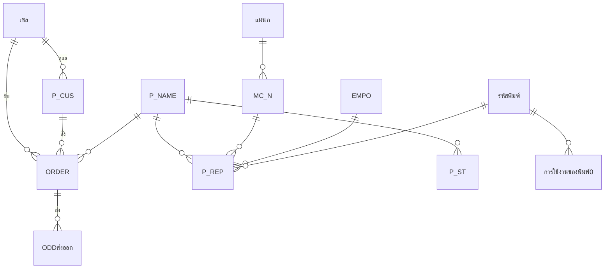

# Data Model — ผลผลิตและ ORDER

> สถานะ: **ร่าง — รอยืนยัน** · อัปเดต 2026-10-04
> ที่มา: `source/_extract/ผลผลิตและORDER/` (`tables.md`, `queries/*.sql`, `samples/*.csv`) + การ query ข้อมูลจริงแบบอ่านอย่างเดียว
> ระบบเดิมมี 113 ตาราง ไม่มีการประกาศ relationship และเกือบไม่มี primary key — **Key ทุกตัวที่มี 🔍 อนุมานจาก JOIN ใน query และค่าข้อมูล**
> ไฟล์นี้บอกว่าข้อมูล *คืออะไร* · ขั้นตอนที่ระบบทำกับข้อมูลอยู่ใน [business-rules.md](business-rules.md)

## สารบัญตาราง
ตารางที่ย้ายไประบบใหม่ (34 ตาราง) · ตารางที่ไม่ย้าย (79 ตาราง) อยู่หัวข้อ [ตารางที่ไม่ย้าย](#ตารางที่ไม่ย้าย)

| ID | ตาราง | หน้าที่ | แถว |
|---|---|---|---|
| T-P_CUS | P_CUS | ลูกค้า | 1,084 |
| T-P_NAME | P_NAME | สินค้า (ขาย + งานระหว่างผลิต) | 2,619 |
| T-เซล | เซล | เขตการขาย/พนักงานขาย | 12 |
| T-EMPO | EMPO | พนักงานฝ่ายผลิต | 196 |
| T-MC_N | MC_N | เครื่องจักร | 163 |
| T-รหัสพิมพ์ | รหัสพิมพ์ | แม่พิมพ์ | 444 |
| T-แผนก | แผนก | แผนกผลิต | 7 |
| T-ประเภท | ประเภท | ประเภทสินค้า | 26 |
| T-TYPE | TYPE | ชนิดเบรก | 2 |
| T-MODEL | MODEL | รุ่นรถ | 28 |
| T-รหัสสินค้าย่อ | รหัสสินค้าย่อ | กลุ่มสินค้าตาม prefix รหัส | 48 |
| T-รับจ้าง | รับจ้าง | ❓ ลูกค้างานรับจ้าง | 38 |
| T-สาเหตุ NCR | สาเหตุ NCR | สาเหตุของเสีย | 41 |
| T-วัตถุประสงค์คุณภาพ | วัตถุประสงค์คุณภาพ | เป้า % ของเสียรายแผนก | 10 |
| T-เป้าหมายคุณภาพ | เป้าหมายคุณภาพ | เป้า % ของเสีย (ชุดเก่า?) | 8 |
| T-หมายเหตุใบ sale order | หมายเหตุใบ sale order | ข้อความท้ายใบ Sale Order | 1 |
| T-BARCODE | BARCODE | ❓ ข้อมูลพิมพ์บาร์โค้ด | 27 |
| T-ODD | ODD | รายการ ORDER ที่ยังค้างส่ง | 80 |
| T-ORDER | ORDER | ประวัติการรับ ORDER | 144,740 |
| T-ODDส่งออก | ODDส่งออก | ประวัติการส่งของ | 146,390 |
| T-เลขที่ใบORDER | เลขที่ใบORDER | ทะเบียนเลขที่ ORDER | 26,045 |
| T-REF_NO<แผนก> | REF_NOไดคาสท์, REF_NOตกแต่ง, REF_NOอัดผ้าเบรค, REF_NOฝนผ้าเบรค, REF_NOผ้าคลัทช์, REF_NOประกอบ, REF_NOบรรจุ | ทะเบียนเลขที่ใบรายงานผลผลิต (7 ตาราง) | 434–505 ต่อตาราง |
| T-P_REPไดคาสท์ | P_REPไดคาสท์ | ใบรายงานผลผลิตแผนกไดคาสท์ | 10,774 |
| T-P_REPตกแต่ง | P_REPตกแต่ง | ใบรายงานผลผลิตแผนกตกแต่ง | 12,778 |
| T-P_REPอัดผ้าเบรก | P_REPอัดผ้าเบรก | ใบรายงานผลผลิตแผนกอัดผ้าเบรก | 20,333 |
| T-P_REPฝนผ้าเบรก | P_REPฝนผ้าเบรก | ใบรายงานผลผลิตแผนกฝนผ้าเบรก | 8,352 |
| T-P_REPผ้าคลัทช์และดิสเบรค | P_REPผ้าคลัทช์และดิสเบรค | ใบรายงานผลผลิตแผนกผ้าคลัทช์และดิสเบรค | 12,118 |
| T-P_REPประกอบ | P_REPประกอบ | ใบรายงานผลผลิตแผนกประกอบ | 14,076 |
| T-P_REPบรรจุ | P_REPบรรจุ | ใบรายงานผลผลิตแผนกบรรจุ | 49,184 |
| T-P_REP | P_REP | ผลผลิตที่โอนเข้าสต็อกแล้ว (รวมทุกแผนก) | 127,112 |
| T-P_ST | P_ST | ความเคลื่อนไหวสต็อกงวดปัจจุบัน | 19,541 |
| T-P_ADDST | P_ADDST | ความเคลื่อนไหวสต็อกงวดที่ปิดแล้ว | 204,281 |
| T-ต้นงวดP_ST | ต้นงวดP_ST | ยอดสต็อกยกมาต้นงวด | 103,941 |
| T-การใช้งานของพิมพ์0 | การใช้งานของพิมพ์0 | การใช้งานแม่พิมพ์งวดปัจจุบัน | 178 |
| T-ตันงวดการใช้งานของพิมพ์0 | ตันงวดการใช้งานของพิมพ์0 | ยอดใช้งานแม่พิมพ์ยกมาต้นงวด | 16,431 |

---

## T-P_CUS — ลูกค้า
หน้าที่: ข้อมูลลูกค้า หนึ่งแถว = หนึ่งลูกค้า
จำนวนแถวปัจจุบัน: 1,084

| ฟิลด์ | ชนิด | ขนาด | Null | Default | Key | ความหมาย / กฎ |
|---|---|---|---|---|---|---|
| CODE | Text | 255 | ได้ (จริง: ไม่มีค่าว่าง) | | 🔍 PK (ไม่ unique — ดูปัญหาคุณภาพข้อมูล) | รหัสลูกค้า รูปแบบ `SS-GG-NNN` เช่น `08-01-003` — 🔍 `SS` = เขตการขาย (ตรงกับ `SALE_ID`), `GG` = ❓ Q-20, `NNN` = ลำดับ |
| NAME | Text | 255 | ได้ | | | ชื่อร้าน/บริษัท |
| CREDIT | Text | 255 | ได้ | | | เงื่อนไขชำระเป็นข้อความ เช่น `60 วัน`, `เงินสด` |
| ADDRESS | Text | 255 | ได้ | | | ที่อยู่ (เลขที่ หมู่ ตำบล) |
| ADDRESS1 | Text | 255 | ได้ | | | อำเภอ |
| PROVINCES | Text | 255 | ได้ | | | จังหวัด — ใช้ในรายงานส่งออกตามจังหวัด |
| P_CODE | Text | 50 | ได้ | | | รหัสไปรษณีย์ |
| ADD1 | Text | 255 | ได้ | | | 🔍 ชื่อบริษัทขนส่ง เช่น `หจก. จันทบุรี ยุทธนา` |
| ADDDE | Text | 255 | ได้ | | | 🔍 จุดส่งของขนส่ง เช่น `พุทธมณฑลสาย 5` |
| ADDDE1 | Text | 255 | ได้ | | | 🔍 เบอร์โทรขนส่ง |
| TEL_1 | Text | 255 | ได้ | | | เบอร์โทร 1 |
| TEL_2 | Text | 255 | ได้ | | | เบอร์โทร 2 |
| SALE_ID | Text | 255 | ได้ | | 🔍 FK → T-เซล.ID | เขตการขายที่ดูแล (`00` = ออฟฟิศ) |
| REMARK | Text | 255 | ได้ | | | ชื่อ + ที่อยู่รวมเป็นข้อความเดียวสำหรับพิมพ์ |

Index: (CODE) ไม่ unique; (P_CODE) ไม่ unique; (SALE_ID) ไม่ unique

## T-P_NAME — สินค้า
หน้าที่: สินค้าทุกชนิด ทั้งสินค้าสำเร็จรูปที่ขาย สินค้าซื้อมาขาย และงานระหว่างผลิตของแต่ละแผนก (เช่น `G5029 C100 A อัดผ้าเบรก`) หนึ่งแถว = หนึ่งรหัสสินค้า
จำนวนแถวปัจจุบัน: 2,619 (เพิ่มตั้งแต่ปี 2005)

| ฟิลด์ | ชนิด | ขนาด | Null | Default | Key | ความหมาย / กฎ |
|---|---|---|---|---|---|---|
| PD_C | Text | 255 | ได้ (จริง: ไม่มีค่าว่าง) | | 🔍 PK (จริง: ไม่ซ้ำ) | รหัสสินค้า · prefix บอกกลุ่ม → T-รหัสสินค้าย่อ |
| PD_N | Text | 255 | ได้ | | | ชื่อสินค้า |
| U_NAME | Text | 255 | ได้ | | | หน่วยนับ เช่น `คู่`, `ชิ้น`, `เส้น` |
| U_PACK | Text | 255 | ได้ | | | 🔍 จำนวนต่อแพ็ค |
| WEIGHT | Double | | ได้ | | | ❓ Q-09 |
| WEIGHT1 | Double | | ได้ | | | ❓ Q-09 |
| WEIGHT2 | Double | | ได้ | | | ❓ Q-09 |
| WEIGHT3 | Double | | ได้ | | | ❓ Q-09 |
| WEIGHT4 | Double | | ได้ | | | ❓ Q-09 |
| U_PRICE | Double | | ได้ | | | ราคาขายตั้งต้น (บาท/หน่วย) |
| FML | Double | | ได้ | | | 🔍 ต้นทุน — คำนวณโดย BR-010 |
| MEM | Text | 255 | ได้ | | 🔍 FK → T-ประเภท.MEM | ประเภทสินค้า |
| MOULD | Text | 255 | ได้ | | 🔍 FK → T-รหัสพิมพ์.ID | แม่พิมพ์ที่ใช้ผลิต |
| CUS_ID | Text | 50 | ได้ | | 🔍 FK → T-P_CUS.CODE | ลูกค้าเจ้าของสินค้า (สินค้าสั่งทำเฉพาะราย) |
| CUS | Text | 255 | ได้ | | | ชื่อลูกค้าเจ้าของสินค้า (คัดลอก) |
| YEAR | Date/Time | | ได้ | | | 🔍 วันที่เพิ่มสินค้า |
| MODEL | Text | 255 | ได้ | | 🔍 FK → T-MODEL.MODEL | รุ่นรถ |
| BARCODE | Text | 50 | ได้ | | | บาร์โค้ด |
| มอก | Text | 255 | ได้ | | | เลข มอก. |
| TYPE | Text | 255 | ได้ | | 🔍 FK → T-TYPE | ชนิดเบรก |
| SIZE | Text | 255 | ได้ | | | ขนาด |
| FORMULA | Text | 255 | ได้ | | | สูตรเนื้อผ้าเบรก |
| MODEL1 | Text | 255 | ได้ | | | ❓ ชื่อรุ่นสำหรับแสดง (ในตัวอย่างซ้ำกับ PD_N) — Q-21 |

Index: (BARCODE) ไม่ unique; (CUS_ID) ไม่ unique

## T-เซล — เขตการขาย / พนักงานขาย
หน้าที่: รหัสเซลที่ผูกกับลูกค้าและ ORDER หนึ่งแถว = หนึ่งรหัสเซล — 🔍 **รหัสหมายถึงเขตการขาย ไม่ใช่ตัวบุคคล** เพราะคนเดียวกันมีหลายรหัส (`01` และ `08` = นายประเวศ; `02`, `03`, `10` = นายศุภฤกษ์) ❓ Q-22
จำนวนแถวปัจจุบัน: 12 · โครงสร้างคัดลอกมาจากตารางพนักงาน (35 ฟิลด์) แต่**มีข้อมูลเฉพาะ ID, NAME, NATION** และค่า default

| ฟิลด์ | ชนิด | ขนาด | Null | Default | Key | ความหมาย / กฎ |
|---|---|---|---|---|---|---|
| ID | Text | 4 | ได้ | | 🔍 PK (จริง: ไม่ซ้ำ) | รหัสเซล 2 หลัก `00`–`11` |
| NAME | Text | 255 | ได้ | | | ชื่อ (`00` = `ออฟฟิศ`, `11` = `เซลออนไลน์`) |
| SEX, BORN, ID_CODE, PER_ADD, ID_PLACE, ID_DATE, ADDRESS, START, NO, POINT, DEPARTMENT, POSITION, CLAS, ID_S, ACC, SHIFT, HOT1, RESIGN, SECTION, HOSPITAL, WORK, DATE_1, DATE_2, DATE_3, GRED_1, GRED_2, MEM, photo | หลายชนิด | | ได้ | | | ว่างทุกแถว — ไม่ย้าย |
| SALARY, SA_DAY, POINT_1, POINT_2 | Double/Long | | ได้ | 0 | | เป็น 0 ทุกแถว — ไม่ย้าย |
| NATION | Text | 50 | ได้ | "ไทย" | | ค่า default — ไม่ย้าย |

## T-EMPO — พนักงานฝ่ายผลิต
หน้าที่: พนักงานที่ถูกบันทึกในใบรายงานผลผลิต
จำนวนแถวปัจจุบัน: 196

| ฟิลด์ | ชนิด | ขนาด | Null | Default | Key | ความหมาย / กฎ |
|---|---|---|---|---|---|---|
| ID | Text | 5 | ได้ | | 🔍 PK (ซ้ำ 1 รหัส: `B179`) | รหัสพนักงาน เช่น `B792` — 🔍 ตัวอักษรนำหน้า = แผนก (T-แผนก.DEPA) |
| NAME | Text | 30 | ได้ | | | ชื่อ-สกุล |

Index: (ID) ไม่ unique

## T-MC_N — เครื่องจักร
หน้าที่: ทะเบียนเครื่องจักรของทุกแผนก
จำนวนแถวปัจจุบัน: 163

| ฟิลด์ | ชนิด | ขนาด | Null | Default | Key | ความหมาย / กฎ |
|---|---|---|---|---|---|---|
| CODE | Text | 6 | ไม่ | | PK | รหัสเครื่อง เช่น `B35`, `A001` — ตัวอักษรนำหน้า = แผนก |
| NAME | Text | 30 | ได้ | | | ชื่อเครื่อง |
| DEP | Text | 255 | ได้ | | 🔍 FK → T-แผนก.DEP | แผนกที่เครื่องอยู่ |

## T-รหัสพิมพ์ — แม่พิมพ์
หน้าที่: ทะเบียนแม่พิมพ์ หนึ่งแถว = แม่พิมพ์หนึ่งชุด
จำนวนแถวปัจจุบัน: 444

| ฟิลด์ | ชนิด | ขนาด | Null | Default | Key | ความหมาย / กฎ |
|---|---|---|---|---|---|---|
| ID | Text | 50 | ไม่ | | PK | รหัสแม่พิมพ์ เช่น `BF-029-1/1`, `BL-C100-1/8` — 🔍 `BF` = แม่พิมพ์ฉีดก้ามเบรก (ไดคาสท์), `BL` = แม่พิมพ์อัดผ้าเบรก, `-x/y` = ชุดที่ x จาก y |
| NAME | Text | 100 | ได้ | | | ชื่อแม่พิมพ์ |
| QTYS | Long | | ได้ | | | 🔍 จำนวนชิ้นต่อการฉีด 1 ครั้ง (cavity) |
| OWNER | Text | 100 | ได้ | "บจก.ล็อคเต้" | | เจ้าของแม่พิมพ์ |
| SHOT | Long | | ได้ | | | 🔍 อายุการใช้งาน (จำนวนครั้งที่ฉีดได้) เช่น 50,000 |
| PCS | Long | | ได้ | | | ❓ Q-23 (ส่วนใหญ่ว่าง) |
| YEAR | Long | | ได้ | | | ❓ Q-23 (ส่วนใหญ่ว่าง) |
| DEP | Text | 50 | ได้ | | 🔍 FK → T-แผนก.DEP | แผนกที่ใช้ |
| MARKER | Text | 100 | ได้ | "บจก.ล็อคเต้" | | ผู้สร้างแม่พิมพ์ |
| DATE | Date/Time | | ได้ | | | วันที่รับเข้า |
| OUT_DATE | Date/Time | | ได้ | | | วันที่เลิกใช้ (ว่าง = ยังใช้อยู่) |
| COST | Long | | ได้ | 0 | | ราคาแม่พิมพ์ (บาท) |
| AL WEIGHT | Single | | ได้ | | | 🔍 น้ำหนักอะลูมิเนียมต่อชิ้น (กก.) |

## T-แผนก — แผนกผลิต
หน้าที่: รายชื่อแผนก + prefix ของรหัส (เครื่องจักร, พนักงาน, เลขที่ใบรายงาน) · ค่าทั้งหมดอยู่ใน [ข้อมูลอ้างอิง](#ข้อมูลอ้างอิง-lookup--master)
จำนวนแถวปัจจุบัน: 7

| ฟิลด์ | ชนิด | ขนาด | Null | Default | Key | ความหมาย / กฎ |
|---|---|---|---|---|---|---|
| DEP | Text | 50 | ได้ | | 🔍 PK | ชื่อแผนก |
| DEPA | Text | 50 | ได้ | | | pattern prefix เช่น `D*` |

## T-ประเภท — ประเภทสินค้า
หน้าที่: ค่าที่เลือกได้ของ `P_NAME.MEM` · ค่าทั้งหมดอยู่ใน [ข้อมูลอ้างอิง](#ข้อมูลอ้างอิง-lookup--master)
จำนวนแถวปัจจุบัน: 26

| ฟิลด์ | ชนิด | ขนาด | Null | Default | Key | ความหมาย / กฎ |
|---|---|---|---|---|---|---|
| MEM | Text | 255 | ได้ | | 🔍 PK | ชื่อประเภท |

## T-TYPE — ชนิดเบรก
หน้าที่: ค่าที่เลือกได้ของ `P_NAME.TYPE` · ค่าทั้งหมดอยู่ใน [ข้อมูลอ้างอิง](#ข้อมูลอ้างอิง-lookup--master)
จำนวนแถวปัจจุบัน: 2

| ฟิลด์ | ชนิด | ขนาด | Null | Default | Key | ความหมาย / กฎ |
|---|---|---|---|---|---|---|
| NANE | Text | 255 | ได้ | | 🔍 PK | ชื่อชนิด (ชื่อฟิลด์สะกดผิดจาก NAME) |
| TYPE | Text | 255 | ได้ | | | ❓ รหัสชนิด `2`/`4` — Q-24 `P_NAME.TYPE` เก็บชื่อหรือรหัส |

## T-MODEL — รุ่นรถ
หน้าที่: ค่าที่เลือกได้ของ `P_NAME.MODEL` · ค่าทั้งหมดอยู่ใน [ข้อมูลอ้างอิง](#ข้อมูลอ้างอิง-lookup--master)
จำนวนแถวปัจจุบัน: 28

| ฟิลด์ | ชนิด | ขนาด | Null | Default | Key | ความหมาย / กฎ |
|---|---|---|---|---|---|---|
| MODEL | Text | 255 | ได้ | | 🔍 PK | ชื่อรุ่น + ตัวแปร เช่น `C100 A`, `C100 B` |

## T-รหัสสินค้าย่อ — กลุ่มสินค้า
หน้าที่: จับกลุ่มสินค้าจาก prefix ของ `PD_C` สำหรับรายงาน STOCK และยอดขาย · ค่าทั้งหมดอยู่ใน [ข้อมูลอ้างอิง](#ข้อมูลอ้างอิง-lookup--master)
จำนวนแถวปัจจุบัน: 48

| ฟิลด์ | ชนิด | ขนาด | Null | Default | Key | ความหมาย / กฎ |
|---|---|---|---|---|---|---|
| C | Text | 50 | ได้ | | 🔍 PK | pattern แบบ Access `LIKE` (`*` = อะไรก็ได้) เช่น `SB*` · `*` = ทั้งหมด |
| N | Text | 50 | ได้ | | | ชื่อกลุ่ม |

## T-รับจ้าง — ❓ ลูกค้างานรับจ้าง
หน้าที่: ❓ Q-11
จำนวนแถวปัจจุบัน: 38

| ฟิลด์ | ชนิด | ขนาด | Null | Default | Key | ความหมาย / กฎ |
|---|---|---|---|---|---|---|
| ID | Text | 255 | ได้ | | 🔍 PK | รหัส |
| NAME | Text | 255 | ได้ | | | ชื่อ |

Index: (ID) ไม่ unique

## T-สาเหตุ NCR — สาเหตุของเสีย
หน้าที่: ตัวเลือกสาเหตุสำหรับบันทึก NCR
จำนวนแถวปัจจุบัน: 41

| ฟิลด์ | ชนิด | ขนาด | Null | Default | Key | ความหมาย / กฎ |
|---|---|---|---|---|---|---|
| NCRDESC | Text | 255 | ได้ | | 🔍 PK | ข้อความสาเหตุ |

## T-วัตถุประสงค์คุณภาพ — เป้า % ของเสียรายแผนก
หน้าที่: เป้าหมาย % ของเสียที่ยอมรับได้ ใช้เทียบในรายงานผลผลิตประจำเดือน · ค่าทั้งหมดอยู่ใน [ข้อมูลอ้างอิง](#ข้อมูลอ้างอิง-lookup--master)
จำนวนแถวปัจจุบัน: 10

| ฟิลด์ | ชนิด | ขนาด | Null | Default | Key | ความหมาย / กฎ |
|---|---|---|---|---|---|---|
| DEP | Text | 255 | ได้ | | 🔍 PK | แผนก (บางแผนกมี 2 เป้า เช่น `ไดคาสท์1`, `ไดคาสท์2` ❓ Q-12) |
| QO | Single | | ได้ | 0 | | เป้า % ของเสีย |

## T-เป้าหมายคุณภาพ — เป้า % ของเสีย (ชุดเดิม)
หน้าที่: 🔍 ชุดเป้าหมายรุ่นก่อน — ค่าเท่ากับ T-วัตถุประสงค์คุณภาพ ทุกแผนก แต่ไม่มี `บรรจุ` และ `วางแผน` ❓ Q-12 ย้ายหรือรวม
จำนวนแถวปัจจุบัน: 8

| ฟิลด์ | ชนิด | ขนาด | Null | Default | Key | ความหมาย / กฎ |
|---|---|---|---|---|---|---|
| DEPART | Text | 50 | ได้ | | 🔍 PK | แผนก |
| OBJECT | Single | | ได้ | 0 | | เป้า % ของเสีย |

## T-หมายเหตุใบ sale order — ข้อความท้ายใบ Sale Order
หน้าที่: ข้อความหมายเหตุที่พิมพ์ท้ายใบ Sale Order (1 แถว) ปัจจุบัน: `ส่ง หนองบัวนครสวรรค์(นำโชคขนส่ง)` — 🔍 ผู้ใช้แก้ก่อนพิมพ์แต่ละครั้ง ❓ Q-25
จำนวนแถวปัจจุบัน: 1

| ฟิลด์ | ชนิด | ขนาด | Null | Default | Key | ความหมาย / กฎ |
|---|---|---|---|---|---|---|
| REMARK | Text | 255 | ได้ | | | ข้อความหมายเหตุ |

## T-BARCODE — ❓ ข้อมูลพิมพ์บาร์โค้ด
หน้าที่: ❓ Q-13
จำนวนแถวปัจจุบัน: 27

| ฟิลด์ | ชนิด | ขนาด | Null | Default | Key | ความหมาย / กฎ |
|---|---|---|---|---|---|---|
| ID | AutoNumber | | ไม่ | | PK | |
| รหัสสินค้า | Text | 255 | ได้ | | 🔍 FK → T-P_NAME.PD_C | |
| ชื่อสินค้า | Text | 255 | ได้ | | | |
| จำนวนที่มี | Double | | ได้ | | | ❓ |
| รหัส | Text | 255 | ได้ | | | ❓ |
| จำนวนรหัส | Double | | ได้ | | | ❓ |
| BARCODE | Text | 255 | ได้ | | | |

Index: (BARCODE) ไม่ unique

## T-ODD — รายการ ORDER ที่ยังค้างส่ง
หน้าที่: รายการสินค้าในใบ ORDER ที่ยังส่งไม่ครบ หนึ่งแถว = หนึ่งบรรทัดของใบ ORDER — แถวถูกลบเมื่อส่งครบ และ `QTY` ถูกลดเหลือยอดค้างเมื่อส่งบางส่วน (BR-003)
จำนวนแถวปัจจุบัน: 80 (ORDER ลงวันที่ 2025-05 ถึง 2026-09)

| ฟิลด์ | ชนิด | ขนาด | Null | Default | Key | ความหมาย / กฎ |
|---|---|---|---|---|---|---|
| OD_DATE | Date/Time | | ได้ | | | วันที่รับ ORDER |
| CUS_ID | Text | 50 | ได้ | | 🔍 FK → T-P_CUS.CODE | ลูกค้า |
| CUS_N | Text | 50 | ได้ | | | ชื่อลูกค้า ณ วันที่สั่ง (คัดลอก) |
| REF_NO | Text | 50 | ได้ | | 🔍 PK ร่วมกับ SUF_NO | เลขที่ ORDER รูปแบบ `SS-YY-NNNN` เช่น `08-68-0538` — `SS` = เซล, `YY` = ปี พ.ศ. 2 หลัก, `NNNN` = ลำดับ (BR-001) · ORDER เก่า/ใบสั่งของลูกค้าเองใช้รูปแบบอื่นได้ เช่น `24/2564` |
| SUF_NO | Long | | ได้ | | 🔍 PK ร่วม | ลำดับบรรทัดในใบ ORDER (1, 2, 3 …) |
| PD_C | Text | 6 | ได้ | | 🔍 FK → T-P_NAME.PD_C | สินค้า |
| PD_N | Text | 50 | ได้ | | | ชื่อสินค้า ณ วันที่สั่ง (คัดลอก) |
| QTY | Double | | ได้ | | | จำนวนที่ยังต้องส่ง |
| U_NAME | Text | 50 | ได้ | | | หน่วย |
| U_PRICE | Double | | ได้ | | | ราคาต่อหน่วย |
| AMOUNT | Double | | ได้ | | | มูลค่า = QTY × U_PRICE (BR-004) |
| DISC_PS | Double | | ได้ | | | 🔍 **ไม่ใช่ส่วนลด** — ใน T-ODDส่งออก เป็นเลขลำดับ 1, 2, 3 … ❓ Q-14 |
| DISC_2 | Double | | ได้ | | | ว่างทุกแถว (ทั้ง 3 ตาราง) — ไม่ย้าย |
| DISC_3 | Double | | ได้ | | | ว่างทุกแถว (ทั้ง 3 ตาราง) — ไม่ย้าย |
| NET | Double | | ได้ | | | 🔍 **ไม่ใช่ยอดสุทธิ** — ใน T-ODDส่งออก = เดือนของ `DL_DATE` (ตรง 100%) ❓ Q-14 |
| MARK | Text | 50 | ได้ | | | สถานะระหว่างประมวลผล (BR-002, BR-003): `Y` = ORDER ใหม่ยังไม่บันทึกประวัติ, `a` = ส่งครบ, `b` = ส่งไม่ครบ |
| SALE_ID | Text | 4 | ได้ | | 🔍 FK → T-เซล.ID | เขตการขาย |
| DL_DATE | Date/Time | | ได้ | | | วันที่ส่ง (กรอกตอนบันทึกส่ง แล้วล้างทิ้ง) |
| INV_NO | Text | 11 | ได้ | | | เลขที่บิลที่ส่ง (กรอกแล้วล้างทิ้ง) |
| INV_SUF | Long | | ได้ | | | ลำดับบรรทัดในบิล (กรอกแล้วล้างทิ้ง) |
| DL_QTY | Double | | ได้ | | | จำนวนที่ส่งครั้งนี้ (กรอกแล้วล้างทิ้ง) |
| DL_NET | Double | | ได้ | | | มูลค่าที่ส่งครั้งนี้ (กรอกแล้วล้างทิ้ง) |
| UND_QTY | Double | | ได้ | | | ยอดค้างส่ง |
| DUERE_D | Text | 50 | ได้ | | | 🔍 เครดิต (วัน) เช่น `30` |
| DATE_DL | Date/Time | | ได้ | | | กำหนดส่ง |
| LOT | Text | 255 | ได้ | | | Lot ที่ส่ง (กรอกแล้วล้างทิ้ง) |
| REMARK | Text | 255 | ได้ | | | ชื่อ + ที่อยู่ลูกค้าสำหรับพิมพ์ |

Index: (CUS_ID) ไม่ unique; (SALE_ID) ไม่ unique

## T-ORDER — ประวัติการรับ ORDER
หน้าที่: สำเนาทุกบรรทัดของใบ ORDER ณ ตอนรับ — ไม่ถูกแก้เมื่อมีการส่งของ (BR-002) ใช้ทำรายงานการรับ ORDER
จำนวนแถวปัจจุบัน: 144,740 (ข้อมูลถึง 2026-09)

**โครงสร้างเหมือน T-ODD ทุกฟิลด์** ส่วนที่ต่าง:

| ฟิลด์ | ชนิด | ขนาด | Null | Default | Key | ความหมาย / กฎ |
|---|---|---|---|---|---|---|
| QTY | Double | | ได้ | | | จำนวนสั่งเดิม (ไม่ถูกลด) |
| MARK | Text | 50 | ได้ | | | `del` = รอลบโดย BR-009, ว่าง = ปกติ |
| DISC_PS | Double | | ได้ | | | มีค่า 27% ของแถว (1, 2, 3 …) ❓ Q-14 |
| NET | Double | | ได้ | | | มีค่า 18% ของแถว (1–12) ❓ Q-14 |

## T-ODDส่งออก — ประวัติการส่งของ
หน้าที่: หนึ่งแถว = การส่งสินค้า 1 ครั้งของ 1 บรรทัด ORDER (บรรทัดเดียวกันส่งหลายครั้งได้)
จำนวนแถวปัจจุบัน: 146,390 (DL_DATE 2020-01 ถึง 2026-09)

**โครงสร้างเหมือน T-ODD ทุกฟิลด์** ส่วนที่ต่าง:

| ฟิลด์ | ชนิด | ขนาด | Null | Default | Key | ความหมาย / กฎ |
|---|---|---|---|---|---|---|
| REF_NO | Text | 13 | ได้ | | 🔍 FK → T-ORDER (REF_NO, SUF_NO) | ขนาด 13 (ไม่ใช่ 50) |
| DL_DATE | Date/Time | | ได้ | | | วันที่ส่ง |
| INV_NO | Text | 11 | ได้ | | | เลขที่บิล/ใบส่งของ เช่น `0103646` |
| INV_SUF | Long | | ได้ | | | ลำดับบรรทัดในบิล |
| DL_QTY | Double | | ได้ | | | จำนวนส่ง |
| DL_NET | Double | | ได้ | | | มูลค่าส่ง = DL_QTY × U_PRICE (ตรง 100% ของแถว — ไม่มีส่วนลด/VAT) |
| NET | Double | | ได้ | | | = เดือนของ DL_DATE (1–12) ตรง 100% |
| DISC_PS | Double | | ได้ | | | เลขลำดับ 1, 2, 3 … (มีค่าทุกปีเท่า ๆ กัน) ❓ Q-14 |
| MARK | Text | 50 | ได้ | | | `a` = ส่งครบ (103,347), `b` = ส่งไม่ครบ (1,637), ว่าง (41,406), `AB` = ชั่วคราวระหว่างโอนเข้าสต็อก (BR-006) |
| QA | Text | 50 | ได้ | | | **ว่างทุกแถว** — ไม่ย้าย |

## T-เลขที่ใบORDER — ทะเบียนเลขที่ ORDER
หน้าที่: เลขที่ ORDER ที่ถูกใช้แล้ว ใช้ออกเลขถัดไป (BR-001)
จำนวนแถวปัจจุบัน: 26,045

| ฟิลด์ | ชนิด | ขนาด | Null | Default | Key | ความหมาย / กฎ |
|---|---|---|---|---|---|---|
| REF_NO | Text | 50 | ไม่ | | PK | เลขที่ ORDER |
| MARK | Text | 50 | ได้ | | | สถานะชั่วคราวระหว่างลบ |

## T-REF_NO<แผนก> — ทะเบียนเลขที่ใบรายงานผลผลิต
หน้าที่: เลขที่ใบรายงานที่ใช้แล้วของแต่ละแผนก (7 ตาราง: `REF_NOไดคาสท์`, `REF_NOตกแต่ง`, `REF_NOอัดผ้าเบรค`, `REF_NOฝนผ้าเบรค`, `REF_NOผ้าคลัทช์`, `REF_NOประกอบ`, `REF_NOบรรจุ`)
จำนวนแถวปัจจุบัน: 434–505 ต่อตาราง

| ฟิลด์ | ชนิด | ขนาด | Null | Default | Key | ความหมาย / กฎ |
|---|---|---|---|---|---|---|
| REF_NO | Text | 50 | ได้ | | unique | เลขที่ใบรายงาน |

## T-P_REPไดคาสท์ — ใบรายงานผลผลิตแผนกไดคาสท์
หน้าที่: ผลผลิตที่แผนกบันทึก หนึ่งแถว = หนึ่งบรรทัดของใบรายงาน (เครื่อง × สินค้า × กะ)
จำนวนแถวปัจจุบัน: 10,774 (2020-01 ถึง 2026-09)

| ฟิลด์ | ชนิด | ขนาด | Null | Default | Key | ความหมาย / กฎ |
|---|---|---|---|---|---|---|
| DATE | Date/Time | | ได้ | | | วันที่ผลิต |
| REF_NO | Text | 8 | ได้ | | 🔍 PK ร่วมกับ SUF_NO | เลขที่ใบรายงาน เช่น `B69198` — ตัวอักษรนำหน้า = แผนก |
| SUF_NO | Long | | ได้ | | 🔍 PK ร่วม | ลำดับบรรทัด |
| MC_NO | Text | 10 | ได้ | | 🔍 FK → T-MC_N.CODE | เครื่องจักร |
| SHIFT | Text | 50 | ได้ | | | กะ: `A`, `B`, `D` (พบค่าผิดรูปแบบ — ดูปัญหาคุณภาพข้อมูล) ❓ Q-16 |
| START_T | Date/Time | | ได้ | | | ว่างทุกแถว — ไม่ย้าย |
| STOP_T | Date/Time | | ได้ | | | ว่างทุกแถว — ไม่ย้าย |
| TT_T | Double | | ได้ | | | ชั่วโมงทำงาน เช่น `8.0` |
| LOT_MTR1 | Text | 50 | ได้ | | | Lot วัตถุดิบ/งานที่รับจากแผนกก่อนหน้า เช่น `260901B00-A/2` |
| LOT_MTR2 | Text | 50 | ได้ | | | Lot วัตถุดิบตัวที่ 2 |
| PD_C | Text | 5 | ได้ | | 🔍 FK → T-P_NAME.PD_C | สินค้าที่ผลิต |
| PD_N | Text | 50 | ได้ | | | ชื่อสินค้า (คัดลอก) |
| U_NAME | Text | 50 | ได้ | | | หน่วย |
| QTY | Double | | ได้ | | | จำนวนที่ผลิต |
| NG | Double | | ได้ | | | จำนวนของเสีย |
| EMP_ID | Text | 40 | ได้ | | 🔍 FK → T-EMPO.ID | พนักงาน |
| TOTAL | Double | | ได้ | | | 🔍 จำนวนดี = QTY − NG (ตรง 88% ของแถวใน P_REP) — เป็นยอดที่เข้าสต็อก ❓ Q-17 |
| MAN_P | Double | | ได้ | | | ❓ Q-17 (ส่วนใหญ่ว่าง) |
| AVG | Double | | ได้ | | | ❓ Q-17 (ส่วนใหญ่ว่าง) |
| MARK1 | Text | 50 | ได้ | | | สถานะชั่วคราว (BR-005) |
| MOULD | Text | 100 | ได้ | | 🔍 FK → T-รหัสพิมพ์.ID | แม่พิมพ์ที่ใช้ |
| LOT | Text | 50 | ได้ | | | Lot ของผลผลิต: `YYMMDD` (ค.ศ.) + เครื่อง + `-` + กะ + `/` + ลำดับ เช่น `260903B35-A/1` |

Index: (EMP_ID) ไม่ unique

## T-P_REPตกแต่ง — ใบรายงานผลผลิตแผนกตกแต่ง
หน้าที่: เหมือน T-P_REPไดคาสท์ สำหรับแผนกตกแต่ง
จำนวนแถวปัจจุบัน: 12,778 (2020-01 ถึง 2026-09)
**โครงสร้างเหมือน T-P_REPไดคาสท์ ทุกฟิลด์**

## T-P_REPอัดผ้าเบรก — ใบรายงานผลผลิตแผนกอัดผ้าเบรก
หน้าที่: เหมือน T-P_REPไดคาสท์ สำหรับแผนกอัดผ้าเบรก
จำนวนแถวปัจจุบัน: 20,333 (ถึง 2026-09) · SHIFT: `A` 20,078 / `D` 193 / `B` 104
**โครงสร้างเหมือน T-P_REPไดคาสท์ ทุกฟิลด์**

## T-P_REPฝนผ้าเบรก — ใบรายงานผลผลิตแผนกฝนผ้าเบรก
หน้าที่: เหมือน T-P_REPไดคาสท์ สำหรับแผนกฝนผ้าเบรก
จำนวนแถวปัจจุบัน: 8,352 (2020-01 ถึง 2026-09)
**โครงสร้างเหมือน T-P_REPไดคาสท์ ทุกฟิลด์**

## T-P_REPผ้าคลัทช์และดิสเบรค — ใบรายงานผลผลิตแผนกผ้าคลัทช์และดิสเบรค
หน้าที่: เหมือน T-P_REPไดคาสท์ สำหรับแผนกผ้าคลัทช์และดิสเบรค
จำนวนแถวปัจจุบัน: 12,118 (2013-06 ถึง 2026-09)
**โครงสร้างเหมือน T-P_REPไดคาสท์ ทุกฟิลด์**

## T-P_REPประกอบ — ใบรายงานผลผลิตแผนกประกอบ
หน้าที่: เหมือน T-P_REPไดคาสท์ สำหรับแผนกประกอบ
จำนวนแถวปัจจุบัน: 14,076 (2020-01 ถึง 2026-09)
**โครงสร้างเหมือน T-P_REPไดคาสท์ ทุกฟิลด์**

## T-P_REPบรรจุ — ใบรายงานผลผลิตแผนกบรรจุ
หน้าที่: เหมือน T-P_REPไดคาสท์ สำหรับแผนกบรรจุ
จำนวนแถวปัจจุบัน: 49,184 (2020-01 ถึง 2026-09 + วันที่ผิด 2123)
**โครงสร้างเหมือน T-P_REPไดคาสท์ ทุกฟิลด์**

## T-P_REP — ผลผลิตที่โอนเข้าสต็อกแล้ว
หน้าที่: 🔍 รวมผลผลิตทุกแผนกที่คัดลอกมาจาก T-P_REP<แผนก> ตอนโอนเข้าสต็อก (BR-005) ใช้ทำรายงานผลผลิตและนับการใช้งานแม่พิมพ์ ❓ Q-06
จำนวนแถวปัจจุบัน: 127,112 (2020-01 ถึง 2026-08) · SHIFT: `D` 98,391 / `A` 28,433 / `B` 104 / อื่น ๆ ~40 แถว

**โครงสร้างเหมือน T-P_REPไดคาสท์ ทุกฟิลด์** ส่วนที่ต่าง:

| ฟิลด์ | ชนิด | ขนาด | Null | Default | Key | ความหมาย / กฎ |
|---|---|---|---|---|---|---|
| U_NAME | — | | | | | ไม่มีฟิลด์นี้ |
| MARK1 | Text | 50 | ได้ | | | `ab` = โอนแล้ว, `Y` = รอย้าย (BR-005) |

Index: (EMP_ID) ไม่ unique

## T-P_ST — ความเคลื่อนไหวสต็อกงวดปัจจุบัน
หน้าที่: สมุดรายการรับ-จ่ายสินค้า ยอดคงเหลือ = ผลรวม `QTY` ตาม `PD_C` (BR-006)
จำนวนแถวปัจจุบัน: 19,541 (ยอดยกมา 2025-12-31 + รายการหลังจากนั้น)

| ฟิลด์ | ชนิด | ขนาด | Null | Default | Key | ความหมาย / กฎ |
|---|---|---|---|---|---|---|
| DATE | Date/Time | | ได้ | | | วันที่ |
| REF_NO | Text | 10 | ได้ | | | เลขที่เอกสารอ้างอิง (ใบรายงานผลผลิต / ใบเบิก) · `stock` = ยอดยกมา |
| SUF_NO | Text | 2 | ได้ | | | ลำดับบรรทัด |
| PD_C | Text | 6 | ได้ | | 🔍 FK → T-P_NAME.PD_C | สินค้า |
| PD_N | Text | 100 | ได้ | | | ชื่อสินค้า (ส่วนใหญ่ว่าง) |
| QTY | Double | | ได้ | | | จำนวน: บวก = รับเข้า, ลบ = จ่ายออก |
| UNIT | Text | 50 | ได้ | | | หน่วย (ส่วนใหญ่ว่าง) |
| ID | Text | 50 | ได้ | | | ผู้ทำรายการ (รหัสพนักงาน) |
| MARK | Text | 2 | ได้ | | | ชนิดรายการ: `pd` = รับจากผลผลิต (บวกทุกแถว, 13,134), `tr` = เบิก/จ่ายออก (ลบทุกแถว, 4,658), ว่าง = ยอดยกมาหรือปรับปรุง (บวก 889 / ลบ 428) ❓ Q-19 |
| REM | Text | 50 | ได้ | | | หมายเหตุ |

Index: (ID) ไม่ unique

## T-P_ADDST — ความเคลื่อนไหวสต็อกงวดที่ปิดแล้ว
หน้าที่: รายการจาก T-P_ST ที่ถูกย้ายมาเมื่อตัดสต็อกสิ้นงวด (BR-007)
จำนวนแถวปัจจุบัน: 204,281 (ถึง 2025-12)

**โครงสร้างเหมือน T-P_ST** แต่ไม่มีฟิลด์ `PD_N`, `UNIT`, `REM` · MARK พบ: `pd` 120,386 / `tr` 48,206 / `de` 35,644 / ว่าง 30 / ค่าอื่นผิดรูปแบบ 15 แถว

## T-ต้นงวดP_ST — ยอดสต็อกยกมาต้นงวด
หน้าที่: ยอดคงเหลือต่อสินค้า ณ วันที่ตัดสต็อกแต่ละครั้ง (BR-007)
จำนวนแถวปัจจุบัน: 103,941 (2019-12-31 ถึง 2025-12-31)

**โครงสร้างเหมือน T-P_ADDST ทุกฟิลด์** · `REF_NO` = `stock` หรือ `DE` (ถูกยกเลิก), `MARK` = `de` (ถูกยกเลิก)

## T-การใช้งานของพิมพ์0 — การใช้งานแม่พิมพ์งวดปัจจุบัน
หน้าที่: จำนวนครั้งที่ฉีดของแม่พิมพ์แต่ละตัว ต่อวัน (BR-008)
จำนวนแถวปัจจุบัน: 178

| ฟิลด์ | ชนิด | ขนาด | Null | Default | Key | ความหมาย / กฎ |
|---|---|---|---|---|---|---|
| DAY | Date/Time | | ได้ | | | วันที่ |
| MOULD_ID | Text | 50 | ได้ | | 🔍 FK → T-รหัสพิมพ์.ID | แม่พิมพ์ |
| PD_QTY | Long | | ได้ | 0 | | จำนวนครั้งที่ใช้ |
| MARK | Text | 50 | ได้ | | | `ST` = ยอดยกมา, `de`/`DE` = ชั่วคราวระหว่างตัดยอด |

Index: (MOULD_ID) ไม่ unique

## T-ตันงวดการใช้งานของพิมพ์0 — ยอดใช้งานแม่พิมพ์ยกมาต้นงวด
หน้าที่: ยอดใช้งานสะสมต่อแม่พิมพ์ ณ วันที่ตัดยอดแต่ละครั้ง (BR-008) · ชื่อตารางสะกดผิด "ตัน" = "ต้น"
จำนวนแถวปัจจุบัน: 16,431 (2019-12-31 ถึง 2025-12-31)

**โครงสร้างเหมือน T-การใช้งานของพิมพ์0 ทุกฟิลด์**

---

## ความสัมพันธ์
ระบบเดิม **ไม่ได้ประกาศความสัมพันธ์ใด ๆ** และไม่บังคับ referential integrity — ทุกแถวด้านล่างอนุมานจาก JOIN ใน query และค่าข้อมูล

| แม่ (1) | ลูก (N) | ฟิลด์ | บังคับ | Cascade | ที่มา |
|---|---|---|---|---|---|
| T-เซล | T-P_CUS | ID → SALE_ID | ไม่ | ไม่ | 🔍 ค่าตรงกัน, query รายงานตามเซล |
| T-เซล | T-ODD, T-ORDER, T-ODDส่งออก | ID → SALE_ID | ไม่ | ไม่ | 🔍 query `ORDERตามเซล*`, `สรุปส่งออกตามเซล*` |
| T-P_CUS | T-ODD, T-ORDER, T-ODDส่งออก | CODE → CUS_ID | ไม่ | ไม่ | 🔍 query `ORDERตามลูกค้า*`, `รายงานส่งออกตามจังหวัด` |
| T-P_CUS | T-P_NAME | CODE → CUS_ID | ไม่ | ไม่ | 🔍 ชื่อฟิลด์ตรงกัน |
| T-P_NAME | T-ODD, T-ORDER, T-ODDส่งออก | PD_C → PD_C | ไม่ | ไม่ | 🔍 query `สรุปส่งออกตามรหัสสินค้า*` (P_NAME ถูกอ่าน 42 query) |
| T-P_NAME | T-P_REP*, T-P_ST, T-P_ADDST, T-ต้นงวดP_ST | PD_C → PD_C | ไม่ | ไม่ | 🔍 query รายงาน STOCK |
| T-ประเภท | T-P_NAME | MEM → MEM | ไม่ | ไม่ | 🔍 ค่าตรงกัน |
| T-MODEL | T-P_NAME | MODEL → MODEL | ไม่ | ไม่ | 🔍 query `ORDERตามรุ่น*` |
| T-TYPE | T-P_NAME | ❓ Q-24 | ไม่ | ไม่ | 🔍 ชื่อฟิลด์ตรงกัน |
| T-แผนก | T-MC_N, T-รหัสพิมพ์ | DEP → DEP | ไม่ | ไม่ | 🔍 ค่าตรงกัน |
| T-MC_N | T-P_REP* | CODE → MC_NO | ไม่ | ไม่ | 🔍 ค่าตรงกัน |
| T-EMPO | T-P_REP* | ID → EMP_ID | ไม่ | ไม่ | 🔍 ค่าตรงกัน |
| T-รหัสพิมพ์ | T-P_REP*, T-P_NAME | ID → MOULD | ไม่ | ไม่ | 🔍 query `บันทึกผลผลิต21` |
| T-รหัสพิมพ์ | T-การใช้งานของพิมพ์0, T-ตันงวดการใช้งานของพิมพ์0 | ID → MOULD_ID | ไม่ | ไม่ | 🔍 query `ตัดพิมพ์*` |
| T-ORDER | T-ODDส่งออก | (REF_NO, SUF_NO) → (REF_NO, SUF_NO) | ไม่ | ไม่ | 🔍 query `ส่งครบORDER2` คัดลอกจาก ODD |
| T-P_REP* (LOT) | T-P_REP* แผนกถัดไป (LOT_MTR1/2), T-ODDส่งออก (LOT) | LOT → LOT_MTR1 / LOT | ไม่ | ไม่ | 🔍 รูปแบบ lot ตรงกัน — การตรวจย้อนกลับ |

## ข้อมูลอ้างอิง (lookup / master)

**T-แผนก** (DEP → DEPA): ไดคาสท์ → `D*` · ตกแต่ง → `T*` · อัดผ้าเบรก → `B*` · ฝนผ้าเบรก → `G*` · ประกอบ → `A*` · ผ้าคลัทช์และดิสเบรก → `K*` · บรรจุ → `X*`

**T-TYPE** (NANE → TYPE): ดรัมเบรก → `2` · ดิสเบรก → `4`

**T-ประเภท** (26): ก้ามเบรก, ฉีดก้ามเบรก, ฉีดงานรับจ้าง, ฉีดแผ่นคลัทช์, โซ่, ดิสเบรกบรรจุกล่อง, ดิสเบรกสกินแพ็ค, ดิสเบรกสำเร็จ, แบตเตอรี่, ประกอบผ้าเบรก, ผ้าคลัทช์กล่อง, ผ้าคลัทช์สกินแพ็ค, ผ้าคลัทช์สำเร็จ, ผ้าเบรกบรรจุกล่อง, ผ้าเบรกสกินแพ็ค, แผ่นคลัทช์ชุด, แผ่นคลัทช์ปั้มและเหล็กคลัทช์, แผ่นคลัทช์ยิงทราย, ฝนผ้าเบรก, ไม้ก๊อก, ลูกปืน, สปริง, หัวเทียน, อัดดิสเบรก, อัดผ้าเบรก, อัดไม้ก๊อก

**T-MODEL** (28): A100 A, A100 B, AR125 A, BELLE A, C100 A, C100 B, CLICK A, DT100 A, DT100 B, GTO F A, GTO R, JOG, K125, KRISS, MATE U A, MATE U B, NH50, NOUVO, RX100 A, RX100 B, SPACY, SS50, TACT, V100 A, WAVE110 A, WING A, XL078 A, XL125 A

**T-รหัสสินค้าย่อ** (C → N):

| C | N | C | N | C | N |
|---|---|---|---|---|---|
| `*` | ทั้งหมด | `G1*` | ก้ามเบรก | `M0*` | แม่พิมพ์ |
| `BA*` | แบตเตอรี | `G2*` | แผ่นคลัทช์ | `MA*` | แม่พิมพ์ |
| `BP*` | ถุงหิ้วพิมพ์ | `G3*` | ก้ามเบรก | `MI*` | กระสอบปุ๋ย |
| `BR*` | ลูกปืน | `G4*` | แผ่นคลัทช์ | `MO*` | แม่พิมพ์ |
| `CA*` | กล่อง,ค่าBLOCK | `G5*` | อัดผ้าเบรก | `MU*` | แม่พิมพ์ |
| `CD*` | แผ่นคลัทช์ชุด | `G6*` | ฝนผ้าเบรก | `P0*` | งานฉีดอลูมิเนียม |
| `CF*` | บริการ | `G7*` | ผ้าเบรก | `PA*` | บรรจุ |
| `CH*` | โซ่ | `G8*` | ไม้ก๊อก | `QP*` | อะไหล่พิมพ์ |
| `DB*` | เหล็กดิสเบรค | `G90*` | อัดไม้ก๊อก | `RM*` | ล้อ |
| `EX` | สินค้าสำเร็จรูปซื้อมาขาย | `G91*` | คลัทช์สำเร็จ | `SB*` | ผ้าเบรกกล่อง |
| `G0*` | แผ่นคลัทช์ | `GD5*` | ดิสเบรก | `SD*` | ดิสเบรคสกินแพค |
| `HM*` | หมวกกันน็อค | `GD6*` | ดิสเบรก | `SG*` | คลัทช์สกินแพค |
| `L0*` | ก้ามเปล่า | `GD7*` | ดิสเบรก | `SH*` | แผ่นป้าย |
| `L1*` | มือเบรก,มือคลัทช์ | `GD8*` | ดิสเบรก | `Sk*` | ผ้าเบรคสกินแพค |
| `LM*` | หลอดไฟ | | | `SL*` | หัวเทียน |
| | | | | `SP*` | สปริง |
| | | | | `SR*` | ยางดุม |
| | | | | `SS*` | ผ้าเบรคสกินแพค ใส่สปริง |
| | | | | `SX*` | ผ้าคลัทช์กล่อง |

หมายเหตุ: pattern บางคู่ทับซ้อนกัน (`G1*`/`G3*` = ก้ามเบรกทั้งคู่, `G0*`/`G2*`/`G4*` = แผ่นคลัทช์) และ `EX` ไม่มี `*` ❓ Q-26

**T-วัตถุประสงค์คุณภาพ** (DEP → QO %): ไดคาสท์1 1.2 · ไดคาสท์2 5.0 · ตกแต่ง 0.16 · อัดผ้าเบรค 1.2 · ผ้าคลัทช์และดิสเบรค1 1.2 · ผ้าคลัทช์และดิสเบรค2 0.6 · ฝนผ้าเบรค 0.1 · ประกอบ 0.35 · บรรจุ 0.3 · วางแผน 0.8

**T-เซล** (ID → NAME): 00 ออฟฟิศ · 01 นาย ประเวศ บุญแสงชัย · 02 นาย ศุภฤกษ์ นันทมงคล · 03 นาย ศุภฤกษ์ นันทมงคล · 04 นาย สมชาย เพียรพล · 05 นาย กิตติพงษ์ อนุวงศ์ · 06 นาย อำนาจพงษ์ อนุวงศ์ · 07 นาย พนัง ฟักแฟง · 08 นาย ประเวศ บุญแสงชัย · 09 นาย วรวิทย์ วงศ์วรวิทย์ · 10 นาย ศุภฤกษ์ นันทมงคล · 11 เซลออนไลน์

## ปัญหาคุณภาพข้อมูลที่พบ
| ปัญหา | ตัวอย่าง / จำนวน | ผลกระทบ |
|---|---|---|
| รหัสลูกค้าซ้ำ | 9 รหัสซ้ำ 2 แถว: `02-14-004`, `02-17-001`, `02-17-004`, `03-07-019`, `03-25-003`, `10-07-015`, `10-13-001`, `30-01-013`, `30-01-032` | ย้ายเข้าตารางที่มี PK ไม่ได้ — ต้องให้ผู้ใช้เลือกแถวที่ถูก (Q-08) |
| รหัสพนักงานซ้ำ | `EMPO.ID` = `B179` ซ้ำ 2 แถว | เช่นเดียวกัน (Q-08) |
| วันที่ผิดปี (พ.ศ. ลงช่อง ค.ศ. / พิมพ์ผิด) | `P_ST.DATE` สูงสุด 2562-05-08 · `P_ADDST.DATE` ต่ำสุด 0120-10-10 · `P_REPอัดผ้าเบรก.DATE` 0256-12-13 · `P_REPบรรจุ.DATE` 2123-08-09 · `DATE_DL` 5820-11-16 | รายงานตามช่วงวันที่ตกหล่น — ระบบใหม่ต้องตรวจช่วงปี (BR-011) |
| วันที่เป็นค่าศูนย์ของ Access | `OD_DATE` = 1899-12-30 | แปลงเป็นค่าว่าง |
| ค่ากะผิดรูปแบบ | `P_REP.SHIFT`: `.D`, `A.`, `1D`, `DD`, `1174`, `DG7031`, `210429T01-D/1`, `ก` ฯลฯ ~40 แถว (นอกเหนือ `A`/`B`/`D`, ว่าง 152) | ต้อง map ก่อนย้าย |
| MARK ผิดรูปแบบ | `P_ADDST.MARK` = `0`–`30`, `.`, `r` (15 แถว) | ต้อง map ก่อนย้าย |
| รหัสสินค้าผิดรูปแบบในสต็อก | `P_ST.PD_C` = `.G7045`, `0` | ยอดสต็อกไม่ผูกกับสินค้า |
| ชื่อลูกค้า/สินค้าถูกคัดลอกลงทุกรายการ | `CUS_N`, `PD_N` | ค่าอาจไม่ตรง master ปัจจุบัน (เป็น snapshot) |

## ฟิลด์/ตารางที่เลิกใช้
| ตาราง.ฟิลด์ | หลักฐาน | ย้ายไหม |
|---|---|---|
| T-P_REP*.START_T, STOP_T | ว่างทุกแถวทุกตาราง | ไม่ |
| T-ODD/ORDER/ODDส่งออก.DISC_2, DISC_3 | ว่างทุกแถวทั้ง 3 ตาราง (291,220 แถว) | ไม่ |
| T-ODDส่งออก.QA | ว่างทุกแถว | ไม่ |
| T-เซล ทุกฟิลด์ยกเว้น ID, NAME | ว่าง / ค่า default | ไม่ |
| T-ODD/ORDER/ODDส่งออก.NET, DISC_PS | ใช้ผิดความหมายชื่อ (เดือน, ลำดับ) | ❓ Q-14 |

## ตารางที่ไม่ย้าย
| เหตุผล | ตาราง | หลักฐาน |
|---|---|---|
| ตารางเก็บพารามิเตอร์ของฟอร์ม/รายงาน (ระบบใหม่รับค่าจากหน้าจอแทน) | `วันที่`, `วันที่ตัดSTOCK`, `วันที่ตัดพิมพ์`, `วันที่ผลผลิตไดคาสท์`, `วันที่ผลผลิตตกแต่ง`, `วันที่ผลผลิตบรรจุ`, `วันที่ผลผลิตประกอบ`, `วันที่ผลผลิตผ้าคลัทช์`, `วันที่ผลผลิตฝนผ้าเบรค`, `วันที่ผลผลิตอัดผ้าเบรค`, `วันที่ส่งออก`, `วันที่โอนผลผลิต`, `วันที่โอนผลผลิต1`, `เดือน`, `พิมพ์`, `รหัสลูกค้า`, `รหัสลูกค้าย่อ`, `รหัสสินค้า`, `รหัสสินค้า1`, `รหัสสินค้า11`, `รหัสย่อ`, `รหัสสินค้าย่อ1`, `เลือกเซล`, `เซล1`, `เลขที่ใบรายงาน`, `ลบORDER`, `sale oder`, `พิมพ์รายชื่อสินค้าตามลูกค้า`, `ORDERส่งครบ` | 1–12 แถว มีแต่ FROM_DATE/TO_DATE หรือค่าตัวเลือก ถูก JOIN แบบ cross join ใน action query |
| ตารางกลไกออกเลข | `MAX_REF_NO` | 2 แถว ลบ-เติมทุกครั้ง (BR-001) |
| ตารางพักผลรายงาน (ระบบใหม่คำนวณสด) | `ODDรวม`, `ODDรวม1`, `ODDADD1`, `สรุปการรับORDER`, `สรุปส่งออก1001`, `สรุปส่งออก23`, `สรุปส่งออกเดือน1B`, `สรุปส่งออกเดือน10B`, `สรุปส่งออกเดือน400B`, `สรุปส่งออกตามชื่อสินค้า`, `สรุปส่งออกตามรหัสสินค้า`, `สรุปส่งออกตามเซล`, `สรุปส่งออกใน-นอก`, `ผลผลิตเดือน`, `ผลผลิตประจำเดือน`, `ผลผลิตประจำเดือน120`, `ผลผลิตประจำเดือน121`, `ยอดขายแต่ละชนิด`, `รายงานส่งออกSALE ORDER1`, `P_ST1` | มี DELETE query ล้างก่อน APPEND ทุกครั้ง |
| ว่างเปล่า | `DEL_ODD`, `ODDADD`, `P_ADDREP`, `P_IN`, `P_ODDADD`, `P_REP1`, `P_REP2`, `P_REPสโตร์`, `P_ST3` | 0 แถว |
| สำเนาสำรอง | `สำเนาของ ODDส่งออก`, `สำเนาของ P_CUS`, `สำเนาของ P_NAME`, `สำเนาของ P_NAME1`, `สำเนาของ P_NAME11`, `สำเนาของ ตันงวดการใช้งานของพิมพ์0` | ชื่อ "สำเนาของ" ข้อมูลเก่า |
| ข้อมูลเก่ามาก ❓ Q-07, Q-18 | `NCR` (43 แถว, ส.ค. 2009 เท่านั้น), `P_ST2` (19 แถว, 2019) | ไม่มีข้อมูลใหม่หลายปี แม้ยังอยู่ในเมนู |
| ไม่ทราบที่มา ❓ Q-07 | `ตาราง1` (1 แถว), `สปริงผ้าเบรค` (39 แถว ฟิลด์ชื่อ `เขตข้อมูล1..10`) | ชื่อตาราง/ฟิลด์เป็นค่า default ของ Access — น่าจะ import ชั่วคราว |
| ตารางระบบของ Access | `Name AutoCorrect Save Failures`, `ความล้มเหลวในการบันทึกการแก้ไขชื่ออัตโนมัติ`, `Switchboard Items` | สร้างโดย Access (`Switchboard Items` = เมนู ใช้อ้างอิงใน screens.md) |
