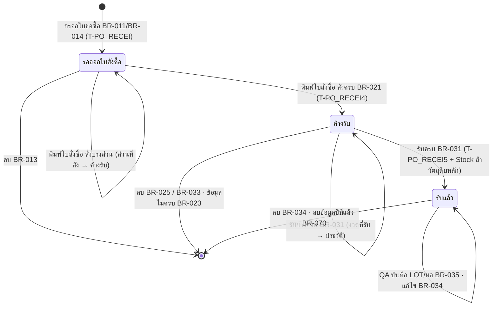

# Business Rules — วัตถุดิบ

> สถานะ: **ถอดครบ — รอยืนยัน** · อัปเดต 2026-10-05
> ที่มา: macro 128 ตัว + SQL ของ query 248 ตัว + นิยามฟอร์มและซอร์ส VBA ที่กู้จากตารางระบบ `MSysAccessStorage` (`source/_extract/วัตถุดิบ/recovered/`) + ตรวจกับข้อมูลจริง (อ่านอย่างเดียว)
> สถานะ "✅ จากโค้ด" = อ่านจากโค้ดเดิมโดยตรง แต่ผู้ใช้ยังไม่ยืนยันความหมายทางธุรกิจ
> ระบบเดิม**ไม่ใช้ transaction** — macro รัน query ทีละตัว ถ้าหยุดกลางทาง ข้อมูลค้างครึ่งทางได้ทุกขั้นตอนด้านล่าง (BR-080)
> ไฟล์นี้บรรยายพฤติกรรมเดิมตามจริง — ผู้ใช้ตัดสินใจ (2026-10-05): **ระบบใหม่คงพฤติกรรมเดิมไว้ก่อน** จุด ⚠ คือรายการปรับปรุงภายหลัง (open-questions หมวด ข.)
> ผลลัพธ์ของแต่ละกฎอยู่ในขั้นตอน **กฎ** และตารางตัวอย่าง · กฎที่ไม่มีบรรทัด **เหตุผล** = ยังไม่ทราบเหตุผลทางธุรกิจ (❓ Q-56)

## การปัดเศษที่ใช้ในโปรแกรม

| ID | ฟังก์ชันเดิม | พฤติกรรม + ตัวอย่าง | ใช้ที่ |
|---|---|---|---|
| RND-A | `CutDecimal(x)` (module `ThaiNumber`) = `((x*100) \ 1) / 100` | **ปัดเป็นทศนิยม 2 ตำแหน่ง แบบปัดครึ่งเป็นคู่ (banker's)** — ชื่อบอกว่า "ตัด" แต่ตัวดำเนินการ `\` ของ VBA ปัด operand เป็นจำนวนเต็มก่อนหาร จึงเป็นการปัด ไม่ใช่ตัด · ค่า `.xx5` ขึ้นกับการแทนค่า Double ของผลคูณ จึงอาจขึ้นหรือลง ✅ ตัวอย่างจริงจาก T-PO_RECEI5: 138.244→**138.24**, 130.968→**130.97**, 374.50428→**374.50**, 136.425→**136.43**, 300.135→**300.13**, 500.225→**500.23**, 1064.115→**1064.12** · ⚠ ถ้า `x × 100` เกิน 2,147,483,647 (ยอด > 21,474,836.47 บาท) เกิด error overflow | BR-022, BR-024 |
| RND-B | ไม่ปัด (Double) | คูณตรง ๆ เก็บทศนิยมเต็ม เช่น 96 × 10,042.8 = `964108.7999999999` | `NET_AMT` ทุกที่ (BR-011, BR-021, BR-030), ผลรวมในรายงาน |
| RND-C | เก็บใน field ชนิด Single | ความละเอียด ~7 หลัก ค่าเพี้ยนท้าย เช่น TO = 6,826.60 เก็บเป็น `6826.60009765625`, TA = 446.6 เป็น `446.6000061035156` | `PO_RECEI2.SumOfNET_AMT/TA/TO`, `PO_RECEI4.TOTAL`, `PO_RECEI1/2.NET_AMT/TAX` |
| RND-D | ใส่ค่า Double ลง field ชนิด Long | Access แปลงเป็นจำนวนเต็มแบบปัด 🔍 (ปัดครึ่งเป็นคู่ตามการแปลงของ Jet ❓ Q-16) เช่น 1,234.56 → 1,235 | ตารางพักรายงานรายปีตามชื่อ (BR-061 ข), ซื้อมาขาย (BR-062) |
| RND-E | `GetThaiUnit(x)` | สตางค์ใช้ **2 หลักแรกหลังจุด (ตัด ไม่ปัด)** จากข้อความของตัวเลข เช่น 100.129 → "สิบสองสตางค์" (BR-064) | RPT-02, RPT-10 |
| RND-F | รูปแบบแสดงผล `Standard` ในรายงาน/ฟอร์ม | แสดง 2 ตำแหน่งพร้อมคั่นหลักพัน (ปัดเพื่อแสดงเท่านั้น ค่าที่เก็บไม่เปลี่ยน) | ทุกรายงานที่มีจำนวน/เงิน |

---

# ข้อมูลหลัก

## BR-001 — การเพิ่ม/แก้ไขวัตถุดิบ
สถานะ: ✅ จากโค้ด
ที่มา: ฟอร์ม `MTR_NAME` (เพิ่ม), `MTR_NAME1` + ฟอร์มย่อย `MTR_NAME2` (แก้ไข) · VBA `CODE_AfterUpdate` · macro `ปรับปรุงข้อมูลวัตถุดิบ`, `ปรับปรุงข้อมูลวัตถุดิบ1` → query `ปรับปรุงข้อมูลวัตถุดิบ`

**กฎ:**
1. ช่องรหัส (`CODE`) — หลังพิมพ์แปลงเป็นตัวพิมพ์ใหญ่ (`UCase`) · ห้ามซ้ำ/ห้ามว่างโดย PK ของตาราง (Access แสดงข้อความมาตรฐานของระบบเมื่อซ้ำ ไม่มีข้อความเฉพาะ)
2. ช่องที่กรอกได้: รหัส, ชื่อ, หน่วย, วัตถุดิบหลัก (ใช่/ไม่ใช่), ราคาซื้อคืนต่อ กก. (`BUY`) — หน้าจอแก้ไขมีช่องราคา (`COST`) เพิ่ม
3. ปุ่ม "กลับเมนูเดิม" → **ลบวัตถุดิบทุกแถวที่ชื่อว่าง** (ทั้งตาราง ไม่ใช่เฉพาะแถวที่เพิ่งกรอก) แล้วปิดฟอร์ม
4. ไม่มีการตรวจชื่อซ้ำ ความยาวชื่อ (มีแค่ป้ายเตือน "ไม่ควรเกิน 56 ตัวอักษร") หรือการลบวัตถุดิบที่ยังถูกใช้

**เหตุผล:** 🔍 ขั้น 3 ล้างแถวที่ผู้ใช้เผลอสร้างจากการพิมพ์รหัสแล้วออก
**ถ้าผิดเงื่อนไข:** รหัสซ้ำ → Access ไม่ยอมบันทึกแถว

| # | Input | Expected |
|---|---|---|
| 1 | พิมพ์รหัส `r0200` | เก็บเป็น `R0200` |
| 2 | เพิ่มรหัส `R0019` (มีอยู่แล้ว) | บันทึกไม่ได้ (PK ซ้ำ) |
| 3 | สร้างแถว `X0001` ไม่ใส่ชื่อ แล้วกด "กลับเมนูเดิม" | แถว `X0001` ถูกลบ |

⚠ ข้อสังเกต
- ฟอร์มเพิ่มมี VBA `SUP_CODE_AfterUpdate` (เติมชื่อผู้ขาย) แต่ไม่มีช่อง `SUP_CODE` บนฟอร์ม — ผู้ขาย/ราคาล่าสุดถูกเติมโดย BR-031 ขั้น 6 เท่านั้น
- ฟอร์มเพิ่มบันทึก filter ค้างไว้ `Not NAME="ค่าสอบเทียบ Pressure Gauge (0-350 kg/m2"` (ไม่มีผลต่อการเพิ่ม)

## BR-002 — การเพิ่ม/แก้ไขผู้ขาย
สถานะ: ✅ จากโค้ด
ที่มา: ฟอร์ม `SP` (เพิ่ม), `SP1` + ฟอร์มย่อย `SP2` (แก้ไข/พิมพ์) · macro `ปรับปรุงข้อมูลผู้ขาย1`, `ปรับปรุงข้อมูลผู้ขาย2` → query `ปรับปรุงข้อมูลผู้ขาย`

**กฎ:**
1. รหัสผู้ขายแปลงเป็นตัวพิมพ์ใหญ่หลังพิมพ์ · **ไม่มีการตรวจซ้ำ** (ตารางไม่มี PK — ข้อมูลจริงมีรหัสซ้ำ 5 รหัส DQ-01)
2. ช่อง: รหัส, ชื่อ, ที่อยู่ 2 บรรทัด, โทร 2 เบอร์, แฟกซ์, ผู้ติดต่อ, เครดิต (เลือกจาก T-CREDIT), VAT (YES/NO), ประเภทผลิตภัณฑ์, ประเภทธุรกิจ (เลือก), ใบรับรอง (มี/ไม่มี), ใช้ในการผลิต (ใช่/ไม่ใช่)
3. ปุ่ม "กลับเมนูเดิม" → ลบผู้ขายทุกแถวที่ชื่อว่าง แล้วปิดฟอร์ม
4. หน้าจอแก้ไขค้นผู้ขายด้วยรหัส (ไปที่แถวแรกที่รหัสตรง — ถ้ารหัสซ้ำ เข้าแถวที่สองไม่ได้ผ่านช่องค้น)

| # | Input | Expected |
|---|---|---|
| 1 | เพิ่ม `as-40` | เก็บ `AS-40` |
| 2 | เพิ่ม `S0198` ซึ่งมีอยู่แล้ว | บันทึกได้ → รหัสซ้ำ |

⚠ ข้อสังเกต
- การแก้ชื่อผู้ขายทำให้ประวัติรับของเดิม JOIN กับผู้ขายไม่ได้ในงานประเมิน (BR-050 ใช้ชื่อเป็น key)

## BR-003 — วัตถุดิบหลัก (`INCOMING` = `ใช่`)
สถานะ: ✅ จากโค้ด · นิยามจากป้ายฟอร์ม: "วัตถุดิบหลัก คือ วัตถุดิบที่ใช้ในการผลิตผ้าเบรก ดิสเบรก ผ้าคลัทช์ โดยเฉพาะ เช่น อลูมิเนียมสำหรับฉีด ขาเหล็ก เคมีผ้าเบรก เหล็กดิสเบรก ไม้ก๊อกผง เคมีผ้าคลัทช์ กาวที่ใช้อัด นอกนั้นไม่ใช่วัตถุดิบหลัก"
ที่มา: query `รับวัตถุดิบ5`, `รายงานการรับวัตถุดิบหลัก`, `รับวัตถุดิบหลัก1`, combo ในฟอร์ม `ตั้งวันที่บันทึกการรับของ1`

**กฎ:** ธงนี้มีผล 3 อย่าง:
1. รับของแล้ว**เข้าสต็อกเฉพาะวัตถุดิบหลัก** (BR-031 ขั้น 1) — วัตถุดิบอื่นมีแค่ประวัติรับของ
2. รายงานวัตถุดิบหลัก (RPT-23, RPT-24) นับเฉพาะวัตถุดิบหลัก
3. รายการวัตถุดิบในงานหลอมอลูมิเนียม (BR-060) แสดงเฉพาะวัตถุดิบหลัก

ค่าว่างถือเป็น "ไม่ใช่" (เงื่อนไขเปรียบเทียบ `= "ใช่"`)

⚠ ข้อสังเกต
- การเบิก (BR-040) ไม่ตรวจธงนี้ — เบิกวัตถุดิบที่ไม่เข้าสต็อกได้ ยอดคงเหลือจึงติดลบ (DQ-08)
- หน้าจอ QA (BR-035) แสดงทุกรายการที่รับในวันนั้น ไม่กรองวัตถุดิบหลัก (query `QAรับวัตถุดิบ` ที่กรองไว้อยู่ในฟอร์มที่ไม่มีทางเข้า)

---

# ใบขอซื้อ (PR)

## BR-010 — การออกเลขที่ใบขอซื้อ
สถานะ: ✅ จากโค้ด
ที่มา: ฟอร์ม `ตาราง1` (เลือกแผนก) → macro `พิมพ์ใบขออนุมัติสั่งซื้อ` → query `แบบสอบถาม1`, `แบบสอบถาม2`, `แบบสอบถาม3` → ฟอร์ม `ฟอร์ม3` (แสดงผล) → ฟอร์ม `PO_RECEI_DIE` event Load

**กฎ:** เลขที่ใบขอซื้อรูปแบบ `<prefix><YY>-<NNNN>` แยกลำดับตามแผนกและปี
1. ผู้ใช้เลือกแผนก → ได้ pattern `T-รายชื่อแผนก.CODE` (เช่น `B*`, `D6*`) เก็บลง `ตาราง1.ID`
2. หาเลขมากที่สุดใน T-PO_RECEI_ADD ที่ `PR_NO LIKE pattern` (เปรียบเทียบแบบข้อความ)
3. แยกส่วนตามความยาวเลขเดิม: ยาว 8 ตัว → prefix 1 ตัว, ปี = ตัวที่ 2–3; ยาวอื่น → prefix 2 ตัว, ปี = ตัวที่ 3–4; ลำดับ = 4 ตัวท้าย
4. ถ้าปีของเลขเดิม = `Right(Date(),2)` → ลำดับ + 1 เติม 0 ข้างหน้าให้ครบ 4 หลัก; ไม่เท่า (ขึ้นปีใหม่) → ลำดับ = `0001`
5. เลขใหม่ = prefix (จากเลขเดิม) + ปีปัจจุบัน + `-` + ลำดับ
6. ฟอร์มใบขอซื้อเปิดพร้อม `PR_NO` = เลขใหม่ และ `EMP_ID` = ชื่อแผนก (ผู้ใช้แก้ทั้งสองช่องได้)
7. เลข**ยังไม่ถูกจอง** — ลงทะเบียนเมื่อพิมพ์หรือออกจากฟอร์ม (BR-011 ขั้น 2, BR-014)

**ปีปัจจุบัน** = 2 ตัวท้ายของวันที่ที่แปลงเป็นข้อความตาม regional setting ของ Windows — เครื่องที่ใช้ตั้งเป็น พ.ศ. (2026 → `69`) 🔍 จากข้อมูล (`B69-0086`)
**เหตุผล:** 🔍 ให้รู้แผนกจากเลขที่ และนับใหม่ทุกปี
**เงื่อนไขก่อน:** เลือกแผนกแล้ว
**ถ้าผิดเงื่อนไข:** ไม่มีการตรวจใด ๆ — ดูตัวอย่าง #5–#7

| # | Input | Expected |
|---|---|---|
| 1 | แผนก `B*`, เลขสูงสุด `B69-0086`, วันนี้ ต.ค. 2569 | `B69-0087` |
| 2 | แผนก `DM*`, เลขสูงสุด `DM69-0015` | `DM69-0016` |
| 3 | แผนก `T*`, เลขสูงสุด `T68-0130`, วันนี้ ม.ค. 2569 | `T69-0001` |
| 4 | แผนก `QA*`, ยังไม่เคยมีเลข | `PR_NO` ว่าง — ผู้ใช้ต้องพิมพ์เอง |
| 5 | แผนก ไดคาสท์ `D6*`, วันนี้ ม.ค. 2570 (2027), เลขสูงสุดที่ตรง `D6*` = `D69-0077` | `D70-0001` — และ**ทุกครั้งถัดไปก็ได้ `D70-0001` ซ้ำ** เพราะ `D70-…` ไม่ตรง pattern `D6*` ⚠ |
| 6 | ลำดับเดิม `9999` | `NNNN` = ว่าง → `B69-` ⚠ |
| 7 | ผู้ใช้ 2 คนเปิดฟอร์มพร้อมกัน แผนกเดียวกัน | ได้เลขเดียวกันทั้งคู่ ⚠ |

⚠ ข้อสังเกต
- **ไดคาสท์จะออกเลขซ้ำตั้งแต่ ม.ค. 2570 (2027)** (ตัวอย่าง #5) — pattern `D6*` ถูกตั้งเพื่อแยกจากแม่พิมพ์ `DM*` แต่ผูกกับปี 25**6**x · ทะเบียนมี PK จึงลงทะเบียนเลขซ้ำไม่ได้ แต่ใบขอซื้อยังพิมพ์ออกด้วยเลขซ้ำ (❓ Q-17)
- ปีขึ้นกับ regional setting ของเครื่อง (ถ้าตั้งเป็น ค.ศ. จะได้ `26`)
- ฟอร์ม `ฟอร์ม3` ต้องเปิดค้างไว้เพราะฟอร์มใบขอซื้ออ่านค่า `Forms![ฟอร์ม3]![expr7]`

## BR-011 — การกรอกและพิมพ์ใบขอซื้อ
สถานะ: ✅ จากโค้ด
ที่มา: ฟอร์ม `PO_RECEI_DIE` + ฟอร์มย่อย `PO_RECEI1_DIE1` (ทั้งคู่ผูกกับ T-PO_RECEI) · VBA `Form_Load`, `MTR_CODE_AfterUpdate`, `PR_QTY_AfterUpdate` · macro `พิมพ์ใบขออนุมัติสั่งซื้อ1` … `10` · query `พิมพ์ใบขออนุมัติสั่งซื้อ20`, `พิมพ์ใบสั่งซื้อ4`, `พิมพ์ใบสั่งซื้อ1`, `พิมพ์ใบสั่งซื้อ222`, `พิมพ์ใบสั่งซื้อ333`

**การกรอก:**
| เหตุการณ์ | ผล |
|---|---|
| เปิดฟอร์ม | `PR_NO`, `EMP_ID` จาก BR-010; `PR_DATE` = วันนี้ |
| หัวใบ: วันที่ต้องการ, ผู้จัดซื้อ (F/O), เหตุผลในการขอซื้อ (เลือก/พิมพ์), หมายเหตุ (เลือก/พิมพ์) | ค่าหัวใบถูกคัดลอกลงทุกรายการ (ฟอร์มย่อยเชื่อมด้วย `pr_no;emp_id;deli_d;pr_date;pur;remark;mem`) |
| รายการ: เลือกรหัสวัตถุดิบ | ตัวพิมพ์ใหญ่; `MTR_NAME`, `MTR_UNIT` จากทะเบียน; `U_PRICE` = `MTR_NAME.COST` (ราคาล่าสุด) |
| รายการ: แก้จำนวน `PR_QTY` | `NET_AMT = U_PRICE × PR_QTY` (RND-B) |
| รายการใหม่ | `MARK` = `Y` |
| ลำดับ `PR_SUF` | ผู้ใช้พิมพ์เอง ไม่ตรวจซ้ำ |
| ช่อง "นน.ถัง" (`WEIGHT`) | ใช้เฉพาะงานอลูมิเนียม (BR-060) |

**ปุ่ม "พิมพ์ N รายการ"** (N = 1…10 — ผู้ใช้เลือกปุ่มตามจำนวนรายการ; แต่ละปุ่มเปิดรายงาน layout ของตัวเอง) ทำตามลำดับ:
1. ปิดฟอร์มใบขอซื้อและ `ฟอร์ม3` (บันทึกแถว)
2. ลงทะเบียน: เพิ่ม `Max(PR_NO)` ของแถว `MARK` = `Y` ลง T-PO_RECEI_ADD (ถ้ามีแล้ว PK ปฏิเสธ — 🔍 Access แจ้ง key violation แล้วทำต่อ)
3. คำนวณเลขที่ถัดไป (BR-010) แล้วเปิด `ฟอร์ม3` และฟอร์มใบขอซื้อใหม่ (พร้อมสำหรับใบถัดไป)
4. ลบทุกแถวใน T-PO_RECEI ที่ `PR_QTY` ว่างหรือ 0 (🔍 ลบแถวหัวใบที่ฟอร์มหลักสร้าง และรายการที่ไม่ใส่จำนวน — **ของทุกใบ**)
5. ล้างตารางพัก `PO_RECEI1` แล้วคัดลอกแถว `MARK` = `Y` เข้าไป
6. ล้าง `MARK` เป็นว่าง
7. เปิดรายงาน RPT-01 แบบ preview (ผู้ใช้สั่งพิมพ์เอง)

**ผลลัพธ์:** รายการของใบขอซื้ออยู่ใน T-PO_RECEI รอออกใบสั่งซื้อ (BR-021) · เลขที่อยู่ในทะเบียน
**เหตุผล:** ❓ Q-15 ทำไมแยกปุ่ม/รายงานตามจำนวนรายการ (🔍 จัดหน้ากระดาษแบบฟอร์มให้พอดี)

| # | Input | Expected |
|---|---|---|
| 1 | ใบ `B69-0087` 2 รายการ: R0019 จำนวน 500, W0365 จำนวน 0 → กด "พิมพ์2รายการ" | W0365 ถูกลบ (จำนวน 0); RPT-01 แสดง 1 รายการ; ทะเบียนมี `B69-0087`; ฟอร์มเปิดใหม่ด้วย `B69-0088` |
| 2 | เลือก R0019 (COST 96) จำนวน 3,000 | `U_PRICE` 96, `NET_AMT` 288,000 |

⚠ ข้อสังเกต
- ป้ายฟอร์ม "ปิดฟอร์มนี้ให้คลิกปุ่มกลับเมนูเดิมปุ่มเดียว ห้ามคลิกที่ปุ่มกากบาทมุมบนขวา" — ปิดด้วยกากบาทข้ามขั้นตอน BR-014 (แถวหัวใบค้าง, `MARK` ค้าง `Y` → ไปโผล่ในใบถัดไป)
- 🔍 ฟอร์มหลักผูกกับ T-PO_RECEI เดียวกับรายการ — ถ้าไม่ได้ตั้ง DataEntry การเปิดฟอร์มอาจเขียนเลขใหม่ทับแถวแรกที่ค้างอยู่ (กู้ property DataEntry ไม่ได้ ❓ Q-18)
- ราคาในใบขอซื้อคือราคาล่าสุดจากทะเบียน (ไม่ใช่ราคาที่ตกลงกับผู้ขาย) — ราคาจริงกรอกตอนออกใบสั่งซื้อ

## BR-012 — การแก้ไขและพิมพ์ใบขอซื้อซ้ำ
สถานะ: ✅ จากโค้ด
ที่มา: ฟอร์ม `PO_RECEI111` + ฟอร์มย่อย `PO_RECEI9`, `PO_RECEI_ADD` · macro `พิมพ์ใบขออนุมัติสั่งซื้อA1` … `A10`

**กฎ:**
1. เลือกเลขที่ใบขอซื้อจากรายการ `PR_NO` ที่ยังอยู่ใน T-PO_RECEI (ใบที่ออกใบสั่งซื้อครบแล้วแก้/พิมพ์ซ้ำที่นี่ไม่ได้)
2. แก้ได้ทุกช่องของรายการ (วันที่, แผนก, วัตถุดิบ, จำนวน, เหตุผล, หมายเหตุ, ผู้จัดซื้อ, นน.ถัง) และแก้เลขในทะเบียน · ฟอร์มย่อย `PO_RECEI9` บันทึก filter `REMARK Is Not Null` ไว้ — 🔍 ถ้า filter ทำงาน รายการที่ไม่มีเหตุผลในการขอซื้อจะไม่แสดง (กู้ property FilterOn ไม่ได้ ❓ Q-18)
3. จะพิมพ์รายการใด ผู้ใช้ต้องพิมพ์ `Y` ในช่อง "พิมพ์" (`MARK`) ของรายการนั้น
4. ปุ่ม "พิมพ์ N รายการ" → ลบแถวจำนวนว่าง/0 (ทั้งตาราง) → สร้าง `PO_RECEI1` จากแถว `MARK` = `Y` → ล้าง `MARK` → RPT-01 layout N · **ไม่ลงทะเบียนเลข**

| # | Input | Expected |
|---|---|---|
| 1 | ใบ `K69-0025` ใส่ `Y` 2 รายการ กด "พิมพ์2รายการ" | RPT-01 แสดง 2 รายการ, `MARK` ว่าง |
| 2 | ไม่ใส่ `Y` เลย กดพิมพ์ | รายงานว่าง |

## BR-013 — การลบรายการใบขอซื้อ
สถานะ: ✅ จากโค้ด
ที่มา: ฟอร์ม `PO_RECEI111` ปุ่ม "ลบรายการนี้" → macro `ลบใบขออนุมัติสั่งซื้อ` → query `ลบใบขออนุมัติสั่งซื้อ1`, `ลบใบขออนุมัติสั่งซื้อ2`, `ลบใบขออนุมัติสั่งซื้อ`

**กฎ:** ผู้ใช้พิมพ์ `Y` ในช่อง "ลบ" (`BAHT TEXT`) ของรายการ แล้วกดปุ่ม:
1. เลขที่ใบขอซื้อของรายการที่เลือก → ลบออกจากทะเบียน T-PO_RECEI_ADD (ตั้งเป็น `0` แล้วลบแถว `0`)
2. ลบรายการที่เลือกออกจาก T-PO_RECEI
3. เปิดฟอร์มใหม่

**ถ้าผิดเงื่อนไข:** ไม่มีการยืนยัน ไม่มีการตรวจว่ารายการอื่นของใบเดียวกันยังอยู่

| # | Input | Expected |
|---|---|---|
| 1 | ใบ `O69-0040` มี 3 รายการ เลือกลบ 1 รายการ | รายการนั้นหาย; **เลข `O69-0040` หายจากทะเบียน** ขณะที่อีก 2 รายการยังอยู่ ⚠ |
| 2 | กดปุ่มโดยไม่ได้ใส่ `Y` รายการใด | ไม่มีอะไรถูกลบ ฟอร์มเปิดใหม่ |

⚠ ข้อสังเกต: ถ้าเลขที่ลบเป็นเลขสูงสุดของแผนก BR-010 จะออกเลขเดิมซ้ำให้ใบถัดไป

## BR-014 — การออกจากหน้าจอใบขอซื้อโดยไม่พิมพ์
สถานะ: ✅ จากโค้ด
ที่มา: ฟอร์ม `PO_RECEI_DIE` ปุ่ม "กลับเมนูเดิม" → macro `แมโคร3` → query `พิมพ์ใบสั่งซื้อ4` (2 ครั้ง), `พิมพ์ใบสั่งซื้อ41`, `พิมพ์ใบขออนุมัติสั่งซื้อ20`, `พิมพ์ใบสั่งซื้อ333`

**กฎ:** ปิดฟอร์ม → ลบแถวจำนวนว่าง/0 → ลบแถวที่ไม่มีเลขที่ใบขอซื้อ → ลงทะเบียน `Max(PR_NO)` ของแถว `MARK` = `Y` → ล้าง `MARK` → ปิด `ฟอร์ม3`
**ผลลัพธ์:** รายการที่กรอกไว้**ยังอยู่**รอออกใบสั่งซื้อ และเลขถูกลงทะเบียน แม้ไม่ได้พิมพ์ (พิมพ์ภายหลังได้ที่ BR-012)

| # | Input | Expected |
|---|---|---|
| 1 | กรอก 2 รายการ กด "กลับเมนูเดิม" | 2 รายการอยู่ใน T-PO_RECEI, เลขอยู่ในทะเบียน |
| 2 | กรอกรายการที่จำนวนเป็น 0 แล้วกด "กลับเมนูเดิม" | รายการนั้นถูกลบ |

---

# ใบสั่งซื้อ (PO)

## BR-020 — เลขที่ใบสั่งซื้อ
สถานะ: ✅ จากโค้ด (รูปแบบ 🔍 จากข้อมูล)
ที่มา: ฟอร์มย่อย `RUN PO_NO subform` ← query `RUN PO_NO` (`Max(PO_NO.PO_NO)`) · query `พิมพ์ใบสั่งซื้อ10`

**กฎ:**
1. หน้าจอออกใบสั่งซื้อแสดง "เลขที่ใบสั่งซื้อสูงสุดในทะเบียน" ให้ดูเท่านั้น
2. ผู้ใช้**พิมพ์เลขที่เอง**ในทุกรายการของใบ (ไม่มีการคำนวณ/ตรวจรูปแบบ/ตรวจซ้ำ)
3. ลงทะเบียนตอนพิมพ์ใบสั่งซื้อ: `First(PO_NO)` ของรายการที่เลือกพิมพ์ (BR-021 ขั้น 6)
4. รูปแบบที่ใช้จริง: 6 หลัก `<YY พ.ศ.><NNNN>` เช่น `690988` 🔍 — ลำดับต่อเนื่องทั้งบริษัท ไม่แยกแผนก/ผู้จัดซื้อ

| # | Input | Expected |
|---|---|---|
| 1 | ทะเบียนสูงสุด `690987` | หน้าจอแสดง `690987`; ผู้ใช้พิมพ์ `690988` |
| 2 | เลือกพิมพ์ 2 รายการที่พิมพ์เลขต่างกัน `690988` และ `690989` | ทั้งสองอยู่ในใบพิมพ์ใบเดียว; ลงทะเบียนแค่เลขเดียว ⚠ |

⚠ ข้อสังเกต: ใบที่พิมพ์ด้วยปุ่ม "พิมพ์5รายการ" ไม่ถูกลงทะเบียน (BR-021 ขั้น 6) → เลขสูงสุดที่แสดงอาจต่ำกว่าเลขที่ใช้จริง

## BR-021 — การออกและพิมพ์ใบสั่งซื้อ
สถานะ: ✅ จากโค้ด
ที่มา: ฟอร์ม `PO_RECEI5` + ฟอร์มย่อย `PO_RECEI411` · VBA ของ `PO_RECEI411` · macro `พิมพ์ใบสั่งซื้อA1` … `A10` · query ตามขั้นด้านล่าง

**การกรอก** (ต่อรายการ ในรายการของใบขอซื้อที่เลือก):
| เหตุการณ์ | ผล |
|---|---|
| เลือกเลขที่ใบขอซื้อ (combo) | แสดงรายการของใบนั้นที่ยังรอออกใบสั่งซื้อ |
| กรอกวันที่สั่งซื้อ, เลขที่ใบสั่งซื้อ (BR-020), ลำดับ `PO_SUF` | ผู้ใช้พิมพ์เอง |
| เลือกผู้ขาย `SUP_CODE` | `SUP_NAME`, `SUP_ADD1`, `SUP_ADD2`, `SUP_TEL`, `SUP_FAX`, `CREDIT_D`, `VAT` คัดลอกจาก T-SP (แก้ได้) |
| เปลี่ยนวัตถุดิบ `MTR_CODE` | `MTR_NAME`, `MTR_UNIT` จากทะเบียน และ `SUP_CODE` = ผู้ขายล่าสุดของวัตถุดิบ (🔍 การตั้งค่าด้วยโค้ดไม่เรียก event ของผู้ขาย → ชื่อ/ที่อยู่ผู้ขายไม่ถูกเติมตาม) |
| แก้จำนวนสั่งซื้อ `PO_QTY` | `DIF_QTY = PR_QTY − PO_QTY` (ยอดค้างสั่ง) |
| แก้ราคา `U_PRICE` | `NET_AMT = U_PRICE × PO_QTY` (RND-B) |
| ต้องการพิมพ์ | ผู้ใช้พิมพ์ `Y` ในช่อง "ต้องการพิมพ์ใส่Y" (`DUE_DATE`) |

**ปุ่ม "พิมพ์ N รายการ"** ทำตามลำดับ:
1. ปิดฟอร์ม (บันทึก) · ลบทุกแถวใน T-PO_RECEI ที่ `PR_QTY` ว่างหรือ 0 (query `พิมพ์ใบสั่งซื้อ4`)
2. สร้างตารางพัก `PO_RECEI1` = แถวที่ `DUE_DATE` = `Y` (`พิมพ์ใบสั่งซื้อ1` ล้าง, `พิมพ์ใบสั่งซื้อ2` เติม)
3. คำนวณยอดรวมใบ BR-022 (`คำนวณรวมเงิน`, `คำนวณรวมเงิน1`); เขียน `TAX` ต่อรายการ (`คำนวณรวมเงิน11`); สร้างตารางพัก `PO_RECEI2` = รายการ × ยอดรวม (`คำนวณรวมเงิน3` ล้าง, `คำนวณรวมเงิน2` เติม — RecordSource ของ RPT-02)
4. เขียน `TOTAL` (ยอดรวมใบ) ลงแถวที่เลือก (`พิมพ์ใบสั่งซื้อ411`)
5. **คัดลอกแถวที่เลือกไป T-PO_RECEI4** (ใบสั่งซื้อค้างรับ) (`พิมพ์ใบสั่งซื้อ5`)
6. ลงทะเบียน `First(PO_NO)` ของแถวที่เลือกใน T-PO_NO (`พิมพ์ใบสั่งซื้อ10`) — ⚠ **ยกเว้นปุ่ม "พิมพ์5รายการ"** (macro `พิมพ์ใบสั่งซื้อA5` เรียก `พิมพ์ใบสั่งซื้อ1` (ล้างตารางพัก) แทน)
7. ลบแถวที่เลือกซึ่ง `DIF_QTY ≤ 0` (สั่งครบหรือเกิน) ออกจาก T-PO_RECEI (`พิมพ์ใบสั่งซื้อ6`)
8. แถวที่ `DIF_QTY > 0` (ทุกแถว ไม่เฉพาะที่เลือก — query `พิมพ์ใบสั่งซื้อ7`): `PR_QTY` = `DIF_QTY` (`พิมพ์ใบสั่งซื้อ8`) แล้วล้างข้อมูลฝั่งสั่งซื้อ (`DIF_QTY`, `PO_DATE`, `PO_NO`, `PO_SUF`, `PO_QTY`, `RE_DATE`, `SUP_*`, `U_PRICE`, `NET_AMT`, `CREDIT_D`, `VAT`) (`พิมพ์ใบสั่งซื้อ9`) → รายการกลับไปรอออกใบสั่งซื้อด้วยยอดค้างสั่ง
9. ล้าง `DUE_DATE` (`พิมพ์ใบสั่งซื้อ3`)
10. เปิดฟอร์มใหม่ และเปิด RPT-02 layout N แบบ preview

**ผลลัพธ์:** รายการใบสั่งซื้ออยู่ใน T-PO_RECEI4 รอรับของ; รายการขอซื้อที่สั่งไม่ครบยังค้างใน T-PO_RECEI
**เหตุผล:** 🔍 หนึ่งรายการขอซื้อสั่งซื้อได้หลายครั้ง/หลายผู้ขาย (ข้อมูลจริง: `D69-0074` ลำดับ 3 อลูมิเนียม ขอ 6,000 → PO `690980` 4,000, `690981` 3,000, `690982` 5,000)

| # | Input | Expected |
|---|---|---|
| 1 | `K69-0025` 2 รายการ ขอ 1/1 สั่ง 1/1 ราคา 950 และ 5,430 VAT YES PO `690988` → "พิมพ์2รายการ" | T-PO_RECEI4 ได้ 2 แถว `TAX` 1,016.50 / 5,810.10, `TOTAL` 6,826.60; T-PO_RECEI ไม่เหลือรายการ; T-PO_NO มี `690988` (ตรงข้อมูลจริง) |
| 2 | ขอ 6,000 สั่ง 3,000 | T-PO_RECEI4 ได้ 3,000; T-PO_RECEI เหลือรายการเดิม `PR_QTY` 3,000 ฝั่ง PO ว่าง |
| 3 | ขอ 500 สั่ง 1,000 (`DIF_QTY` −500) | รายการขอซื้อถูกลบ (สั่งครบ) |
| 4 | ใส่ราคา 1.00 ก่อน แล้วแก้จำนวนจาก 31,500 เป็น 30,000 | `NET_AMT` ยังเป็น 31,500 (ไม่คำนวณใหม่) ⚠ — พบจริง: PO `690974` SH085 |
| 5 | รายการที่เลือกมี VAT ทั้ง YES และ NO | ยอดรวมถูกคำนวณแยก 2 กลุ่ม และทุกรายการถูกคูณซ้ำใน `PO_RECEI2` → ใบพิมพ์แสดงรายการซ้ำ ⚠ |

⚠ ข้อสังเกต
- `NET_AMT` คำนวณใหม่เฉพาะเมื่อแก้ราคา ไม่ใช่เมื่อแก้จำนวน (ตัวอย่าง #4) — macro ชุดเก่า (`พิมพ์ใบสั่งซื้อ1`…`10`, ไม่มีทางเข้า) เคยมีขั้น `คำนวณจำนวนเงิน` แก้เรื่องนี้ แต่ชุดที่ใช้ปัจจุบัน (`A1`…`A10`) ไม่มี
- ถ้ารายการที่เลือกไม่ได้แก้จำนวนสั่งซื้อ (`DIF_QTY` ว่าง) จะถูกคัดลอกไป T-PO_RECEI4 แต่**ไม่ถูกลบ**จาก T-PO_RECEI (ขั้น 7–8 ไม่ครอบคลุมค่าว่าง) → สั่งซ้ำได้
- ขั้น 8 ใช้กับทุกแถวที่ `DIF_QTY > 0` แม้ไม่ได้เลือกพิมพ์ — แถวที่ผู้ใช้กรอกจำนวนสั่งไว้แต่ยังไม่พิมพ์จะถูกล้างข้อมูลสั่งซื้อทิ้ง

## BR-022 — การคำนวณยอดเงินและ VAT ของใบสั่งซื้อ
สถานะ: ✅ จากโค้ด + ตรงกับข้อมูลจริง
ที่มา: query `คำนวณรวมเงิน`, `คำนวณรวมเงิน1`, `คำนวณรวมเงิน11`, `พิมพ์ใบสั่งซื้อ411` (ตอนพิมพ์ครั้งแรก) · `แก้ไขใบสั่งซื้อ1`, `แก้ไขใบสั่งซื้อ2` (ตอนพิมพ์ซ้ำ BR-024)

**สูตร** (ต่อใบที่กำลังพิมพ์ = รายการที่เลือก จัดกลุ่มตาม `VAT`):
1. จำนวนเงินรายการ `NET_AMT = U_PRICE × PO_QTY` (RND-B — คำนวณตอนกรอก BR-021)
2. `S` = Σ `NET_AMT` ของรายการในกลุ่ม
3. ภาษี `TA` = CutDecimal( `S × 0.07` ถ้า `VAT` ≠ `NO`; 0 ถ้า `VAT` = `NO` ) (RND-A)
4. ยอดรวม `TO` = CutDecimal( `S + S × 0.07` หรือ `S` ) — **ปัดจากผลรวมโดยตรง ไม่ใช่ `CutDecimal(S) + TA`**
5. ยอดก่อนภาษีที่พิมพ์ = CutDecimal(`S`)
6. ต่อรายการ: `TAX` = CutDecimal(`NET_AMT + NET_AMT × 0.07`) หรือ CutDecimal(`NET_AMT`) — ยอดรายการรวม VAT (ใช้ในรายงาน RPT-11)
7. `TOTAL` ของทุกรายการในใบ = `TO`
8. จำนวนเงินตัวอักษรบนใบสั่งซื้อ = GetThaiUnit(`TO`) (BR-064)

`VAT` ที่ไม่ใช่ `NO` (รวมค่าว่าง) **คิด VAT** · อัตรา 7% hard-code · ไม่มีส่วนลด (โครงเก่า `RECEI` มี `DISCOUNT_1/2` แต่เลิกใช้)
**หน่วย:** บาท · เก็บ `TA`/`TO` ใน field Single (RND-C)

| # | Input | Expected |
|---|---|---|
| 1 | รายการ 950 + 5,430, VAT `YES` | S 6,380.00; TA 446.60; TO 6,826.60; TAX 1,016.50 / 5,810.10 |
| 2 | รายการ 129.20 + 127.50, VAT `YES` (PO `690956`) | S 256.70; TA = CutDecimal(17.969) = 17.97; TO = CutDecimal(274.669) = 274.67 ✅ ตรงข้อมูลจริง; TAX 138.24 / 136.43 |
| 3 | รายการ 288,000, VAT `NO` | TA 0; TO 288,000.00; TAX 288,000 |
| 4 | รายการ 10,000, VAT ว่าง | คิด VAT: TO 10,700.00 |
| 5 | ผลรวม 25,000,000 VAT `YES` | 26,750,000 × 100 เกิน Long → error overflow ⚠ |

⚠ ข้อสังเกต: Σ `TAX` ของรายการอาจไม่เท่า `TO` (ปัดคนละระดับ) เช่น ตัวอย่าง #2 138.24 + 136.43 = 274.67 = TO (บังเอิญเท่า) แต่ไม่รับประกัน

## BR-023 — การออกจากหน้าจอออกใบสั่งซื้อ
สถานะ: ✅ จากโค้ด
ที่มา: ฟอร์ม `PO_RECEI5` ปุ่ม "กลับเมนูเดิม" → macro `ปรับปรุงข้อมูลใบสั่งซื้อ` → query `ปรับปรุงข้อมูลใบสั่งซื้อ1`…`4`

**กฎ:** ลบแถวใน **T-PO_RECEI4** (ใบสั่งซื้อค้างรับ) ที่ `PO_DATE` ว่าง หรือ `PO_NO` ว่าง หรือ `PO_QTY` ว่าง หรือ `U_PRICE` ว่าง
**เหตุผล:** 🔍 ล้างรายการใบสั่งซื้อที่ข้อมูลไม่ครบซึ่งหลุดมาจากการพิมพ์ (BR-021)

| # | Input | Expected |
|---|---|---|
| 1 | T-PO_RECEI4 มีแถวที่ลืมใส่ราคา | ถูกลบเมื่อกด "กลับเมนูเดิม" — ใบสั่งซื้อพิมพ์ออกไปแล้วแต่รับของไม่ได้ ⚠ |
| 2 | ทุกแถวครบ 4 ช่อง | ไม่มีอะไรถูกลบ |

## BR-024 — การแก้ไขและพิมพ์ใบสั่งซื้อซ้ำ
สถานะ: ✅ จากโค้ด
ที่มา: ฟอร์ม `PO_RECEI511` + ฟอร์มย่อย `PO_RECEI4`, `PO_NO`, `RUN PO_NO subform` · VBA ของฟอร์ม `PO_RECEI4` · macro `แก้ไขใบสั่งซื้อ1`…`10`

**กฎ:**
1. เลือกเลขที่ใบสั่งซื้อจากใบที่ยังค้างรับ (T-PO_RECEI4, เรียงจากมากไปน้อย)
2. แก้ได้ทุกช่องของรายการ (ผู้ขาย→เติมชื่อ/ที่อยู่/เครดิต, ราคา→`NET_AMT`, จำนวนสั่ง→`DIF_QTY`, VAT, ผู้จัดซื้อ) และแก้เลขในทะเบียน T-PO_NO
3. ใส่ `Y` ในช่อง "ต้องการพิมพ์ใส่Y" ของรายการที่จะพิมพ์ → ปุ่ม "พิมพ์ N รายการ":
   - คำนวณ S/TA/TO จากรายการที่เลือก (สูตร BR-022 ขั้น 2–4)
   - สร้าง `PO_RECEI2` ใหม่ → ล้าง `DUE_DATE` → RPT-02 layout N

| # | Input | Expected |
|---|---|---|
| 1 | แก้ราคาใน PO `690988` แล้วพิมพ์ซ้ำ | ใบพิมพ์ใช้ยอดใหม่; `TAX`/`TOTAL` ที่เก็บใน T-PO_RECEI4 **ยังเป็นค่าเดิม** ⚠ |
| 2 | พิมพ์ซ้ำใบที่รับของไปบางส่วนแล้ว | ใบพิมพ์แสดงจำนวนค้างส่ง (ไม่ใช่จำนวนสั่งเดิม) ⚠ |

## BR-025 — การลบรายการใบสั่งซื้อ
สถานะ: ✅ จากโค้ด
ที่มา: ฟอร์ม `PO_RECEI511` ปุ่ม "ลบรายการนี้" → macro `ลบใบสั่งซื้อ` → query `ลบใบสั่งซื้อ1`, `ลบใบสั่งซื้อ11`, `ลบใบสั่งซื้อ2`, `ลบใบสั่งซื้อ21`, `ลบใบสั่งซื้อ`

**กฎ:** ผู้ใช้พิมพ์ `Y` ในช่อง "ต้องการลบรายการนี้ใส่Y" (`BAHT TEXT`) แล้วกดปุ่ม:
1. เลขที่ใบสั่งซื้อของรายการที่เลือก → ลบจาก T-PO_NO
2. เลขที่ใบขอซื้อของรายการที่เลือก → ลบจาก T-PO_RECEI_ADD
3. ลบรายการจาก T-PO_RECEI4

| # | Input | Expected |
|---|---|---|
| 1 | ลบ 1 ใน 4 รายการของ PO `690974` | รายการหาย; เลข `690974` และ `P69-0073` หายจากทะเบียน ขณะที่อีก 3 รายการยังค้างรับ ⚠ |
| 2 | ลบรายการเดียวของ PO ที่มี 1 รายการ | รายการและเลขทั้งสองหายครบ — ใบนั้นหายจากระบบ |

⚠ ข้อสังเกต: รายการขอซื้อ**ไม่ถูกคืน**ไปรอออกใบสั่งซื้อ — ถ้ายังต้องการของต้องออกใบขอซื้อใหม่

---

# รับของ

## BR-030 — การบันทึกรับของ (ระหว่างกรอก)
สถานะ: ✅ จากโค้ด
ที่มา: ฟอร์ม `PO_RECEI2` + ฟอร์มย่อย `PO_RECEI3` · VBA `RE_DATE_BeforeUpdate`, `RE_QTY_AfterUpdate`, `SUP_CODE_AfterUpdate`

**กฎ:** เลือกเลขที่ใบสั่งซื้อ (จาก T-PO_RECEI4) → รายการของใบแสดงในฟอร์มย่อย แต่ละรายการกรอก:
| เหตุการณ์ | ผล |
|---|---|
| พิมพ์วันที่รับ `RE_DATE` | `SEND` = `ทัน` ถ้า `DELI_D − RE_DATE ≥ 0` (รับก่อนหรือตรงวันที่ต้องการ) มิฉะนั้น `ไม่ทัน` |
| พิมพ์จำนวนรับ `RE_QTY` | `DIF_QTY1 = PO_QTY − RE_QTY` (ยอดค้างส่ง); `NET_AMT = U_PRICE × RE_QTY`; `PUR_ID` = `N` ถ้า `PO_QTY − RE_QTY > 0` มิฉะนั้นค่าว่าง |
| เลือกผู้ขาย | `SUP_NAME` = ชื่อจาก T-SP |
| ช่องอื่นที่กรอกได้ | เลขที่ใบส่งสินค้า + ลำดับ, ราคา, จำนวนเงิน, ผลการตรวจสอบ (เลือกได้เฉพาะ `ไม่ผ่าน` — ป้าย "ใส่เฉพาะไม่ผ่าน"), อื่น ๆ (ส่งคืน) `CREM`, ช่อง "คงค้างกำหนดส่ง" (ผูกกับ `DUE_DATE` 🔍 ❓ Q-19), ช่องลบ `Y` |

| # | Input | Expected |
|---|---|---|
| 1 | DELI_D 2026-09-12, RE_DATE 2026-09-11 | `ทัน` |
| 2 | DELI_D 2026-09-12, RE_DATE 2026-09-12 | `ทัน` (เท่ากัน = ทัน) |
| 3 | DELI_D 2026-09-12, RE_DATE 2026-09-13 | `ไม่ทัน` |
| 4 | DELI_D ว่าง | `ไม่ทัน` (Null ไม่ผ่านเงื่อนไข) |
| 5 | PO_QTY 200, RE_QTY 50, ราคา 1,195.271 | DIF_QTY1 150; NET_AMT 59,763.55; PUR_ID `N` |
| 6 | PO_QTY 5,000, RE_QTY 10,042.8, ราคา 96 | DIF_QTY1 −5,042.8; NET_AMT 964,108.80; PUR_ID ว่าง (ตรงข้อมูลจริง PO `690982`) |

⚠ ข้อสังเกต: `SEND` คำนวณเฉพาะตอนพิมพ์วันที่รับ — ถ้าแก้วันที่ต้องการทีหลัง ค่าไม่อัปเดต (DQ-11)

## BR-031 — การยืนยันรับของ (ลงสต็อกและย้ายเข้าประวัติ)
สถานะ: ✅ จากโค้ด
ที่มา: ฟอร์ม `PO_RECEI2` ปุ่ม "กลับเมนูเดิม" → macro `รับวัตถุดิบ1` → query `รับวัตถุดิบ5`, `รับวัตถุดิบ`, `รับวัตถุดิบ1`, `รับวัตถุดิบ2`, `รับวัตถุดิบ3`, `รับวัตถุดิบ4`

**กฎ:** เมื่อกด "กลับเมนูเดิม" ระบบทำกับ**ทุกแถว**ใน T-PO_RECEI4 ที่มี `RE_QTY` (ไม่เฉพาะใบที่เปิดอยู่):
1. **ลงสต็อก** (เฉพาะวัตถุดิบหลัก BR-003): เพิ่มแถว T-Stock — วันที่ = `RE_DATE`, เลขที่ = `INVOICE_NO`, ลำดับ = `INV_SUF`, รหัส = `MTR_CODE`, จำนวน = `RE_QTY` (บวก), `EMP_ID` = รหัสผู้ขาย, `MARK` = `st`, ราคา = `U_PRICE`
2. **เข้าประวัติ**: คัดลอกแถวไป T-PO_RECEI5
3. รับครบ/เกิน (`DIF_QTY1 ≤ 0`) → ลบออกจาก T-PO_RECEI4
4. รับไม่ครบ (`DIF_QTY1 > 0`) → `PO_QTY` = ยอดค้างส่ง, `PR_QTY` = ว่าง
5. รับไม่ครบ → ล้าง `DIF_QTY1`, `RE_DATE`, `INVOICE_NO`, `INV_SUF`, `RE_QTY`, `NET_AMT`, `WEIGHT`, `CREM` (คงไว้: `SEND`, `PASS`, `PUR_ID`=`N`) → รอรับงวดถัดไป
6. **อัปเดตทะเบียนวัตถุดิบ**: ทุกวัตถุดิบที่ **ชื่อ** ตรงกับชื่อในประวัติรับของ (T-PO_RECEI5 ทั้งตาราง) → `SUP_CODE`, `SUP_NAME`, `COST` = ค่าจากประวัติ
7. ปิดฟอร์ม

**เหตุผล:** 🔍 ราคา/ผู้ขายล่าสุดใช้เป็นค่าเริ่มต้นของใบขอซื้อ/ใบสั่งซื้อถัดไป
**ผลลัพธ์:** ยอดสต็อกเพิ่ม; ประวัติรับของมีแถวใหม่; ใบสั่งซื้อปิดหรือเหลือยอดค้าง

| # | Input | Expected |
|---|---|---|
| 1 | W0365 (วัตถุดิบหลัก) PO_QTY 400 รับ 400 | Stock +400 `st`; ประวัติ 1 แถว; หายจากค้างรับ |
| 2 | แก๊ส F0005 PO_QTY 200 รับ 50 | ประวัติ 1 แถว RE_QTY 50; ค้างรับเหลือ PO_QTY 150 วันที่รับ/จำนวนรับว่าง (ตรงข้อมูลจริง PO `690817`/`690867` ที่รับเป็นงวด) |
| 3 | E0054 พันมอเตอร์ (ไม่ใช่วัตถุดิบหลัก) รับ 1 | ประวัติ 1 แถว; **ไม่เข้า Stock** |
| 4 | รับ 2 ใบสั่งซื้อในการเปิดหน้าจอครั้งเดียว | ทั้งสองใบถูกประมวลผลตอนกด "กลับเมนูเดิม" |

⚠ ข้อสังเกต
- ขั้น 6 JOIN ด้วย**ชื่อ** และใช้ประวัติทั้งตาราง — ถ้าชื่อซ้ำหลายแถว ค่าที่ได้ขึ้นกับลำดับภายในของ Access (ไม่กำหนด) · ประวัติที่ชื่อถูกแก้ (DQ-04) ไม่อัปเดตทะเบียน
- ถ้า `PO_QTY` ว่าง → `DIF_QTY1` ว่าง → แถวเข้าประวัติและสต็อก แต่ไม่ถูกลบหรือล้าง → **ถูกลงซ้ำ**ทุกครั้งที่กด "กลับเมนูเดิม"
- ผลตรวจ `ไม่ผ่าน` ที่กรอกแล้วกด "กลับเมนูเดิม" (แทนปุ่ม BR-032) → ถูกรับเข้าสต็อกตามปกติ
- `NET_AMT` ในประวัติ = ราคา × จำนวนรับ ส่วน `TAX`/`TOTAL` ยังเป็นค่าตอนสั่ง (คิดจากจำนวนสั่ง)
- ไม่มีการยืนยันก่อนลงสต็อก และขั้นตอนนี้ทำงานเมื่อปิดหน้าจอด้วยปุ่มเท่านั้น (ปิดด้วยกากบาท = ยังไม่ลงสต็อก แต่ค่าที่กรอกค้างใน T-PO_RECEI4 จนกว่าจะเปิด-กดปุ่มครั้งถัดไป)

## BR-032 — การบันทึกวัตถุดิบที่ตรวจไม่ผ่าน
สถานะ: ✅ จากโค้ด
ที่มา: ฟอร์ม `PO_RECEI2` ปุ่ม "บันทึกวัตถุดิบที่ไม่ผ่าน" → macro `รับวัตถุดิบที่ไม่ผ่าน` → query `รับวัตถุดิบที่ไม่ผ่าน`, `รับวัตถุดิบที่ไม่ผ่าน1`

**กฎ:** ทุกแถวใน T-PO_RECEI4 ที่ `PASS` = `ไม่ผ่าน`:
1. คัดลอกไป T-PO_RECEI5 (เป็นหลักฐานสำหรับประเมินผู้ขาย — นับเป็น NCR ใน BR-050)
2. ล้าง `DIF_QTY1`, `RE_DATE`, `INVOICE_NO`, `INV_SUF`, `RE_QTY`, `NET_AMT`, `PASS` → ใบสั่งซื้อยังค้างรับเต็มจำนวนเดิม
3. **ไม่ลงสต็อก**

| # | Input | Expected |
|---|---|---|
| 1 | PO_QTY 1,000 รับ 1,000 ผลตรวจ `ไม่ผ่าน` → กดปุ่ม | ประวัติ 1 แถว `PASS` ไม่ผ่าน (ไม่ถูกนับในรายงานยอดซื้อ); ค้างรับยัง 1,000; Stock ไม่เปลี่ยน |
| 2 | ไม่มีแถว `PASS` = `ไม่ผ่าน` | ไม่มีอะไรเปลี่ยน |

## BR-033 — การลบรายการค้างรับจากหน้าจอรับของ
สถานะ: ✅ จากโค้ด
ที่มา: ฟอร์ม `PO_RECEI2` ปุ่ม "ลบรายการนี้" → macro `ลบใบสั่งซื้อ1` → query `ลบใบสั่งซื้อ`

**กฎ:** ลบแถว T-PO_RECEI4 ที่ช่องลบ = `Y` · **ไม่**ลบเลขออกจากทะเบียน (ต่างจาก BR-025)

| # | Input | Expected |
|---|---|---|
| 1 | ผู้ขายยกเลิกการส่ง ใส่ `Y` แล้วกดปุ่ม | รายการหายจากค้างรับ; ทะเบียนเลขไม่เปลี่ยน |
| 2 | ใส่ `Y` สองรายการต่างใบสั่งซื้อ | ทั้งสองรายการหาย (ลบทุกแถว `Y` ในตาราง) |

## BR-034 — การแก้ไขและลบประวัติรับของ
สถานะ: ✅ จากโค้ด
ที่มา: ฟอร์ม `PO_RECEI21` + ฟอร์มย่อย `PO_RECEI31` · VBA `RE_QTY_AfterUpdate`, `U_PRICE_AfterUpdate`, `MTR_CODE_AfterUpdate`, `SUP_CODE_AfterUpdate` · macro `ลบการรับวัตถุดิบ` → query `ลบการรับวัตถุดิบ1`, `ลบใบขออนุมัติสั่งซื้อ2`, `ลบการรับวัตถุดิบ2`, `ลบใบสั่งซื้อ2`, `ลบการรับวัตถุดิบ`

**กฎ:**
1. เลือกเลขที่ใบสั่งซื้อจากประวัติ (T-PO_RECEI5) → แก้ได้: วันที่/จำนวนรับ (คำนวณ `DIF_QTY1`, `NET_AMT`, `PUR_ID` เหมือน BR-030), ราคา (`NET_AMT = U_PRICE × RE_QTY`), วัตถุดิบ (เติมชื่อ/หน่วย), ผู้ขาย, ผลตรวจ (ผ่าน/ไม่ผ่าน), `CREM`
2. ปุ่ม "ลบรายการนี้" (แถวช่องลบ = `Y`): ลบเลขใบขอซื้อและเลขใบสั่งซื้อของแถวนั้นออกจากทะเบียน แล้วลบแถวประวัติ

| # | Input | Expected |
|---|---|---|
| 1 | แก้จำนวนรับจาก 400 เป็น 380 | ประวัติเปลี่ยน; **Stock ยังเป็น +400** ⚠ |
| 2 | ลบแถวประวัติ | แถวหาย; **Stock ไม่ถูกหักคืน**; ใบสั่งซื้อไม่กลับไปค้างรับ ⚠ |

## BR-035 — การบันทึกผลตรวจรับของ QA
สถานะ: ✅ จากโค้ด
ที่มา: เมนู "QA รับวัตถุดิบ" → ฟอร์ม `ฟอร์ม2` + ฟอร์มย่อย `PO_RECEI8` (ผูก T-PO_RECEI5)

**กฎ:**
1. QA พิมพ์วันที่ → ฟอร์มย่อยแสดง**ทุกรายการที่รับในวันนั้น** (เชื่อมด้วย `re_date`)
2. กรอกต่อรายการ: LOT, ผลการตรวจ (ผ่าน/ไม่ผ่าน), ใบรับรอง (มี/ไม่มี), หมายเหตุ (`RESULT`) — แก้ชื่อวัตถุดิบ (เลือกจากทะเบียน → เติมหน่วย) และชื่อผู้ขายได้ด้วย
3. ไม่มี action อื่น — ค่าถูกใช้ในบันทึก INCOMING (RPT-06) และการประเมินผู้ขาย (BR-050 นับเฉพาะแถวที่มี LOT)

| # | Input | Expected |
|---|---|---|
| 1 | วันที่ 2026-09-11 | แสดงรายการรับวันนั้นทั้งหมด (เช่น T0051, EQ896, W0365, R0019) |
| 2 | ใส่ `ไม่ผ่าน` ให้รายการที่ลงสต็อกแล้ว | ประวัติเปลี่ยน; Stock ไม่เปลี่ยน ⚠ |

⚠ ข้อสังเกต: การค้นวันที่ใช้ `FindFirst "[re_date] = '<ข้อความ>'"` (เทียบวันที่กับข้อความ) — 🔍 การเลื่อนไปแถวแรกอาจไม่ทำงาน แต่ฟอร์มย่อยกรองตามวันที่ได้

---

# สต็อก

## BR-040 — การเบิกวัตถุดิบ
สถานะ: ✅ จากโค้ด
ที่มา: ฟอร์ม `P_ST2` + ฟอร์มย่อย `P_ST1` (ผูก T-Stock) · macro `เบิกวัตถุดิบ` ("ใบต่อไป"), `เบิกวัตถุดิบ1` ("กลับเมนูเดิม") → query `เบิกวัตถุดิบ`, `เบิกวัตถุดิบ1`

**กฎ:**
1. หัวใบเบิก: วันที่, เลขที่ใบเบิก (พิมพ์เอง เช่น `002/0098`), พนักงาน (รหัส เช่น `B136`) — คัดลอกลงทุกรายการ
2. รายการ: ลำดับ, รหัสวัตถุดิบ (เลือก), จำนวน (พิมพ์เป็นบวก), `MARK` ค่าเริ่มต้น `tr`
3. กด "ใบต่อไป" หรือ "กลับเมนูเดิม":
   - ลบทุกแถว T-Stock ที่จำนวนว่าง (🔍 แถวหัวใบที่ฟอร์มหลักสร้าง)
   - **กลับเครื่องหมาย**: ทุกแถว `MARK` = `tr` ที่จำนวน > 0 → จำนวน = −จำนวน
4. ไม่ตรวจยอดคงเหลือ, ไม่ตรวจเลขที่ซ้ำ, ไม่ตรวจว่าวัตถุดิบเข้าสต็อกหรือไม่

| # | Input | Expected |
|---|---|---|
| 1 | เบิก R0120 จำนวน 90 | Stock แถว `tr` −90 |
| 2 | พิมพ์ −5 | คงเป็น −5 (เบิก 5) |
| 3 | เบิก E0054 (ไม่ใช่วัตถุดิบหลัก ไม่เคยรับเข้าสต็อก) 1 | Stock −1 → ยอดคงเหลือ −1 ⚠ |
| 4 | เบิกเกินยอดคงเหลือ | บันทึกได้ ยอดติดลบ |

⚠ ข้อสังเกต: ขั้นกลับเครื่องหมายทำกับ**ทุกแถว** `tr` ที่เป็นบวก — การปรับยอดเพิ่มด้วยแถว `tr` บวก (BR-043) จะถูกกลับเป็นลบเมื่อมีคนกดปุ่มนี้

## BR-041 — ยอดคงเหลือและ STOCK CARD
สถานะ: ✅ จากโค้ด
ที่มา: เมนู "พิมพ์ STOCK CARD วัตถุดิบ" → ฟอร์ม `รหัสวัตถุดิบ` → macro `STOCK CARD` → query `รหัสสินค้ารายการSTOCK1`…`3` → รายงาน `STOCK CARD`

**กฎ:**
- **ยอดคงเหลือ** ของรหัส = Σ `RE_QTY` ของทุกแถว T-Stock ของรหัสนั้น (ยอดยกมา + รับ − เบิก ± ปรับ) — แสดงในหน้าจอ SCR-16 เป็นผลรวม
- STOCK CARD (RPT-14): เลือกรหัส → สร้างตารางพัก `P_ST2` ใหม่: แถวที่จำนวน ≥ 0 → คอลัมน์ "เข้า", จำนวน < 0 → คอลัมน์ "เบิก" (ค่าลบ) · คงเหลือ = ยอดสะสม (running sum) ของ เข้า + เบิก ตามลำดับ วันที่ → เลขที่ → ลำดับ
- แสดงเฉพาะงวดปัจจุบัน (ตั้งแต่ตัดสต็อกล่าสุด) — ยอดยกมาเป็นแถวแรก (เลขที่ `stock`)
- ต้องมีรหัสในทะเบียนวัตถุดิบ (INNER JOIN) — แถว Stock ที่รหัสไม่อยู่ในทะเบียนไม่แสดง (DQ-07)

| # | Input | Expected |
|---|---|---|
| 1 | R0019: ยกมา 1,000 (2025-10-31), รับ 3,356 (2026-09-09), เบิก −1,138.6 | การ์ด 3 แถว คงเหลือ 1,000 → 4,356 → 3,217.4 |
| 2 | DB006 ยกมา −13,250 | แถวยกมาอยู่คอลัมน์ "เบิก" (เพราะติดลบ) |

## BR-042 — การตัดสต็อกสิ้นเดือน
สถานะ: ✅ จากโค้ด
ที่มา: เมนู "ตัด STOCK วัตถุดิบ" → ฟอร์ม `วันที่ตัดSTOCK` (ป้าย "กำหนดวันที่ตัดSTOCKทุกสิ้นเดือน", "ห้ามผู้ที่ไม่มีหน้าที่มาทำการตัด STOCK … (อย่าคลิกคำสั่งพิมพ์)", "ผู้จัดการโรงงาน") → ปุ่ม "พิมพ์" → macro `ตัดSTOCK` → query `ตัดSTOCK1`…`10`

**กฎ:** ผู้ใช้กำหนดวันตัด `D` แล้วกด "พิมพ์":
1. **เก็บประวัติ** (`ตัดSTOCK1`): คัดลอกแถว T-Stock ที่ `RE_DATE ≤ D` และ `INVOICE_NO` ≠ `STOCK` ไป T-P_ADDST — ⚠ แถวที่ `INVOICE_NO` ว่าง (แถวรับของทุกแถว) **ไม่ถูกเก็บ** (`Null <> "STOCK"` ไม่เป็นจริง)
2. ล้างตารางพัก `P_ST1` (`ตัดSTOCK2`)
3. คัดลอกแถว `RE_DATE ≤ D` ที่รหัส**ไม่**ขึ้นต้นด้วย `sp` (สปริง) ไป `P_ST1` (รวมแถวยอดยกมาเดิม) (`ตัดSTOCK3`)
4. ทำเครื่องหมาย `MARK` = `CU` ทุกแถว `RE_DATE ≤ D` (`ตัดSTOCK4`) แล้วลบแถว `MARK` = `CU` ออกจาก T-Stock (`ตัดSTOCK5`)
5. รวมจำนวนใน `P_ST1` ต่อรหัส (`ตัดSTOCK6`)
6. เพิ่มแถวยอดยกมาใน T-Stock: รหัส, จำนวน = ผลรวม, วันที่ = `D`, เลขที่ = `stock` (`ตัดSTOCK7`)
7. ลบยอดยกมาวันที่ `D` เดิมใน T-ต้นงวดP_ST ถ้าเคยตัดวันเดียวกัน (`ตัดSTOCK8` ตั้ง `REF_NO` = `DE`, `ตัดSTOCK9` ลบ)
8. เพิ่มยอดยกมาวันที่ `D` ลง T-ต้นงวดP_ST (`ตัดSTOCK10`)
9. เปิด RPT-26 (`ตัดSTOCK11`: ยอดยกมา × ราคาล่าสุดในทะเบียน)

**ผลลัพธ์:** T-Stock เหลือ ยอดยกมา ณ `D` + ความเคลื่อนไหวหลัง `D`
**เหตุผล:** 🔍 ลดขนาดตาราง และได้ยอดคงเหลือ/มูลค่าสิ้นเดือน (ป้ายบอกให้ทำทุกสิ้นเดือน — ข้อมูลจริงตัดทุกเดือนถึง 2025-10-31 แล้วหยุด ❓ Q-20)

| # | Input | Expected |
|---|---|---|
| 1 | R0019: ยกมา 1,000 (2025-10-31), รับ +3,356 (2026-09-09), เบิก −1,138.6 (2026-09-20), D = 2026-09-30 | T-Stock เหลือ R0019 1 แถว 3,217.4 วันที่ 2026-09-30 `stock`; T-P_ADDST ได้เฉพาะแถวเบิก |
| 2 | SP006 (สปริง) ยกมา 500 + รับ 30,000 − เบิก 1,000, D = 2026-09-30 | แถวทั้งหมดถูกลบ และ**ไม่มียอดยกมา** → ยอดเป็น 0 ⚠ |
| 3 | ตัดซ้ำวันเดียวกัน | ยอดเท่าเดิม (ยอดยกมาวัน D ถูกรวมใหม่และแทนที่) |
| 4 | แถวเบิกวันที่ 2026-11-22 (อนาคต) | ไม่ถูกตัด ยังอยู่ใน T-Stock |

⚠ ข้อสังเกต
- สปริง (`sp*`) ถูกล้างยอดทุกครั้งที่ตัด (ตัวอย่าง #2) ❓ Q-21
- แถวที่ไม่มีวันที่ไม่ถูกตัดเลย
- ประวัติ T-P_ADDST ไม่มีแถวรับของ → ย้อนคำนวณยอดจากประวัติไม่ได้ ต้องใช้ T-ต้นงวดP_ST

## BR-043 — การปรับแก้สต็อกด้วยมือ
สถานะ: ✅ จากโค้ด
ที่มา: ฟอร์ม `แก้ไขSTOCK` + ฟอร์มย่อย `P_ST6`, ฟอร์ม `เพิ่มSTOCK`, ฟอร์ม `P_ST4` + `P_ST5` (แก้ใบเบิก)

**กฎ:**
1. แก้ไขSTOCK: เลือกรหัส → แสดงทุกแถว T-Stock ของรหัสพร้อมผลรวม (= ยอดคงเหลือ) — แก้/ลบได้ทุกช่อง
2. เพิ่มSTOCK: เพิ่มแถวใหม่ (วันที่, เลขที่, ลำดับ, รหัส, จำนวน, พนักงาน, หมายเหตุ) — เครื่องหมายตามที่พิมพ์
3. แก้ใบเบิก (ปุ่ม "แก้ไข" ในหน้าจอเบิก): เลือกเลขที่ใบเบิก (แถว `MARK` = `TR`) → แก้แถวได้
4. ไม่มีการบันทึกเหตุผล/ผู้แก้

| # | Input | Expected |
|---|---|---|
| 1 | ตรวจนับ R0019 ได้น้อยกว่าระบบ 20 → เพิ่มแถว −20 `MARK` ว่าง | ยอดลด 20 |
| 2 | เพิ่มแถว +20 `MARK` = `tr` | ถูกกลับเป็น −20 ครั้งถัดไปที่มีการเบิก (BR-040) ⚠ |

---

# ประเมินผู้ขาย

## BR-050 — การประเมินติดตามผู้ขายรายไตรมาส
สถานะ: ✅ จากโค้ด
ที่มา: เมนู "พิมพ์แบบผลการประเมินติดตามผู้ขายประจำไตรมาส" → ฟอร์ม `ตั้งวันที่ประเมินผู้ขาย` → macro `แบบประเมินผู้ขาย` → query `บันทึกINCOMING`, `บันทึกINCOMING1`…`16`, `บันทึกINCOMING20` → รายงาน `แบบประเมินผู้ขาย` (RPT-07)

**ข้อมูลเข้า:** ช่วงวันที่ (ตั้งแต่–ถึง), ผู้ขาย (เลือกชื่อจากผู้ขายที่ใช้ในการผลิต), วันที่ประเมิน, ไตรมาส, คะแนนบริการ 1 และ 2 (ผู้ใช้ให้ 1–5)

**ขั้นตอน:**
1. ดึงประวัติรับของ (T-PO_RECEI5) ที่ `SUP_NAME LIKE <ผู้ขาย>` และวันที่รับอยู่ในช่วง และ **มี LOT** (ผ่านการตรวจ QA แล้ว) — JOIN กับ T-SP ด้วย**ชื่อ**
2. นับ: ผ่าน (`EXPR1`), ไม่ผ่าน (`EXPR2`), มีใบรับรอง (`EXPR3`), ไม่มีใบรับรอง (`EXPR4`), ส่งทัน (`EXPR5`), ส่งไม่ทัน (`EXPR6`)
3. บันทึกผลนับลง T-ประเมินผู้ขาย: ลบแถวเดิมที่ช่วงวันที่+ผู้ขายเดียวกันก่อน แล้วเพิ่มแถวใหม่ (พร้อมคะแนนบริการและไตรมาส) · แถวที่ทุกค่านับเป็น 0 ถูกลบ
4. พิมพ์แบบประเมิน (RPT-07) พร้อมคะแนน

**การให้คะแนน** (คำนวณในรายงาน ไม่เก็บ):
| หัวข้อ | คะแนน |
|---|---|
| การควบคุมคุณภาพ (ใบ NCR) | จาก `EXPR2`: 0→5, 1→4, 2→3, 3→2, ≥4→1 |
| การรับรองคุณภาพ (ใบ Certificate) | ถ้าผู้ขาย `CERTIFICATE` = `ไม่มี` → 1; มิฉะนั้นจาก `EXPR4`: 0→5, 1→4, 2→3, 3→2, ≥4→1 |
| การจัดส่ง (ความรวดเร็ว) | จาก `EXPR6`: 0→5, 1→4, 2→3, 3→2, ≥4→1 |
| การบริการ 1 (ฟัง-ตอบปัญหา ให้ข้อมูล) | `POINT1` — คำอธิบาย 5 "สม่ำเสมอและแก้ไขปัญหา", 4 "สม่ำเสมอ", 3 "บางครั้ง", 2 "น้อยครั้ง", อื่น "ไม่สามารถ" |
| การบริการ 2 (ตอบสนองข้อร้องเรียน) | `POINT2` — 5 "ดีมาก", 4 "ดี", 3 "ปานกลาง", 2 "พอใช้", อื่น "น้อย" |
| รวม | ผลบวก 5 หัวข้อ (เต็ม 25) |
| เปอร์เซ็นต์ | รวม ÷ 25 × 100 (ไม่ปัด) |
| เกรด | ≥ 80 → A, ≥ 70 → B, ≥ 60 → C, อื่น → D |
| ผลการประเมิน | A "ผู้ขายชั้นดี" · B "ควรสอบถามข้อมูลให้แน่ชัดก่อนสั่งซื้อ" · C "ระมัดระวังในการสั่งซื้อ,สั่งซื้อเท่าที่จำเป็น" · D "ห้ามสั่งซื้อ นอกจากได้รับคำสั่งจาก ผจก.จัดซื้อ" |

**เหตุผล:** ❓ ระบบคุณภาพ (ป้ายเอกสาร `PC-PU001-5/2547`) 🔍 ISO/TS16949

| # | Input | Expected |
|---|---|---|
| 1 | ไม่ผ่าน 0, มีใบรับรอง/ไม่มี 0, ส่งไม่ทัน 1, P1 5, P2 5 | 5+5+4+5+5 = 24 → 96% → A |
| 2 | ไม่ผ่าน 2, ผู้ขายไม่มีใบรับรอง, ไม่ทัน 0, P1 3, P2 3 | 3+1+5+3+3 = 15 → 60% → C |
| 3 | รวม 20 | 80% → A (เท่าเกณฑ์ = ผ่าน) |
| 4 | ผู้ขายไม่มีรายการที่มี LOT ในช่วง | ทุกค่านับ 0 → ไม่เก็บแถว; รายงานว่าง |
| 5 | ข้อมูลจริง: "สุรินทร์ การช่าง(ยี้)" ไตรมาส 2/2026 ผ่าน 29 ไม่ผ่าน 0 มี 1 ไม่มี 28 ทัน 29 ไม่ทัน 0, P1 5, P2 5 | NCR 5; ใบรับรอง 1 (ไม่มีใบรับรอง 28 ครั้ง ≥ 4 — และถ้าผู้ขาย `CERTIFICATE` = ไม่มี ก็ได้ 1 เช่นกัน); ส่ง 5; รวม 21 → 84% → A |

⚠ ข้อสังเกต
- นับเฉพาะรายการที่ QA ใส่ LOT — รายการที่ไม่ได้ผ่าน QA (วัตถุดิบไม่หลัก) ไม่ถูกนับ
- ใช้ชื่อผู้ขายเป็น key ทั้งการดึงและการบันทึก (`SUP`) — เปลี่ยนชื่อผู้ขายทำให้ประวัติหลุด
- `LIKE` ทำให้พิมพ์ `*` = ผู้ขายทั้งหมดรวมกันได้ (บันทึกแถว `SUP` = `*`)

## BR-051 — แบบประเมินผู้ขายประจำปี
สถานะ: ✅ จากโค้ด
ที่มา: ฟอร์ม `ตั้งวันที่4` → macro `ประเมินผู้ขายประจำปี` → query `ประเมินประจำปี1`, `ประเมินประจำปี2` → รายงาน `แบบประเมินผู้ขายประจำปี` (RPT-08)

**กฎ:** พิมพ์แบบประเมินเปล่าหนึ่งหน้าต่อผู้ขาย สำหรับผู้ขายที่ (1) มีการรับของในช่วงวันที่ และ (2) `USE IN PRODUCT` = `ใช่` — JOIN ด้วย**รหัส**ผู้ขาย · ระบบเติมเฉพาะรายละเอียดผู้ขาย (รหัส ชื่อ ที่อยู่ ประเภทผลิตภัณฑ์ ประเภทธุรกิจ) คำถาม/คะแนนพิมพ์คงที่ ให้กรอกด้วยมือ · ไม่เก็บผล

| # | Input | Expected |
|---|---|---|
| 1 | ช่วง 2026-01-01…2026-12-31 | 1 หน้า ต่อผู้ขายผลิตที่มีรับของในปี |
| 2 | ผู้ขายรับของแต่ `USE IN PRODUCT` = `ไม่ใช่` | ไม่พิมพ์ |

## BR-052 — สรุปผลการประเมินผู้ขายรายไตรมาส
สถานะ: ✅ จากโค้ด
ที่มา: ฟอร์ม `ตั้งวันที่สรุปประเมินผู้ขาย` → macro `สรุปประเมินผู้ขาย` → query `บันทึกINCOMING17`…`19` → รายงาน `สรุปประเมินผู้ขาย` (RPT-09)

**กฎ:** ผู้ใช้ใส่ช่วงวันที่และไตรมาส → ดึงแถว T-ประเมินผู้ขาย ที่ `FROM_DATE`/`TO_DATE` **ตรงกับช่วงที่ใส่พอดี** → แสดงผู้ขายที่ใช้ในการผลิต**ทุกราย** (LEFT JOIN) พร้อมคะแนน/เกรดตาม BR-050; รายที่ไม่มีแถวประเมินแสดง "ไม่มีการสั่งซื้อ"

| # | Input | Expected |
|---|---|---|
| 1 | 2026-04-01…2026-06-30 | 124 ราย; ที่ประเมินแล้วแสดงคะแนน |
| 2 | 2026-04-01…2026-06-29 (ไม่ตรงกับที่ประเมินไว้) | ทุกรายแสดง "ไม่มีการสั่งซื้อ" ⚠ |

---

# รายงานที่มีการคำนวณ

## BR-060 — บันทึกการส่งอลูมิเนียมไปหลอม
สถานะ: ✅ จากโค้ด (การใช้งานจริง ❓ Q-22)
ที่มา: เมนู "พิมพ์บันทึกการส่งอลูมิเนียมไปหลอม" → ฟอร์ม `ตั้งวันที่บันทึกการรับของ1` → macro `บันทึกการส่งอลูมิเนียมไปหลอม` → query `บันทึกการส่งอลูมิเนียมไปหลอม2` (UPDATE), `บันทึกการส่งอลูมิเนียมไปหลอม1` → รายงาน `บันทึกการส่งอลูมิเนียมไปหลอม1` (RPT-10)

**ความหมายพิเศษของฟิลด์** (รายการรับของของผู้หลอม): `PO_NO` เลขที่, `PO_DATE` วันที่ส่งหลอม, `PR_QTY` น้ำหนักที่ส่งไปหลอม, `WEIGHT` น้ำหนักถัง, `CREM` อื่น ๆ (ส่งคืน), `PO_QTY` น้ำหนักที่ต้องการ, `RE_DATE` วันที่รับคืน, `RE_QTY` น้ำหนักที่รับคืน, `U_PRICE` ค่าหลอม กก.ละ

**ข้อมูลเข้า:** ช่วงวันที่, ผู้หลอม (ผู้ขายที่ใช้ในการผลิต), วัตถุดิบ (วัตถุดิบหลัก — เติม "ซื้อคืน กก.ละ" `BUY` จากทะเบียน แก้ได้), % สูญเสีย `LOSS`

**ขั้นตอน:**
1. ⚠ **แก้ประวัติ**: แถว T-PO_RECEI5 ในช่วง/ผู้หลอม/วัตถุดิบนั้น ที่ `PR_QTY` ว่าง → `PO_QTY` = 0
2. ต่อแถว: คงเหลือ `N = PR_QTY − WEIGHT − CREM`; สูญเสีย `L = N × LOSS / 100`; ขาด-เกิน `X = RE_QTY − PO_QTY`
3. ผลรวม: ΣPR_QTY, ΣWEIGHT, ΣCREM, ΣN, ΣL, ΣPO_QTY, ΣRE_QTY, ΣX
4. ค่าหลอม = ถ้า ΣX > 0: `ΣN × (1 − LOSS/100) × U_PRICE` มิฉะนั้น `ΣRE_QTY × U_PRICE` (🔍 `U_PRICE` ที่ท้ายรายงานคือค่าของแถวสุดท้าย)
5. ส่วนเกิน = ถ้า ΣX > 0: `(ΣRE_QTY − ΣN × (1 − LOSS/100)) × BUY` มิฉะนั้น `ΣX × BUY` (ติดลบ = หักเงิน)
6. รวมเป็นเงิน = ค่าหลอม + ส่วนเกิน · ตัวอักษร = GetThaiUnit (BR-064)
ไม่ปัดเศษ (RND-B) แสดง 2 ตำแหน่ง (RND-F)

| # | Input | Expected |
|---|---|---|
| 1 | 1 แถว: PR_QTY 1,000, WEIGHT 50, CREM 0, PO_QTY 855, RE_QTY 900, U_PRICE 12, LOSS 10, BUY 60 | N 950; L 95; X 45; ค่าหลอม 950×0.9×12 = 10,260.00; ส่วนเกิน (900 − 855)×60 = 2,700.00; รวม 12,960.00 |
| 2 | เหมือน #1 แต่ RE_QTY 800 | X −55; ค่าหลอม 800×12 = 9,600.00; ส่วนเกิน −55×60 = −3,300.00; รวม 6,300.00 |

⚠ ข้อสังเกต: ข้อมูลปี 2026 ไม่มีแถวที่ `WEIGHT`/`CREM` ≠ 0 และ R0019 (อลูมิเนียมแข็ง) ถูกซื้อแบบปกติ — 🔍 งานนี้อาจเลิกใช้แล้ว

## BR-061 — สรุปการรับวัตถุดิบรายเดือนและรายปี
สถานะ: ✅ จากโค้ด
ที่มา: ฟอร์ม `สรุปการรับวัตถุดิบ`, `สรุปการรับวัตถุดิบหลัก`, `การรับวัตถุดิบตามชื่อ` · macro `สรุปการรับวัตถุดิบ`, `สรุปการรับวัตถุดิบ1`, `รวมค่าวัตถุดิบ`, `สรุปการรับวัตถุดิบหลัก`, `สรุปการรับวัตถุดิบหลัก1`, `สรุปการรับวัตถุดิบตามชื่อ1…12`, `สรุปการรับวัตถุดิบตามชื่อหน่วย1…12`
· query (ข. จำนวนเงิน): `สรุปการรับวัตถุดิบตามชื่อ1` (ช่วงวันที่) → `สรุปการรับวัตถุดิบตามชื่อ2` (รวม) · ล้างตาราง `สรุปการรับวัตถุดิบตามชื่อ3` · เติมเดือน ม.ค. `สรุปการรับวัตถุดิบตามชื่อ5`, ก.พ.…ธ.ค. `สรุปการรับวัตถุดิบตามชื่อ7`…`สรุปการรับวัตถุดิบตามชื่อ17` · ตั้งคอลัมน์เดือนเป็น 0 `สรุปการรับวัตถุดิบตามชื่อ71`, `สรุปการรับวัตถุดิบตามชื่อ81`, `สรุปการรับวัตถุดิบตามชื่อ91`, `สรุปการรับวัตถุดิบตามชื่อ101`, `สรุปการรับวัตถุดิบตามชื่อ111`, `สรุปการรับวัตถุดิบตามชื่อ121`, `สรุปการรับวัตถุดิบตามชื่อ131`, `สรุปการรับวัตถุดิบตามชื่อ141`, `สรุปการรับวัตถุดิบตามชื่อ151`, `สรุปการรับวัตถุดิบตามชื่อ161`, `สรุปการรับวัตถุดิบตามชื่อ171` · รายงาน `สรุปการรับวัตถุดิบตามชื่อ6` → `สรุปการรับวัตถุดิบตามชื่อ61`
· query (ข. จำนวนหน่วย): ชุดเดียวกันชื่อ `สรุปการรับวัตถุดิบตามชื่อหน่วย…` — `สรุปการรับวัตถุดิบตามชื่อหน่วย1`, `สรุปการรับวัตถุดิบตามชื่อหน่วย2`, `สรุปการรับวัตถุดิบตามชื่อหน่วย3`, `สรุปการรับวัตถุดิบตามชื่อหน่วย5`, `สรุปการรับวัตถุดิบตามชื่อหน่วย7`…`สรุปการรับวัตถุดิบตามชื่อหน่วย17`, `สรุปการรับวัตถุดิบตามชื่อหน่วย71`, `สรุปการรับวัตถุดิบตามชื่อหน่วย81`, `สรุปการรับวัตถุดิบตามชื่อหน่วย91`, `สรุปการรับวัตถุดิบตามชื่อหน่วย101`, `สรุปการรับวัตถุดิบตามชื่อหน่วย111`, `สรุปการรับวัตถุดิบตามชื่อหน่วย121`, `สรุปการรับวัตถุดิบตามชื่อหน่วย131`, `สรุปการรับวัตถุดิบตามชื่อหน่วย141`, `สรุปการรับวัตถุดิบตามชื่อหน่วย151`, `สรุปการรับวัตถุดิบตามชื่อหน่วย161`, `สรุปการรับวัตถุดิบตามชื่อหน่วย171`, `สรุปการรับวัตถุดิบตามชื่อหน่วย6`, `สรุปการรับวัตถุดิบตามชื่อหน่วย61` · macro `สรุปการรับวัตถุดิบตามชื่อ1`…`สรุปการรับวัตถุดิบตามชื่อ12`, `สรุปการรับวัตถุดิบตามชื่อหน่วย1`…`สรุปการรับวัตถุดิบตามชื่อหน่วย12`
· query (ก.): ดู RPT-20…RPT-24 ใน reports.md

**ก. สรุปรายเดือน/สะสมทั้งปี (RPT-20, 21, 22, 23, 24)**
1. แหล่งข้อมูล: T-PO_RECEI5 ที่วันที่รับอยู่ในช่วง — ยอดซื้อรวม (RPT-20/21/22) **ไม่นับรายการ `ไม่ผ่าน`**; ยอดวัตถุดิบหลัก (RPT-23/24) นับเฉพาะวัตถุดิบหลัก **แต่นับรายการ `ไม่ผ่าน` ด้วย** ⚠
2. RPT-20/23 "พิมพ์": รวมจำนวนและจำนวนเงินต่อ**ชื่อ**วัตถุดิบ (+หน่วย); ราคาเฉลี่ย = Σเงิน ÷ Σจำนวน; RPT-20 แสดงจำนวนใบขอซื้อและใบสั่งซื้อที่ไม่ซ้ำในช่วง
3. RPT-21/24 "พิมพ์สรุป": เดือน = เดือนของ "ถึงวันที่" (`SUF`) → ลบแถวสรุปของเดือนนั้น → เพิ่มแถวใหม่ (ยอดเงินรวม, จำนวนใบขอซื้อ/ใบสั่งซื้อ หรือจำนวนรวม) → พิมพ์ทุกเดือนที่สะสมไว้ (1 แถวต่อเดือน) · ตารางสะสมถูกล้างปีละครั้ง (BR-070)
4. RPT-22 "พิมพ์เป็นแผนก": ยอดเงินรวมต่อแผนกที่ขอซื้อ เรียงมากไปน้อย

**ข. การซื้อวัตถุดิบรายปีตามชื่อ (RPT-16 จำนวนเงิน, RPT-17 จำนวนหน่วย)**
1. ผู้ใช้ตั้งช่วงวันที่เป็นเดือนนั้น แล้วกดปุ่มเดือน (ม.ค.…ธ.ค.)
2. ปุ่ม ม.ค. **ล้างตารางทั้งหมด**ก่อน; ปุ่มเดือนอื่นตั้งค่าคอลัมน์เดือนนั้นเป็น 0 ทุกแถว
3. รวมยอดต่อ (รหัส, ชื่อ) ในช่วง แล้วเพิ่มแถวใหม่โดยใส่ยอดในคอลัมน์เดือนนั้น (ปัดเป็นจำนวนเต็ม RND-D)
4. ปุ่ม "แสดงรายงาน": รวม 12 เดือนต่อ (รหัส, ชื่อ) + รวมทั้งปี เรียงยอดรวมมากไปน้อย
5. นับทุกรายการรวม `ไม่ผ่าน`

| # | Input | Expected |
|---|---|---|
| 1 | RPT-21 กันยายน (ถึงวันที่ 2026-09-30) กด 2 ครั้ง | มีแถวกันยายนแถวเดียว (แถวเก่าถูกแทน) |
| 2 | RPT-16: กด ม.ค. ด้วยช่วง ม.ค., กด ก.พ. ด้วยช่วง ม.ค. (ลืมเปลี่ยน) | ยอด ม.ค. ไปอยู่ทั้งคอลัมน์ ม.ค. และ ก.พ. ⚠ (ระบบไม่ผูกปุ่มกับวันที่) |
| 3 | ยอดเงิน 1,234.56 | เก็บ 1,235 (RND-D 🔍) |

⚠ ข้อสังเกต: สรุปสะสมใช้เลขเดือนอย่างเดียว ไม่แยกปี — ถ้าไม่ล้างตอนขึ้นปี ข้อมูลเดือนเดียวกันของปีก่อนถูกแทนที่

## BR-062 — รายงานรับสินค้าซื้อมาขายไป
สถานะ: ✅ จากโค้ด
ที่มา: ฟอร์ม `ตั้งวันที่5` ปุ่ม "พิมพ์" → macro `รับซื้อมาขาย` → query `รับซื้อมาขาย1`…`15`, `รับซื้อมาขาย100` → รายงาน `รับซื้อมาขาย` (RPT-25)

**กฎ:** ล้างตารางพัก แล้วรวมจำนวนรับและจำนวนเงินของ T-PO_RECEI5 ในช่วงวันที่ ตามกลุ่ม prefix รหัส (ไม่สนตัวพิมพ์เล็ก/ใหญ่) — 5 แถวคงที่ตามลำดับ:
| ลำดับ | ชื่อกลุ่ม | รหัสขึ้นต้น |
|---|---|---|
| 1 | แบตเตอร์รี่ | `ba` |
| 2 | ลูกปืน | `br` |
| 3 | โซ่ | `ch` |
| 4 | หัวเทียน | `sl` |
| 5 | สปริง | `sp` |
จำนวน/จำนวนเงินเก็บเป็นจำนวนเต็ม (RND-D) · รวมทุกกลุ่มท้ายรายงาน · นับรายการ `ไม่ผ่าน` ด้วย

| # | Input | Expected |
|---|---|---|
| 1 | ช่วงปี 2025 (ข้อมูลในตารางพักปัจจุบัน) | โซ่ 10,000 / 485,570; สปริง 547,491 / 568,562; กลุ่มอื่นว่าง |
| 2 | กลุ่มที่ไม่มีรายการ | จำนวน/เงินว่าง (ไม่ใช่ 0) |

## BR-063 — สรุปใบสั่งซื้อยอดต่ำกว่า 5,000 บาท
สถานะ: ✅ จากโค้ด
ที่มา: ฟอร์ม `ใบสั่งซื้อต่ำกว่า5000` → macro `ใบสั่งซื้อต่ำกว่า5000` → query `ใบสั่งซื้อต่ำกว่า5000บาท` (ล้าง), `ใบสั่งซื้อต่ำกว่า5000บาท1` (จากค้างรับ), `ใบสั่งซื้อต่ำกว่า5000บาท2` (จากประวัติ), `ใบสั่งซื้อต่ำกว่า5000บาท3` → RPT-11

**กฎ:** รายการใบสั่งซื้อที่ วันที่สั่งซื้ออยู่ในช่วง **และ** ยอดรวมใบ (`TOTAL`) ≤ 5,000 **และ** `PUR_ID` ว่าง — จากทั้ง T-PO_RECEI4 (ค้างรับ) และ T-PO_RECEI5 (รับแล้ว) · แสดงยอดรายการรวม VAT (`TAX`) และชื่อผู้อนุมัติ (ผู้ใช้พิมพ์ในฟอร์ม ค่าเริ่มต้น `คุณวิโรจน์`)
**เหตุผล:** 🔍 `PUR_ID` ว่าง = ยังไม่รับเลย หรือรับงวดสุดท้าย → แต่ละรายการปรากฏครั้งเดียว · ❓ Q-23 ใช้ทำอะไร (อนุมัติย้อนหลัง?)

| # | Input | Expected |
|---|---|---|
| 1 | PO `690987` TOTAL 6,741 | ไม่แสดง |
| 2 | PO `690988` TOTAL 6,826.60 | ไม่แสดง |
| 3 | PO `690977` TOTAL 3,317 รับครบ | แสดง 1 แถว ยอด 3,317 |
| 4 | TOTAL = 5,000.00 พอดี | แสดง |

## BR-064 — จำนวนเงินเป็นตัวอักษรภาษาไทย
สถานะ: ✅ จากโค้ด (ทดสอบด้วยการจำลองอัลกอริทึม)
ที่มา: module `ThaiNumber` ฟังก์ชัน `GetThaiUnit`, `GetThaiNumber` · ใช้ใน RPT-02 (`"(" & Trim(GetThaiUnit([TO])) & ")"`), RPT-10

**กฎ:**
1. แปลงตัวเลขเป็นข้อความ (ทศนิยมสูงสุด 15 หลักนัยสำคัญ) · ติดลบขึ้นต้น "ลบ"
2. ส่วนจำนวนเต็มอ่านทีละหลักแบบ 6 หลักวนซ้ำ (หน่วย สิบ ร้อย พัน หมื่น แสน แล้ว "ล้าน"): หลักสิบเลข 1 = "สิบ", เลข 2 = "ยี่สิบ"; หลักหน่วยเลข 1 = "เอ็ด" **เฉพาะเมื่อหลักก่อนหน้าไม่ใช่ 0**; ต่อท้าย "บาท"
3. สตางค์ = 2 หลักแรกหลังจุด (**ตัด ไม่ปัด** — RND-E); ถ้า 0 หรือไม่มี → "ถ้วน"; หลักหน่วยของสตางค์เลข 1 = "เอ็ด" เมื่อหลักสิบไม่ใช่ 0; ต่อท้าย "สตางค์"
4. ค่า 0 → "ศูนย์บาทถ้วน"

| # | Input | Expected |
|---|---|---|
| 1 | 6,826.60 | หกพันแปดร้อยยี่สิบหกบาทหกสิบสตางค์ |
| 2 | 1,021 | หนึ่งพันยี่สิบเอ็ดบาทถ้วน |
| 3 | 11 | สิบเอ็ดบาทถ้วน |
| 4 | 0 | ศูนย์บาทถ้วน |
| 5 | 100.129 | หนึ่งร้อยบาทสิบสองสตางค์ (ตัด) |
| 6 | 10.11 | สิบบาทสิบเอ็ดสตางค์ |
| 7 | 0.01 | หนึ่งสตางค์ (ไม่มีคำว่า "บาท") |
| 8 | 1,000,001 | หนึ่งล้านหนึ่งบาทถ้วน (หลักก่อนหน้าเป็น 0 จึงไม่ใช้ "เอ็ด") |
| 9 | −15.50 | ลบสิบห้าบาทห้าสิบสตางค์ |

---

# งานประจำปี

## BR-070 — การลบข้อมูลปีที่แล้ว
สถานะ: ✅ จากโค้ด
ที่มา: เมนู "ลบข้อมูลปีที่แล้ว(ให้ลบเมื่อใช้งานมาถึงเดือนกุมภาพันธ์ของทุกปี)" → ฟอร์ม `ตั้งวันที่ลบข้อมูลปีที่แล้ว` → ปุ่ม "ลบข้อมูล" → ฟอร์ม `เตือนลบข้อมูลปีที่แล้ว` ("คุณต้องการที่จะลบข้อมูลปีที่แล้ว ใช่หรือไม่" ใช่/ไม่) → macro `ลบข้อมูลปีที่แล้ว` → query `ลบข้อมูลปีที่แล้ว1`…`21` (รวม `ลบข้อมูลปีที่แล้ว41`, `ลบข้อมูลปีที่แล้ว42` หาปีที่แล้ว) · ปุ่มใช่ของฟอร์มยืนยันเรียก macro นี้ผ่าน VBA; ปุ่ม \"ลบข้อมูล\" เรียก macro `เตือนลบข้อมูล` (เปิดฟอร์มยืนยัน)

**กฎ:** ผู้ใช้กำหนดวันที่ `F` แล้วยืนยัน "ใช่":
1. ทะเบียนเลขที่ใบสั่งซื้อ: ลบทุกเลขที่ `PO_NO < <YY ปัจจุบัน> & "0000"` (เปรียบเทียบข้อความ) → ลบ**ทุกปีก่อนหน้า**
2. ทะเบียนเลขที่ใบขอซื้อ: สำหรับ prefix `A`, `B`, `D`, `DM`, `G`, `K`, `MT`, `O`, `P`, `QA`, `S`, `T` ลบเลขที่อยู่ระหว่าง `<prefix><YY−1>-0000` ถึง `<prefix><YY−1>-9999` → ลบ**เฉพาะปีที่แล้ว**
3. ประวัติรับของ: ลบทุกแถว T-PO_RECEI5 ที่ `RE_DATE ≤ F`
4. ล้างตารางสรุปสะสม `สรุปการรับวัตถุดิบ`, `สรุปการรับวัตถุดิบหลัก` ทั้งหมด
5. แสดงข้อความ "ลบข้อมูลเรียบร้อย กดตกลง"

YY = 2 ตัวท้ายของ `Date()` ตาม regional setting (พ.ศ.) · ไม่แตะ: ใบสั่งซื้อค้างรับ, ใบขอซื้อค้าง, สต็อก, ประวัติสต็อก, ยอดยกมา, ผลประเมินผู้ขาย
**เหตุผล:** 🔍 ไม่ให้ไฟล์โตเกิน และให้เลขที่ปีใหม่เริ่มต้นสะอาด ❓ Q-05

| # | Input | Expected |
|---|---|---|
| 1 | ก.พ. 2569, F = 2025-12-31 | ลบ PO `68xxxx` และเก่ากว่า; ลบ PR `?68-xxxx`; ลบประวัติรับของ ≤ 2025-12-31 (ตรงข้อมูลจริง: ประวัติเริ่ม 2026-01-05, PO มีแต่ `69xxxx`) |
| 2 | ปีก่อนไม่ได้ลบ (ข้ามปี) | PR ของปีที่ข้ามค้างตลอด (ข้อมูลจริง: PR ปี 66 และ 67 ยังอยู่ 1,354 เลข) ⚠ |
| 3 | ประวัติรับของแถวไม่มีวันที่ | ไม่ถูกลบ (DQ-05) |
| 4 | กดในเดือน ธ.ค. ด้วย F = วันนี้ | ลบประวัติรับของทั้งปีปัจจุบัน ⚠ ไม่มีการตรวจวันที่ |

⚠ ข้อสังเกต: เงื่อนไข PR (เฉพาะปีที่แล้ว) กับ PO (ทุกปีก่อนหน้า) ไม่เหมือนกัน · ประวัติที่ลบไปทำให้รายงานรับของ/ประเมินผู้ขายย้อนหลังข้ามปีทำไม่ได้

---

# พฤติกรรมทั่วไป

## BR-080 — ไม่มี transaction และการยืนยันของ Access
สถานะ: 🔍 อนุมานจากโครงสร้าง macro
ที่มา: macro ทุกตัว — ไม่มี action `SetWarnings`

**กฎ:** macro รัน query ทีละตัว ไม่มี rollback · ไม่มี `SetWarnings False` → Access แสดงกล่องยืนยันทุก action query ("คุณกำลังจะเพิ่ม/ลบ n แถว") เว้นแต่เครื่องนั้นปิดตัวเลือก "Confirm action queries" ไว้ (❓ Q-24) · ถ้าผู้ใช้กด "No" กลางทาง ขั้นที่เหลือยังทำต่อ → ข้อมูลไม่สอดคล้อง (เช่น ลงสต็อกแล้วแต่ไม่เข้าประวัติ)

| # | Input | Expected (พฤติกรรมเดิม) |
|---|---|---|
| 1 | รับของ (BR-031) แล้วตอบ "Yes" ทุกกล่อง | ทุกขั้นทำครบ |
| 2 | รับของแล้วตอบ "No" ที่ขั้นคัดลอกเข้าประวัติ | ขั้นถัดไปยังทำ — สต็อกเพิ่มแต่ไม่มีประวัติรับของ ⚠ |

## BR-081 — ตารางพารามิเตอร์ใช้ร่วมกัน
สถานะ: ✅ จากโค้ด
ที่มา: ตาราง `ตั้งวันที่` (1 แถว) — RecordSource ของฟอร์มพารามิเตอร์ 16 ฟอร์ม; query รายงานทุกตัว CROSS JOIN ตารางนี้

**กฎ:** ฟอร์มพารามิเตอร์เขียนค่า (ช่วงวันที่, ผู้ขาย, แผนก, วัตถุดิบ, คะแนน, ไตรมาส, LOSS, BUY, ผู้อนุมัติ) ลงแถวเดียวกัน แล้ว query อ่านจากแถวนั้น · ค่าค้างจากครั้งก่อนจะแสดงเป็นค่าเริ่มต้นครั้งถัดไป
| # | Input | Expected (พฤติกรรมเดิม) |
|---|---|---|
| 1 | พิมพ์รายงานช่วง ก.ย. 2026 แล้วเปิดฟอร์มพารามิเตอร์อื่น | ช่วงวันที่แสดง ก.ย. 2026 ค้างไว้ |
| 2 | ผู้ใช้ A ตั้งผู้ขาย X, ผู้ใช้ B ตั้งผู้ขาย Y ก่อน A กดพิมพ์ | รายงานของ A ออกเป็นผู้ขาย Y ⚠ |

⚠ ผู้ใช้ 2 คนพิมพ์รายงานพร้อมกันจะเขียนทับพารามิเตอร์กัน · การพิมพ์ "ถึงวันที่" ในบางฟอร์มตั้ง "เดือน" (`MONTH`) และเลขเดือน (`SUF`) ให้อัตโนมัติ

## State machine — รายการซื้อหนึ่งรายการ

| สถานะ | ตารางเดิม | ใครเปลี่ยนได้ |
|---|---|---|
| รอออกใบสั่งซื้อ | T-PO_RECEI | ไม่มีการแบ่งสิทธิ์ (ทุกคนที่เปิดโปรแกรม — non-functional) |
| ค้างรับ | T-PO_RECEI4 | ไม่มีการแบ่งสิทธิ์ |
| รับแล้ว | T-PO_RECEI5 | ไม่มีการแบ่งสิทธิ์ |
