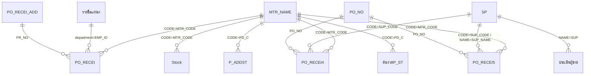

# Data Model — วัตถุดิบ

> สถานะ: **ถอดครบ — รอยืนยัน** · อัปเดต 2026-10-05
> ที่มา: `source/_extract/วัตถุดิบ/` (`tables.md`, `schema2.json`, `recovered/queries_compact.txt`, `samples/*.csv`) + query ข้อมูลจริงแบบอ่านอย่างเดียว (2026-10-05)
> ระบบเดิมมี 52 ตาราง **ไม่มีการประกาศ relationship** และมี primary key เพียง 5 ตาราง — Key/FK ที่มี 🔍 อนุมานจาก JOIN ใน query, RowSource ของ combo และค่าข้อมูล
> ไฟล์นี้บอกว่าข้อมูล *คืออะไร* · ขั้นตอนที่ระบบทำกับข้อมูลอยู่ใน [business-rules.md](business-rules.md)

## สารบัญตาราง
กลุ่ม: A ข้อมูลหลัก/ธุรกรรม · B ประวัติ · C lookup — ตารางที่ย้ายไประบบใหม่ 18 ตาราง · ตาราง lookup 2 ค่า 5 ตารางกลายเป็น enum (หัวข้อ "ข้อมูลอ้างอิง") · ไม่ย้าย 29 ตาราง (หัวข้อ [ตารางที่ไม่ย้าย](#ตารางที่ไม่ย้าย))

**ภาพรวมการไหลของรายการซื้อ** — ระบบเดิมเก็บ "รายการ" (หนึ่งบรรทัดของใบขอซื้อ/ใบสั่งซื้อ) เป็นแถวแบนในตารางโครงเดียวกัน 46–48 ฟิลด์ แล้ว**ย้ายแถวข้ามตาราง**ตามขั้น — ไม่มีตารางหัวเอกสารแยก (หัวเอกสารถูกคัดลอกลงทุกแถว):

```
T-PO_RECEI (ใบขอซื้อ ยังไม่ออกใบสั่งซื้อ) --พิมพ์ใบสั่งซื้อ BR-021--> T-PO_RECEI4 (ใบสั่งซื้อ ค้างรับ) --รับของ BR-031--> T-PO_RECEI5 (ประวัติรับของ)
                                                                                             └─(วัตถุดิบหลัก)──> T-Stock (+)
T-Stock: รับ (+, BR-031) · เบิก (−, BR-040) · ยอดยกมา (BR-042) --ตัดสต็อก--> T-P_ADDST (ประวัติ) + T-ต้นงวดP_ST (ยอดยกมาทุกงวด)
```

| ID | ตาราง | กลุ่ม | หน้าที่ | แถว / ข้อมูลล่าสุด |
|---|---|---|---|---|
| T-MTR_NAME | MTR_NAME | A | ทะเบียนวัตถุดิบ (รวมอะไหล่ ค่าบริการ สินค้าซื้อมาขาย) | 5,228 |
| T-SP | SP | A | ทะเบียนผู้ขาย | 497 |
| T-รายชื่อแผนก | รายชื่อแผนก | C | แผนกที่ขอซื้อ + prefix เลขที่ใบขอซื้อ + หัวหน้า | 12 |
| T-PO_RECEI | PO_RECEI | A | รายการใบขอซื้อที่ยังไม่ได้ออกใบสั่งซื้อครบ (และหัวใบขอซื้อที่กำลังกรอก) | 0 ณ วันที่ถอด (ตารางทำงาน — แถวย้ายออกเมื่อออกใบสั่งซื้อ) |
| T-PO_RECEI4 | PO_RECEI4 | A | รายการใบสั่งซื้อที่ยังรับของไม่ครบ | 37 / PO ล่าสุด 2026-09-11 (เก่าสุด 2024-03) |
| T-PO_RECEI5 | PO_RECEI5 | A | ประวัติการรับของ (รวมรายการที่ QA ไม่ผ่าน) | 1,581 / รับล่าสุด 2026-09-11 (ข้อมูลก่อน 2026 ถูกลบโดย BR-070) |
| T-PO_RECEI_ADD | PO_RECEI_ADD | A | ทะเบียนเลขที่ใบขอซื้อที่ออกแล้ว | 1,774 (ปี 66: 618, 67: 736, 69: 420 — ปี 68 ถูกลบโดย BR-070) |
| T-PO_NO | PO_NO | A | ทะเบียนเลขที่ใบสั่งซื้อที่ออกแล้ว | 630 (ปี 69 เท่านั้น สูงสุด `690988`) |
| T-Stock | Stock | A | ความเคลื่อนไหวสต็อกงวดปัจจุบัน (ยอดยกมา + รับ + เบิก) | 2,927 / ตั้งแต่ตัดสต็อก 2025-10-31 |
| T-P_ADDST | P_ADDST | B | ประวัติความเคลื่อนไหวสต็อกที่ตัดงวดแล้ว | 57,070 / ถึง 2025-10-31 |
| T-ต้นงวดP_ST | ต้นงวดP_ST | B | ยอดยกมารายวัตถุดิบ ทุกครั้งที่ตัดสต็อก | 49,172 / 2010-06-25 … 2025-10-31 |
| T-ประเมินผู้ขาย | ประเมินผู้ขาย | A | ผลนับรายไตรมาสต่อผู้ขาย (ใช้พิมพ์สรุปประเมิน) | 1,731 / ไตรมาส 2 ปี 2026 |
| T-PURC | PURC | C | ผู้จัดซื้อ (โรงงาน/ออฟฟิศ) | 2 |
| T-CREDIT | CREDIT | C | ตัวเลือกเครดิตผู้ขาย | 6 |
| T-ประเภทธุรกิจ | ประเภทธุรกิจ | C | ประเภทธุรกิจผู้ขาย | 4 |
| T-เหตุผลในการขอซื้อ | เหตุผลในการขอซื้อ | C | ข้อความเหตุผลที่เลือกได้ตอนขอซื้อ | 270 |
| T-หมายเหตุ | หมายเหตุ | C | ข้อความหมายเหตุที่เลือกได้ตอนขอซื้อ | 13 |
| T-รหัสตัวแรกของวัตถุดิบ | รหัสตัวแรกของวัตถุดิบ | C | prefix รหัสวัตถุดิบ สำหรับพิมพ์รายชื่อตามกลุ่ม | 16 |

---

## T-MTR_NAME — วัตถุดิบ
หน้าที่: ทะเบียนวัตถุดิบ หนึ่งแถว = หนึ่งรหัส ใช้ทุกที่ที่เลือกวัตถุดิบ
จำนวนแถวปัจจุบัน: 5,228 (วัตถุดิบหลัก `INCOMING`=`ใช่` 540)

| ฟิลด์ | ชนิด | ขนาด | Null | Default | Key | ความหมาย / กฎ |
|---|---|---|---|---|---|---|
| CODE | Text | 6 | ไม่ | | PK (unique) | รหัสวัตถุดิบ ✅ แปลงเป็นตัวพิมพ์ใหญ่เมื่อกรอก (BR-001) · รูปแบบ = prefix ตัวอักษร 1–2 ตัว + ตัวเลข เช่น `R0019`, `CA156`, `MI1411`, `DB070` — prefix บอกกลุ่ม (ดู "ข้อมูลอ้างอิง" > prefix รหัสวัตถุดิบ) 🔍 |
| NAME | Text | 255 | ได้ | | | ชื่อวัตถุดิบ — ป้ายฟอร์ม "ไม่ควรเกิน 56 ตัวอักษรรวมเว้นวรรค" (เพื่อให้พอดีช่องในใบสั่งซื้อ 🔍) · ไม่ unique (มีชื่อซ้ำ 22 ชื่อ) · แถวที่ NAME ว่างถูกลบเมื่อออกจากฟอร์ม (BR-001) |
| U_NAME | Text | 12 | ได้ | | | หน่วยนับ เช่น `กก.`, `ใบ`, `ชุด`, `ตัว` |
| U_PACK | Text | 24 | ได้ | | | หน่วยบรรจุ — มีค่าแค่ 6 แถว ไม่มีฟอร์ม/รายงานใช้ (เลิกใช้ 🔍) |
| CATEGORY | Text | 12 | ได้ | | | หมวด (ข้อความอิสระ สะกดไม่สม่ำเสมอ เช่น `สิ้นเปลือง`, `สินเปลือง`, `ไฟฟ้า`) — ไม่มีฟอร์มปัจจุบัน/รายงานใช้ (เลิกใช้ 🔍) |
| MINIMUM | Double | | ได้ | | | จุดสั่งซื้อต่ำสุด — แสดงในรายงานรายชื่อวัตถุดิบเท่านั้น ไม่มีการเตือน · มีค่า 61 แถว |
| MAXIMUM | Double | | ได้ | | | จำนวนสูงสุด — แสดงในรายงานเท่านั้น · ไม่มีแถวใดมีค่า ≠ 0 |
| COST | Double | | ได้ | | | ราคาล่าสุดต่อหน่วย (บาท ไม่รวม VAT) — ✅ ระบบเขียนทับทุกครั้งที่รับของ (BR-031 ขั้น 6) ผู้ใช้แก้ได้ในฟอร์ม · ใช้คิดมูลค่าตัดสต็อก (RPT-26) และเป็นราคาเริ่มต้นตอนขอซื้อ (BR-011) |
| SUP_CODE | Text | 50 | ได้ | | 🔍 FK → T-SP.CODE | ผู้ขายล่าสุด — เขียนทับเมื่อรับของ (BR-031) · เป็นผู้ขายเริ่มต้นเมื่อเลือกวัตถุดิบในใบสั่งซื้อ (SCR-05) |
| SUP_NAME | Text | 255 | ได้ | | | ชื่อผู้ขายล่าสุด (สำเนาจาก T-SP.NAME) |
| INCOMING | Text | 50 | ได้ | | | วัตถุดิบหลักหรือไม่ — ค่า: `ใช่`, `ไม่ใช่`, ว่าง (50 แถว — ระบบถือเป็น "ไม่ใช่") · ผลกระทบดู BR-003 |
| BUY | Single | | ได้ | 0 | | ราคาซื้อคืนส่วนเกินต่อ กก. (บาท) — ป้ายฟอร์ม "ใส่เฉพาะอลูมิเนียมหลอมคืน วัตถุดิบอื่นไม่ต้องใส่" ใช้ใน BR-060 · มีค่า ≠ 0 อยู่ 19 แถว (บางแถวไม่ใช่อลูมิเนียม เช่น `DC018` แผ่นคลัทช์ — ⚠ ใช้ผิดวัตถุประสงค์ 🔍) |
| R-W | Text | 50 | ได้ | | | 🔍 ตัวอักษรกลุ่ม ส่วนใหญ่ = ตัวแรกของ CODE (`R`, `W`, `E`, `T`, `M`, `C`, `D`, `F`, `S`, `B`, `Q`) — ไม่มีฟอร์ม/query/รายงานใดใช้ (เลิกใช้ 🔍) |
| REMARK | Memo | | ได้ | | | หมายเหตุ — มีค่า 3 แถว ไม่มีฟอร์มใช้ |

Index: (CODE) PK unique; (SUP_CODE) ไม่ unique

---

## T-SP — ผู้ขาย
หน้าที่: ทะเบียนผู้ขาย หนึ่งแถว = หนึ่งผู้ขาย
จำนวนแถวปัจจุบัน: 497 (ใช้ในการผลิต 124)

| ฟิลด์ | ชนิด | ขนาด | Null | Default | Key | ความหมาย / กฎ |
|---|---|---|---|---|---|---|
| CODE | Text | 255 | ได้ | | 🔍 PK (ไม่ unique — ซ้ำ 5 รหัส) | รหัสผู้ขาย ✅ แปลงเป็นตัวพิมพ์ใหญ่เมื่อกรอก (BR-002) · รูปแบบ prefix + ลำดับ: `S0nnn` (387 ราย), `AS-nn` (30), `DC-nn` (37), `BL-nn` (19), `SC-nn` (20), `TR-nn` (4) — 🔍 prefix = กลุ่มผู้ขาย (❓ Q-07) |
| NAME | Text | 255 | ได้ | | | ชื่อผู้ขาย — ⚠ ถูกใช้เป็น key ในการ JOIN กับประวัติรับของ (`PO_RECEI5.SUP_NAME`) ในงานประเมินผู้ขาย (BR-050) และในงานหลอมอลูมิเนียม · แถวที่ NAME ว่างถูกลบเมื่อออกจากฟอร์ม (BR-002) |
| ADDRESS1 | Text | 255 | ได้ | | | ที่อยู่บรรทัด 1 |
| ADDRESS2 | Text | 255 | ได้ | | | ที่อยู่บรรทัด 2 — ป้ายฟอร์ม "เขต(อำเภอ)และจังหวัด" |
| TEL_1 | Text | 255 | ได้ | | | โทรศัพท์ 1 |
| TEL_2 | Text | 255 | ได้ | | | โทรศัพท์ 2 |
| FAX_NO | Text | 255 | ได้ | | | แฟกซ์ |
| MG | Text | 255 | ได้ | | | ชื่อผู้ติดต่อ |
| CREDIT | Text | 50 | ได้ | | | เครดิต — เลือกจาก T-CREDIT (`30`, `45`, `60`, `90`, `120`, `เงินสด`) ข้อมูลจริงมี `15` ด้วย · คัดลอกไปเป็น `CREDIT_D` ของใบสั่งซื้อ |
| VAT | Text | 50 | ได้ | | | คิด VAT หรือไม่ — enum YES/NO (ว่าง 6 แถว) · คัดลอกไปเป็น `VAT` ของใบสั่งซื้อ (BR-022) |
| PRODUCT | Text | 255 | ได้ | | | ประเภทผลิตภัณฑ์/สินค้าหรือบริการ (ข้อความอิสระ) |
| BUSINESS | Text | 255 | ได้ | | | ประเภทธุรกิจ — เลือกจาก T-ประเภทธุรกิจ (มีค่านอกรายการ `อุปกรณ์ไฟฟ้า` 1 แถว) |
| CERTIFICATE | Text | 50 | ได้ | | | ผู้ขายมีใบรับรองระบบคุณภาพหรือไม่ — enum มี/ไม่มี · มีผลต่อคะแนนประเมิน (BR-050) |
| USE IN PRODUCT | Text | 50 | ได้ | | | ใช้ในการผลิตหรือไม่ — enum ใช่/ไม่ใช่ · `ใช่` = อยู่ในทะเบียนผู้ขาย (RPT-32) และถูกประเมิน (BR-050, BR-051) |

Index: (CODE) ไม่ unique

---

## T-รายชื่อแผนก — แผนก
หน้าที่: แผนกที่ขอซื้อได้ หนึ่งแถว = หนึ่งแผนก · ค่าทั้งหมดอยู่ในหัวข้อ "ข้อมูลอ้างอิง"
จำนวนแถวปัจจุบัน: 12

| ฟิลด์ | ชนิด | ขนาด | Null | Default | Key | ความหมาย / กฎ |
|---|---|---|---|---|---|---|
| department | Text | 50 | ได้ | | 🔍 PK (ค่าจริง unique) | ชื่อแผนก — ✅ ค่านี้ (ไม่ใช่ CODE) คือสิ่งที่เก็บใน `EMP_ID` ของรายการขอซื้อ/สั่งซื้อ/รับของ |
| CODE | Text | 50 | ได้ | | | **pattern** สำหรับค้นเลขที่ใบขอซื้อของแผนก เช่น `B*`, `DM*`, `D6*` — ตัด `*` ออกได้ prefix ของเลขที่ (BR-010) · ⚠ ไดคาสท์ใช้ `D6*` (ผูกกับปี 6x) ดู BR-010 |
| CHIP | Text | 255 | ได้ | | | ชื่อหัวหน้าแผนก — 🔍 แสดงในฟอร์มเลือกแผนก (SCR-03) ไม่พบว่าพิมพ์ในรายงาน (❓ Q-08) |

Index: (CODE) ไม่ unique

---

## T-PO_RECEI — รายการใบขอซื้อที่ยังไม่ออกใบสั่งซื้อ
หน้าที่: หนึ่งแถว = หนึ่งรายการของใบขอซื้อ (หัวใบคัดลอกอยู่ทุกแถว) แถวอยู่ที่นี่ตั้งแต่กรอกใบขอซื้อจนกว่าจะออกใบสั่งซื้อครบจำนวน (BR-011, BR-021) · ฟิลด์ฝั่งใบสั่งซื้อ (`PO_*`, `SUP_*`, `U_PRICE` …) ถูกกรอกในหน้าจอออกใบสั่งซื้อก่อนแถวจะย้ายไป T-PO_RECEI4
จำนวนแถวปัจจุบัน: 0 (ตารางทำงาน) · ไม่มี PK ไม่มี index unique

**ฟิลด์ธง (flag) ที่ใช้ฟิลด์ผิดชื่อ** — ระบบเดิมใช้ฟิลด์ข้อความ 3 ตัวเป็นตัวเลือกแถวสำหรับ action ซึ่งชื่อไม่ตรงความหมาย ระบบใหม่ไม่ต้องย้ายค่าเหล่านี้ (เป็นสถานะชั่วคราวของหน้าจอ):

| ฟิลด์ | ค่า | ความหมายจริง | ใช้ใน |
|---|---|---|---|
| `MARK` | `Y`/ว่าง | รายการของใบขอซื้อที่กำลังจะพิมพ์ (ค่าเริ่มต้น `Y` เมื่อเพิ่มรายการใหม่) | BR-011, BR-012 |
| `DUE_DATE` | `Y`/ว่าง | ผู้ใช้เลือกรายการนี้ให้อยู่ในใบสั่งซื้อที่จะพิมพ์ (ป้าย "ต้องการพิมพ์ใส่Y") | BR-021, BR-024 |
| `BAHT TEXT` | `Y`/ว่าง | ผู้ใช้ต้องการลบรายการนี้ (ป้าย "ต้องการลบรายการนี้ใส่Y") | BR-013, BR-025, BR-033, BR-034 |

| ฟิลด์ | ชนิด | ขนาด | Null | Default | Key | ความหมาย / กฎ |
|---|---|---|---|---|---|---|
| PR_NO | Text | 255 | ได้ | | 🔍 FK → T-PO_RECEI_ADD.PR_NO | เลขที่ใบขอซื้อ (BR-010) |
| PR_SUF | Single | | ได้ | | | ลำดับรายการในใบขอซื้อ — ผู้ใช้พิมพ์เอง (1, 2, …) ไม่มีการตรวจซ้ำ |
| PR_DATE | Date/Time | | ได้ | | | วันที่ขอซื้อ — ค่าเริ่มต้น = วันนี้ (`Date()`) ไม่มีเวลา |
| PR_QTY | Double | | ได้ | 0 | | จำนวนขอซื้อ · หลังออกใบสั่งซื้อบางส่วนจะถูกแทนด้วยยอดค้างสั่ง (BR-021 ขั้น 8) · ความหมายพิเศษในงานอลูมิเนียม: น้ำหนักที่ส่งไปหลอม (BR-060) |
| MTR_CODE | Text | 255 | ได้ | | 🔍 FK → T-MTR_NAME.CODE | รหัสวัตถุดิบ (ข้อมูลจริงไม่มี orphan) |
| MTR_NAME | Text | 255 | ได้ | | | ชื่อวัตถุดิบ — ✅ คัดลอกจาก T-MTR_NAME เมื่อเลือกรหัส แต่ผู้ใช้**แก้ข้อความได้** (เช่น เติมรายละเอียดงานพิมพ์) · 441 จาก 1,581 แถวใน T-PO_RECEI5 มีชื่อไม่ตรง T-MTR_NAME |
| MTR_UNIT | Text | 255 | ได้ | | | หน่วย — คัดลอกจาก `MTR_NAME.U_NAME` |
| DELI_D | Date/Time | | ได้ | | | วันที่ต้องการของ (ป้าย "วันที่ต้องการ"/"กำหนดส่ง") — ใช้ตัดสิน "ส่งทัน" (BR-030) |
| EMP_ID | Text | 255 | ได้ | | 🔍 FK → T-รายชื่อแผนก.department | แผนกที่ขอซื้อ (เก็บชื่อแผนก ไม่ใช่รหัส) — ชื่อฟิลด์ไม่สื่อ |
| PUR | Text | 255 | ได้ | | 🔍 FK → T-PURC.ID | ผู้จัดซื้อ `F`/`O` (ข้อมูลจริงเป็น `F` เกือบทั้งหมด) |
| REMARK | Text | 255 | ได้ | | | เหตุผลในการขอซื้อ — เลือกจาก T-เหตุผลในการขอซื้อ หรือพิมพ์เอง |
| MEM | Text | 255 | ได้ | | | หมายเหตุ — เลือกจาก T-หมายเหตุ หรือพิมพ์เอง |
| MARK | Text | 255 | ได้ | (ฟอร์ม) `Y` | | ธง "อยู่ในใบขอซื้อที่กำลังพิมพ์" (ดูตารางธงด้านบน) |
| PO_NO | Text | 255 | ได้ | | 🔍 FK → T-PO_NO.PO_NO | เลขที่ใบสั่งซื้อ (BR-020) — ว่างจนกว่าจะออกใบสั่งซื้อ |
| PO_SUF | Single | | ได้ | | | ลำดับรายการในใบสั่งซื้อ — ผู้ใช้พิมพ์เอง |
| PO_DATE | Date/Time | | ได้ | | | วันที่สั่งซื้อ |
| PO_QTY | Double | | ได้ | | | จำนวนสั่งซื้อ (อาจน้อยกว่า/มากกว่าจำนวนขอซื้อ — ข้อมูลจริงมีสั่งมากกว่าขอ เช่น ขอ 500 สั่ง 1,000) · ความหมายพิเศษในงานอลูมิเนียม: น้ำหนักที่ต้องการ (BR-060) |
| DIF_QTY | Double | | ได้ | | | ยอดค้างสั่ง = `PR_QTY − PO_QTY` (BR-021) |
| SUP_CODE | Text | 255 | ได้ | | 🔍 FK → T-SP.CODE | ผู้ขาย |
| SUP_NAME | Text | 255 | ได้ | | | ชื่อผู้ขาย (สำเนาจาก T-SP เมื่อเลือกรหัส) |
| SUP_ADD1 | Text | 255 | ได้ | | | ที่อยู่ผู้ขาย 1 (สำเนา) |
| SUP_ADD2 | Text | 255 | ได้ | | | ที่อยู่ผู้ขาย 2 (สำเนา) |
| SUP_TEL | Text | 255 | ได้ | | | โทรผู้ขาย (สำเนา `TEL_1`) |
| SUP_FAX | Text | 255 | ได้ | | | แฟกซ์ผู้ขาย (สำเนา) |
| CREDIT_D | Text | 50 | ได้ | | | เครดิต (สำเนา `SP.CREDIT` แก้ได้) เช่น `30`, `เงินสด` |
| VAT | Text | 255 | ได้ | | | `YES`/`NO` (สำเนา `SP.VAT` แก้ได้) |
| U_PRICE | Double | | ได้ | | | ราคาต่อหน่วย (บาท ไม่รวม VAT) ทศนิยมได้ถึง 3 ตำแหน่งในข้อมูลจริง (เช่น `1195.271`) |
| NET_AMT | Double | | ได้ | | | จำนวนเงิน = `U_PRICE × PO_QTY` (RND-B) — ตอนขอซื้อ = `U_PRICE × PR_QTY` |
| TAX | Double | | ได้ | 0 | | **ยอดรวมรายการรวม VAT** (ไม่ใช่ยอดภาษี) = CutDecimal(NET_AMT × 1.07 หรือ ×1) (BR-022) |
| TOTAL | Double | | ได้ | | | ยอดรวมใบสั่งซื้อรวม VAT (ค่าเดียวกันทุกรายการในใบ) (BR-022) |
| DUE_DATE | Text | 50 | ได้ | | | ธง "เลือกพิมพ์ใบสั่งซื้อ" — ชื่อไม่สื่อ ไม่ใช่วันที่ |
| BAHT TEXT | Text | 255 | ได้ | | | ธง "ลบรายการนี้" — ชื่อไม่สื่อ ไม่ใช่จำนวนเงินตัวอักษร |
| RE_DATE | Date/Time | | ได้ | | | วันที่รับของ (ว่างใน T-PO_RECEI) |
| RE_QTY | Double | | ได้ | | | จำนวนรับ (ว่างใน T-PO_RECEI) |
| INVOICE_NO | Text | 255 | ได้ | | | เลขที่ใบส่งสินค้าของผู้ขาย — ✅ ข้อมูลจริงว่างทุกแถว (ไม่มีใครกรอก) |
| INV_SUF | Text | 255 | ได้ | | | ลำดับในใบส่งสินค้า — ข้อมูลจริงมีค่า 1, 2, 3 … (🔍 ผู้ใช้ใส่ลำดับรายการ) |
| DIF_QTY1 | Double | | ได้ | | | ยอดค้างส่ง (ใช้ตอนรับของ BR-030) |
| PUR_ID | Text | 255 | ได้ | | | ธงรับไม่ครบ `N`/ว่าง (BR-030) — ชื่อไม่สื่อ |
| LOT | Text | 255 | ได้ | | | Lot (QA กรอกหลังรับ BR-035) |
| PASS | Text | 255 | ได้ | | | ผลตรวจ `ผ่าน`/`ไม่ผ่าน`/ว่าง |
| NOPASS | Text | 255 | ได้ | | | ใบรับรอง `มี`/`ไม่มี`/ว่าง — ชื่อไม่สื่อ |
| WEIGHT | Long | | ได้ | 0 | | น้ำหนักถัง (กก.) — ใช้เฉพาะงานอลูมิเนียม (BR-060) ข้อมูลจริงเป็น 0 ทุกแถว |
| CREM | Long | | ได้ | 0 | | น้ำหนักอื่น ๆ (ส่งคืน) — ใช้เฉพาะงานอลูมิเนียม (BR-060) ข้อมูลจริงเป็น 0 ทุกแถว |
| EMP | Text | 255 | ได้ | | | ว่างทุกแถว ไม่มีฟอร์มใช้ (เลิกใช้) |
| PUR_NAME | Text | 255 | ได้ | | | ชื่อเจ้าหน้าที่จัดซื้อ — มีเฉพาะในฟอร์มเก่าที่ไม่มีทางเข้า (ค่าเริ่มต้น `รำพึง`) ว่างทุกแถว (เลิกใช้) |
| QTY | Text | 255 | ได้ | | | ว่างทุกแถว (เลิกใช้) |

Index: (EMP_ID), (MTR_CODE), (PUR_ID), (SUP_CODE) ไม่ unique

---

## T-PO_RECEI4 — รายการใบสั่งซื้อที่ยังรับของไม่ครบ
หน้าที่: หนึ่งแถว = หนึ่งรายการใบสั่งซื้อที่ยังมียอดค้างส่ง แถวเข้ามาเมื่อพิมพ์ใบสั่งซื้อ (BR-021 ขั้น 5) ออกไปเมื่อรับครบ (BR-031)
จำนวนแถวปัจจุบัน: 37 (PO ปี 2024–2026; 3 แถวเก่ากว่า 1 ปียังค้าง — ดูปัญหาคุณภาพข้อมูล)

โครงสร้างเหมือน T-PO_RECEI ทุกฟิลด์ ยกเว้น:

| ฟิลด์ | ชนิด | ขนาด | Null | Default | Key | ความหมาย / กฎ |
|---|---|---|---|---|---|---|
| SEND | Text | 50 | ได้ | | | ผลการส่ง `ทัน`/`ไม่ทัน` (BR-030) — เพิ่มจาก T-PO_RECEI |
| TOTAL | Single | | ได้ | | | ชนิดต่างจาก T-PO_RECEI (Single) → ค่าเพี้ยนทศนิยมเช่น `6826.60009765625` (RND-C) |
| PO_QTY | Double | | ได้ | | | หลังรับบางส่วน = ยอดค้างส่ง (BR-031 ขั้น 4) ไม่ใช่จำนวนสั่งเดิม |
| PR_QTY | Double | | ได้ | 0 | | หลังรับบางส่วนถูกล้างเป็นว่าง (BR-031 ขั้น 4) |
| BAHT TEXT | Text | 255 | ได้ | | | ธงลบ (BR-025, BR-033) |
| PASS | Text | 255 | ได้ | | | ผลตรวจที่จัดซื้อกรอกตอนรับ — หน้าจอให้เลือกเฉพาะ `ไม่ผ่าน` (BR-032) |

Index: เหมือน T-PO_RECEI

---

## T-PO_RECEI5 — ประวัติการรับของ
หน้าที่: หนึ่งแถว = การรับของหนึ่งครั้งของหนึ่งรายการใบสั่งซื้อ (รับหลายงวด = หลายแถว) รวมรายการที่ตรวจไม่ผ่าน (BR-032) · เป็นแหล่งข้อมูลของรายงานรับของทั้งหมดและการประเมินผู้ขาย
จำนวนแถวปัจจุบัน: 1,581 (รับปี 2026: 1,539 + แถวไม่มีวันที่รับ 42 แถว — ดูปัญหาคุณภาพข้อมูล)

โครงสร้างเหมือน T-PO_RECEI ทุกฟิลด์ ยกเว้น:

| ฟิลด์ | ชนิด | ขนาด | Null | Default | Key | ความหมาย / กฎ |
|---|---|---|---|---|---|---|
| SEND | Text | 50 | ได้ | | | ผลการส่ง `ทัน` (1,517) / `ไม่ทัน` (64) |
| RESULT | Text | 255 | ได้ | | | หมายเหตุผลตรวจ QA (ป้าย "หมายเหตุ") — ข้อมูลปัจจุบันว่างทุกแถว · ⚠ ใช้เป็นธงชั่วคราว `0` ตอนลบข้อมูลปีที่แล้ว (BR-070) |
| QTY | Text | 255 | ได้ | | | ชนิดต่างจาก T-PO_RECEI3/4 (Text) ว่างทุกแถว |
| NET_AMT | Double | | ได้ | | | ✅ คำนวณใหม่ตอนรับ = `U_PRICE × RE_QTY` (จำนวนรับจริง) ไม่ปัดเศษ เช่น `964108.7999999999` |
| TAX, TOTAL | Double | | ได้ | | | ค่าที่คำนวณตอนพิมพ์ใบสั่งซื้อ (จากจำนวนสั่งเดิม) ไม่ถูกคำนวณใหม่ตอนรับ |
| PO_QTY | Double | | ได้ | | | จำนวนสั่งที่ค้าง ณ ตอนรับงวดนั้น (งวดถัดไปจะน้อยลง) |
| LOT, PASS, NOPASS | Text | 255 | ได้ | | | QA กรอกหลังรับ (BR-035) — มีค่า 570 / 566 / 565 แถว (เฉพาะวัตถุดิบหลัก) |

Index: เหมือน T-PO_RECEI

---

## T-PO_RECEI_ADD — ทะเบียนเลขที่ใบขอซื้อ
หน้าที่: เลขที่ใบขอซื้อที่ออกแล้ว ใช้หาเลขถัดไป (BR-010)
จำนวนแถวปัจจุบัน: 1,774 (ปี 66: 618, ปี 67: 736, ปี 69: 420 — ปี 66–67 ค้างอยู่เพราะ BR-070 ลบเฉพาะ "ปีที่แล้ว")

| ฟิลด์ | ชนิด | ขนาด | Null | Default | Key | ความหมาย / กฎ |
|---|---|---|---|---|---|---|
| PR_NO | Text | 255 | ไม่ | | PK (unique) | เลขที่ใบขอซื้อ รูปแบบ `<prefix><YY>-<NNNN>` (BR-010) · ค่าชั่วคราว `0` ใช้เป็นธงก่อนลบ (BR-013) |
| MARK | Text | 50 | ได้ | | | ธงชั่วคราว `0` = จะถูกลบตอนลบข้อมูลปีที่แล้ว (BR-070) ปกติว่าง |

---

## T-PO_NO — ทะเบียนเลขที่ใบสั่งซื้อ
หน้าที่: เลขที่ใบสั่งซื้อที่ออกแล้ว แสดงเลขสูงสุดให้ผู้ใช้ดูตอนออกเลขใหม่ (BR-020)
จำนวนแถวปัจจุบัน: 630 (`690001` … `690988` มีช่องว่าง เช่น `690004`)

| ฟิลด์ | ชนิด | ขนาด | Null | Default | Key | ความหมาย / กฎ |
|---|---|---|---|---|---|---|
| PO_NO | Text | 255 | ไม่ | | PK (unique) | เลขที่ใบสั่งซื้อ 6 หลัก `<YY พ.ศ.><NNNN>` 🔍 · ค่าชั่วคราว `0` ใช้เป็นธงก่อนลบ |
| MARK | Text | 50 | ได้ | | | ธงชั่วคราว `0` = จะถูกลบตอนลบข้อมูลปีที่แล้ว (BR-070) |

---

## T-Stock — ความเคลื่อนไหวสต็อกงวดปัจจุบัน
หน้าที่: หนึ่งแถว = หนึ่งความเคลื่อนไหวของวัตถุดิบหนึ่งรหัส · ยอดคงเหลือ = ผลรวม `RE_QTY` ทุกแถวของรหัสนั้น (BR-041) · แถวที่วันที่ ≤ วันตัดสต็อกจะถูกยุบเป็นยอดยกมา (BR-042)
จำนวนแถวปัจจุบัน: 2,927

ชนิดแถวแยกด้วย `MARK` + `INVOICE_NO`:

| ชนิดแถว | `MARK` | `INVOICE_NO` | `EMP_ID` | เครื่องหมาย `RE_QTY` | สร้างโดย | แถว |
|---|---|---|---|---|---|---|
| ยอดยกมา | ว่าง | `stock` | ว่าง | ± (ติดลบได้) | BR-042 | 443 (2025-10-31) |
| รับเข้า | `st` | ว่าง (ไม่มีเลขใบส่งของ) | รหัสผู้ขาย | + | BR-031 | 839 |
| เบิกออก | `tr` | เลขที่ใบเบิก เช่น `002/0098`, `87/4350` | รหัสพนักงานผู้เบิก เช่น `B136` | − (ระบบกลับเครื่องหมาย BR-040) | SCR-14 | 1,645 |
| ปรับแก้ด้วยมือ | ใดก็ได้ | ใดก็ได้ | ใดก็ได้ | ± | SCR-16 | — |

| ฟิลด์ | ชนิด | ขนาด | Null | Default | Key | ความหมาย / กฎ |
|---|---|---|---|---|---|---|
| RE_DATE | Date/Time | | ได้ | | | วันที่เคลื่อนไหว (รับ/เบิก/วันตัดสต็อก) |
| INVOICE_NO | Text | 255 | ได้ | | | เลขที่เอกสาร: ใบเบิก / `stock` (ยอดยกมา) / ว่าง (รับ) |
| INV_SUF | Text | 255 | ได้ | | | ลำดับรายการในเอกสาร |
| MTR_CODE | Text | 255 | ได้ | | 🔍 FK → T-MTR_NAME.CODE | รหัสวัตถุดิบ — มี 54 แถวที่ไม่พบใน T-MTR_NAME (พิมพ์ผิด/ตัวเล็ก เช่น `db0054`, `d054`) |
| RE_QTY | Double | | ได้ | | | จำนวน: บวก = เข้า, ลบ = ออก |
| EMP_ID | Text | 255 | ได้ | | | รับเข้า = รหัสผู้ขาย · เบิก = รหัสพนักงาน (🔍 อ้างทะเบียนพนักงานของโปรแกรม `พนักงาน.accdb` ❓ Q-09) |
| MARK | Text | 255 | ได้ | | | ชนิดแถว (ตารางด้านบน) · ค่าชั่วคราว `CU` ระหว่างตัดสต็อก (BR-042) |
| U_PRICE | Double | | ได้ | 0 | | ราคาต่อหน่วยตอนรับ (แถวรับเท่านั้น) — ไม่มีรายงานใช้ |

Index: (EMP_ID), (MTR_CODE) ไม่ unique

---

## T-P_ADDST — ประวัติความเคลื่อนไหวสต็อก
หน้าที่: แถวเบิก (และปรับแก้) ที่ถูกตัดงวดแล้ว — **ไม่มีแถวรับของ** เพราะ BR-042 ขั้น 1 คัดเฉพาะแถวที่ `INVOICE_NO` ไม่ว่าง (⚠ ดู BR-042)
จำนวนแถวปัจจุบัน: 57,070 (`tr` 57,054; ค่าอื่นเล็กน้อย) วันที่ 1963-03-02 (พิมพ์ผิด) … 2025-10-31

| ฟิลด์ | ชนิด | ขนาด | Null | Default | Key | ความหมาย / กฎ |
|---|---|---|---|---|---|---|
| DATE | Date/Time | | ได้ | | | = `Stock.RE_DATE` |
| REF_NO | Text | 10 | ได้ | | | = `Stock.INVOICE_NO` (⚠ ขนาด 10 ตัด เลขที่ยาวกว่า 10 ตัว 🔍) |
| SUF_NO | Text | 2 | ได้ | | | = `Stock.INV_SUF` |
| PD_C | Text | 6 | ได้ | | 🔍 FK → T-MTR_NAME.CODE | = `Stock.MTR_CODE` |
| QTY | Double | | ได้ | | | = `Stock.RE_QTY` |
| ID | Text | 50 | ได้ | | | = `Stock.EMP_ID` |
| MARK | Text | 2 | ได้ | | | = `Stock.MARK` |

Index: (ID) ไม่ unique

---

## T-ต้นงวดP_ST — ยอดยกมาทุกงวด
หน้าที่: สำเนายอดยกมารายวัตถุดิบ ทุกครั้งที่ตัดสต็อก (BR-042 ขั้น 8) ใช้พิมพ์รายงานตัดสต็อก (RPT-26)
จำนวนแถวปัจจุบัน: 49,172 (ตัดงวด 2010-06 … 2025-10-31; รายเดือนตั้งแต่ 2013 ขาดช่วง 2014-07 … 2016-08)

โครงสร้างเหมือน T-P_ADDST ทุกฟิลด์ (`REF_NO` = `stock`, `SUF_NO`/`ID`/`MARK` ว่าง) ยกเว้น:

| ฟิลด์ | ชนิด | ขนาด | Null | Default | Key | ความหมาย / กฎ |
|---|---|---|---|---|---|---|
| U_PRICE | Double | | ได้ | 0 | | ไม่ถูกเติม — เป็น 0 ทุกแถว (มูลค่าใน RPT-26 ใช้ `MTR_NAME.COST` ปัจจุบันแทน) |

---

## T-ประเมินผู้ขาย — ผลนับประเมินผู้ขายรายไตรมาส
หน้าที่: หนึ่งแถว = ผลนับของผู้ขายหนึ่งรายในหนึ่งช่วงประเมิน สร้างเมื่อพิมพ์แบบประเมินรายไตรมาส (BR-050)
จำนวนแถวปัจจุบัน: 1,731 (ไตรมาส 1–4 ตั้งแต่ปี 2005 ถึงไตรมาส 2/2026)

| ฟิลด์ | ชนิด | ขนาด | Null | Default | Key | ความหมาย / กฎ |
|---|---|---|---|---|---|---|
| EXPR1 | Long | | ได้ | 0 | | จำนวนรายการรับที่ตรวจ `ผ่าน` |
| EXPR2 | Long | | ได้ | 0 | | จำนวนรายการ `ไม่ผ่าน` (นับเป็นใบ NCR) |
| EXPR3 | Long | | ได้ | 0 | | จำนวนรายการที่ `มี` ใบรับรอง |
| EXPR4 | Long | | ได้ | 0 | | จำนวนรายการที่ `ไม่มี` ใบรับรอง |
| EXPR5 | Long | | ได้ | 0 | | จำนวนรายการที่ส่ง `ทัน` |
| EXPR6 | Long | | ได้ | 0 | | จำนวนรายการที่ส่ง `ไม่ทัน` |
| FROM_DATE | Date/Time | | ได้ | | 🔍 key ร่วม (FROM_DATE, TO_DATE, SUP) | วันเริ่มช่วงประเมิน |
| TO_DATE | Date/Time | | ได้ | | 🔍 key ร่วม | วันสิ้นสุดช่วงประเมิน |
| SUP | Text | 255 | ได้ | | 🔍 key ร่วม · FK → T-SP.NAME | **ชื่อ**ผู้ขาย (ไม่ใช่รหัส) |
| POINT1 | Long | | ได้ | 0 | | คะแนนบริการ 1 (1–5) ผู้ใช้กรอก |
| POINT2 | Long | | ได้ | 0 | | คะแนนบริการ 2 (1–5) ผู้ใช้กรอก |
| TERM | Text | 50 | ได้ | | | ไตรมาส `1`–`4` ผู้ใช้กรอก · ⚠ ใช้เป็นธงชั่วคราว `Y` ตอนลบแถวซ้ำ (BR-050) |

---

## T-PURC — ผู้จัดซื้อ
หน้าที่: lookup ผู้จัดซื้อ (ค่าทั้งหมดใน "ข้อมูลอ้างอิง")
จำนวนแถวปัจจุบัน: 2

| ฟิลด์ | ชนิด | ขนาด | Null | Default | Key | ความหมาย / กฎ |
|---|---|---|---|---|---|---|
| ID | Text | 50 | ได้ | | 🔍 PK | `F`, `O` |
| NAME | Text | 50 | ได้ | | | `โรงงาน`, `ออฟฟิส สีลม` |

## T-CREDIT — ตัวเลือกเครดิต
หน้าที่: RowSource ของช่องเครดิตในฟอร์มผู้ขาย
จำนวนแถวปัจจุบัน: 6

| ฟิลด์ | ชนิด | ขนาด | Null | Default | Key | ความหมาย / กฎ |
|---|---|---|---|---|---|---|
| CREDIT | Text | 50 | ได้ | | 🔍 PK | `30`, `45`, `60`, `90`, `120`, `เงินสด` (จำนวนวัน หรือเงินสด) |

## T-ประเภทธุรกิจ — ประเภทธุรกิจผู้ขาย
จำนวนแถวปัจจุบัน: 4

| ฟิลด์ | ชนิด | ขนาด | Null | Default | Key | ความหมาย / กฎ |
|---|---|---|---|---|---|---|
| BUSINESS | Text | 255 | ได้ | | 🔍 PK | `ผลิต (manufacturing)`, `บริการ (service)`, `ขายสินค้า (trading)`, `รับเหมาช่วง (sub contractor)` |

## T-เหตุผลในการขอซื้อ — เหตุผลในการขอซื้อ
หน้าที่: รายการข้อความที่เลือกได้ในช่อง "เหตุผลในการขอซื้อ" (ผู้ใช้พิมพ์ค่าอื่นได้)
จำนวนแถวปัจจุบัน: 270 (มีข้อความเฉพาะกิจปนอยู่มาก เช่น `กลึงปลอกพิมพ์ C100 2/4`)

| ฟิลด์ | ชนิด | ขนาด | Null | Default | Key | ความหมาย / กฎ |
|---|---|---|---|---|---|---|
| REMARK | Text | 255 | ไม่ | | PK (unique) | ข้อความเหตุผล |

## T-หมายเหตุ — ข้อความหมายเหตุ
หน้าที่: รายการข้อความที่เลือกได้ในช่อง "หมายเหตุ" ของใบขอซื้อ
จำนวนแถวปัจจุบัน: 13 (ข้อความเก่าปี 2548–2550 เช่น กำหนดส่งเป็นงวด)

| ฟิลด์ | ชนิด | ขนาด | Null | Default | Key | ความหมาย / กฎ |
|---|---|---|---|---|---|---|
| MEM | Text | 255 | ได้ | | | ข้อความหมายเหตุ |

## T-รหัสตัวแรกของวัตถุดิบ — prefix รหัสวัตถุดิบ
หน้าที่: ตัวเลือก pattern สำหรับพิมพ์รายชื่อวัตถุดิบตามกลุ่มรหัส (RPT-28)
จำนวนแถวปัจจุบัน: 16

| ฟิลด์ | ชนิด | ขนาด | Null | Default | Key | ความหมาย / กฎ |
|---|---|---|---|---|---|---|
| ID | Text | 50 | ได้ | | 🔍 PK | pattern แบบ `LIKE`: `B*`, `C*`, `E0*`, `EQ*`, `F0*`, `M0*`, `MI*`, `MM*`, `R*`, `S*`, `T0*`, `TE*`, `W*`, `FD*`, `DC*`, `DB*` |
| NAME | Text | 255 | ได้ | | | ว่างทุกแถว (ไม่มีชื่อกลุ่ม ❓ Q-06) |

---

## ความสัมพันธ์
ระบบเดิมไม่ได้ประกาศ relationship ใด ๆ — ไม่มี referential integrity และไม่มี cascade ทุกแถวด้านล่าง 🔍 อนุมานจาก JOIN/RowSource

| แม่ (1) | ลูก (N) | ฟิลด์ | บังคับ | Cascade | ที่มา |
|---|---|---|---|---|---|
| T-MTR_NAME | T-PO_RECEI / T-PO_RECEI4 / T-PO_RECEI5 | `CODE` = `MTR_CODE` | ไม่ | ไม่ — ชื่อ/หน่วยถูกคัดลอก แก้แม่ไม่กระทบลูก | combo `MTR_CODE` ในฟอร์มขอซื้อ/สั่งซื้อ, query `QAรับวัตถุดิบ` |
| T-MTR_NAME | T-Stock / T-P_ADDST / T-ต้นงวดP_ST | `CODE` = `MTR_CODE` / `PD_C` | ไม่ | ไม่ | query `รหัสสินค้ารายการSTOCK2`, `ตัดSTOCK11` |
| T-MTR_NAME | T-PO_RECEI5 | `NAME` = `MTR_NAME` | ไม่ | ไม่ | ⚠ JOIN ด้วยชื่อใน query `รับวัตถุดิบ4` (อัปเดตราคาล่าสุด) |
| T-SP | T-PO_RECEI / 4 / 5 | `CODE` = `SUP_CODE` | ไม่ | ไม่ — ชื่อ/ที่อยู่ถูกคัดลอก | combo `SUP_CODE` |
| T-SP | T-PO_RECEI5 | `NAME` = `SUP_NAME` | ไม่ | ไม่ | ⚠ JOIN ด้วยชื่อใน query `บันทึกINCOMING`, `สรุปผลการประเมิน1` |
| T-SP | T-ประเมินผู้ขาย | `NAME` = `SUP` | ไม่ | ไม่ | query `บันทึกINCOMING18` (LEFT JOIN) |
| T-SP | T-MTR_NAME | `CODE` = `SUP_CODE` | ไม่ | ไม่ | ฟอร์ม `MTR_NAME` combo |
| T-รายชื่อแผนก | T-PO_RECEI / 4 / 5 | `department` = `EMP_ID` | ไม่ | ไม่ | combo `EMP_ID` |
| T-PO_RECEI_ADD | T-PO_RECEI / 4 / 5 | `PR_NO` | ไม่ | ไม่ (ลบรายการแล้วลบเลขในทะเบียน — BR-013, BR-025, BR-034) | query `ลบใบขออนุมัติสั่งซื้อ1` |
| T-PO_NO | T-PO_RECEI4 / 5 | `PO_NO` | ไม่ | ไม่ (เหมือนข้างบน) | query `ลบใบสั่งซื้อ1`, `ลบการรับวัตถุดิบ2` |
| T-PURC | T-PO_RECEI / 4 / 5 | `ID` = `PUR` | ไม่ | ไม่ | combo `PUR` |



## ข้อมูลอ้างอิง (lookup / master)

### แผนก (T-รายชื่อแผนก) — ค่าปัจจุบันทั้งหมด
| department | CODE (pattern) | prefix เลขที่ใบขอซื้อ | CHIP (หัวหน้า) | ใบขอซื้อในทะเบียน |
|---|---|---|---|---|
| ไดคาสท์ | `D6*` | `D` | นายสมหวัง | 270 |
| ตกแต่ง | `T*` | `T` | นางสาวเมตตาลักษณ์ | 130 |
| อัดผ้าเบรก | `B*` | `B` | นายบรรลัง | 281 |
| ฝนผ้าเบรก | `G*` | `G` | นางสมคิด | 42 |
| ประกอบ | `A*` | `A` | นางสาวอัมพร | 141 |
| ผ้าคลัทช์และดิสเบรก | `K*` | `K` | นายบรรลัง | 84 |
| บรรจุ | `P*` | `P` | นางอัมพร | 225 |
| ซ่อมบำรุง | `MT*` | `MT` | นายวิชัย | 71 |
| ประกันคุณภาพ | `QA*` | `QA` | นางชนิดา | 14 |
| บุคคลและธุรการ | `O*` | `O` | นางสาวณัฏฐกานต์ | 283 |
| สโตร์ | `S*` | `S` | นางพูลศิลป์ | 110 |
| แม่พิมพ์ | `DM*` | `DM` | นายสถิตย์ | 123 |

### enum ที่ระบบเดิมเก็บเป็นตาราง 2 แถว (ไม่ย้ายเป็นตาราง)
| ตารางเดิม | ค่า | ใช้กับฟิลด์ |
|---|---|---|
| `YES,NO` | `YES`, `NO` | `SP.VAT`, `VAT` ของรายการ |
| `ใช่,ไม่ใช่` | `ใช่`, `ไม่ใช่` | `MTR_NAME.INCOMING`, `SP.USE IN PRODUCT` |
| `มี,ไม่มี` | `มี`, `ไม่มี` | `SP.CERTIFICATE`, `NOPASS` (ใบรับรอง) |
| `ผ่าน,ไม่ผ่าน` | `ผ่าน`, `ไม่ผ่าน` | `PASS` (หน้าจอ QA และแก้ไขการรับ) |
| `ตาราง2` | `ไม่ผ่าน` (แถวเดียว) | `PASS` ในหน้าจอรับของของจัดซื้อ — บังคับให้เลือกได้เฉพาะ "ไม่ผ่าน" (BR-032) |

### prefix รหัสวัตถุดิบ (จากข้อมูลจริง — 🔍 ความหมายอนุมานจากชื่อวัตถุดิบ ❓ Q-06)
| prefix | จำนวน | วัตถุดิบหลัก | ตัวอย่างชื่อ | ความหมาย 🔍 |
|---|---|---|---|---|
| `R0` | 116 | 103 | อลูมิเนียมแข็ง, เรซิน, ผงทองเหลือง | วัตถุดิบเคมี/โลหะสำหรับผลิต |
| `DB` | 120 | 99 | เหล็ก DB:CLICK-I/A | เหล็กดิสเบรก |
| `CA` | 172 | 166 | กล่อง NO.4 … | กล่องบรรจุ |
| `SH` | 74 | 70 | แผ่นป้าย HONDA … | แผ่นป้าย/สติกเกอร์ |
| `SP` | 54 | 53 | สปริงผ้าเบรก WING/A | สปริง (สินค้าซื้อมาขายด้วย BR-062) |
| `W0` | 209 | 40 | ทรายเม็ด, พลาสติกใส | วัสดุสิ้นเปลือง/บรรจุ |
| `DC` | 19 | 6 | แผ่นคลัทช์ | ชิ้นส่วนผ้าคลัทช์ |
| `F0` | 25 | 1 | แก๊สถังละ 48 กก. | เชื้อเพลิง/แก๊ส |
| `E0`/`E1`/`EO` | 738 | 0 | พันมอเตอร์ 5.5HP | งานซ่อม/อะไหล่ไฟฟ้า |
| `EQ` | 600 | 0 | แผ่นกันสึกด้านข้างหัวยิง | อะไหล่เครื่องจักร |
| `T0`/`T1`/`TO` | 781 | 0 | ใบพัดตีเม็ดเหล็ก | เครื่องมือ |
| `TE` | 300 | 0 | | ❓ |
| `MI` | 1,670 | 0 | ฟองน้ำล้างจาน, ค่าอบรม | ของใช้/ค่าบริการเบ็ดเตล็ด |
| `MM` | 259 | 0 | W/C INSERT ซองขาเหล็ก | แม่พิมพ์/ชิ้นส่วนแม่พิมพ์ |
| `M0`/`M1`/`MO` | 17 | 2 | | ❓ |
| `FD` | 35 | 0 | | ❓ |
| `BA`, `CH` | 25, 12 | 0 | | สินค้าซื้อมาขาย: แบตเตอรี่, โซ่ (BR-062) |
| `QA`, `กล` | 1, 1 | 0 | | รหัสผิดรูปแบบ |

### ค่าที่ hard-code ในระบบเดิม (ย้ายเป็นค่าตั้งค่า)
| ค่า | ที่อยู่เดิม | ใช้ใน |
|---|---|---|
| อัตรา VAT 7% (`× 0.07`, `× 1.07`) | query `คำนวณรวมเงิน1`, `คำนวณรวมเงิน11`, `แก้ไขใบสั่งซื้อ2` | BR-022 |
| เกณฑ์ใบสั่งซื้อเล็ก 5,000 บาท | query `ใบสั่งซื้อต่ำกว่า5000บาท1/2` | BR-063 |
| ผู้อนุมัติใบสั่งซื้อเล็ก ค่าเริ่มต้น `คุณวิโรจน์` | default ของ `ตั้งวันที่.APP` | RPT-11 |
| prefix สินค้าซื้อมาขาย `ba`/`br`/`ch`/`sl`/`sp` + ชื่อกลุ่ม | query `รับซื้อมาขาย1…15` | BR-062 |
| prefix ที่ไม่ยกยอดตอนตัดสต็อก `sp*` | query `ตัดSTOCK3` | BR-042 |
| รายการ prefix แผนกสำหรับลบทะเบียนปีเก่า `A B D DM G K MT O P QA S T` | query `ลบข้อมูลปีที่แล้ว4` | BR-070 |
| เกณฑ์เกรด A ≥ 80%, B ≥ 70%, C ≥ 60%, อื่น D | รายงาน `แบบประเมินผู้ขาย`, `สรุปประเมินผู้ขาย` | BR-050 |
| ชื่อ/ที่อยู่บริษัท และรหัสเอกสาร ISO บนหัวรายงาน (เช่น `PC-PU002-2/2547 ฉบับที่ 1`) | label ในรายงาน | reports.md |

## ปัญหาคุณภาพข้อมูลที่พบ
| # | ตาราง | ปัญหา | จำนวน | ผลต่อการย้ายข้อมูล |
|---|---|---|---|---|
| DQ-01 | T-SP | `CODE` ซ้ำ (`S0198`, `S0208`, `S0297`, `S0332`, `S0358`) และชื่อซ้ำ 1 ชื่อ | 5 รหัส | ต้องเลือกแถวที่ถูกก่อนตั้ง PK ❓ Q-10 |
| DQ-02 | T-MTR_NAME | `NAME` ซ้ำ (คนละรหัส) | 22 ชื่อ | กระทบ BR-031 ขั้น 6 ที่ JOIN ด้วยชื่อ |
| DQ-03 | T-MTR_NAME | `CATEGORY` สะกดไม่สม่ำเสมอ (≥ 15 แบบของคำว่า "สิ้นเปลือง") | ~2,900 แถว | ฟิลด์เลิกใช้ — ทิ้งหรือ clean ❓ Q-11 |
| DQ-04 | T-PO_RECEI5 | `MTR_NAME` ไม่ตรงชื่อใน T-MTR_NAME (ผู้ใช้แก้ชื่อในรายการ) | 441 / 1,581 | ระบบใหม่ต้องเก็บ "ชื่อในเอกสาร" แยกจาก master |
| DQ-05 | T-PO_RECEI5 | แถวไม่มีวันที่รับ ไม่มีชื่อวัตถุดิบ PO ปี 2017–2024 (เศษจากขั้นตอนเก่า — รอดจาก BR-070 เพราะเงื่อนไขวันที่เป็น Null) | 42 | ทิ้ง 🔍 ❓ Q-12 |
| DQ-06 | T-PO_RECEI4 | ใบสั่งซื้อค้างรับเกิน 1 ปี (PO 670290, 670296, 670737 ปี 2024; 680186 ปี 2025) | 4 | ปิดหรือย้าย ❓ Q-12 |
| DQ-07 | T-Stock | `MTR_CODE` ไม่พบใน T-MTR_NAME (ตัวเล็ก/พิมพ์ผิด เช่น `db0054`, `d054`, `s[`) | 54 | map หรือทิ้ง |
| DQ-08 | T-Stock | ยอดยกมาติดลบ เช่น `DB006` −13,250, `DB083` −105,909 (เบิกวัตถุดิบที่ไม่ได้บันทึกรับเข้าสต็อก — BR-003) | 154 รหัส | ยอดคงเหลือเริ่มต้นของระบบใหม่ต้องตรวจนับจริง ❓ Q-13 |
| DQ-09 | T-Stock / T-P_ADDST | วันที่ผิดปกติ: อนาคต (เกิน 2026-10-05) 11 แถว เช่น `2026-11-22`; อดีตก่อน 2000 13 แถว เช่น `1963-03-02` | 24 | แก้ก่อนย้าย |
| DQ-10 | T-Stock | `EMP_ID` ของใบเบิกไม่สม่ำเสมอ (`136`, `P178/`, `ญ178`, ว่าง) | 4 | |
| DQ-11 | T-PO_RECEI5 | `SEND` = `ทัน` แต่วันที่รับ > วันที่ต้องการ (SEND ถูกคำนวณเฉพาะตอนพิมพ์วันที่รับ — BR-030) | 9 | ระบบใหม่คำนวณใหม่จากวันที่ได้ |
| DQ-12 | T-PO_NO | เลขที่ใบสั่งซื้อขาดช่วง (เช่น `690004`) จากการลบ (BR-025, BR-034) หรือ BR-021 ขั้น 6 ไม่ทำงานในใบ 5 รายการ | — | ไม่กระทบ |
| DQ-13 | ทุกตาราง | ไม่มี PK ในตารางธุรกรรม (T-PO_RECEI/4/5, T-Stock) แถวซ้ำแยกกันไม่ได้ | — | ระบบใหม่ต้องสร้าง id |
| DQ-14 | T-PO_RECEI_ADD | เลขที่ใบขอซื้อปี 66 (618) และ 67 (736) ค้างในทะเบียน เพราะ BR-070 ลบเฉพาะปีที่แล้ว และปีนั้นไม่ได้รัน | 1,354 | ไม่กระทบเลขปีปัจจุบัน — ทิ้งได้ถ้าไม่ย้ายทะเบียน |

## ฟิลด์/ตารางที่เลิกใช้
| ฟิลด์ | เหตุผล | ข้อเสนอ |
|---|---|---|
| `EMP`, `PUR_NAME`, `QTY` ใน T-PO_RECEI/4/5 | ว่างทุกแถว ไม่มีหน้าจอปัจจุบันใช้ | ทิ้ง 🔍 |
| `INVOICE_NO` ใน T-PO_RECEI4/5 | มีช่องในหน้าจอรับของแต่ไม่เคยถูกกรอก (ว่างทุกแถว) | ❓ Q-14 — ระบบใหม่ต้องการเลขใบส่งของไหม |
| `RESULT` ใน T-PO_RECEI5 | ว่างทุกแถว | ❓ Q-14 |
| `MTR_NAME.U_PACK`, `CATEGORY`, `MAXIMUM`, `R-W`, `REMARK` | ไม่มีหน้าจอปัจจุบันกรอก/ใช้ | ทิ้ง 🔍 ❓ Q-11 |
| `ต้นงวดP_ST.U_PRICE`, `Stock.U_PRICE` | ไม่ถูกใช้ในรายงาน | ❓ Q-13 (ถ้าระบบใหม่ต้องการมูลค่าสต็อกตามราคาทุนจริง ใช้ `Stock.U_PRICE` ได้) |
| ฟิลด์ธง `MARK`, `DUE_DATE`, `BAHT TEXT`, `TERM`=`Y`, `RESULT`=`0`, `PR_NO`/`PO_NO`=`0` | เป็นสถานะชั่วคราวของหน้าจอ/ขั้นตอน | ไม่ย้าย — ระบบใหม่ใช้การเลือกในหน้าจอ |

## ตารางที่ไม่ย้าย
| กลุ่ม / เหตุผล | ตาราง | หลักฐาน |
|---|---|---|
| C→enum: lookup 2 ค่า | `YES,NO`, `ใช่,ไม่ใช่`, `มี,ไม่มี`, `ผ่าน,ไม่ผ่าน`, `ตาราง2` | ค่าอยู่ในหัวข้อ "ข้อมูลอ้างอิง" |
| D. พารามิเตอร์ 1 แถว | `ตั้งวันที่` | 1 แถว — ฟอร์มรายงานเกือบทุกตัวเขียนช่วงวันที่/ผู้ขาย/แผนก/คะแนนลงแถวนี้แล้ว query อ่าน (BR-081) · ค่า `APP` (ผู้อนุมัติ) ควรจำข้ามรอบ → ค่าตั้งค่า |
| D. พารามิเตอร์ 1 แถว | `ตาราง1` | 1 แถว แผนกที่เลือกตอนเริ่มใบขอซื้อ (SCR-03) |
| D. พารามิเตอร์ 1 แถว | `วันที่ตัดSTOCK` | 1 แถว วันตัดสต็อก (`FROM_DATE` = 2025-10-31 = วันตัดล่าสุด) — ระบบใหม่ควรจำวันตัดล่าสุด → ค่าตั้งค่า |
| D. พารามิเตอร์ 1 แถว | `รหัสวัตถุดิบ` | 1 แถว รหัสที่เลือกพิมพ์ STOCK CARD |
| D. พารามิเตอร์ 1 แถว | `รหัสตัวแรกของวัตถุดิบ1` | 1 แถว pattern ที่เลือกพิมพ์รายชื่อวัตถุดิบ |
| D. พารามิเตอร์ 1 แถว | `SPมุ่งมั่น(มรท)` | 1 แถว ผู้ขายที่เลือกพิมพ์หนังสือมุ่งมั่น (RPT-33) |
| E. ตารางพักผล | `PO_RECEI1` | ลบ-เติมทุกครั้งที่พิมพ์ใบขอซื้อ/ใบสั่งซื้อ (BR-011, BR-021) |
| E. ตารางพักผล | `PO_RECEI2` | ลบ-เติมทุกครั้งที่พิมพ์ใบสั่งซื้อ (รายการ + ยอดรวม) — RecordSource ของ RPT-02 |
| E. ตารางพักผล | `PO_RECEI6` | ลบ-เติมทุกครั้งที่พิมพ์ RPT-11 |
| E. ตารางพักผล | `P_ST1` | ลบ-เติมระหว่างตัดสต็อก (BR-042) |
| E. ตารางพักผล | `P_ST2` | ลบ-เติมทุกครั้งที่พิมพ์ STOCK CARD (BR-041) |
| E. ตารางพักผล | `รับซื้อมาขาย` | ลบ-เติมทุกครั้งที่พิมพ์ RPT-25 |
| E. ตารางพักผล | `สรุปการรับวัตถุดิบตามชื่อ`, `สรุปการรับวัตถุดิบตามชื่อหน่วย` | ลบเมื่อกดเดือน ม.ค. แล้วเติมทีละเดือน (BR-061) — คำนวณใหม่จาก T-PO_RECEI5 ได้ |
| E. ตารางพักผล (สะสมรายเดือน) | `สรุปการรับวัตถุดิบ`, `สรุปการรับวัตถุดิบหลัก` | แทนที่ทีละเดือน ลบทั้งหมดปีละครั้ง (BR-061, BR-070) — คำนวณใหม่จาก T-PO_RECEI5 ได้ |
| E. ตารางพักผล | `AAA` | MAKE-TABLE จาก query `แบบสอบถาม7` (ไม่มีทางเข้า) ว่าง |
| F. ว่าง/โครงเก่า | `PO_RECEI00` (0), `PO_RECEI3` (0), `RECEI` (0), `บันทึกข้อมูล 1` (0) | ไม่มีข้อมูล · `RECEI` เป็นโครงเก่า (มี `DISCOUNT_1/2`) ใช้กับฟอร์ม `RECEI` ที่ไม่มีทางเข้า |
| F. สำเนา | `สำเนาของ PO_RECEI_ADD` (953, เลขปี 52), `สำเนาของ PO_RECEI5` (0) | ไม่มี query/ฟอร์มอ้าง |
| F. เลิกใช้ | `SUP` (232) | ทะเบียนผู้ขายรุ่นเก่า (รหัส `S454`…) ไม่มี query/ฟอร์มอ้าง — ถูกแทนด้วย T-SP |
| F. เลิกใช้ | `รายชื่อแผนก1` (12) | สำเนาเก่าของแผนก (`D5`, `บุคคลและธุระการ`) ไม่มีที่ใช้ |
| F. เลิกใช้ | `เจ้าหน้าที่จัดซื้อ` (1: `รำพึง`), `เดือน` (12: ม.ค.–ธ.ค. 2550) | ใช้เฉพาะฟอร์มเก่าที่ไม่มีทางเข้า / ไม่มีที่ใช้ |
| F. ตารางระบบ | `Name AutoCorrect Save Failures` (52) | log ของ Access (2021) |
| เมนู | `Switchboard Items` (67) | โครงเมนู — ย้ายเป็นแผนผังเมนูใน [screens.md](screens.md) |
