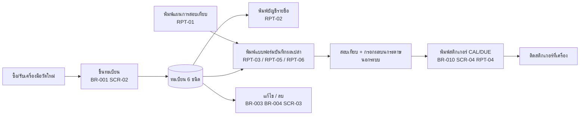

# สอบเทียบ — ทะเบียนเครื่องมือวัดและแบบฟอร์มการสอบเทียบ

> สถานะ: **สเปคระบบเดิม — ถอดครบ รอผู้ใช้ยืนยัน (คำถามหมวด ก.)** — คำถามค้างเลื่อนไปภายหลัง; ระบบใหม่ให้คงพฤติกรรมเดิมไว้ก่อน (ผู้ใช้ 2026-10-05) — อัปเดตล่าสุด 2026-10-05 (ตรวจตาม review-checklist แล้ว: วัตถุทุกชิ้นในไฟล์เดิม — ตาราง 9, query 12, ฟอร์ม 26, รายงาน 59, macro 27, module 3 — ถูกอ้างถึงในสเปค) · ตรวจทานรอบ 2 (2026-10-05): เติมตัวอย่าง/ที่มา/ผลลัพธ์ BR, การนำทาง SCR, ผลกระทบของทุกคำถาม, ดัชนีวัตถุเดิม
> ที่มา: `source/สอบเทียบ.accdb` (19.5 MB, MS Access) — ถอดจากสำเนาใน scratchpad ด้วย `.claude/skills/reengineering-access/scripts/extract_access.py` (2026-10-05) + ข้อมูลทุกแถวด้วย ODBC (`source/_extract/สอบเทียบ/full/`) + ฟอร์ม/VBA กู้จาก `MSysAccessStorage` (ดู "วิธีถอดฟอร์มและ VBA") · ผลอยู่ใน `source/_extract/สอบเทียบ/`
> ผู้ใช้แจ้ง (โปรแกรมก่อนหน้า): ให้ถอดพฤติกรรมระบบเดิมให้ครบก่อน คำถามระบบใหม่พักไว้ (open-questions หมวด ข.)

## วัตถุประสงค์
🔍 อนุมานจากเมนู ป้ายรายงาน และข้อมูล (❓ Q-01): โปรแกรมของฝ่าย QA บริษัท ล็อคเต้ จำกัด สำหรับระบบคุณภาพ (เอกสาร PC-QA009, WI-QA049) ในการควบคุมเครื่องมือวัด
1. **ทะเบียนเครื่องมือวัด** — แยก 6 ทะเบียนตามชนิด: สอบเทียบภายนอก (ส่งบริษัทภายนอก), เวอร์เนีย/ไฮเกจ/ไมโครมิเตอร์, เพรสเชอร์เกจ, เครื่องชั่ง, JIG, ตัวควบคุมอุณหภูมิ
2. **พิมพ์บัญชีรายชื่อเครื่องมือวัด** (PC-QA009-1) และ **แผนการสอบเทียบ** ประจำปี (PC-QA009-2)
3. **พิมพ์แบบฟอร์มบันทึกผลการสอบเทียบเปล่า** (PC-QA009-4, WI-QA049-x) ให้ผู้สอบเทียบกรอกผลด้วยมือ
4. **พิมพ์สติกเกอร์** ติดเครื่องมือวัด (หมายเลขเครื่อง / วันที่สอบเทียบ / วันครบกำหนดครั้งต่อไป)

> **สำคัญ:** ระบบเดิม **ไม่เก็บประวัติหรือผลการสอบเทียบ** — ไม่มีตารางวันที่สอบเทียบ/ผลผ่าน-ไม่ผ่าน/ค่าที่วัดได้ ผลทั้งหมดอยู่บนกระดาษที่พิมพ์ออกไป วันที่ที่พิมพ์บนสติกเกอร์ถูกเก็บแค่ค่าล่าสุดค่าเดียว (ตาราง `วันที่ CAL`) — ดู BR-030, BR-031

## ผู้ใช้
| บทบาท | ทำอะไรในระบบ | ความถี่ |
|---|---|---|
| 🔍 QA (เจ้าหน้าที่ดูแลเครื่องมือวัด) | ขึ้นทะเบียน/แก้ไข/ลบเครื่องมือวัด, พิมพ์บัญชีรายชื่อ แผน แบบฟอร์ม สติกเกอร์ | เมื่อมีเครื่องใหม่ และรอบสอบเทียบประจำปี |
| 🔍 ผู้สอบเทียบภายใน (ชื่อในฟิลด์ `ผู้สอบเทียบ` — พนักงานแต่ละแผนก) | ใช้แบบฟอร์มที่พิมพ์ออกไปกรอกผล (ไม่ได้ใช้โปรแกรมเอง ❓ Q-02) | ปีละครั้ง |
| ❓ Q-02 | ยืนยันผู้ใช้จริงและจำนวนเครื่อง | |

## ขอบเขต
**ทำ:** (ตามเมนูที่ใช้งาน — screens.md แผนผังเมนู)
- ทะเบียนเครื่องมือวัด 6 ชนิด: เพิ่ม, แก้ไข, ลบ (BR-001…BR-006)
- ทะเบียนบริษัทที่สอบเทียบ (ใช้เป็นตัวเลือกของเครื่องมือสอบเทียบภายนอก) (BR-007)
- รายงาน: แผนการสอบเทียบ, บัญชีรายชื่อเครื่องมือวัดแยกชนิด, แบบฟอร์มบันทึกผลการสอบเทียบเปล่า, แบบรายงานการตรวจสอบ JIG (วัดศูนย์ 23 แบบ / กรอ 19 แบบ), สติกเกอร์ (BR-010)

**ไม่ทำ (Out of scope):**
- การบันทึกผลการสอบเทียบ (ค่าที่วัดได้, ผ่าน/ไม่ผ่าน), ประวัติการสอบเทียบ, การคำนวณ/แจ้งเตือนวันครบกำหนด — ระบบเดิมไม่มี (❓ Q-20 หมวด ข.)
- ข้อมูลพนักงาน (ชื่อผู้สอบเทียบเป็นข้อความอิสระ ไม่ผูกกับโปรแกรม `พนักงาน.accdb`)
- login/สิทธิ์/การอนุมัติในระบบ — ระบบเดิมไม่มี (ลายเซ็นอนุมัติอยู่บนกระดาษ)
- ไม่มีการคำนวณตัวเลขหรือเงินใด ๆ

## Workflow หลัก

ประจำปี (🔍 ส่วนใหญ่ช่วง ส.ค. — ❓ Q-03): พิมพ์แผน → พิมพ์แบบฟอร์ม → สอบเทียบ → พิมพ์สติกเกอร์ · ตามต้องการ: ขึ้นทะเบียน/แก้ไข/ลบเครื่อง

## Constraints / Tech stack
❓ ยังไม่กำหนด (Q-21) · ภาษาที่แสดง: ไทย (ชื่อเครื่องมือส่วนใหญ่เป็นภาษาอังกฤษ) · วันที่: เก็บเป็นวันที่ แต่ข้อมูลเดิมปน พ.ศ./ค.ศ. (data-model "ปัญหาคุณภาพข้อมูล", non-functional)

## เอกสารในโฟลเดอร์นี้
| ไฟล์ | เรื่อง | สถานะ | ❓ ค้าง |
|---|---|---|---|
| [glossary.md](glossary.md) | คำศัพท์ | ถอดครบ — รอยืนยัน | 2 |
| [data-model.md](data-model.md) | ตาราง ฟิลด์ ความสัมพันธ์ (ย้าย 7 / ไม่ย้าย 2) | ถอดครบ — รอยืนยัน | 6 |
| [business-rules.md](business-rules.md) | กฎธุรกิจ BR-001…031 (ไม่มีการคำนวณ/ปัดเศษ, ไม่มี state machine) | ถอดครบ — รอยืนยัน (ส่วนใหญ่ ✅ จากโค้ด) | 10 |
| [screens.md](screens.md) | แผนผังเมนู + หน้าจอ SCR-01…06 | ถอดครบ — รอยืนยัน | 1 |
| [reports.md](reports.md) | รายงาน RPT-01…06 (59 รายงานเดิม) | ถอดครบ — รอยืนยัน | 3 |
| [integrations.md](integrations.md) | import/export | ถอดครบ — ไม่มีการเชื่อมต่ออัตโนมัติ (มีความเชื่อมโยงเชิงเนื้อหากับโปรแกรมอื่น INT-01) | 2 |
| [non-functional.md](non-functional.md) | สิทธิ์ ปริมาณ รูปแบบ การย้ายข้อมูล การพิมพ์ | ถอดครบ — รอยืนยัน | 9 |
| [acceptance.md](acceptance.md) | เกณฑ์ตรวจรับ AC-01…14 | ร่าง (ใช้ตอนสร้างระบบใหม่) | 1 |
| [open-questions.md](open-questions.md) | คำถามค้าง + การตัดสินใจ | หมวด ก. 15 ข้อ (รอผู้ใช้) · หมวด ข. 8 ข้อ (พักไว้จนเริ่มออกแบบระบบใหม่) | 23 |

## วิธีถอดฟอร์มและ VBA
- สคริปต์ extract ส่งออกฟอร์ม 26 ชิ้นและ module 3 ชิ้นไม่ได้ ("The search key was not found") — กู้จากตารางระบบ `MSysAccessStorage` แบบอ่านอย่างเดียว:
  - VBA ทั้ง 29 module: stream ชื่อ `dir` ถูกตั้งชื่อแบบสุ่ม จึงสแกนหา compressed container (MS-OVBA) ในแต่ละ stream โดยตรง → `source/_extract/สอบเทียบ/vbasrc/` (ข้อความ `ChrW(...)` ถูกแปลงเป็นอักษรไทยแล้ว)
  - ฟอร์ม: ข้อความ UTF-16 ใน Blob → `formtxt/` (ชื่อ control, RecordSource, RowSource, macro/`[Event Procedure]` ที่ผูกกับแต่ละปุ่ม)
- รายงาน 59 ชิ้นส่งออกได้ครบ (`reports/`, สรุปที่ `reports_digest.txt`)
- **ข้อสังเกต:** VBA ของหลายฟอร์มถูกคัดลอกมาจากฟอร์ม CALIPER (เรียก macro ของ CALIPER) แต่ปุ่มบนฟอร์มเหล่านั้นผูก macro ของตัวเองโดยตรง — VBA ส่วนนั้นจึงเป็นโค้ดที่ไม่ถูกเรียก สเปคนี้ยึด **การผูกจริงใน Blob ของฟอร์ม** เป็นหลัก (รายละเอียด screens.md)
