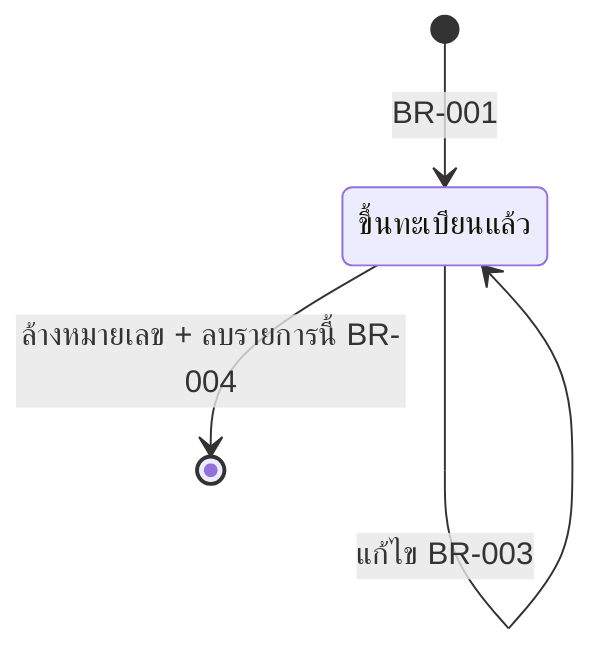

# Business Rules — สอบเทียบ

> สถานะ: ถอดครบ — รอยืนยัน (2026-10-05)
> บรรยายพฤติกรรมของโปรแกรมเดิมตามจริง จุดที่ดูผิดปกติติด "⚠ ข้อสังเกต" — ผู้ใช้ตัดสินใจ (2026-10-05): **ระบบใหม่คงพฤติกรรมเดิมไว้ก่อน** จุด ⚠ คือรายการปรับปรุงภายหลัง (open-questions หมวด ข.)
> ที่มา macro/query: `source/_extract/สอบเทียบ/macros/`, `queries/` · VBA: `vbasrc/` · การผูกปุ่ม: `formtxt/`
> ระบบเดิมไม่มี login, ไม่มีการตรวจช่องบังคับ, ไม่มีข้อความ error ที่เขียนเอง (มีแค่ `MsgBox Err.Description` มาตรฐานของ wizard)

หมวด: ทะเบียนเครื่องมือวัด (BR-001…007) · สติกเกอร์ (BR-010) · ข้อตกลงของข้อมูล (BR-020…021) · รอบการสอบเทียบ (BR-030…031)

## การปัดเศษที่ใช้ในโปรแกรม
ไม่มี — โปรแกรมไม่มีการคำนวณตัวเลขใด ๆ (ไม่พบ `Round`/`Int`/`Fix`/`Format` ใน VBA, query, รายงาน; ค่าตัวเลขทุกค่าเก็บเป็นข้อความ) · module `ThaiNumber` (แปลงตัวเลขเป็นคำอ่าน) มีอยู่แต่ไม่ถูกเรียกจากที่ใด

| ID | ฟังก์ชันเดิม | พฤติกรรม + ตัวอย่าง | ใช้ที่ |
|---|---|---|---|
| — | — | ไม่มี | — |

---

## BR-001 — เพิ่มเครื่องมือวัด ("รายการต่อไป" / "กลับเมนูเดิม")
สถานะ: ✅ ยืนยันจากโค้ด
ที่มา: ฟอร์ม `ภายนอก`, `CALIPER`, `pressure gauge`, `เครื่องชั่ง`, `jig`, `ตัวควบคุมอุณหภูมิ` (เปิดจากเมนูด้วย `acAdd`) · macro `<ชนิด>ต่อไป`, `<ชนิด>ปิดฟอร์ม` · query `ลบ<ชนิด>` (BR-002)

**กฎ:** หน้าจอเพิ่มเปิดเป็นแถวใหม่ว่าง ผู้ใช้กรอกทีละเครื่อง ข้อมูลบันทึกลงตารางของชนิดนั้นทันทีที่ปิดฟอร์ม/เลื่อนแถว (พฤติกรรมปกติของฟอร์ม Access ที่ผูกตาราง — ไม่มีปุ่มบันทึก)
- **รายการต่อไป** = ปิดฟอร์ม (บันทึกแถวปัจจุบัน) → ล้างแถวที่ไม่มีหมายเลขเครื่อง (BR-002) → เปิดฟอร์มเพิ่มใหม่
- **กลับเมนูเดิม** = ปิดฟอร์ม (บันทึก) → ล้างแถวที่ไม่มีหมายเลขเครื่อง (BR-002) → กลับเมนู
**เหตุผล:** 🔍 ใช้การลบแถว `หมายเลขเครื่อง` ว่างแทนการตรวจช่องบังคับ — ถ้าผู้ใช้เผลอกรอกช่องอื่นแต่ไม่ใส่หมายเลข แถวนั้นจะถูกทิ้ง
**เงื่อนไขก่อน:** ไม่มี — ไม่ตรวจซ้ำ ไม่ตรวจรูปแบบ ไม่มีช่องบังคับ
**ผลลัพธ์:** แถวใหม่ในตารางชนิดนั้น · ฟิลด์ที่กรอกได้ = ทุกฟิลด์ของตาราง (screens.md SCR-02)
**ถ้าผิดเงื่อนไข:** ไม่มีการตรวจ — หมายเลขเครื่องซ้ำบันทึกได้ (⚠ ข้อสังเกต ❓ Q-22)

| # | Input | Expected |
|---|---|---|
| 1 | หน้าจอ CALIPER: หมายเลข `VN-QA015/2569`, ชื่อ `Vernier Digital` → กด "รายการต่อไป" | T-CALIPER +1 แถว, ฟอร์มเปิดใหม่เป็นแถวว่าง |
| 2 | กรอกแค่ชื่อเครื่องมือวัด ไม่มีหมายเลข → "กลับเมนูเดิม" | แถวถูกบันทึกแล้วถูกลบทันทีโดย BR-002 → ตารางไม่เปลี่ยน |
| 3 | หมายเลข `VN-QA014/2566` ที่มีอยู่แล้ว → "รายการต่อไป" | บันทึกเป็นแถวที่ 2 ซ้ำ (ไม่มีการเตือน) |
| 4 | เปิดหน้าจอแล้วกด "กลับเมนูเดิม" ทันที | ไม่มีแถวใหม่ (แถวว่างไม่ถูกบันทึก) |

⚠ ข้อสังเกต:
- macro ปิดฟอร์มด้วย `Close` แล้วรัน DELETE query ด้วย `OpenQuery` โดย **ไม่ปิด SetWarnings** — 🔍 Access จะถามยืนยัน "คุณกำลังจะลบ 0 แถว" ทุกครั้ง เว้นแต่เครื่องผู้ใช้ปิดตัวเลือก Confirm action queries ไว้ (❓ Q-09)
- การเปิดฟอร์มใหม่ใน "รายการต่อไป" ใช้ Data Mode ค่าปริยาย (`-1`) ไม่ใช่ `Add` — 🔍 ถ้าคุณสมบัติ Data Entry ของฟอร์มไม่ได้ตั้งเป็น Yes ฟอร์มจะเปิดที่แถวแรกของตาราง (แก้แถวเดิมได้โดยไม่ตั้งใจ) ❓ Q-09
- หน้าจอเพิ่มของภายนอกตั้งค่าเริ่มต้น `แผนกที่ใช้งาน = "QA"`; ชนิดอื่นไม่มีค่าเริ่มต้น

---

## BR-002 — ล้างแถวที่ไม่มีหมายเลขเครื่อง
สถานะ: ✅ ยืนยันจากโค้ด
ที่มา: query `ลบCALIPER`, `ลบpressure gauge`, `ลบเครื่องชั่ง`, `ลบตัวควบคุมอุณหภูมิ`, `ลบJIG`, `ลบภายนอก` (DELETE … WHERE `หมายเลขเครื่อง` Is Null) · `บริษัท` (DELETE FROM บริษัทที่สอบเทียบ WHERE NAME Is Null)

**กฎ:** ลบทุกแถวในตารางชนิดนั้นที่ `หมายเลขเครื่อง` เป็น Null — ทำงานทั้งตาราง ไม่ใช่แค่แถวที่เพิ่งกรอก
**เหตุผล:** เป็นทั้ง (1) การทิ้งแถวที่กรอกไม่ครบ (BR-001) และ (2) **กลไกการลบเครื่องมือวัด** (BR-004)
**ถูกเรียกเมื่อ:** "รายการต่อไป"/"กลับเมนูเดิม" ของหน้าจอเพิ่ม (BR-001) และ "ลบรายการนี้" ของหน้าจอแก้ไข (BR-004) — ของชนิดเดียวกันเท่านั้น
**ผลลัพธ์:** แถวที่ `หมายเลขเครื่อง` Null หายไปถาวร (ไม่มี undo/ไม่มีประวัติ)

| # | Input | Expected |
|---|---|---|
| 1 | T-jig มี 59 แถวครบหมายเลข | ลบ 0 แถว |
| 2 | ใน T-jig มีแถวที่ถูกล้างหมายเลขค้างจากครั้งก่อน 1 แถว + ผู้ใช้กด "รายการต่อไป" ในหน้าจอเพิ่ม JIG | แถวค้างนั้นถูกลบด้วย |
| 3 | `หมายเลขเครื่อง` = ข้อความว่าง `""` (ไม่ใช่ Null) | 🔍 ไม่ถูกลบ — query ตรวจแค่ `Is Null` (ฟอร์ม Access ปกติบันทึกช่องที่ลบจนว่างเป็น Null จึงไม่ค่อยเกิด) |

⚠ ข้อสังเกต: query `บริษัท` และ macro ที่เรียกมัน (`ปิดฟอร์มบริษัท`, `บริษัทต่อไป`) ไม่ถูกเรียกจากที่ใด (BR-007)

---

## BR-003 — แก้ไขเครื่องมือวัด
สถานะ: ✅ ยืนยันจากโค้ด (ยกเว้นภายนอก ดู ⚠)
ที่มา: ฟอร์ม `<ชนิด>แก้ไข` (หลัก ผูกตารางชนิดนั้น) + subform `<ชนิด>แก้ไข1` (link `หมายเลขเครื่อง` ↔ `หมายเลขเครื่อง`) · VBA `Combo24_AfterUpdate`

**กฎ:** ผู้ใช้เลือกหมายเลขเครื่องจาก dropdown (แสดง หมายเลขเครื่อง + ชื่อเครื่องมือวัด/ชื่อ JIG เรียงตามหมายเลข) → ฟอร์มหลักเลื่อนไปแถวแรกที่ `หมายเลขเครื่อง` ตรงกัน (`RecordsetClone.FindFirst "[หมายเลขเครื่อง] = '<ค่า>'"`) → subform แสดงทุกฟิลด์ของเครื่องนั้นให้แก้ไขได้ทันที บันทึกอัตโนมัติเมื่อออกจากแถว/ปิดฟอร์ม
**เหตุผล:** 🔍 ปรับทะเบียนเมื่อข้อมูลเครื่องเปลี่ยน เช่น ย้ายแผนก เปลี่ยนผู้สอบเทียบ
**ผลลัพธ์:** แก้ได้ทุกฟิลด์รวมทั้งหมายเลขเครื่อง · ไม่มีประวัติการแก้ไข
**ถ้าผิดเงื่อนไข:** ไม่มีการตรวจ

| # | Input | Expected |
|---|---|---|
| 1 | เลือก `TC-BL058/2562` → แก้ หน่วย = `°C` → กลับเมนูเดิม | แถวนั้นถูกแก้ |
| 2 | ถ้ามีหมายเลขซ้ำ 2 แถว | แสดงได้แค่แถวแรกที่ FindFirst เจอ (แถวที่ 2 แก้ผ่านหน้าจอนี้ไม่ได้) |
| 3 | เปลี่ยนหมายเลขเครื่องใน subform เป็นค่าอื่น | บันทึกค่าใหม่; subform หลุด link จึงไม่แสดงแถวนั้นต่อ |

⚠ ข้อสังเกต:
- **หน้าจอแก้ไขภายนอก (`ภายนอกแก้ไข`)**: dropdown `Combo0`, ปุ่ม "ลบข้อมูลนี้", "กลับเมนูเดิม" ผูก `[Event Procedure]` แต่ module ของฟอร์มว่าง (ไม่มีโค้ด) → 🔍 **ทั้งสามอย่างไม่ทำงาน** เลือกเครื่องไม่ได้ ลบไม่ได้ ต้องปิดหน้าต่างเอง (แก้ไขได้เฉพาะแถวที่ subform แสดงตามแถวปัจจุบันของฟอร์มหลัก) ❓ Q-10 · dropdown ของภายนอกไม่ได้เรียงลำดับ (ไม่มี ORDER BY)
- หมายเลขเครื่องที่มีเครื่องหมาย `'` จะทำให้ FindFirst error — ข้อมูลปัจจุบันไม่มี

---

## BR-004 — ลบเครื่องมือวัด
สถานะ: ✅ ยืนยันจากโค้ด + ข้อความบนหน้าจอ
ที่มา: ป้ายบนฟอร์ม `<ชนิด>แก้ไข` "ลบรายการเครื่องมือวัด ให้ลบหมายเลขเครื่องออก แล้วกดปุ่มลบรายการนี้" · ปุ่ม `Command29` → macro `ลบCALIPER`/`ลบpressure gauge`/`ลบเครื่องชั่ง`/`ลบตัวควบคุมอุณหภูมิ`/`ลบJIG` (Close ฟอร์มแก้ไข → OpenQuery `ลบ<ชนิด>`)

**กฎ:** การลบทำ 2 ขั้น: (1) ผู้ใช้ลบข้อความในช่อง `หมายเลขเครื่อง` ของ subform จนว่าง (แถวถูกบันทึกเป็น Null) (2) กด "ลบรายการนี้" → ปิดฟอร์มแก้ไข → ลบทุกแถวที่ไม่มีหมายเลขเครื่องในตารางชนิดนั้น (BR-002) → กลับเมนู
**เหตุผล:** 🔍 วิธีลบแบบไม่ต้องเขียนโค้ด — อาศัย BR-002
**ผลลัพธ์:** ลบถาวร ไม่มีการยืนยันของโปรแกรมเอง (มีแค่ข้อความยืนยันของ Access ถ้าเปิดไว้ — ❓ Q-09) ไม่ตรวจว่าเครื่องนี้ถูกอ้างเป็นเครื่องมือมาตรฐานที่ไหน

| # | Input | Expected |
|---|---|---|
| 1 | เลือก `PG-BL012/2547` → ลบหมายเลขจนว่าง → "ลบรายการนี้" | T-PRESSURE GAUGE เหลือ 52 แถว |
| 2 | ลบหมายเลขจนว่าง แล้วกด "กลับเมนูเดิม" แทน | แถวยังอยู่โดยไม่มีหมายเลข (มองไม่เห็นใน dropdown/รายงานยังพิมพ์แถวว่าง) จนกว่าจะมีการเรียก BR-002 ของชนิดนั้นครั้งถัดไป |
| 3 | กด "ลบรายการนี้" โดยไม่ได้ลบหมายเลข | ปิดฟอร์ม ไม่มีอะไรถูกลบ |

⚠ ข้อสังเกต: ภายนอกมี macro `ภายนอกลบ` สำหรับขั้นที่ 2 แต่ปุ่มบนหน้าจอไม่ทำงาน (BR-003 ⚠) — ภายนอกจึงลบได้แค่ทางอ้อม: ล้างหมายเลขแล้วไปเปิด/ปิดหน้าจอเพิ่มภายนอก (BR-001 เรียก BR-002) 🔍

---

## BR-005 — ตัวเลือกใน dropdown ของหน้าจอเพิ่ม/แก้ไข
สถานะ: ✅ ยืนยันจาก RowSource
ที่มา: RowSource `SELECT DISTINCT <ตาราง>.<ฟิลด์> FROM <ตาราง> ORDER BY <ฟิลด์>`

**กฎ:** ช่องต่อไปนี้เป็น dropdown ที่เสนอ **ค่าที่ไม่ซ้ำซึ่งมีอยู่แล้วในตารางเดียวกัน** เรียงตามตัวอักษร แต่พิมพ์ค่าใหม่ได้ (ค่าที่พิมพ์ใหม่จะปรากฏเป็นตัวเลือกครั้งถัดไป) 🔍 LimitToList ไม่ได้เปิด (ข้อมูลมีค่าที่หลากหลายจากการพิมพ์เอง)

| ชนิด | ช่องที่เป็น dropdown |
|---|---|
| CALIPER, PRESSURE GAUGE, เครื่องชั่ง, ตัวควบคุมอุณหภูมิ | ชื่อเครื่องมือวัด, แผนก, ยี่ห้อ/ผู้ผลิต, หน่วย, ผู้สอบเทียบ |
| jig | แกน (mm), คู่มือวิธีการที่ใช้เลขที่, ผู้สอบเทียบ, ขีดจำกัดที่ยอมรับได้, หมายเลขเวอร์เนียที่ใช้(ผ่านการสอบเทียบแล้ว), แผนก |
| ภายนอก | ชื่อเครื่องมือวัด, หน่วย, ผู้สอบเทียบ (หน้าจอเพิ่ม: จาก T-บริษัทที่สอบเทียบ — BR-007; หน้าจอแก้ไข: DISTINCT จาก T-ภายนอก) |

ช่องอื่นเป็นช่องข้อความ/วันที่ธรรมดา
**เหตุผล:** 🔍 ช่วยให้พิมพ์ค่าซ้ำเดิม (ยี่ห้อ หน่วย ผู้สอบเทียบ) ได้เร็วโดยไม่ต้องมีตาราง master
**ผลลัพธ์:** ไม่เปลี่ยนข้อมูลเอง — เป็นตัวช่วยกรอกเท่านั้น

| # | Input | Expected |
|---|---|---|
| 1 | เปิดหน้าจอเพิ่ม PRESSURE GAUGE ช่องหน่วย | ตัวเลือก: `Kg/cm²` |
| 2 | พิมพ์หน่วยใหม่ `bar` | บันทึกได้; ครั้งถัดไปตัวเลือกเป็น `bar`, `Kg/cm²` |

---

## BR-006 — ไม่มีการตรวจความถูกต้องของข้อมูล
สถานะ: ✅ ยืนยันจากโค้ด (ไม่พบ ValidationRule, Required, BeforeUpdate, MsgBox ตรวจค่า)
ที่มา: `schema2.json` (ทุกฟิลด์ไม่ Required ไม่มี ValidationRule), VBA ทุก module ใน `vbasrc/` (ไม่มี BeforeUpdate), ตาราง CALIPER/PRESSURE GAUGE/เครื่องชั่ง/ตัวควบคุมอุณหภูมิ/jig ไม่มี index

**กฎ:** ทุกฟิลด์ว่างได้ ซ้ำได้ ไม่ตรวจรูปแบบหมายเลขเครื่อง (BR-020) ไม่ตรวจปีของวันที่ (ทำให้เกิดปัญหา พ.ศ./ค.ศ. ใน data-model) ข้อยกเว้นเดียวคือแถวที่ไม่มีหมายเลขเครื่องถูกลบทิ้ง (BR-002)
**เหตุผล:** ❓ ไม่ทราบ — ระบบเดิมไม่ได้ออกแบบให้ตรวจ
**ผลลัพธ์:** บันทึกทุกค่าที่กรอก ไม่มีข้อความ error ใด ๆ
⚠ ข้อสังเกต: ระบบใหม่คงเดิมไว้ก่อน (ตัดสินใจ 2026-10-05) — การเพิ่มการตรวจคือ ❓ Q-22, Q-23 (หมวด ข.)

| # | Input | Expected |
|---|---|---|
| 1 | เพิ่ม CALIPER หมายเลข `VN-QA014/2566` (มีอยู่แล้ว) | บันทึกได้ — มี 2 แถวหมายเลขเดียวกัน |
| 2 | วันที่ขึ้นบัญชีพิมพ์ `17/08/62` บนเครื่องปฏิทินคริสต์ | บันทึกเป็น 1962-08-17 ไม่เตือน (ที่มาของ 47 แถวผิดปีใน data-model) |
| 3 | เว้นทุกช่องยกเว้นหมายเลขเครื่อง | บันทึกได้ |

---

## BR-007 — ทะเบียนบริษัทที่สอบเทียบ
สถานะ: ✅ ยืนยันจากโค้ด
ที่มา: เมนู "เพิ่มรายชื่อบริษัทที่สอบเทียบ" → ฟอร์ม `บริษัทที่สอบเทียบ` (เปิดแบบ `acAdd`) · ช่องผู้สอบเทียบในฟอร์ม `ภายนอก`

**กฎ:** ผู้ใช้พิมพ์ชื่อบริษัทใน `NAME` บันทึกเป็นแถวใหม่ — รายชื่อนี้เป็นตัวเลือกของ `ผู้สอบเทียบ` ในหน้าจอเพิ่มเครื่องมือภายนอก (DISTINCT NAME เรียงตามชื่อ)
**เหตุผล:** 🔍 ให้ชื่อบริษัทในทะเบียนภายนอกสะกดตรงกัน
**ผลลัพธ์:** แถวใหม่ใน T-บริษัทที่สอบเทียบ · ไม่มีหน้าจอแก้ไข/ลบบริษัท

| # | Input | Expected |
|---|---|---|
| 1 | NAME = `บ.ไทยเครื่องชั่ง จก.` → ปิดหน้าต่าง | ตัวเลือกผู้สอบเทียบภายนอกมี 2 บริษัท |
| 2 | เปิดหน้าจอแล้วปิดทันทีโดยไม่พิมพ์ | ไม่มีแถวใหม่ (แถวว่างไม่ถูกบันทึก) |
| 3 | พิมพ์ชื่อซ้ำ `Quality Calibration Co.,Ltd.` | บันทึกเป็นแถวที่ 2; dropdown แสดงชื่อเดียว (DISTINCT) |

⚠ ข้อสังเกต: ปุ่ม "บริษัทต่อไป" และ "กลับเมนูเดิม" บนฟอร์มนี้ผูก `[Event Procedure]` แต่ module ว่าง → 🔍 **ปุ่มไม่ทำงาน** ผู้ใช้ต้องปิดหน้าต่างเอง (ถ้าจะเพิ่มบริษัทที่ 2 ต้องเลื่อนไปแถวใหม่ด้วยปุ่มนำทางของ Access) macro `บริษัทต่อไป`/`ปิดฟอร์มบริษัท` และ query `บริษัท` ที่ควรถูกเรียกจึงไม่เคยทำงาน ❓ Q-10

---

## BR-010 — พิมพ์สติกเกอร์ติดเครื่องมือวัด
สถานะ: ✅ ยืนยันจากโค้ด
ที่มา: ฟอร์ม `วันที่ CAL` (CALIPER), `วันที่ CAL เพรสเชอร์เกจ`, `วันที่ CAL เครื่องชั่ง`, `วันที่ CAL JIG`, `วันที่ CAL ตัวควบคุมอุณหภูมิ` (ผูก ตาราง `วันที่ CAL`) · ปุ่ม "พิมพ์" → macro ชื่อเดียวกับฟอร์ม (CALIPER: VBA `Command7_Click` → macro `วันที่ CAL`) · query `วันที่ CAL <ชนิด>` · รายงาน RPT-04

**กฎ:**
1. หน้าจอแสดงแถวเดียวของ ตาราง `วันที่ CAL` (ค่าที่พิมพ์ครั้งล่าสุด) ผู้ใช้กรอก/แก้ 3 ช่อง:
   - `ID` = หมายเลขเครื่อง — dropdown หมายเลขเครื่องของชนิดนั้น (เรียงตามหมายเลข) หรือพิมพ์รูปแบบเอง ("ถ้าต้องการทั้งหมดใส่ *")
   - `CAL` = วันที่สอบเทียบ
   - `DUE` = วันที่ต้องสอบเทียบครั้งต่อไป — **กรอกเอง ไม่คำนวณ** ป้ายบนจอบอกว่า "1 ปีนับจากวันที่สอบเทียบ"
2. กด "พิมพ์": ปิดฟอร์ม (บันทึกค่าทับแถวเดิม) → เปิดฟอร์มอีกครั้ง → เปิด query แล้วปิด → เปิดรายงานสติกเกอร์แบบ Print Preview
3. query เลือกเครื่องในตารางชนิดนั้นที่ `หมายเลขเครื่อง Like [ID]` (cross join กับแถวเดียวของ ตาราง `วันที่ CAL`) → **ทุกสติกเกอร์ในรอบเดียวกันได้ CAL/DUE เดียวกัน**
4. `Like` ของ Access: `*` = อักขระกี่ตัวก็ได้, `?` = 1 ตัว, `#` = ตัวเลข 1 หลัก, ไม่สนตัวพิมพ์เล็กใหญ่; ไม่มี wildcard = ตรงทั้งค่า
5. ลำดับสติกเกอร์: ไม่กำหนด (query และรายงานไม่มีการเรียง — ออกตามลำดับในตาราง 🔍)
**เหตุผล:** ติดป้ายสถานะการสอบเทียบที่ตัวเครื่องตามระบบคุณภาพ
**ผลลัพธ์:** รายงานสติกเกอร์ (RPT-04) · ตาราง `วันที่ CAL` ถูกเขียนทับ — **ไม่มีการบันทึกว่าเครื่องไหนสอบเทียบเมื่อไร** (BR-031)

| # | Input | Expected |
|---|---|---|
| 1 | หน้าจอ CALIPER: ID = `*`, CAL = 17/08/2026, DUE = 17/08/2027 | สติกเกอร์ 13 ดวง (ทุกเครื่องใน T-CALIPER) ทุกดวง CAL 17/08/2026 DUE 17/08/2027 |
| 2 | หน้าจอเพรสเชอร์เกจ: ID = `PG-DC125/2569` | สติกเกอร์ 1 ดวง |
| 3 | หน้าจอเพรสเชอร์เกจ: ID = `PG-DC*` | 35 ดวง |
| 4 | หน้าจอ CALIPER: ID = `VN-QA*` | 3 ดวง (VN-QA012/2560, VN-QA013/2561, VN-QA014/2566) |
| 5 | ID = `XX-999` (ไม่มีในตาราง) หรือว่าง | รายงานไม่มีข้อมูล (หน้าว่าง) ไม่มีข้อความเตือน |
| 6 | CAL = 17/08/2026, DUE = 17/08/2026 (กรอกผิด) | พิมพ์ตามที่กรอก — ไม่มีการตรวจว่า DUE > CAL |

⚠ ข้อสังเกต:
- การเปิด query แบบ datasheet แล้วปิดทันทีไม่มีผลต่อข้อมูล (🔍 เศษจากการสร้าง macro) 
- หน้าจอทั้ง 5 ชนิดใช้แถวเดียวกันของ ตาราง `วันที่ CAL` — ค่าที่กรอกในหน้าจอชนิดหนึ่งจะปรากฏในหน้าจอชนิดอื่น
- ไม่มีหน้าจอสติกเกอร์สำหรับเครื่องมือภายนอก (บริษัทภายนอกน่าจะติดสติกเกอร์ของตัวเอง 🔍 ❓ Q-11)

---

## BR-020 — รูปแบบหมายเลขเครื่อง (ข้อตกลง ไม่ได้บังคับในระบบ)
สถานะ: 🔍 อนุมานจากข้อมูลทั้งหมด 222 แถว (❓ Q-04)
ที่มา: ฟิลด์ `หมายเลขเครื่อง` ของทุกตาราง (`source/_extract/สอบเทียบ/full/*.csv`)

**กฎ:** `<ชนิด>-<แผนก><ลำดับ 3 หลัก>[-<ลำดับย่อย>]/<ปี พ.ศ. ที่ออกหมายเลข>` ระบบเดิมไม่ตรวจ ไม่ออกเลขให้อัตโนมัติ — ผู้ใช้พิมพ์เอง
**เหตุผล:** 🔍 ระบุชนิดและแผนกเจ้าของได้จากหมายเลขบนตัวเครื่อง/สติกเกอร์
**ผลลัพธ์:** ไม่มี — เป็นข้อตกลงของผู้ใช้ (BR-006)
| คำนำหน้า | ความหมาย | ตาราง |
|---|---|---|
| VN | Vernier (caliper/digital) | CALIPER |
| MM | Micrometer | CALIPER |
| HG | Height Gauge | CALIPER |
| PG | Pressure Gauge | PRESSURE GAUGE, ภายนอก |
| WG | เครื่องชั่ง (Weighing) | เครื่องชั่ง, ภายนอก |
| TC | Temp Control | ตัวควบคุมอุณหภูมิ, ภายนอก |
| JG | JIG | jig |
| GB | Gauge Block | ภายนอก |
| BW / SW | Brass Weight / Steel Weight | ภายนอก |
| Q01-n | เครื่องทดสอบแรงเสียดทาน (ไม่มีปี) | ภายนอก |

| # | หมายเลข | ตีความ |
|---|---|---|
| 1 | `VN-GR001/2547` | เวอร์เนีย แผนก GR ลำดับ 001 ออกปี พ.ศ. 2547 |
| 2 | `JG-AS001-2/2560` | JIG แผนกประกอบ (AS) ชุด 001 ตัวที่ 2 ปี 2560 |
| 3 | `PG-DC125/2569` | เพรสเชอร์เกจ แผนก DC ลำดับ 125 ปี 2569 |

---

## BR-021 — การสอบกลับได้ (traceability) ของเครื่องมือมาตรฐาน
สถานะ: 🔍 อนุมานจากข้อมูล (❓ Q-12)
ที่มา: ฟิลด์ `หมายเลขเครื่องมือที่ใช้(ผ่านการสอบเทียบแล้ว)` (CALIPER, PRESSURE GAUGE, เครื่องชั่ง, ตัวควบคุมอุณหภูมิ) และ `หมายเลขเวอร์เนียที่ใช้(ผ่านการสอบเทียบแล้ว)` (jig) เทียบกับ `หมายเลขเครื่อง` ใน ภายนอก/CALIPER · พิมพ์บนแบบฟอร์ม RPT-03

**กฎ:** เครื่องมือที่สอบเทียบภายในบันทึกว่าใช้เครื่องมือมาตรฐานเครื่องไหนสอบเทียบ (`หมายเลขเครื่องมือที่ใช้(ผ่านการสอบเทียบแล้ว)` หรือ `หมายเลขเวอร์เนียที่ใช้(…)` สำหรับ JIG) เครื่องมือมาตรฐานเหล่านั้นส่วนใหญ่อยู่ใน T-ภายนอก (ส่งบริษัทภายนอกสอบเทียบ) — เป็นข้อความอิสระ อาจเป็นช่วงหมายเลขหรือหลายค่าคั่นด้วย `,`
| ชนิด | เครื่องมือมาตรฐานที่บันทึก | อยู่ในทะเบียน |
|---|---|---|
| CALIPER | `GB-QA001/2551 - GB-QA005/2551` (gauge block 5 ชิ้น) | T-ภายนอก |
| PRESSURE GAUGE | `PG-QA001/2550` | T-ภายนอก |
| เครื่องชั่ง | `BW-QA001/2553 - BW-QA004/2553`, `SW-QA001/2555-SW-QA005/2555` | T-ภายนอก |
| ตัวควบคุมอุณหภูมิ | `TC-QA001/2555` (`TC-QA001/2547` ในแผนก DC — ไม่มีในทะเบียน) | T-ภายนอก (เฉพาะ /2555) |
| jig | `VN-QA014/2566` | T-CALIPER |
**เหตุผล:** 🔍 ข้อกำหนด ISO ให้ผลการสอบเทียบสอบกลับได้ถึงมาตรฐานที่ผ่านการสอบเทียบภายนอก
**ผลลัพธ์:** ระบบเดิมไม่ตรวจว่าเครื่องมือมาตรฐานมีอยู่จริงหรือยังอยู่ในอายุการสอบเทียบ

| # | Input | Expected |
|---|---|---|
| 1 | เพิ่มเวอร์เนียใหม่ เครื่องมือที่ใช้ = `GB-QA001/2551 - GB-QA005/2551` | บันทึกเป็นข้อความ; พิมพ์บนแบบบันทึกผล caliper |
| 2 | เครื่องมือที่ใช้ = `TC-QA001/2547` (ไม่มีในทะเบียนภายนอก) | บันทึกได้ ไม่เตือน |

---

## BR-030 — รอบการสอบเทียบ 1 ครั้งต่อปี
สถานะ: 🔍 อนุมานจากป้ายบนหน้าจอและรายงาน (❓ Q-03)
ที่มา: ป้ายฟอร์มสติกเกอร์ "วันที่ต้องสอบเทียบครั้งต่อไป 1 ปีนับจากวันที่สอบเทียบ" · รายงานแผนการสอบเทียบ (RPT-01) "1 ครั้ง / ปี" ทั้งภายนอกและภายใน

**กฎ:** เครื่องมือวัดทุกชนิดสอบเทียบปีละ 1 ครั้ง; DUE = CAL + 1 ปี (ผู้ใช้กรอกเอง BR-010)
**เหตุผล:** 🔍 รอบตามแผนการสอบเทียบของระบบคุณภาพ (PC-QA009-2)
**ผลลัพธ์:** (ระบบเดิม) ไม่มีการคำนวณ ไม่มีรายการเครื่องที่ครบกำหนด ไม่มีการแจ้งเตือน — แผนการสอบเทียบเป็นแบบฟอร์มคงที่ (RPT-01)

| # | CAL | DUE ตามกฎ |
|---|---|---|
| 1 | 17/08/2026 | 17/08/2027 (ตรงกับแถวใน ตาราง `วันที่ CAL`) |
| 2 | 29/02/2028 | ❓ 28/02/2029 หรือ 01/03/2029 — ระบบเดิมไม่ได้กำหนดเพราะกรอกเอง |

---

## BR-031 — ผลการสอบเทียบไม่ถูกเก็บในระบบ
สถานะ: ✅ ยืนยันจากโครงสร้าง (ไม่มีตาราง/ฟิลด์ผลการสอบเทียบ; ทุกแบบฟอร์ม RPT-03/05/06 มีช่องว่างให้กรอกด้วยมือ)
ที่มา: `tables.md` (9 ตาราง ไม่มีฟิลด์ผล), รายงาน `บันทึกผลการสอบเทียบ…`, `JIG กรอ …` และรายงานแบบ JIG วัดศูนย์ (ช่องผลเป็น Label/เส้น ไม่ใช่ TextBox)

**กฎ:** โปรแกรมพิมพ์แบบฟอร์มเปล่าที่มีข้อมูลทะเบียนของเครื่อง (ชื่อ หมายเลข พิกัด หน่วย ขีดจำกัด หน่วยงานสอบเทียบ เครื่องมือมาตรฐาน) — ค่าที่วัดได้ 3 ครั้ง, ค่าเฉลี่ย, ค่าผิดพลาด, สภาวะการสอบเทียบ, ผ่าน/ไม่ผ่าน, ลายเซ็น กรอกบนกระดาษ ไม่ย้อนกลับเข้าระบบ
**เหตุผล:** ❓ ไม่ทราบ (Q-01)
**ผลลัพธ์:** ประวัติการสอบเทียบอยู่ในแฟ้มเอกสาร QA เท่านั้น (❓ Q-20 หมวด ข. — ระบบใหม่จะเก็บผลหรือไม่; ตัดสินใจ 2026-10-05: คงเดิมไว้ก่อน)

| # | Input | Expected |
|---|---|---|
| 1 | พิมพ์บันทึกผลการสอบเทียบ caliper | 13 หน้า ข้อมูลหัวจากทะเบียน ตาราง 20 จุดว่าง (RPT-03) |
| 2 | หลังสอบเทียบเสร็จ ต้องการดูว่า `VN-QA012/2560` สอบเทียบล่าสุดเมื่อไร | ระบบเดิมตอบไม่ได้ — ต้องดูแฟ้มกระดาษ/สติกเกอร์ที่ตัวเครื่อง |

---

## State machine
ไม่มี — ไม่มีฟิลด์สถานะใดในระบบ (เครื่องมือวัดไม่มีสถานะใช้งาน/ส่งสอบเทียบ/เลิกใช้; การเลิกใช้ = ลบแถว BR-004)

---

## ภาคผนวก — วัตถุเดิมที่ใช้ในแต่ละกฎ
ใช้ตรวจย้อนกลับไปยังไฟล์ Access (`source/_extract/สอบเทียบ/`)

| กฎ | macro | query | ฟอร์ม / รายงาน |
|---|---|---|---|
| BR-001, BR-002 (เพิ่ม) | `CALIPERต่อไป`, `CALIPERปิดฟอร์ม`, `pressure gaugeต่อไป`, `pressure gaugeปิดฟอร์ม`, `เครื่องชั่งต่อไป`, `เครื่องชั่งปิดฟอร์ม`, `JIGต่อไป`, `JIGปิดฟอร์ม`, `ตัวควบคุมอุณหภูมิต่อไป`, `ตัวควบคุมอุณหภูมิปิดฟอร์ม`, `ภายนอกต่อไป`, `ภายนอกปิดฟอร์ม` | `ลบCALIPER`, `ลบpressure gauge`, `ลบเครื่องชั่ง`, `ลบJIG`, `ลบตัวควบคุมอุณหภูมิ`, `ลบภายนอก` | `CALIPER`, `pressure gauge`, `เครื่องชั่ง`, `jig`, `ตัวควบคุมอุณหภูมิ`, `ภายนอก` |
| BR-003, BR-004 (แก้/ลบ) | `ลบCALIPER`, `ลบpressure gauge`, `ลบเครื่องชั่ง`, `ลบJIG`, `ลบตัวควบคุมอุณหภูมิ` · ไม่ถูกเรียก: `ภายนอกลบ` | query ชุดเดียวกับข้างบน | `CALIPERแก้ไข`, `CALIPERแก้ไข1`, `pressure gaugeแก้ไข`, `pressure gaugeแก้ไข1`, `เครื่องชั่งแก้ไข`, `เครื่องชั่งแก้ไข1`, `JIGแก้ไข`, `jigแก้ไข1`, `ตัวควบคุมอุณหภูมิแก้ไข`, `ตัวควบคุมอุณหภูมิแก้ไข1`, `ภายนอกแก้ไข`, `ภายนอกแก้ไข1` |
| BR-007 | ไม่ถูกเรียก: `บริษัทต่อไป`, `ปิดฟอร์มบริษัท` | ไม่ถูกเรียก: `บริษัท` | `บริษัทที่สอบเทียบ` |
| BR-010 | `วันที่ CAL`, `วันที่ CAL เพรสเชอร์เกจ`, `วันที่ CAL เครื่องชั่ง`, `วันที่ CAL JIG`, `วันที่ CAL ตัวควบคุมอุณหภูมิ` | `วันที่ CAL CALIPER`, `วันที่ CAL เพรสเชอร์เกจ`, `วันที่ CAL เครื่องชั่ง`, `วันที่ CAL JIG`, `วันที่ CAL ตัวควบคุมอุณหภูมิ` | ฟอร์ม `วันที่ CAL`, `วันที่ CAL เพรสเชอร์เกจ`, `วันที่ CAL เครื่องชั่ง`, `วันที่ CAL JIG`, `วันที่ CAL ตัวควบคุมอุณหภูมิ` / รายงานชื่อเดียวกับ query |
| BR-031 | | | `พิมพ์บันทึกการตรวจสอบJIG` + รายงาน RPT-03/05/06 (reports.md) |
| ทั่วไป | `MAX`, `จบโปรแกรม` · `~TMPCLPMacro` = วัตถุชั่วคราวของ Access (clipboard) ไม่ใช่งานของผู้ใช้ | | `Switchboard` · module `Module1`, `Module2` (ว่าง), `ThaiNumber` (ไม่ถูกเรียก) |