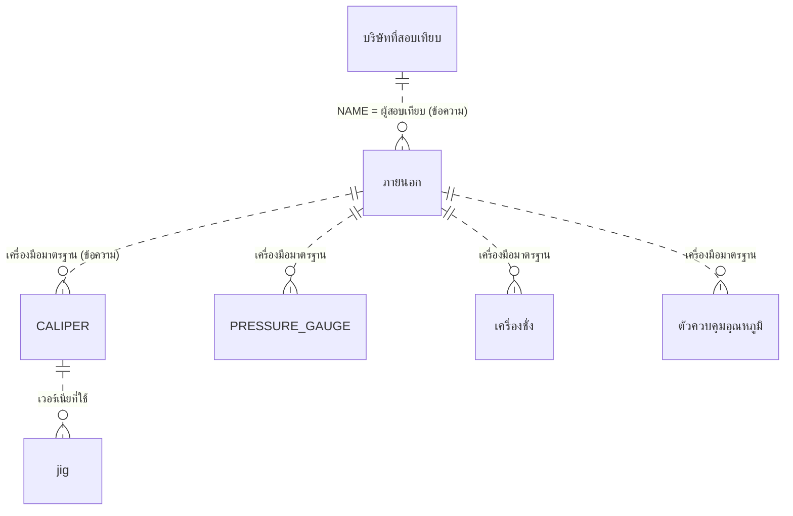

# Data Model — สอบเทียบ

> สถานะ: ถอดครบ — รอยืนยัน (2026-10-05)
> จำนวนแถวจาก `COUNT(*)` บนสำเนาไฟล์ (2026-10-05) · ข้อมูลทุกแถวอยู่ที่ `source/_extract/สอบเทียบ/full/*.csv`
> ทุกฟิลด์ข้อความในระบบเดิม `AllowZeroLength = Yes`, ไม่ Required, ไม่มี Default/Validation — ยกเว้นที่ระบุ · **ไม่มีตารางใดมี primary key** (นอกจาก `Switchboard Items`) และ **ไม่ได้ประกาศความสัมพันธ์ใด ๆ**
> Out: ขั้นตอนเพิ่ม/แก้/ลบ อยู่ใน business-rules.md (BR-001…BR-007)

## สารบัญตาราง
ระบบเดิมมี 9 ตาราง ย้ายไป 7 ตาราง (ทะเบียนเครื่องมือวัด 6 + lookup 1)

| ID | ตาราง | กลุ่ม | หน้าที่ | แถว / ข้อมูลล่าสุด |
|---|---|---|---|---|
| T-ภายนอก | ภายนอก | A. ข้อมูลหลัก | ทะเบียนเครื่องมือวัดที่ส่งสอบเทียบภายนอก (ส่วนใหญ่เป็นเครื่องมือมาตรฐาน) | 20 / ขึ้นบัญชีล่าสุด 2012-10-01 |
| T-CALIPER | CALIPER | A. ข้อมูลหลัก | ทะเบียนเวอร์เนีย ไฮเกจ ไมโครมิเตอร์ (สอบเทียบภายใน) | 13 / หมายเลข `/2567` (พ.ศ. 2567) |
| T-PRESSURE GAUGE | PRESSURE GAUGE | A. ข้อมูลหลัก | ทะเบียนเพรสเชอร์เกจ (สอบเทียบภายใน) | 53 / 2026-08-29 |
| T-เครื่องชั่ง | เครื่องชั่ง | A. ข้อมูลหลัก | ทะเบียนเครื่องชั่ง (สอบเทียบภายใน) | 10 / หมายเลข `/2568` |
| T-ตัวควบคุมอุณหภูมิ | ตัวควบคุมอุณหภูมิ | A. ข้อมูลหลัก | ทะเบียนตัวควบคุมอุณหภูมิ (Temp Control) (สอบเทียบภายใน) | 67 / หมายเลข `/2568` |
| T-jig | jig | A. ข้อมูลหลัก | ทะเบียน JIG วัดศูนย์/กรอก้ามเบรก, PIN GAUGE, TAPER GAUGE (สอบเทียบภายใน) | 59 / หมายเลข `/2568` |
| T-บริษัทที่สอบเทียบ | บริษัทที่สอบเทียบ | C. Lookup | รายชื่อบริษัทที่รับสอบเทียบ | 1 |
| — | วันที่ CAL | D. พารามิเตอร์ 1 แถว | ค่าที่จะพิมพ์บนสติกเกอร์ | ไม่ย้าย — ดู "ตารางที่ไม่ย้าย" |
| — | Switchboard Items | ตารางระบบ | รายการเมนู | ไม่ย้าย |

## T-CALIPER — เวอร์เนีย ไฮเกจ ไมโครมิเตอร์
หน้าที่: ทะเบียนเครื่องมือวัดมิติที่สอบเทียบภายใน หนึ่งแถว = หนึ่งเครื่อง (ชื่อตารางเป็น CALIPER แต่เมนูเรียก "เวอร์เนีย,ไฮเกจ,ไมโครมิเตอร์")
จำนวนแถวปัจจุบัน: 13 (ขึ้นบัญชีตั้งแต่ 2004)
ใช้ที่: SCR-02, SCR-03, SCR-04, RPT-02, RPT-03, RPT-04

| ฟิลด์ | ชนิด | ขนาด | Null | Default | Key | ความหมาย / กฎ |
|---|---|---|---|---|---|---|
| หมายเลขเครื่อง | Text | 255 | ได้ (แต่แถวที่ว่างจะถูกลบ BR-002) | | 🔍 คีย์ธุรกิจ — ไม่มี index/unique | รหัสเครื่อง รูปแบบ BR-020 เช่น `VN-GR001/2547` · ข้อมูลปัจจุบันไม่ซ้ำ |
| ชื่อเครื่องมือวัด | Text | 255 | ได้ | | | ค่าที่พบ: `Vernier Caliper` 4, `Vernier Digital` 7, `Micrometer` 1, `Height Gauge` 1 · กรอกอิสระ (dropdown เสนอค่าที่เคยใช้ BR-005) |
| วันที่ขึ้นบัญชี | Date/Time | | ได้ | | | Format Short Date · ปน พ.ศ./ค.ศ. (ดูปัญหาคุณภาพข้อมูล) |
| ยี่ห้อ/ผู้ผลิต | Text | 255 | ได้ | | | พบ `Mitutoyo` ทุกแถว |
| แผนก | Text | 255 | ได้ | | | แผนกที่ใช้งาน: `GR`, `MT`, `QA`, `DM`, `AS`, `CD` (❓ Q-05) |
| พิกัดใช้งาน | Text | 255 | ได้ | | | ช่วงวัด เช่น `0-150`, `0-300`, `0-25` (หน่วยตาม `หน่วย`) |
| ค่าความละเอียด | Text | 50 | ได้ | | | `0.02`, `0.01` |
| ขีดจำกัดที่ยอมรับได้ | Text | 50 | ได้ | | | `0.1` ทุกแถว |
| หน่วย | Text | 50 | ได้ | | | `mm` ทุกแถว |
| หมายเลขเครื่องมือที่ใช้(ผ่านการสอบเทียบแล้ว) | Text | 255 | ได้ | | 🔍 อ้าง T-ภายนอก (ข้อความ) | เครื่องมือมาตรฐานที่ใช้สอบเทียบ เช่น `GB-QA001/2551 - GB-QA005/2551` (ช่วงหมายเลข gauge block) — BR-021 |
| ผู้สอบเทียบ | Text | 255 | ได้ | | | ชื่อพนักงาน (มี 1 คนทุกแถว) |
| หมายเหตุ | Text | 255 | ได้ | | | ว่างทุกแถว |

Index: ไม่มี

---

## T-PRESSURE GAUGE — เพรสเชอร์เกจ
หน้าที่: ทะเบียนเพรสเชอร์เกจที่สอบเทียบภายใน
จำนวนแถวปัจจุบัน: 53 · ใช้ที่: SCR-02, SCR-03, SCR-04, RPT-02, RPT-03, RPT-04

โครงสร้างเหมือน T-CALIPER ทุกฟิลด์ (ชื่อ ลำดับ ชนิด) ส่วนที่ต่าง:

| ฟิลด์ | ชนิด | ขนาด | Null | Default | Key | ความหมาย / กฎ |
|---|---|---|---|---|---|---|
| พิกัดใช้งาน | Text | 50 | ได้ | | | `100`, `0-350`, `0-400`, `0-250`, `60`, `0-30`, `0-60`, `0-700`, `10` |
| ผู้สอบเทียบ | Text | 50 | ได้ | | | 3 คน (แยกตามแผนก BL/DC/CD) |
| ชื่อเครื่องมือวัด | Text | 255 | ได้ | | | `Pressure Gauge` ทุกแถว |
| แผนก | Text | 255 | ได้ | | | แผนก+เครื่องจักร เช่น `BL`, `BL(B32)`, `DC (D02)`, `DC(48)`, `CD` — การเว้นวรรคไม่สม่ำเสมอ |
| หน่วย | Text | 50 | ได้ | | | `Kg/cm²` ทุกแถว |
| ขีดจำกัดที่ยอมรับได้ | Text | 50 | ได้ | | | `10` ทุกแถว |
| หมายเลขเครื่องมือที่ใช้(ผ่านการสอบเทียบแล้ว) | Text | 255 | ได้ | | | `PG-QA001/2550` (1 แถวเป็น `PG-QA001/2562` ❓ Q-07) |

---

## T-เครื่องชั่ง — เครื่องชั่ง
หน้าที่: ทะเบียนเครื่องชั่งที่สอบเทียบภายใน
จำนวนแถวปัจจุบัน: 10 · ใช้ที่: SCR-02, SCR-03, SCR-04, RPT-02, RPT-03, RPT-04

โครงสร้างเหมือน T-CALIPER ทุกฟิลด์ ส่วนที่ต่าง:

| ฟิลด์ | ชนิด | ขนาด | Null | Default | Key | ความหมาย / กฎ |
|---|---|---|---|---|---|---|
| ผู้สอบเทียบ | Text | 50 | ได้ | | | |
| ชื่อเครื่องมือวัด | Text | 255 | ได้ | | | `เครื่องชั่ง 3 กก.` 8, `เครื่องชั่งดิจิตอล 3000 กรัม`, `เครื่องชั่งดิจิตอล 30 กก.` |
| แผนก | Text | 255 | ได้ | | | เช่น `BL(32,33)` (เครื่องจักร 2 เครื่อง), `QA`, `CD` |
| หน่วย | Text | 50 | ได้ | | | `กรัม` 9, `กก.` 1 |
| หมายเลขเครื่องมือที่ใช้(ผ่านการสอบเทียบแล้ว) | Text | 255 | ได้ | | | ตุ้มน้ำหนักทองเหลือง/เหล็ก เช่น `BW-QA001/2553 - BW-QA004/2553`, `SW-QA001/2555-SW-QA005/2555` |

---

## T-ตัวควบคุมอุณหภูมิ — ตัวควบคุมอุณหภูมิ (Temp Control)
หน้าที่: ทะเบียนตัวควบคุมอุณหภูมิของเครื่องจักรที่สอบเทียบภายใน
จำนวนแถวปัจจุบัน: 67 · ใช้ที่: SCR-02, SCR-03, SCR-04, RPT-02, RPT-03, RPT-04

โครงสร้างเหมือน T-CALIPER ทุกฟิลด์ ส่วนที่ต่าง:

| ฟิลด์ | ชนิด | ขนาด | Null | Default | Key | ความหมาย / กฎ |
|---|---|---|---|---|---|---|
| หน่วย | Text | 255 | ได้ | | | `°C` 66 แถว, ว่าง 1 แถว (`TC-BL058/2562`) |
| ชื่อเครื่องมือวัด | Text | 255 | ได้ | | | `Temp Control` ทุกแถว |
| ยี่ห้อ/ผู้ผลิต | Text | 255 | ได้ | | | ว่างทุกแถว |
| พิกัดใช้งาน | Text | 255 | ได้ | | | `190-210`, `160-170`, `650-700` |
| ค่าความละเอียด | Text | 50 | ได้ | | | `1`, `5` |
| ขีดจำกัดที่ยอมรับได้ | Text | 50 | ได้ | | | `10` ทุกแถว |
| หมายเลขเครื่องมือที่ใช้(ผ่านการสอบเทียบแล้ว) | Text | 255 | ได้ | | | `TC-QA001/2555` / `TC-QA001/2547` (แผนก DC) / `TC-QA001/255` (1 แถว พิมพ์ไม่ครบ) |

---

## T-jig — JIG
หน้าที่: ทะเบียน JIG วัดศูนย์/กรอก้ามเบรกแยกรุ่นรถ รวม PIN GAUGE และ TAPER GAUGE
จำนวนแถวปัจจุบัน: 59 (QA 24, ประกอบ 35) · ใช้ที่: SCR-02, SCR-03, SCR-04, RPT-02, RPT-04 (แบบฟอร์มตรวจสอบ RPT-05/06 ไม่อ่านตารางนี้)

**โครงสร้างต่างจาก T-CALIPER** (10 ฟิลด์ ลำดับตามต้นฉบับ):

| ฟิลด์ | ชนิด | ขนาด | Null | Default | Key | ความหมาย / กฎ |
|---|---|---|---|---|---|---|
| หมายเลขเครื่อง | Text | 255 | ได้ (ถูกลบถ้าว่าง BR-002) | | 🔍 คีย์ธุรกิจ — ไม่มี index | `JG-QA001/2550`, `JG-AS001-2/2560` (เลขชุด-ลำดับที่ของ JIG รุ่นเดียวกัน 🔍) |
| ชื่อ JIG | Text | 255 | ได้ | | | รุ่นรถ/รุ่นก้ามเบรกที่ใช้ เช่น `RX100, MATE'U, BELLE,087, 200`, `CLICK`, `PIN GAUGE` — ใกล้เคียงชื่อแบบฟอร์ม RPT-05/06 แต่สะกดไม่ตรงทุกตัวอักษร (ไม่มีการผูกกัน) |
| แกน (mm) | Text | 255 | ได้ | | | ขนาดแกน เช่น `7, 6`, `12, 6.5`, `11.5` (❓ Q-06) |
| วันที่ขึ้นบัญชี | Date/Time | | ได้ | | | **ไม่มี Format** (ตารางอื่นเป็น Short Date) |
| คู่มือวิธีการที่ใช้เลขที่ | Text | 50 | ได้ | | | `WI-QA049` ทุกแถว |
| ผู้สอบเทียบ | Text | 50 | ได้ | | | 2 คน (QA / ประกอบ) |
| ขีดจำกัดที่ยอมรับได้ | Text | 50 | ได้ | | | `0.20 mm.` ทุกแถว (มีหน่วยในค่า ต่างจากตารางอื่น) |
| หมายเลขเวอร์เนียที่ใช้(ผ่านการสอบเทียบแล้ว) | Text | 50 | ได้ | | 🔍 อ้าง T-CALIPER (ข้อความ) | `VN-QA014/2566` ทุกแถว |
| หมายเหตุ | Text | 255 | ได้ | | | ว่างทุกแถว |
| แผนก | Text | 255 | ได้ | | | `QA`, `ประกอบ` |

ไม่มีฟิลด์ ยี่ห้อ/ผู้ผลิต, พิกัดใช้งาน, ค่าความละเอียด, หน่วย

---

## T-ภายนอก — เครื่องมือวัดสอบเทียบภายนอก
หน้าที่: ทะเบียนเครื่องมือที่ส่งบริษัทภายนอกสอบเทียบ — ส่วนใหญ่เป็นเครื่องมือมาตรฐานที่ใช้สอบเทียบภายใน (BR-021)
จำนวนแถวปัจจุบัน: 20 · ใช้ที่: SCR-02, SCR-03, RPT-02, RPT-03

**โครงสร้างต่างจาก T-CALIPER** (11 ฟิลด์ ลำดับตามต้นฉบับ — `ชื่อเครื่องมือวัด` มาก่อน `หมายเลขเครื่อง`):

| ฟิลด์ | ชนิด | ขนาด | Null | Default | Key | ความหมาย / กฎ |
|---|---|---|---|---|---|---|
| ชื่อเครื่องมือวัด | Text | 255 | ได้ | | | เช่น `GAUGE BLOCK (5 mm)`, `BRASS WEIGHT 100 g`, `STEEL WEIGHT 5 KGS`, `PRESSURE GAUGE`, `TEMPERATURE CONTROLLER`, `เครื่องทดสอบแรงเสียดทาน` |
| หมายเลขเครื่อง | Text | 255 | ได้ | | Index `CODE` (ไม่ unique) | `GB-QA001/2551`, `Q01-1` (3 แถวไม่มีปีต่อท้าย) |
| วันที่ขึ้นบัญชี | Date/Time | | ได้ | | | Short Date |
| ยี่ห้อ/ผู้ผลิต | Text | 255 | ได้ | | | |
| แผนกที่ใช้งาน | Text | 255 | ได้ | `"QA"` (ค่าเริ่มต้นของ control บนฟอร์ม ไม่ใช่ของตาราง) | | `QA` 19, `ST` 1 · ชื่อฟิลด์ต่างจากตารางอื่น (`แผนก`) |
| พิกัดใช้งาน | Text | 255 | ได้ | | | บางแถวมีช่องว่างนำหน้า (` 5`) |
| ค่าความละเอียด | Text | 255 | ได้ | | | ว่างเกือบทุกแถว |
| หน่วย | Text | 50 | ได้ | | | `MM`, `G`, `KGS`, `Kg/cm²`, `°C`, `RPM.` |
| ขีดจำกัดที่ยอมรับได้ | Text | 255 | ได้ | | | `0.05`, `0.1`, `10`, `15`, `0.6`, `10.0` |
| ผู้สอบเทียบ | Text | 255 | ได้ | | 🔍 → T-บริษัทที่สอบเทียบ.NAME (ข้อความ) | ชื่อบริษัท: `Quality Calibration Co.,Ltd.` 19, `บ.ไทยเครื่องชั่ง จก.` 1 (ไม่อยู่ใน T-บริษัทที่สอบเทียบ) |
| หมายเหตุ | Text | 255 | ได้ | | | `สอบเทียบที่โรงงาน` 3 แถว (เครื่องทดสอบแรงเสียดทาน) |

Index: `CODE` (หมายเลขเครื่อง) ไม่ unique

---

## T-บริษัทที่สอบเทียบ — บริษัทที่สอบเทียบ
หน้าที่: lookup รายชื่อบริษัทสอบเทียบภายนอก เป็นตัวเลือกของ `ผู้สอบเทียบ` ในหน้าจอเพิ่มเครื่องมือภายนอก (BR-007)
จำนวนแถวปัจจุบัน: 1

| ฟิลด์ | ชนิด | ขนาด | Null | Default | Key | ความหมาย / กฎ |
|---|---|---|---|---|---|---|
| NAME | Text | 255 | ได้ | | 🔍 คีย์ธุรกิจ — ไม่มี index | ชื่อบริษัท |

ค่าทั้งหมด: `Quality Calibration Co.,Ltd.`

---

## ความสัมพันธ์
ระบบเดิมไม่ได้ประกาศความสัมพันธ์ใดเลย (`relationships.md` ว่าง) — ทุกการอ้างอิงเป็นข้อความอิสระ ไม่ตรวจสอบ ไม่ cascade

| แม่ (1) | ลูก (N) | ฟิลด์ | บังคับ | Cascade | ที่มา |
|---|---|---|---|---|---|
| T-บริษัทที่สอบเทียบ | T-ภายนอก | NAME → ผู้สอบเทียบ | ไม่ (dropdown เสนอค่า) | ไม่ | 🔍 RowSource ของช่องผู้สอบเทียบในฟอร์ม `ภายนอก` |
| T-ภายนอก | T-CALIPER, T-PRESSURE GAUGE, T-เครื่องชั่ง, T-ตัวควบคุมอุณหภูมิ | หมายเลขเครื่อง → หมายเลขเครื่องมือที่ใช้(ผ่านการสอบเทียบแล้ว) | ไม่ — ข้อความ อาจเป็นช่วงหรือหลายค่า | ไม่ | 🔍 ข้อมูล (BR-021) |
| T-CALIPER | T-jig | หมายเลขเครื่อง → หมายเลขเวอร์เนียที่ใช้(ผ่านการสอบเทียบแล้ว) | ไม่ | ไม่ | 🔍 ข้อมูล (`VN-QA014/2566` อยู่ใน T-CALIPER) |
| ทุกตารางทะเบียน | ตาราง `วันที่ CAL` | หมายเลขเครื่อง `Like` ID | ไม่ | ไม่ | query `วันที่ CAL …` (BR-010) |

## ข้อมูลอ้างอิง (lookup / master)
- T-บริษัทที่สอบเทียบ: `Quality Calibration Co.,Ltd.` (1 แถว)
- ช่องอื่นที่เป็น dropdown (ชื่อเครื่องมือวัด, แผนก, ยี่ห้อ, หน่วย, ผู้สอบเทียบ, คู่มือ, ขีดจำกัด …) ไม่มีตาราง lookup — เสนอค่า DISTINCT ที่มีอยู่แล้วในตารางเดียวกัน (BR-005) ค่าที่พบอยู่ในหัวข้อของแต่ละตารางด้านบน
- คำนำหน้าหมายเลขเครื่องที่พบ: ดู BR-020

## ปัญหาคุณภาพข้อมูลที่พบ
| ปัญหา | ตาราง / แถว | ผลกระทบต่อการย้ายข้อมูล |
|---|---|---|
| **วันที่ขึ้นบัญชีปน พ.ศ./ค.ศ.** — ปีเป็น 1961/1962/1966/1968 (พิมพ์ปี พ.ศ. 2 หลัก เช่น `62` → Access ตีเป็น 1962) หรือ 2566/2568 (พิมพ์ พ.ศ. 4 หลักลงช่อง ค.ศ.) หรือ 4722 (พิมพ์ผิด) | PRESSURE GAUGE 16 แถว, ตัวควบคุมอุณหภูมิ 27, jig 2, เครื่องชั่ง 1, CALIPER 1 | ต้องแปลง: 19xx → 25xx−543 (เช่น 1962-08-17 → 2019-08-17), 25xx → −543, 4722 → ❓ — 🔍 ปีจริงตรวจได้จากปีท้ายหมายเลขเครื่อง (BR-020) ❓ Q-08 |
| ปีท้ายหมายเลขเครื่องไม่ตรงปีที่ขึ้นบัญชี (นอกเหนือข้อบน) | jig QA 2550 vs 2004-04-28 (24 แถว), HG-DM002/2547 vs 2016, PG-QA001/2550 vs 2004 | 🔍 วันที่ขึ้นบัญชีอาจเป็นวันที่ได้เครื่องมาก่อนออกหมายเลข — ไม่แก้ |
| ไม่มี PK/unique — หมายเลขเครื่องซ้ำได้ | ทุกตาราง (ปัจจุบันไม่พบซ้ำ) | ระบบใหม่ต้องตัดสินใจ unique ❓ Q-22 |
| หมายเลขเครื่องไม่มีปี | ภายนอก `Q01-1`, `Q01-2`, `Q01-3` | ยอมรับได้ |
| การเขียนแผนกไม่สม่ำเสมอ | PRESSURE GAUGE `DC(44)` / `DC(D44)`, `DC (D02)` / `DC(48)` | normalize ถ้าต้องจัดกลุ่มตามแผนก ❓ Q-05 |
| หน่วยว่าง | ตัวควบคุมอุณหภูมิ `TC-BL058/2562` | เติม `°C` |
| หมายเลขเครื่องมือมาตรฐานผิดรูป | ตัวควบคุมอุณหภูมิ `TC-QA001/255`; CALIPER `GB-QA001/2551GB-QA005/2551` (ไม่มีขีดคั่น) | ข้อความอิสระ — แก้ตอนย้าย ❓ Q-07 |
| ผู้สอบเทียบภายนอกที่ไม่อยู่ใน lookup | ภายนอก `บ.ไทยเครื่องชั่ง จก.` | เพิ่มเข้า lookup ตอนย้าย |
| ชื่อซ้ำความหมายต่างการสะกด | ภายนอก `STEEL WEIGHT 2  KGS` / `STEEL WEIGHT 2 KGS`, `BRASS WEIGHT 200* g` | ไม่กระทบ (เป็นคนละเครื่อง) |

## ฟิลด์/ตารางที่เลิกใช้
| ฟิลด์ | หลักฐาน | ข้อเสนอ |
|---|---|---|
| `หมายเหตุ` ใน CALIPER, PRESSURE GAUGE, เครื่องชั่ง, ตัวควบคุมอุณหภูมิ, jig | ว่างทุกแถว (แต่มีบนหน้าจอ) | ย้ายไปด้วย (ฟิลด์ใช้ได้ แค่ไม่มีใครกรอก) |
| `ยี่ห้อ/ผู้ผลิต` ใน ตัวควบคุมอุณหภูมิ | ว่างทุกแถว | ย้ายไปด้วย |

## ตารางที่ไม่ย้าย
| กลุ่ม / เหตุผล | ตาราง | หลักฐาน |
|---|---|---|
| D. พารามิเตอร์ 1 แถว | วันที่ CAL (ฟิลด์ `ID` Text 100 index ไม่ unique, `CAL` Date Short Date, `DUE` Date Short Date) | 1 แถว: `ID = PG-DC125/2569`, `CAL = 2026-08-17`, `DUE = 2027-08-17` — ฟอร์มพิมพ์สติกเกอร์ 5 หน้าจอเขียนทับแถวเดียวนี้ แล้ว query `วันที่ CAL …` อ่าน (BR-010) · ค่าเป็นแค่ "ค่าที่พิมพ์ครั้งล่าสุด" ไม่ใช่ประวัติ — ระบบใหม่เป็นพารามิเตอร์ของการพิมพ์ (❓ Q-20 ถ้าต้องการเก็บประวัติ) |
| ตารางระบบ (เมนู) | Switchboard Items | 54 แถว = รายการเมนูของฟอร์ม Switchboard มาตรฐาน — ถอดเป็นแผนผังเมนูใน screens.md แล้ว |
| E. ตารางพักผล | — | ไม่มี |
| F. สำเนา/เลิกใช้ | — | ไม่มี |
