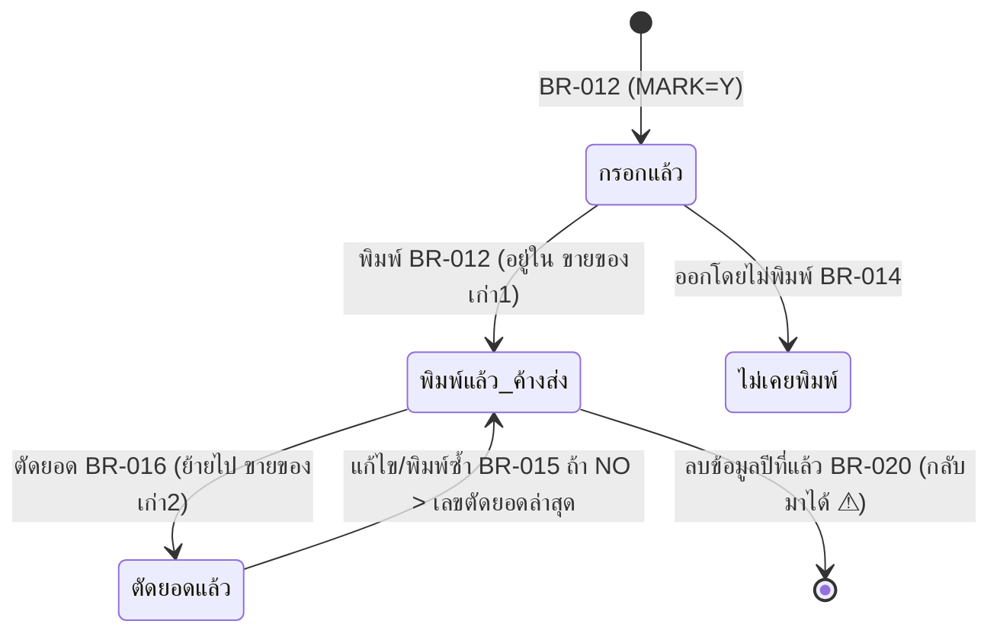

# Business Rules — เงินสดย่อย

> สถานะ: ร่าง (2026-10-05) — ผู้ใช้ตัดสินใจ: ระบบใหม่**คงพฤติกรรมเดิม**ไว้ก่อน จุด ⚠ คือรายการปรับปรุงภายหลัง (open-questions หมวด ข.)
> ที่มา: `source/_extract/เงินสดย่อย/` — macro `macros/`, query `queries/` (หรือ `_digest_all.txt`), VBA `vbasrc/`, การผูกปุ่ม `formtxt/`
> macro ทุกตัวรัน action query ด้วย `OpenQuery` โดย**ไม่ปิด SetWarnings** — 🔍 Access ถามยืนยันทุกครั้ง เว้นแต่เครื่องปิดตัวเลือก Confirm action queries (❓ Q-04) · ไม่มี login · ไม่มีการตรวจช่องบังคับ — ใช้ "ลบแถวที่ช่องสำคัญว่าง" แทน

หมวด: เงินสดย่อย (BR-001…008) · ขายของเก่า (BR-010…018) · งานประจำปี (BR-020…021)

## การปัดเศษที่ใช้ในโปรแกรม
| ID | ฟังก์ชันเดิม | พฤติกรรม + ตัวอย่าง | ใช้ที่ |
|---|---|---|---|
| RND-A | `CutDecimal(x) = ((x*100) \ 1) / 100` (module `ThaiNumber`) | ชื่อว่า "ตัดทศนิยม" แต่ตัวดำเนินการ `\` ของ VBA ปัด operand เป็นจำนวนเต็มแบบ **banker's rounding** ก่อนหาร → ปัด 2 ตำแหน่งแบบ banker's: 100.125 → 100.12, 100.135 → 100.14, 2270 → 2270, 99.999 → 100 | BR-012 ยอดรวมใบเสร็จ |
| RND-B | `AMOUNT = QTY * U_PRICE` (AfterUpdate ของราคา) | ไม่ปัด — เก็บผลคูณเต็ม (ซื้อของเงินสด: Double; ขายของเก่า: Single ความแม่น ~7 หลัก) · คำนวณ**เฉพาะเมื่อแก้ราคา** แก้จำนวนทีหลังไม่คำนวณใหม่ | BR-002, BR-012 |
| RND-C | `GetThaiUnit(x)` (จำนวนเงินตัวอักษร) | ใช้ทศนิยม 2 หลักแรก **ตัดทิ้ง ไม่ปัด**: 1234.567 → "หนึ่งพันสองร้อยสามสิบสี่บาทห้าสิบหกสตางค์" · 0 หรือไม่มีสตางค์ → "…บาทถ้วน" · 0.50 → " ห้าสิบสตางค์" (ไม่มีคำว่า "ศูนย์บาท") · 101 → "หนึ่งร้อยหนึ่งบาทถ้วน" · 21 → "ยี่สิบเอ็ดบาทถ้วน" · ติดลบนำหน้า "ลบ" · ผลมีช่องว่างนำหน้า แล้วรายงาน Trim และครอบด้วย `( )` | RPT-01, RPT-02, RPT-03, RPT-06 |
| — | การแสดงผลในรายงาน | ตัวเลขรูปแบบ Standard (คั่นหลักพัน ทศนิยม 2 ตำแหน่ง) — ปัดเพื่อแสดงเท่านั้น | ทุกรายงาน |

---

## BR-001 — ประเภทค่าใช้จ่าย (เพิ่ม/แก้/ลบ/พิมพ์)
สถานะ: ✅ ยืนยันจากโค้ด
ที่มา: เมนู "เพิ่ม,แก้ไข,ลบและพิมพ์รายการค่าใช้จ่าย" → ฟอร์ม `ค่าใช้จ่ายต่างๆ` (ปุ่ม VBA `คำสั่ง3…7`), `ฟอร์ม1`, `ตาราง1` · query `แบบสอบถาม5/6/7`

**กฎ:**
- **เพิ่ม:** หน้าจอผูกตาราง แสดงทีละแถว ช่อง "ชื่อค่าใช้จ่าย" (CASH_NAME) · "รายการต่อไป" = ไปแถวถัดไป/แถวใหม่ (`GoToRecord acNext`) · ไม่ตรวจซ้ำ
- **แก้ไข** (`ฟอร์ม1`): dropdown "เลือกรายการที่ต้องการแก้ไข" **ผูกกับ CASH_NAME ของแถวปัจจุบัน** — 🔍 การเลือกค่าในรายการจะเขียนทับชื่อของแถวแรก/แถวปัจจุบันด้วยค่าที่เลือก (ไม่ใช่การค้นหา) ⚠ ❓ Q-07
- **ลบ** (`ตาราง1`): เลือกชื่อ → "ลบรายการนี้" ผูก macro `แมโคร4` ซึ่ง**ไม่มีอยู่ในไฟล์** → ⚠ ลบไม่ได้ (Access แจ้งหา macro ไม่พบ) · query ที่ตั้งใจใช้: `แบบสอบถาม5` (MARK = "DEL" ที่ CASH_NAME = ชื่อที่เลือก) → `แบบสอบถาม6` (ลบแถว MARK = "DEL") → `แบบสอบถาม7` (ล้าง ตาราง1) ไม่เคยถูกเรียก ❓ Q-18
- **พิมพ์:** RPT-05
**ผลลัพธ์:** การแก้ชื่อประเภทไม่เปลี่ยน TYPE ที่บันทึกไว้แล้วใน T-ซื้อของเงินสด (ไม่มีความสัมพันธ์)
**เหตุผล:** 🔍 จัดหมวดค่าใช้จ่ายให้ตรงหมวดบัญชีที่ใช้สรุปเบิก

| # | Input | Expected |
|---|---|---|
| 1 | เพิ่ม `ค่าทางด่วน` → รายการต่อไป | T-ค่าใช้จ่ายต่างๆ +1 แถว; ปรากฏใน dropdown TYPE |
| 2 | หน้าจอลบ เลือก `ค่ารับรอง` → ลบรายการนี้ | ระบบเดิม: error หา macro `แมโคร4` ไม่พบ ไม่มีอะไรถูกลบ |

---

## BR-002 — บันทึกค่าใช้จ่ายเงินสดย่อย
สถานะ: ✅ ยืนยันจากโค้ด
ที่มา: ฟอร์ม `ซื้อของเงินสด` (หลัก ผูก T-ซื้อของเงินสด, ช่อง DATE) + subform `ซื้อของเงินสด1` (link DATE ↔ DATE) · VBA `ซื้อของเงินสด1`: `NAME_AfterUpdate`, `U_PRICE_AfterUpdate`

**กฎ:**
1. ผู้ใช้กรอก **วันที่** ที่ฟอร์มหลัก → subform แสดงทุกบรรทัดของวันที่นั้น (รวมที่บันทึกไว้ก่อน) และบรรทัดใหม่ได้วันที่นี้อัตโนมัติ
2. แต่ละบรรทัด: `เลขที่` (SUF, พิมพ์เอง รูปแบบ `MM/NN`), `รายการ` (NAME — dropdown 2 คอลัมน์ ชื่อ+หน่วย จาก query `Query1` = DISTINCT NAME, UNIT ของ**ตาราง `สำเนาของ ซื้อของเงินสด`** เรียงตามชื่อ; พิมพ์ชื่อใหม่ได้), `จำนวน`, `หน่วย`, `ราคา`, `จำนวนเงิน`, `ประเภท` (TYPE — dropdown จาก T-ค่าใช้จ่ายต่างๆ เรียงตามชื่อ)
3. เลือกรายการ → `UNIT` = คอลัมน์หน่วยของรายการนั้น
4. แก้ `ราคา` → `จำนวนเงิน = ราคา × จำนวน` (RND-B); แก้ `จำนวน` ภายหลังไม่คำนวณใหม่; กรอก `จำนวนเงิน` เองได้ (เช่น น้ำมัน: จำนวน 25.01 ลิตร ราคา 0 จำนวนเงิน 1,000)
5. "กลับเมนูเดิม" → BR-003
6. dropdown รายการและประเภท 🔍 ไม่จำกัดเฉพาะค่าในรายการ (ข้อมูลมี TYPE ที่ไม่อยู่ใน T-ค่าใช้จ่ายต่างๆ)
**เหตุผล:** 🔍 บันทึกตามใบเสร็จร้านค้าที่จ่ายเงินสด แยกประเภทเพื่อเบิกชดเชยและลงบัญชี
**ผลลัพธ์:** แถวใน T-ซื้อของเงินสด

| # | Input | Expected |
|---|---|---|
| 1 | วันที่ 11/09/2026, เลขที่ `09/36`, รายการ `หัวสปริงเกอร์ดับเพลิง`, จำนวน 2, ราคา 40, ประเภท `ค่าใช้จ่ายแผนกซ่อมบำรุง` | AMOUNT = 80 |
| 2 | จำนวน 25.01, ราคา 0, จำนวนเงิน พิมพ์ 1000 | AMOUNT = 1000 |
| 3 | ราคา 40, จำนวน 2 → AMOUNT 80 → แก้จำนวนเป็น 3 | AMOUNT ยังเป็น 80 ⚠ (RND-B) |
| 4 | รายการใหม่ที่ไม่อยู่ใน dropdown | บันทึกได้ แต่ไม่ปรากฏใน dropdown ครั้งต่อไป (dropdown อ่านจากสำเนาปี 2016–17) ⚠ ❓ Q-17 |

⚠ ข้อสังเกต: เลขที่ใบสำคัญจ่ายไม่ออกอัตโนมัติและไม่ตรวจซ้ำ ❓ Q-03

---

## BR-003 — ล้างบรรทัดที่ไม่สมบูรณ์เมื่อออกจากหน้าจอบันทึก
สถานะ: ✅ ยืนยันจากโค้ด
ที่มา: ปุ่ม "กลับเมนูเดิม" ของฟอร์ม `ซื้อของเงินสด` → macro `แมโคร1`: Close → `ปรับปรุงข้อมูล` (ลบ DATE Is Null) → `ปรับปรุงข้อมูล1` (SUF Is Null) → `ปรับปรุงข้อมูล2` (NAME Is Null) → `ปรับปรุงข้อมูล3` (TYPE Is Null)

**กฎ:** ลบ**ทุกแถวในตาราง** (ไม่ใช่เฉพาะวันนี้) ที่ไม่มีวันที่ หรือไม่มีเลขที่ หรือไม่มีรายการ หรือไม่มีประเภท
**เหตุผล:** ฟอร์มหลักผูกตารางเดียวกัน การกรอกวันที่ที่ฟอร์มหลักสร้างแถวที่มีแต่วันที่ — macro นี้ลบทิ้ง; และเป็นการบังคับ 4 ช่องแบบหลังบ้าน
**ผลลัพธ์:** ไม่มีข้อความ (นอกจากยืนยันของ Access)

| # | Input | Expected |
|---|---|---|
| 1 | บรรทัดที่ลืมเลือกประเภท | ถูกลบเมื่อกดกลับเมนูเดิม (ข้อมูลหายโดยไม่เตือน) |
| 2 | ปิดหน้าต่างด้วยปุ่ม X แทน | ไม่ลบ — แถวไม่สมบูรณ์ค้างจนกว่าจะออกด้วยปุ่มครั้งถัดไป |

---

## BR-004 — แก้ไขและลบค่าใช้จ่ายเงินสดย่อย
สถานะ: ✅ ยืนยันจากโค้ด
ที่มา: ฟอร์ม `ซื้อของเงินสด3` (ช่อง DATE ไม่ผูก "ระบุวันที่ที่ต้องการแก้ไข") + subform `ซื้อของเงินสด2` (link date ↔ DATE) · ปุ่ม "กลับเมนูเดิม" → macro `ลบเงินสดย่อย`: `ลบเงินสดย่อย1` (NAME Is Null) → `ลบเงินสดย่อย2` (QTY = 0) → Close → `ลบเงินสดย่อย3` (MARK "Y" → Null)

**กฎ:**
1. กรอกวันที่ → แสดงทุกบรรทัดของวันนั้น แก้ได้ทุกช่อง (กฎคำนวณเหมือน BR-002) มีช่อง `พิมพ์` (MARK) และยอดรวมท้ายตาราง `=Sum(amount)` "รวม"
2. **ลบบรรทัด** = ทำให้ `จำนวน = 0` หรือลบ `รายการ` จนว่าง แล้วกด "กลับเมนูเดิม" — 🔍 ❓ Q-10 (ลบแถวด้วยปุ่ม Delete ของ Access ก็ได้)
3. ออกด้วย "กลับเมนูเดิม": ลบทุกแถวในตารางที่ NAME ว่างหรือ QTY = 0 แล้วล้างเครื่องหมาย `Y` ทุกแถว
**ผลลัพธ์:** ไม่มีประวัติการแก้ไข/ลบ
**เหตุผล:** 🔍 แก้บรรทัดที่บันทึกผิดก่อนพิมพ์ใบสำคัญจ่าย/สรุปเบิก

| # | Input | Expected |
|---|---|---|
| 1 | แก้จำนวนเงินบรรทัด `09/35` เป็น 95 | บันทึกทันที |
| 2 | ตั้งจำนวน = 0 ที่บรรทัดหนึ่ง → กลับเมนูเดิม | บรรทัดนั้นถูกลบ |
| 3 | บรรทัดน้ำมันที่ QTY เป็น 0 จริง (เช่น กรอกแต่จำนวนเงิน) | ถูกลบด้วย ⚠ |

⚠ VBA `DATE_AfterUpdate`, `Command9_Click`, `Command10_Click` ในฟอร์มนี้เป็นโค้ดค้าง (control ไม่ได้ผูก)

---

## BR-005 — พิมพ์ใบสำคัญจ่ายเงิน
สถานะ: ✅ ยืนยันจากโค้ด
ที่มา: ฟอร์ม `ซื้อของเงินสด3` ปุ่ม "พิมพ์ 1 รายการ" … "พิมพ์ 7 รายการ" → macro `พิมพ์ใบสำคัญจ่ายเงิน1…7` (เปิด/ปิด query `พิมพ์ใบสำคัญจ่ายเงิน` → รายงาน `พิมพ์ใบสำคัญจ่าย1…7` Print Preview) · RPT-01

**กฎ:**
1. ในหน้าจอแก้ไข (BR-004) ผู้ใช้พิมพ์ `Y` ในช่อง "พิมพ์" ของบรรทัดที่จะออกใบสำคัญจ่าย
2. กดปุ่มตามจำนวนบรรทัดที่เลือก (1–7) — 🔍 แต่ละปุ่มใช้รายงานที่จัดตำแหน่งยอดรวม/ลายเซ็นให้พอดีกับจำนวนบรรทัด (ต่างกันที่ความสูงส่วนท้าย) ❓ Q-11
3. รายงานพิมพ์**ทุกแถวในตาราง**ที่ MARK = `Y` (ทุกวันที่) เป็นใบเดียว: เลขที่และวันที่บนหัวใบมาจากบรรทัดแรก, รายการ/จำนวน/หน่วย/ราคา/จำนวนเงิน, เลขลำดับ, รวมเงิน `Sum(amount)` และตัวอักษร (RND-C)
4. เครื่องหมาย `Y` ถูกล้างเมื่อออกจากหน้าจอ (BR-004) — ระหว่างยังอยู่ในหน้าจอ พิมพ์ซ้ำได้
**ผลลัพธ์:** เอกสารพิมพ์เท่านั้น ไม่บันทึกว่าพิมพ์แล้ว
**เหตุผล:** 🔍 เอกสารประกอบการจ่ายเงินสด ให้ผู้อนุมัติ ผู้จ่ายเงิน สมุห์บัญชี และผู้รับเงินลงนาม

| # | Input | Expected |
|---|---|---|
| 1 | Y ที่ 3 บรรทัดของเลขที่ `09/30` (30+50+60) → "พิมพ์ 3 รายการ" | ใบสำคัญจ่าย เลขที่ 09/30 รวมเงิน 140.00 "(หนึ่งร้อยสี่สิบบาทถ้วน)" |
| 2 | Y ที่บรรทัดของเลขที่ต่างกัน 2 เลข | ออกเป็นใบเดียว หัวใบใช้เลขที่ของบรรทัดแรก ⚠ |
| 3 | ไม่ได้ใส่ Y | รายงานว่าง |

---

## BR-006 — สรุปค่าใช้จ่ายเงินสดย่อย (เพื่อเบิกชดเชย)
สถานะ: ✅ ยืนยันจากโค้ด
ที่มา: เมนู "พิมพ์สรุปค่าใช้จ่ายเงินสดย่อย" → ฟอร์ม `วันที่` → macro `แมโคร2` → query `แบบสอบถาม1` (บรรทัด DATE ระหว่าง FROM_DATE…TO_DATE รวมปลาย) → `แบบสอบถาม2` (รวม AMOUNT ตาม TYPE) → RPT-02

**กฎ:**
1. ผู้ใช้กรอก ตั้งแต่วันที่, ถึงวันที่, ค่าใช้จ่ายงวดที่แล้ว (LAST_PAY) — ค่าถูกจำไว้ใน ตาราง `วันที่` (แถวเดียว)
2. รวมค่าใช้จ่ายงวดนี้ = Σ AMOUNT ของบรรทัดในช่วง จัดกลุ่มตาม TYPE (TYPE ที่สะกดต่างกันแยกกลุ่ม)
3. รวมค่าใช้จ่ายทั้งสิ้น = รวมงวดนี้ + LAST_PAY; ตัวอักษร (RND-C)
**สูตร:** `รวมทั้งสิ้น = Σ(AMOUNT, FROM_DATE ≤ DATE ≤ TO_DATE) + LAST_PAY` ไม่มีการปัด (แสดง 2 ตำแหน่ง)
**เหตุผล:** 🔍 ยอดที่ขอเบิกชดเชยเงินสดย่อยจากสำนักงาน
**ผลลัพธ์:** รายงาน RPT-02 · ตาราง `วันที่` ถูกเขียนทับด้วยค่าที่กรอก

| # | Input | Expected |
|---|---|---|
| 1 | 01/09/2026–03/09/2026, LAST_PAY 21,456 | 9 ประเภท รวมงวดนี้ 28,710.00; รวมทั้งสิ้น 50,166.00 "(ห้าหมื่นหนึ่งร้อยหกสิบหกบาทถ้วน)" |
| 2 | ช่วงที่ไม่มีบรรทัด | รายงานว่าง (ไม่มีแถวให้แสดง LAST_PAY) ⚠ |

❓ Q-08 ความหมายของ "ค่าใช้จ่ายงวดที่แล้ว"

---

## BR-007 — สรุปรายการเงินสดย่อยประจำเดือน
สถานะ: ✅ ยืนยันจากโค้ด · 🔍 ไม่ได้ใช้ตั้งแต่ 2008 (ค่าพารามิเตอร์ล่าสุด) ❓ Q-09
ที่มา: เมนู "พิมพ์รายการซื้อของ" → "พิมพ์สรุปประจำเดือน" → ฟอร์ม `วันที่1` (VBA `TO_DATE_AfterUpdate`: MONTH = TO_DATE) → macro `สรุปประจำเดือน` → query `แบบสอบถาม3` → `4` (รวมตาม TYPE) → `8` (รวมทั้งหมด) → `9` → RPT-03

**กฎ:** ผู้ใช้กรอก ช่วงวันที่, ยอดคงเหลือยกมา ณ วันที่ (LAST_DATE) + จำนวนเงิน (LAST_PAY), เบิกเงินสดย่อยครั้งที่ 1 (วันที่ DATES, จำนวน RECEIVE), ครั้งที่ 2 (DATE1, RECEIVE1), ยอดคงเหลือ ณ วันที่ (DAY); เดือน = เดือนของ "ถึงวันที่" อัตโนมัติ
**สูตร:**
- รวมรายรับ = LAST_PAY + RECEIVE + RECEIVE1
- รวมรายจ่าย = Σ AMOUNT ในช่วง (แยกแสดงตาม TYPE)
- ยอดคงเหลือ = LAST_PAY + RECEIVE + RECEIVE1 − รวมรายจ่าย; ตัวอักษร (RND-C)
**ผลลัพธ์:** รายงาน RPT-03 · ตาราง `วันที่1` ถูกเขียนทับ
**เหตุผล:** 🔍 กระทบยอดเงินสดย่อยคงเหลือรายเดือน

| # | Input | Expected |
|---|---|---|
| 1 | ยกมา 35,491 + เบิก 34,614 + 31,407, รายจ่าย 60,000 | รวมรายรับ 101,512; คงเหลือ 41,512 |
| 2 | ไม่มีการเบิกครั้งที่ 2 (RECEIVE1 = 0) | คงเหลือ = ยกมา + เบิกครั้งที่ 1 − รายจ่าย |

⚠ RECEIVE/RECEIVE1 เป็น Long (จำนวนเต็ม) — เบิกเป็นเศษสตางค์ไม่ได้

---

## BR-008 — รายการซื้อของเงินสดย่อยตามช่วงวันที่
สถานะ: ✅ ยืนยันจากโค้ด
ที่มา: ฟอร์ม `วันที่ซื้อของ` → macro `รายการซื้อของ` → query `รายการซื้อของ` → RPT-04
**กฎ:** แสดงทุกบรรทัดที่ FROM_DATE ≤ DATE ≤ TO_DATE เรียงตามวันที่ แล้วเลขที่ พร้อมรวมทั้งหมด
**ผลลัพธ์:** รายงาน RPT-04 · ตาราง `วันที่` ถูกเขียนทับ
**เหตุผล:** 🔍 ตรวจรายการจ่ายรายบรรทัดตามช่วงเวลา

| # | Input | Expected |
|---|---|---|
| 1 | 09/09/2026–11/09/2026 | บรรทัดเลขที่ 09/26…09/36 เรียงวันที่→เลขที่, รวม = Σ AMOUNT |
| 2 | 11/09/2026–11/09/2026 | 3 บรรทัด (09/34 633.00, 09/35 90.00, 09/36 80.00) รวม 803.00 |
| 3 | ถึงวันที่ < ตั้งแต่วันที่ | รายงานว่าง ไม่มีข้อความเตือน |

---

## BR-010 — ผู้ซื้อของเก่า และรายชื่อของเก่า (เพิ่ม/แก้/ลบ/พิมพ์)
สถานะ: ✅ ยืนยันจากโค้ด
ที่มา: ฟอร์ม `ผู้ซื้อของเก่า` / `ผู้ซื้อของเก่า1` (+ subform `ผู้ซื้อของเก่า2`) · `รายชื่อของเก่า` / `รายชื่อของเก่า1` (+ `รายชื่อของเก่า2`) · macro `ลบชื่อผู้ซื้อ`, `ลบชื่อของเก่า` · query `ลบชื่อผู้ซื้อ` (NAMED Is Null), `ลบชื่อของเก่า` (NAMES Is Null)

**กฎ:**
- เพิ่ม: หน้าจอผูกตาราง (ผู้ซื้อ: ชื่อ, ที่อยู่, เบอร์โทรศัพท์; ของเก่า: ชื่อ, หน่วย) ปุ่ม "พิมพ์" → RPT-10 / RPT-11, "กลับเมนูเดิม" ปิด
- แก้ไข: dropdown เลือกชื่อ → เลื่อนไปแถวที่ชื่อตรงกัน (`RecordsetClone.FindFirst`) → subform แสดงแถวนั้นให้แก้
- ลบ: ลบชื่อในช่องจนว่าง → "กลับเมนูเดิม" → macro ปิด/เปิดฟอร์ม → ลบแถวที่ชื่อว่าง → ปิด
**ผลลัพธ์:** ไม่กระทบใบเสร็จเดิม (เก็บชื่อเป็นข้อความ)
**เหตุผล:** 🔍 ข้อมูลผู้ซื้อ/ชนิดของเก่าให้เลือกบนใบเสร็จโดยไม่ต้องพิมพ์ซ้ำ

| # | Input | Expected |
|---|---|---|
| 1 | แก้ไขผู้ซื้อ เลือก `คุณสำราญ` ลบชื่อจนว่าง → กลับเมนูเดิม | ผู้ซื้อเหลือ 11 ราย |
| 2 | ชื่อที่มี `'` | FindFirst error ⚠ |

---

## BR-011 — ออกเลขที่ใบเสร็จขายของเก่า
สถานะ: ✅ ยืนยันจากโค้ด
ที่มา: query `NO1` (MAX ของ ตาราง `NO`.NO), `NO2` (Expr1…Expr6) แสดงในฟอร์ม `NO2` (เปิดพร้อมหน้าจอใบเสร็จ) · ฟอร์ม `พิมพ์ใบเสร็จ` `Form_Load`: `Me!NO = Forms![NO2]![EXPR6]`

**กฎ:** เลขที่ = `YY` + `NNN`
- `MAX` = เลขที่มากที่สุดในตาราง NO (เปรียบเทียบแบบข้อความ)
- `YY` ปัจจุบัน = 2 ตัวท้ายของ `Date()` ที่แปลงเป็นข้อความตาม regional setting — เครื่องที่ใช้ตั้งปฏิทินพุทธ จึงได้ปี **พ.ศ.** (เช่น 2569 → `69`) 🔍 ยืนยันจากข้อมูล 53001…69029
- ถ้า `Left(MAX,2) = YY` → `YY` + (`Right(MAX,3)` + 1 เติมศูนย์หน้าให้ครบ 3 หลัก) ; ไม่เช่นนั้น → `YY` + `001` (เริ่มใหม่ทุกปี)
**เหตุผล:** 🔍 เลขที่เรียงต่อเนื่องรายปีสำหรับตรวจสอบใบเสร็จ
**ผลลัพธ์:** ค่าเริ่มต้นช่องเลขที่ใน SCR-09 (ยังไม่บันทึกจนกว่าจะพิมพ์ BR-012)
- ตาราง NO ถูกเพิ่มเลขที่เมื่อพิมพ์ใบเสร็จ (BR-012 ขั้น 3) — ถ้าออกจากหน้าจอโดยไม่พิมพ์ เลขนั้นจะถูกใช้ซ้ำ (BR-014)

| # | MAX ในตาราง NO | วันที่เครื่อง | Expected |
|---|---|---|---|
| 1 | `69029` | 05/10/2569 | `69030` |
| 2 | `69029` | 03/01/2570 | `70001` |
| 3 | `69999` | ปี 2569 | `691000` (6 หลัก — เกิน 3 หลักไม่ได้ป้องกัน) ⚠ |
| 4 | `69009` | ปี 2569 | `69010` |
| 5 | เครื่องตั้งปฏิทิน ค.ศ. (2026) | | `26001` ⚠ เลขเปลี่ยนรูปแบบ ❓ Q-13 |

---

## BR-012 — บันทึกและพิมพ์ใบเสร็จรับเงินขายของเก่า
สถานะ: ✅ ยืนยันจากโค้ด
ที่มา: เมนู "พิมพ์ใบเสร็จ,แก้ไขและลบข้อมูล" → macro `เปิดฟอร์มพิมพ์ใบเสร็จ` (`พิมพ์ใบเสร็จ1`: MARK "y" → Null ทั้งตาราง → เปิด `NO2`, `พิมพ์ใบเสร็จ`) · ฟอร์ม `พิมพ์ใบเสร็จ` (หัว) + subform `พิมพ์ใบเสร็จ1` (link no, date, named, address, tel) · ปุ่ม "พิมพ์" → macro `พิมพ์ใบเสร็จ`

**กฎ (การกรอก):**
- หัวใบ: เลขที่ (BR-011), วันที่ (ค่าเริ่มต้น วันนี้), ชื่อผู้ซื้อ (dropdown ผู้ซื้อ 3 คอลัมน์) → ที่อยู่/โทร เติมจากผู้ซื้อ (แก้ได้)
- บรรทัด: ลำดับที่ (SUF กรอกเอง), รายการ (dropdown รายชื่อของเก่า → หน่วยเติมอัตโนมัติ), จำนวน, หน่วย, ราคา (แก้ราคา → จำนวนเงิน = จำนวน × ราคา RND-B), จำนวนเงิน; MARK = `Y` ค่าเริ่มต้น (= บรรทัดของใบที่จะพิมพ์)

**กฎ (กด "พิมพ์" — macro `พิมพ์ใบเสร็จ` ตามลำดับ):**
1. ปิด/เปิดฟอร์มใหม่ (บันทึกแถว)
2. ลบแถวขายของเก่าที่ NAMES ว่าง (แถวหัวที่ฟอร์มหลักสร้าง)
3. บันทึกเลขที่ลงตาราง NO = MAX(NO) ของบรรทัด MARK = `y` (`ปรับปรุงขายของเก่า1`)
4. กันซ้ำ (BR-013): CODE = NO & SUF → คัดลอกบรรทัด `Y` เข้า ขายของเก่า4 (PK CODE) → ลบขายของเก่าทั้งตาราง → คัดลอกกลับจากขายของเก่า4 → คัดลอกบรรทัด `Y` เข้า **ขายของเก่า1 (ค้างส่งออฟฟิส)** → ล้าง `Y` ในขายของเก่า4
5. คำนวณยอด: `พิมพ์ใบเสร็จ` (บรรทัด MARK = Y) → `พิมพ์ใบเสร็จ2` (Σ AMOUNT) → `พิมพ์ใบเสร็จ4` (CutDecimal — RND-A) → `พิมพ์ใบเสร็จ3`
6. เปิดรายงานใบเสร็จ RPT-06 (Print Preview) — บรรทัดเรียงตามลำดับที่
7. ปิดฟอร์ม → ล้าง MARK `Y` → ลบแถว NAMES ว่าง
**ผลลัพธ์:** บรรทัดในขายของเก่า (MARK ว่าง), เลขที่ในตาราง NO, สำเนาใน "ค้างส่งออฟฟิส"
**เหตุผล:** 🔍 หลักฐานการรับเงินจากการขายของเก่า และเป็นรายการที่ต้องนำเงินส่งออฟฟิส

| # | Input | Expected |
|---|---|---|
| 1 | ใบ `69029` 08/09/2569 คุณหน่อย ชูชีพ: เบ้าเหล็ก 220 กก.×1, ถังพลาสติก 1×120, น้ำมันเก่า 1.5 ถัง×800, พลาสติกสกินแพ็ค 110×3, ถังเหล็ก 5×80 | ยอดรวม 2,270.00 "(สองพันสองร้อยเจ็ดสิบบาทถ้วน)"; ขายของเก่า +5 แถว CODE 690291…690295; ค้างส่ง +5 แถว |
| 2 | บรรทัดที่ไม่ได้เลือกรายการ | ถูกลบในขั้น 2 |

⚠ ข้อสังเกต: ยอดรวมคิดจาก**ทุกบรรทัดที่ MARK = Y ในตาราง** ไม่ใช่เฉพาะเลขที่นี้ — ปกติมีแค่ใบปัจจุบันเพราะล้างทุกครั้ง

---

## BR-013 — กันบรรทัดใบเสร็จซ้ำด้วย CODE
สถานะ: ✅ ยืนยันจากโค้ด (query `ลบข้อมูลซ้ำ`, `ลบข้อมูลซ้ำ0…4`, ตาราง ขายของเก่า4 มี PK = CODE)

ที่มา: query `ลบข้อมูลซ้ำ`, `ลบข้อมูลซ้ำ0`, `ลบข้อมูลซ้ำ01`–`ลบข้อมูลซ้ำ4`; ตาราง ขายของเก่า4 (PK CODE)

**กฎ:** CODE = NO & SUF (ต่อข้อความ: `69029` & `2` = `690292`) · การคัดลอกผ่านตาราง PK ทำให้**บรรทัดที่ CODE ซ้ำกับที่มีอยู่ถูกทิ้งเงียบ ๆ** (แถวเดิมชนะ)
**เหตุผล:** 🔍 กันบรรทัดซ้ำจากการเปิด/ปิดฟอร์มหลายรอบระหว่างพิมพ์
**ผลลัพธ์:** ขายของเก่ามีได้ 1 แถวต่อ (NO, SUF) — ข้อมูลปัจจุบันไม่มีคู่ซ้ำ
⚠ CODE ไม่มีตัวคั่น — ปลอดภัยตราบที่เลขที่ยาว 5 หลักคงที่; ถ้าเลขที่เป็น 6 หลัก (BR-011 #3) ชนกันได้ เช่น `69100`&`11` = `691001`&`1` = `6910011`

| # | Input | Expected |
|---|---|---|
| 1 | บรรทัดใหม่ NO 69030 SUF 1 | CODE `690301` เพิ่มได้ |
| 2 | พิมพ์ใบเดิมซ้ำโดยกรอกบรรทัด SUF 1 อีกครั้ง | บรรทัดใหม่ถูกทิ้ง เหลือแถวเดิม |

---

## BR-014 — ออกจากหน้าจอใบเสร็จโดยไม่พิมพ์
สถานะ: ✅ ยืนยันจากโค้ด
ที่มา: "กลับเมนูเดิม" → macro `ปิดฟอร์มพิมพ์ใบเสร็จ`: ลบแถว NAMES ว่าง, DATE ว่าง, QTY ว่าง → ปิดฟอร์ม

**กฎ:** บรรทัดที่กรอกครบแต่ไม่ได้กด "พิมพ์" **ยังอยู่ในขายของเก่า** (MARK = Y) แต่ไม่มี CODE ไม่อยู่ในตาราง NO และไม่อยู่ในยอดค้างส่ง · ครั้งถัดไปที่เปิดหน้าจอ MARK ถูกล้าง → กลายเป็นบรรทัดที่ไม่เคยพิมพ์
⚠ เลขที่ไม่ถูกบันทึกในตาราง NO → ใบถัดไปได้**เลขที่เดียวกัน** ❓ Q-14
**ผลลัพธ์:** แถวที่ไม่มีรายการ/วันที่/จำนวนถูกลบ; แถวครบค้างอยู่โดยไม่ได้พิมพ์
**เหตุผล:** ❓ ไม่ทราบ — เป็นผลข้างเคียงของการออกแบบ ไม่ใช่กฎที่ตั้งใจ

| # | Input | Expected |
|---|---|---|
| 1 | กรอกใบ 69030 สองบรรทัด → กลับเมนูเดิม → เปิดใหม่ | เลขที่ที่เสนอยังเป็น 69030; บรรทัดเดิม 2 บรรทัดค้างในขายของเก่า |
| 2 | ใบถัดไปกรอก 69030 ลำดับ 1 แล้วพิมพ์ | CODE `690301` ชนกับบรรทัดค้าง → บรรทัดใหม่ถูกทิ้ง (BR-013) ใบเสร็จพิมพ์บรรทัดเก่าแทน ⚠ |
| 3 | เปิดหน้าจอแล้วกลับเมนูเดิมทันที | ไม่มีอะไรเปลี่ยน (แถวว่างถูกลบ) |

---

## BR-015 — แก้ไข / พิมพ์ใบเสร็จซ้ำ และคำนวณยอดค้างส่งใหม่
สถานะ: ✅ ยืนยันจากโค้ด
ที่มา: ปุ่ม "แก้ไข" บนหน้าจอใบเสร็จ → ฟอร์ม `NO` (dropdown เลขที่ DISTINCT จากขายของเก่า + subform `ขายของเก่า`) · ปุ่ม "พิมพ์" → macro `พิมพ์ใบเสร็จ1`

**กฎ:**
1. เลือกเลขที่ → แสดงบรรทัดของใบนั้น แก้ได้ทุกช่อง (กฎคำนวณเหมือน BR-012) ช่อง "ต้องการพิมพ์ใส่ Y"
2. กด "พิมพ์": ลบแถว NAMES ว่าง → พิมพ์ RPT-06 จากบรรทัด MARK = Y → CODE = NO & SUF ใหม่ของบรรทัด Y → ล้าง Y → **สร้างตารางใหม่ทั้งหมด**: ขายของเก่า4 = ขายของเก่า (กันซ้ำ BR-013) → ขายของเก่า = ขายของเก่า4 → NO = DISTINCT NO ของขายของเก่า → **ยอดค้างส่ง (ขายของเก่า1) = ทุกบรรทัดที่ NO > MAX(NO) ของการตัดยอดครั้งล่าสุด (ขายของเก่า2)**
3. "ลบ (เปิดฟอร์ม)" → SCR-11 (BR-017); ปุ่มชื่อ "ลบข้อมูลปีที่แล้ว" บนหน้าจอนี้**เปิดหน้าจอย้ายข้อมูลกลับ** (BR-021) ⚠ ป้ายไม่ตรงการทำงาน
**ผลลัพธ์:** การแก้ไขถูกบันทึกทันทีเมื่อเลื่อนแถว; การกด "พิมพ์" คำนวณยอดค้างส่งใหม่ทั้งหมด
**เหตุผล:** 🔍 แก้ใบเสร็จที่ออกผิดแล้วพิมพ์ใหม่ โดยให้ยอดค้างส่งตรงกับข้อมูลล่าสุด

| # | Input | Expected |
|---|---|---|
| 1 | เลือก 69028 แก้ราคาฝุ่นเป็น 2,200 → ใส่ Y → พิมพ์ | ใบเสร็จ 69028 ยอดใหม่ 1,100.00; ยอดค้างส่งคำนวณใหม่ = บรรทัด NO > `63028` |
| 2 | ใส่ Y สองใบ (69027, 69028) | พิมพ์รวมเป็นใบเดียว หัวใบจากบรรทัดแรก ⚠ ❓ Q-16 |

---

## BR-016 — ยอดค้างส่งออฟฟิส และการตัดยอด
สถานะ: ✅ ยืนยันจากโค้ด · 🔍 ไม่ได้ตัดยอดตั้งแต่ 2020 (ค้างส่ง 64001–69029) ❓ Q-12
ที่มา: เมนู "พิมพ์ตัดยอดส่งออฟฟิสและยอดคงค้าง" → ฟอร์ม `FROM_NO` (ตั้งแต่เลขที่, ถึงเลขที่) → ปุ่ม "พิมพ์" macro `พิมพ์ตัดยอด`; ปุ่ม "รายงานยอดคงค้าง" macro `ขายของเก่าคงค้าง`

**กฎ (ตัดยอด):** ล้างขายของเก่า2 → ขายของเก่า1 ที่ from_no ≤ NO ≤ to_no (เปรียบเทียบข้อความ) ตั้ง MARK = N → คัดลอกเข้าขายของเก่า2 → ลบออกจากขายของเก่า1 → รายงาน RPT-07 (รวมตามเลขที่ + รวมทั้งหมด)
**กฎ (ยอดคงค้าง):** RPT-08 = ขายของเก่า1 รวมตามเลขที่ เฉพาะเลขที่ที่ยอดรวม > 0
**ผลลัพธ์:** บรรทัดที่ตัดยอดแล้วออกจาก "ค้างส่ง"; ขายของเก่า2 เก็บชุดล่าสุด (ใช้ใน BR-015)
**เหตุผล:** 🔍 ควบคุมเงินขายของเก่าที่ยังไม่ได้ส่งสำนักงาน

| # | Input | Expected |
|---|---|---|
| 1 | ตัดยอด 69028–69029 | ใบสรุป: 69028 1,000.00; 69029 2,270.00; รวม 3,270.00 · ค้างส่งเหลือ 64001–69027 |
| 2 | ตัดยอดช่วงที่ไม่มีในค้างส่ง | รายงานว่าง และ**ล้างชุดตัดยอดล่าสุด** (ขายของเก่า2 ว่าง → BR-015 ครั้งต่อไปค้างส่ง = ทุกใบ) ⚠ |

⚠ หัวรายงาน "ตั้งแต่เลขที่/ถึงเลขที่" ว่างเสมอ — query `พิมพ์ตัดยอด2` ไม่คัดลอก from_no/to_no (query `พิมพ์ตัดยอด3` ที่คัดลอกไม่ถูกเรียก) · query `พิมพ์ตัดยอด11`, `พิมพ์ตัดยอด41` (ทำกับขายของเก่า4) ไม่ถูกเรียก

---

## BR-017 — ลบใบเสร็จ
สถานะ: ⚠ ใช้ไม่ได้ในระบบเดิม (ยืนยันจากโครงสร้าง)
ที่มา: ฟอร์ม `ลบใบเสร็จ` (RecordSource `Table1`, ช่อง REF_NO "ระบุเลขที่ใบเสร็จที่ต้องการลบ") → macro `ลบใบเสร็จ` → query `ลบใบเสร็จ1…10`

**กฎที่ตั้งใจไว้:** ตั้ง MARK = Y ที่บรรทัดเลขที่ = REF_NO ใน ขายของเก่า, ขายของเก่า1, ขายของเก่า3, ขายของเก่า4 แล้วลบแถว MARK = Y; ใน NO ตั้งค่าเลขที่เป็น "Y" แล้วลบ
**พฤติกรรมจริง:** ตาราง `Table1` ไม่มีในไฟล์ (มี `Table11` ค่า `590022`) → ฟอร์มเปิดไม่ได้/บันทึกไม่ได้ และ query 1, 3, 5, 7, 9 error → 🔍 ลบใบเสร็จไม่ได้ · ⚠ ถ้าทำงานได้ `ลบใบเสร็จ2/4` จะลบทุกแถวที่ MARK = Y รวมถึงใบที่ยังไม่พิมพ์ด้วย ❓ Q-15
**ผลลัพธ์:** (ระบบเดิม) ไม่มีอะไรถูกลบ
**เหตุผล:** 🔍 ยกเลิกใบเสร็จที่ออกผิด

| # | Input | Expected (พฤติกรรมเดิม) |
|---|---|---|
| 1 | เปิด "ลบ (เปิดฟอร์ม)" จาก SCR-10 | Access แจ้งหา `Table1` ไม่พบ / ฟอร์มว่าง |
| 2 | กด "ลบ" | macro หยุดที่ query `ลบใบเสร็จ1` (error) — ไม่มีข้อมูลเปลี่ยน |

---

## BR-018 — รายงานยอดขายของเก่าตามช่วงวันที่
สถานะ: ✅ ยืนยันจากโค้ด
ที่มา: ฟอร์ม `วันที่2` → macro `พิมพ์ยอดขายของเก่า` → query `พิมพ์ยอดขายของเก่า4` (FROM_DATE ≤ DATE ≤ TO_DATE) → RPT-09
**กฎ:** ทุกบรรทัดขายของเก่าในช่วง จัดกลุ่มตามวันที่ → เลขที่ → ลำดับ แสดงผู้ซื้อ รายการ จำนวน ราคา จำนวนเงิน; รวมทั้งหมด และจำนวนบรรทัด (`Count(no)`)
**ผลลัพธ์:** รายงาน RPT-09 · ตาราง `วันที่` ถูกเขียนทับ (ใช้ร่วมกับ BR-006/008)
**เหตุผล:** 🔍 สรุปรายได้จากการขายของเก่าตามช่วงเวลา

| # | Input | Expected |
|---|---|---|
| 1 | 01/09/2026–30/09/2026 | ใบ 69028 (1 บรรทัด) + 69029 (5 บรรทัด) รวม 3,270.00, 6 รายการ |
| 2 | 05/08/2026–05/08/2026 | ใบ 69027 (4 บรรทัด) รวม 1,360.00, 4 รายการ |

---

## BR-020 — ลบข้อมูลปีที่แล้ว
สถานะ: ✅ ยืนยันจากโค้ด · 🔍 รันครั้งล่าสุด ~พ.ค. 2017 (สำเนาสำรอง) ❓ Q-20
ที่มา: เมนู "ลบข้อมูลปีที่แล้ว(ให้ลบเมื่อใช้งานถึงเดือนกุมภาพันธ์ของทุกปี)" → ฟอร์ม `วันที่3` (TO_DATE "วันที่สุดท้ายของปีที่แล้วที่ต้องการลบ") → "ลบข้อมูล" → macro `เตือนลบข้อมูล` → ฟอร์ม `เตือนลบข้อมูลปีที่แล้ว` "คุณต้องการที่จะลบข้อมูลปีที่แล้ว ใช่หรือไม่" → "ใช่" → macro `ลบข้อมูลซื้อของเงินสด`

**กฎ (ตามลำดับ):**
1. ล้างตารางสำเนาทั้งสอง → คัดลอก**ทั้งหมด**ของขายของเก่า → `สำเนาของ ขายของเก่า`, ซื้อของเงินสด → `สำเนาของ ซื้อของเงินสด` (ไม่มี U_PRICE, MARK; QTY เป็นจำนวนเต็ม — ทศนิยมหาย ⚠)
2. ซื้อของเงินสดที่ DATE ≤ TO_DATE: TYPE = "del" แล้วลบ
3. ขายของเก่าที่ DATE ≤ TO_DATE: MARK = "del" แล้วลบ
4. แสดง "ลบเรียบร้อยแล้ว กดตกลง"
**เหตุผล:** 🔍 จำกัดขนาดไฟล์ Access (2 GB)
**ผลลัพธ์:** บรรทัดที่ DATE ≤ TO_DATE ถูกลบจากซื้อของเงินสดและขายของเก่า; สำเนาข้อมูลทั้งหมดก่อนลบอยู่ในตาราง `สำเนาของ ซื้อของเงินสด` / `สำเนาของ ขายของเก่า`; ข้อความ "ลบเรียบร้อยแล้ว กดตกลง"

⚠ **บั๊กสำคัญ:** ไม่ได้ลบ ขายของเก่า4 / ขายของเก่า1 / NO → การพิมพ์ใบเสร็จครั้งถัดไป (BR-012 ขั้น 4) คัดลอกขายของเก่า4 กลับทั้งหมด → **ข้อมูลขายของเก่าที่ลบกลับมาครบ** — หลักฐาน: ขายของเก่ายังมีข้อมูล 2010–2016 (ขายของเก่า4 = 1,859 แถวเท่ากัน) ❓ Q-19
⚠ ไม่มีการตรวจว่า TO_DATE อยู่ในปีที่แล้ว — ใส่วันที่ปัจจุบันจะลบข้อมูลปีนี้

| # | Input | Expected (พฤติกรรมเดิม) |
|---|---|---|
| 1 | TO_DATE 31/12/2025 | ซื้อของเงินสดเหลือเฉพาะ 2026 (1,218 แถว); สำเนาเก็บทั้งหมด 19,037 แถว; ขายของเก่า ≤ 2025 ถูกลบ แต่กลับมาเมื่อพิมพ์ใบเสร็จครั้งถัดไป |
| 2 | กด "ไม่" ที่หน้าเตือน | ปิด ไม่ลบ |

---

## BR-021 — ย้ายข้อมูลกลับ
สถานะ: ✅ ยืนยันจากโค้ด
ที่มา: ฟอร์ม `วันที่3` ปุ่ม "ย้ายข้อมูลกลับ" หรือ ฟอร์ม `NO` ปุ่ม "ลบข้อมูลปีที่แล้ว" → ฟอร์ม `วันที่4` (TO_DATE) → macro `ย้ายกลับข้อมูล`
**กฎ:** `ย้ายกลับขายของเก่า`: คัดลอก `สำเนาของ ขายของเก่า` ที่ DATE ≤ TO_DATE เข้าขายของเก่า · `ย้ายกลับซื้อเงินสด`: คัดลอก**จากตาราง ซื้อของเงินสด เอง** (ไม่ใช่สำเนา) ที่ DATE ≤ TO_DATE เข้าซื้อของเงินสด → แสดง "ย้ายเรียบร้อยแล้ว กดตกลง"
⚠ **บั๊ก:** ค่าใช้จ่ายไม่ถูกกู้คืน แต่**บรรทัดที่ยังอยู่ถูกทำซ้ำ** (ยอดสรุปเพิ่มเป็น 2 เท่า) · ขายของเก่าที่ย้ายกลับซ้ำกับที่มีอยู่ได้ (ไม่มี PK) จนกว่า BR-015 กันซ้ำ
**ผลลัพธ์:** ข้อความ "ย้ายเรียบร้อยแล้ว กดตกลง" (ไม่บอกจำนวนแถว)
**เหตุผล:** 🔍 กู้ข้อมูลที่ลบผิดจากงานลบข้อมูลปีที่แล้ว

| # | Input | Expected (พฤติกรรมเดิม) |
|---|---|---|
| 1 | TO_DATE 31/12/2025 หลังไม่ได้ลบอะไร | ซื้อของเงินสด ≤ 2025 ทุกแถวถูกเพิ่มซ้ำ (+17,819 แถว) |
| 2 | TO_DATE 31/12/2016 (สำเนามีขายของเก่าถึง 2017-04) | ขายของเก่า +บรรทัดสำเนาที่ ≤ 2016 (ซ้ำกับที่มีอยู่); ค่าใช้จ่าย ≤ 2016 ในตารางปัจจุบันมี 7 แถว (ปี 2011) → ถูกทำซ้ำ 7 แถว |

---

## State machine
ไม่มีฟิลด์สถานะถาวร — MARK เป็นธงชั่วคราวระหว่าง macro ทำงาน สถานะของบรรทัดใบเสร็จขายของเก่าอนุมานได้ดังนี้:

ค่าใช้จ่ายเงินสดย่อย: ไม่มีสถานะ (บันทึก → แก้/ลบ → ลบประจำปี)

---

## ภาคผนวก — วัตถุเดิมที่ใช้ในแต่ละกฎ
ใช้ตรวจย้อนกลับไปยังไฟล์ Access (SQL เต็มอยู่ใน `source/_extract/เงินสดย่อย/queries/`)

| กฎ | macro | query | ฟอร์ม / รายงาน |
|---|---|---|---|
| BR-001 | `แมโคร4` (ไม่มี) | `แบบสอบถาม5`, `แบบสอบถาม6`, `แบบสอบถาม7` (ไม่ถูกเรียก) | `ค่าใช้จ่ายต่างๆ`, `ฟอร์ม1`, `ตาราง1` / `ค่าใช้จ่ายต่างๆ` |
| BR-002, BR-003 | `แมโคร1` | `Query1`, `ปรับปรุงข้อมูล`, `ปรับปรุงข้อมูล1`, `ปรับปรุงข้อมูล2`, `ปรับปรุงข้อมูล3` | `ซื้อของเงินสด`, `ซื้อของเงินสด1` |
| BR-004 | `ลบเงินสดย่อย` | `ลบเงินสดย่อย1`, `ลบเงินสดย่อย2`, `ลบเงินสดย่อย3` | `ซื้อของเงินสด3`, `ซื้อของเงินสด2` |
| BR-005 | `พิมพ์ใบสำคัญจ่ายเงิน1`, `พิมพ์ใบสำคัญจ่ายเงิน2`, `พิมพ์ใบสำคัญจ่ายเงิน3`, `พิมพ์ใบสำคัญจ่ายเงิน4`, `พิมพ์ใบสำคัญจ่ายเงิน5`, `พิมพ์ใบสำคัญจ่ายเงิน6`, `พิมพ์ใบสำคัญจ่ายเงิน7` | `พิมพ์ใบสำคัญจ่ายเงิน` | รายงาน `พิมพ์ใบสำคัญจ่าย1`, `พิมพ์ใบสำคัญจ่าย2`, `พิมพ์ใบสำคัญจ่าย3`, `พิมพ์ใบสำคัญจ่าย4`, `พิมพ์ใบสำคัญจ่าย5`, `พิมพ์ใบสำคัญจ่าย6`, `พิมพ์ใบสำคัญจ่าย7` |
| BR-006 | `แมโคร2` | `แบบสอบถาม1`, `แบบสอบถาม2` | `วันที่` / `สรุปค่าใช้จ่ายเงินสดย่อย` |
| BR-007 | `สรุปประจำเดือน` | `แบบสอบถาม3`, `แบบสอบถาม4`, `แบบสอบถาม8`, `แบบสอบถาม9` | `วันที่1` / `สรุปประจำเดือน` |
| BR-008 | `รายการซื้อของ` | `รายการซื้อของ` | `วันที่ซื้อของ` / `รายการซื้อของ` |
| BR-010 | `ลบชื่อผู้ซื้อ`, `ลบชื่อของเก่า` | `ลบชื่อผู้ซื้อ`, `ลบชื่อของเก่า` | `ผู้ซื้อของเก่า`, `ผู้ซื้อของเก่า1`, `ผู้ซื้อของเก่า2`, `รายชื่อของเก่า`, `รายชื่อของเก่า1`, `รายชื่อของเก่า2` / `ผู้ซื้อของเก่า`, `รายชื่อของเก่า` |
| BR-011 | | `NO1`, `NO2` | `NO2` |
| BR-012, BR-013 | `เปิดฟอร์มพิมพ์ใบเสร็จ`, `พิมพ์ใบเสร็จ` | `พิมพ์ใบเสร็จ1`, `ปรับปรุงขายของเก่า`, `ปรับปรุงขายของเก่า1`, `ลบข้อมูลซ้ำ`, `ลบข้อมูลซ้ำ1`, `ลบข้อมูลซ้ำ2`, `ลบข้อมูลซ้ำ3`, `ลบข้อมูลซ้ำ31`, `ลบข้อมูลซ้ำ4`, `พิมพ์ใบเสร็จ`, `พิมพ์ใบเสร็จ2`, `พิมพ์ใบเสร็จ4`, `พิมพ์ใบเสร็จ3` | `พิมพ์ใบเสร็จ`, `พิมพ์ใบเสร็จ1` / `ขายของเก่า` |
| BR-014 | `ปิดฟอร์มพิมพ์ใบเสร็จ` | `ปรับปรุงขายของเก่า`, `ปรับปรุงขายของเก่า2`, `ปรับปรุงขายของเก่า3` | `พิมพ์ใบเสร็จ` |
| BR-015 | `พิมพ์ใบเสร็จ1` | `ปรับปรุงขายของเก่า`, `พิมพ์ใบเสร็จ`, `ลบข้อมูลซ้ำ0`, `พิมพ์ใบเสร็จ1`, `ลบข้อมูลซ้ำ01`, `ลบข้อมูลซ้ำ02`, `ลบข้อมูลซ้ำ2`, `ลบข้อมูลซ้ำ3`, `ลบข้อมูลซ้ำ30`, `แก้ไขใบเสร็จ5`, `แก้ไขใบเสร็จ6`, `แก้ไขใบเสร็จ7`, `แก้ไขใบเสร็จ8`, `แก้ไขใบเสร็จ9`, `แก้ไขใบเสร็จ10`, `แก้ไขใบเสร็จ11`, `แก้ไขใบเสร็จ12` | `NO`, `ขายของเก่า` (subform) / `ขายของเก่า` |
| BR-016 | `พิมพ์ตัดยอด`, `ขายของเก่าคงค้าง` | `พิมพ์ตัดยอด5`, `พิมพ์ตัดยอด`, `พิมพ์ตัดยอด2`, `พิมพ์ตัดยอด4`, `พิมพ์ตัดยอด6`, `ขายของเก่าคงค้าง` · ไม่ถูกเรียก: `พิมพ์ตัดยอด3`, `พิมพ์ตัดยอด11`, `พิมพ์ตัดยอด41` | `FROM_NO` / `พิมพ์ตัดยอด`, `ขายของเก่าคงค้าง` |
| BR-017 | `ลบใบเสร็จ` | `ลบใบเสร็จ1`, `ลบใบเสร็จ2`, `ลบใบเสร็จ3`, `ลบใบเสร็จ4`, `ลบใบเสร็จ5`, `ลบใบเสร็จ6`, `ลบใบเสร็จ7`, `ลบใบเสร็จ8`, `ลบใบเสร็จ9`, `ลบใบเสร็จ10` | `ลบใบเสร็จ` |
| BR-018 | `พิมพ์ยอดขายของเก่า` | `พิมพ์ยอดขายของเก่า4` · ไม่ถูกเรียก: `พิมพ์ยอดขายของเก่า1`, `พิมพ์ยอดขายของเก่า2`, `พิมพ์ยอดขายของเก่า3` (เติม/ล้าง ขายของเก่า3) | `วันที่2` / `พิมพ์ยอดขายของเก่า4` |
| BR-020 | `เตือนลบข้อมูล`, `ลบข้อมูลซื้อของเงินสด` | `ลบสำเนาขายของเก่า`, `ลบสำเนาซื้อของเงินสด`, `โอนขายของเก่า`, `โอนซื้อเงินสด`, `ลบข้อมูลซื้อของเงินสด1`, `ลบข้อมูลซื้อของเงินสด2`, `ลบข้อมูลขายของเก่า1`, `ลบข้อมูลขายของเก่า2` | `วันที่3`, `เตือนลบข้อมูลปีที่แล้ว` |
| BR-021 | `ย้ายกลับข้อมูล` | `ย้ายกลับขายของเก่า`, `ย้ายกลับซื้อเงินสด` | `วันที่4` |
| ไม่ถูกเรียก | `Macro1` (เปิด `Form1` ที่ไม่มี) | `ลบข้อมูลซ้ำ21` (ล้าง ขายของเก่า1 — ไม่มี macro ใช้) | |
| ทั่วไป | `MAX`, `จบโปรแกรม` | | `Switchboard` |