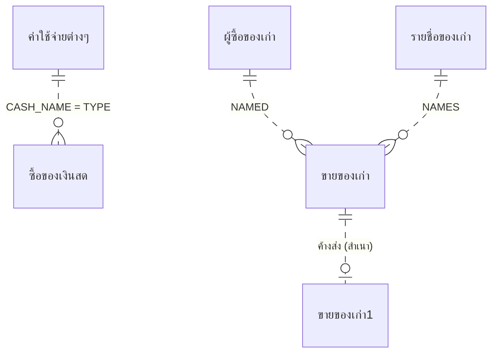

# Data Model — เงินสดย่อย

> สถานะ: ร่าง (2026-10-05)
> จำนวนแถวจาก `COUNT(*)` บนสำเนาไฟล์ (2026-10-05) · ข้อมูลทุกแถว: `source/_extract/เงินสดย่อย/full/*.csv` · ผลตรวจ: `_data_checks.txt`
> ทุกฟิลด์ไม่ Required, ไม่มี Validation · ฟิลด์ข้อความ AllowZeroLength ตามค่าปริยาย · **ไม่ได้ประกาศความสัมพันธ์ใด ๆ** · ขั้นตอนอยู่ใน business-rules.md

## สารบัญตาราง
ระบบเดิมมี 27 ตาราง ย้ายไป 6 ตาราง (+ ค่าตั้ง 1 ค่าจาก ขายของเก่า2)

| ID | ตาราง | กลุ่ม | หน้าที่ | แถว / ข้อมูลล่าสุด |
|---|---|---|---|---|
| T-ซื้อของเงินสด | ซื้อของเงินสด | A. ธุรกรรม | บรรทัดค่าใช้จ่ายเงินสดย่อย | 19,037 / 2026-09-11 (ตั้งแต่ 2017 + 7 แถวปี 2011) |
| T-ขายของเก่า | ขายของเก่า | A. ธุรกรรม | บรรทัดใบเสร็จขายของเก่า | 1,859 / 2026-09-08 (ตั้งแต่ 2010) |
| T-ขายของเก่า1 | ขายของเก่า1 | A. สถานะ | บรรทัดใบเสร็จที่ยังค้างส่งออฟฟิส | 385 / เลขที่ 64001–69029 |
| T-ค่าใช้จ่ายต่างๆ | ค่าใช้จ่ายต่างๆ | C. Lookup | ประเภทค่าใช้จ่าย | 40 |
| T-ผู้ซื้อของเก่า | ผู้ซื้อของเก่า | C. Lookup/Master | ผู้ซื้อของเก่า | 12 |
| T-รายชื่อของเก่า | รายชื่อของเก่า | C. Lookup | ชนิดของเก่า + หน่วย | 29 |
| — | 21 ตารางที่เหลือ | D/E/F/ระบบ | | ดู "ตารางที่ไม่ย้าย" |

## T-ซื้อของเงินสด — บรรทัดค่าใช้จ่ายเงินสดย่อย
หน้าที่: หนึ่งแถว = หนึ่งรายการที่จ่าย หลายแถวที่ `SUF` เดียวกันคือใบสำคัญจ่ายใบเดียวกัน (🔍 ❓ Q-03)
จำนวนแถวปัจจุบัน: 19,037 (~2,000/ปี) · ใช้ที่: SCR-03, SCR-04, RPT-01…04

| ฟิลด์ | ชนิด | ขนาด | Null | Default | Key | ความหมาย / กฎ |
|---|---|---|---|---|---|---|
| DATE | Date/Time | | ได้ (แถวที่ว่างถูกลบ BR-003) | | | วันที่จ่าย · Short Date · ไม่มีเวลา |
| SUF | Text | 50 | ได้ (ถูกลบถ้าว่าง BR-003) | | | เลขที่ใบสำคัญจ่าย `MM/NN` = เดือน/ลำดับในเดือน เช่น `09/35` กรอกเอง ไม่ตรวจซ้ำ (BR-002) |
| NAME | Text | 255 | ได้ (ถูกลบถ้าว่าง BR-003/004) | | | รายการที่ซื้อ เช่น `ซีล TC 25-40-8` |
| QTY | Double | | ได้ | 0 | | จำนวน (มีทศนิยม เช่น ลิตร `25.01`) · `0` = ลบแถว (BR-004) |
| UNIT | Text | 50 | ได้ | | | หน่วย — เติมอัตโนมัติจากรายการที่เลือก (BR-002) |
| U_PRICE | Double | | ได้ | 0 | | ราคาต่อหน่วย · 4,980 แถวเป็น 0 (กรอกจำนวนเงินตรง เช่น น้ำมัน) |
| AMOUNT | Double | | ได้ | 0 | | จำนวนเงิน (บาท) = QTY × U_PRICE เมื่อแก้ราคา หรือกรอกเอง (BR-002, RND-B) |
| TYPE | Text | 255 | ได้ (ถูกลบถ้าว่าง BR-003) | | 🔍 → T-ค่าใช้จ่ายต่างๆ.CASH_NAME (ข้อความ) | ประเภทค่าใช้จ่าย |
| MARK | Text | 50 | ได้ | | | `Y` = เลือกพิมพ์ใบสำคัญจ่าย (ชั่วคราว ล้างเมื่อออกจากหน้าจอ BR-005) · ปัจจุบันว่างทุกแถว |

Index: ไม่มี · ไม่มี PK

---

## T-ขายของเก่า — บรรทัดใบเสร็จขายของเก่า
หน้าที่: หนึ่งแถว = หนึ่งบรรทัดของใบเสร็จ; ข้อมูลหัวใบเสร็จ (DATE, NO, NAMED, ADDRESS, TEL) ซ้ำทุกบรรทัด
จำนวนแถวปัจจุบัน: 1,859 (765 ใบ) · ใช้ที่: SCR-09, SCR-10, RPT-06, RPT-09

| ฟิลด์ | ชนิด | ขนาด | Null | Default | Key | ความหมาย / กฎ |
|---|---|---|---|---|---|---|
| DATE | Date/Time | | ได้ (ถูกลบถ้าว่าง BR-014) | วันนี้ (ค่าเริ่มต้นบนหน้าจอ) | | วันที่ใบเสร็จ · Short Date |
| NO | Text | 50 | ได้ | ออกอัตโนมัติ (BR-011) | 🔍 เลขที่ใบเสร็จ | `YYNNN` เช่น `69029` |
| NAMED | Text | 100 | ได้ | | 🔍 → T-ผู้ซื้อของเก่า.NAMED (ข้อความ) | ชื่อผู้ซื้อ |
| ADDRESS | Text | 255 | ได้ | | | สำเนาจากผู้ซื้อตอนเลือก (BR-012) |
| TEL | Text | 50 | ได้ | | | สำเนาจากผู้ซื้อ |
| SUF | Single | | ได้ | 0 | | ลำดับบรรทัด 1, 2, 3 … กรอกเอง |
| NAMES | Text | 255 | ได้ (ถูกลบถ้าว่าง BR-014) | | 🔍 → T-รายชื่อของเก่า.NAMES | ชนิดของเก่า |
| UNIT | Text | 50 | ได้ | | | เติมจากชนิดของเก่า |
| QTY | Single | | ได้ (ถูกลบถ้าว่าง BR-014) | 0 | | จำนวน (Format Standard) |
| U_PRICE | Single | | ได้ | 0 | | ราคา |
| AMOUNT | Single | | ได้ | 0 | | จำนวนเงิน = QTY × U_PRICE เมื่อแก้ราคา (RND-B) หรือกรอกเอง — 3 แถวไม่ตรงสูตร |
| MARK | Text | 50 | ได้ | `"Y"` | | `Y` = รอพิมพ์/เลือกพิมพ์ซ้ำ; ว่าง = พิมพ์แล้ว (BR-012, BR-015) |
| CODE | Text | 50 | ได้ | | Index `CODE` ไม่ unique | `NO & SUF` — กำหนดตอนพิมพ์ (BR-013) |

ปัจจุบัน MARK ว่างทุกแถว · ไม่มีคู่ (NO, SUF) ซ้ำ

---

## T-ขายของเก่า1 — บรรทัดใบเสร็จค้างส่งออฟฟิส
หน้าที่: สำเนาบรรทัดใบเสร็จที่พิมพ์แล้วแต่ยังไม่ได้ตัดยอดส่งออฟฟิส — การเพิ่ม/ลบ/สร้างใหม่ ดู BR-012, BR-015, BR-016
จำนวนแถวปัจจุบัน: 385 (ใบเสร็จ 64001–69029, ปี 2021–2026 — 🔍 ไม่ได้ตัดยอดตั้งแต่ 2020 ❓ Q-12)

โครงสร้างเหมือน T-ขายของเก่า ทุกฟิลด์ ส่วนที่ต่าง:

| ฟิลด์ | ชนิด | ขนาด | Null | Default | Key | ความหมาย / กฎ |
|---|---|---|---|---|---|---|
| MARK | Text | 50 | ได้ | (ไม่มี) | | `N` ระหว่างตัดยอด, `Y` ระหว่างคำนวณใหม่ (BR-015/016) · ปัจจุบัน `Y` 33 แถวค้าง |

---

## T-ค่าใช้จ่ายต่างๆ — ประเภทค่าใช้จ่าย
หน้าที่: รายการให้เลือกในช่องประเภท (TYPE) · ใช้ที่: SCR-02, SCR-03/04, RPT-05
จำนวนแถว: 40

| ฟิลด์ | ชนิด | ขนาด | Null | Default | Key | ความหมาย / กฎ |
|---|---|---|---|---|---|---|
| CASH_NAME | Text | 255 | ได้ | | 🔍 คีย์ธุรกิจ (ไม่มี index) | ชื่อประเภท เช่น `ค่าขนส่ง`, `ค่าใช้จ่ายแผนกไดคาสท์`, `ค่าใช้จ่ายยานพาหนะ (ณน - 9974)` |
| MARK | Text | 50 | ได้ | | | `DEL` ชั่วคราวระหว่างลบ (BR-001 — ใช้ไม่ได้) |

ค่าทั้งหมด: `source/_extract/เงินสดย่อย/full/ค่าใช้จ่ายต่างๆ.csv` (40 ค่า)

---

## T-ผู้ซื้อของเก่า — ผู้ซื้อของเก่า
จำนวนแถว: 12 · ใช้ที่: SCR-07, SCR-09, RPT-10

| ฟิลด์ | ชนิด | ขนาด | Null | Default | Key | ความหมาย / กฎ |
|---|---|---|---|---|---|---|
| NAMED | Text | 255 | ได้ (ถูกลบถ้าว่าง BR-010) | | 🔍 คีย์ธุรกิจ | ชื่อผู้ซื้อ |
| ADDRESS | Text | 255 | ได้ | | | ที่อยู่ (ว่าง 4 ราย) |
| TEL | Text | 50 | ได้ | | | โทร (หลายเบอร์คั่นด้วย `,`) |

---

## T-รายชื่อของเก่า — ชนิดของเก่า
จำนวนแถว: 29 · ใช้ที่: SCR-08, SCR-09/10, RPT-11

| ฟิลด์ | ชนิด | ขนาด | Null | Default | Key | ความหมาย / กฎ |
|---|---|---|---|---|---|---|
| NAMES | Text | 255 | ได้ (ถูกลบถ้าว่าง BR-010) | | 🔍 คีย์ธุรกิจ | ชื่อของเก่า เช่น `เศษเหล็ก`, `น้ำมันเก่า` |
| UNIT | Text | 50 | ได้ | | | หน่วย: `กก.`, `ถัง`, `ใบ`, `คู่`, `ลูก`, `ตลับ` |

---

## ความสัมพันธ์
ไม่มีการประกาศ — อ้างอิงด้วยข้อความ ไม่ตรวจ ไม่ cascade (แก้ชื่อใน lookup ไม่กระทบแถวเดิม)

| แม่ (1) | ลูก (N) | ฟิลด์ | บังคับ | Cascade | ที่มา |
|---|---|---|---|---|---|
| T-ค่าใช้จ่ายต่างๆ | T-ซื้อของเงินสด | CASH_NAME → TYPE | ไม่ (🔍 dropdown) | ไม่ | RowSource ช่อง TYPE |
| ใบสำคัญจ่าย (ไม่มีตาราง) | T-ซื้อของเงินสด | SUF | ไม่ | | 🔍 ข้อมูล |
| T-ผู้ซื้อของเก่า | T-ขายของเก่า | NAMED (+ สำเนา ADDRESS, TEL) | ไม่ | ไม่ | RowSource |
| T-รายชื่อของเก่า | T-ขายของเก่า | NAMES (+ สำเนา UNIT) | ไม่ | ไม่ | RowSource |
| ใบเสร็จ (ไม่มีตารางหัว) | T-ขายของเก่า | NO | | | |
| T-ขายของเก่า | T-ขายของเก่า1 | NO+SUF (สำเนาแถว) | | | BR-012, BR-015 |

## ข้อมูลอ้างอิง (lookup / master)
- T-ค่าใช้จ่ายต่างๆ 40 ค่า, T-รายชื่อของเก่า 29 ค่า, T-ผู้ซื้อของเก่า 12 ราย — ค่าทั้งหมดใน `full/*.csv`
- รายการซื้อ (NAME) ไม่มี master — dropdown เสนอจาก **ตารางสำรองปี 2016–2017** `สำเนาของ ซื้อของเงินสด` (query `Query1`) ⚠ BR-002

## ปัญหาคุณภาพข้อมูลที่พบ
| ปัญหา | ตาราง / แถว | ผลกระทบต่อการย้ายข้อมูล |
|---|---|---|
| TYPE ที่ไม่อยู่ในรายการประเภท / มีขึ้นบรรทัดใหม่ในค่า (`ค่าใช้จ่ายอบรม\r\nค่าใช้จ่ายการเดินทางในประเทศ`) / สะกดต่างกัน (`(1 ฒง 494)`, `(1ฒง 494)`, `(1 ฒง 494 )`) | T-ซื้อของเงินสด ~70 แถวมี CRLF; หลายประเภทไม่มีใน T-ค่าใช้จ่ายต่างๆ | สรุปตามประเภทแยกเป็นหลายกลุ่ม — ❓ Q-05 normalize หรือคงเดิม |
| AMOUNT ≠ QTY × U_PRICE | T-ซื้อของเงินสด 4,983 แถว (4,980 คือ U_PRICE = 0); T-ขายของเก่า 3 แถว | ไม่แก้ — AMOUNT คือค่าที่จ่ายจริง |
| วันที่ปี 2011 | T-ซื้อของเงินสด 7 แถว (🔍 พิมพ์ปีผิด) | ❓ Q-06 |
| SUF ปีไม่อยู่ในเลข — `09/35` ซ้ำได้ทุกปี | T-ซื้อของเงินสด | เลขที่ใบสำคัญจ่ายไม่ unique ข้ามปี; หลายบรรทัดต่อเลขที่เป็นเรื่องปกติ |
| ข้อมูลขายของเก่าปี 2010–2016 ยังอยู่ทั้งที่มีการลบข้อมูลปีที่แล้ว (สำเนาเดือน พ.ค. 2017) | T-ขายของเก่า | หลักฐานของบั๊ก BR-020 ⚠ |
| MARK `Y` ค้าง 33 แถว | T-ขายของเก่า1 | ล้างตอนย้าย |
| QTY/U_PRICE/AMOUNT ของขายของเก่าเป็น Single (ทศนิยมเพี้ยน เช่น 0.33000001) | T-ขายของเก่า | ย้ายเป็น decimal 2–3 ตำแหน่ง |

## ฟิลด์/ตารางที่เลิกใช้
| ฟิลด์ | หลักฐาน | ข้อเสนอ |
|---|---|---|
| T-ซื้อของเงินสด.MARK, T-ขายของเก่า.MARK, T-ค่าใช้จ่ายต่างๆ.MARK | ธงชั่วคราวของ macro | ระบบใหม่แทนด้วยการเลือกบนหน้าจอ (ไม่ต้องเก็บ) |
| T-ขายของเก่า.CODE | สร้างจาก NO & SUF | คำนวณได้ |

## ตารางที่ไม่ย้าย
| กลุ่ม / เหตุผล | ตาราง | หลักฐาน |
|---|---|---|
| D. พารามิเตอร์ 1 แถว | วันที่ (FROM_DATE, TO_DATE, MONTH, LAST_PAY) | ช่วงวันที่ของรายงาน RPT-02/04/09 + ค่าใช้จ่ายงวดก่อน (ปัจจุบัน 2026-09-01…03, 21,456) และ TO_DATE ของลบ/ย้ายกลับ BR-020/021 — 🔍 LAST_PAY ค่าล่าสุดผู้ใช้อาจต้องการให้จำ ❓ Q-08 |
| D. พารามิเตอร์ 1 แถว | วันที่1 (FROM_DATE, TO_DATE, MONTH, LAST_DATE, LAST_PAY, DATES, RECEIVE, DAY, DATE1, RECEIVE1) | พารามิเตอร์ RPT-03 — ค่าปี 2008 (🔍 ไม่ได้ใช้ตั้งแต่ 2008 ❓ Q-09) |
| D. พารามิเตอร์ 1 แถว | FROM_NO (from_no, to_no) | ช่วงเลขที่ตัดยอด (`65001`–`65011`) BR-016 |
| D. พารามิเตอร์ 1 แถว | Table11 (REF_NO) | `590022` — 🔍 เดิมชื่อ `Table1` ที่ฟอร์ม/query ลบใบเสร็จอ้าง (BR-017 ⚠) |
| D. พารามิเตอร์ 1 แถว | ตาราง1 (NAME) | ช่องเลือกประเภทที่จะลบ (BR-001) — ว่าง |
| E. ตารางพักผล **แต่ต้องจำค่า 1 ค่า** | ขายของเก่า2 (โครงสร้างเหมือน T-ขายของเก่า ไม่มี CODE; มี `from_no`, `to_no` Text 50 ว่างทุกแถว) | 1,474 แถว 53001–63028 = บรรทัดของการตัดยอดครั้งล่าสุด ถูกล้างทุกครั้งที่ตัดยอด (BR-016) · `MAX(NO)` = `63028` ใช้คำนวณยอดค้างใหม่ (BR-015) → ระบบใหม่เก็บเป็นค่าตั้ง "เลขที่ใบเสร็จสุดท้ายที่ตัดยอดแล้ว" ไม่ต้องย้ายแถว |
| E. ตารางพักผล | REFNO (NO) | เลขที่ตัดยอดล่าสุดชั่วคราว (`63028`) BR-015 |
| E. ตารางพักผล | NO (NO PK) | 765 เลขที่ใบเสร็จที่ออกแล้ว — ใช้หา MAX ออกเลขถัดไป (BR-011) สร้างใหม่จาก T-ขายของเก่า ทุกครั้งที่แก้ไขใบเสร็จ (BR-015) → ระบบใหม่คำนวณจาก T-ขายของเก่า |
| E. ตารางพักผล | ขายของเก่า4 (PK CODE) | สำเนา T-ขายของเก่า ใช้กันบรรทัดซ้ำ (BR-013) — 1,859 แถวเท่าต้นฉบับ · ⚠ ต้นเหตุของบั๊ก BR-020 |
| E. ตารางพักผล (ไม่ใช้) | ขายของเก่า3 | 0 แถว — query `พิมพ์ยอดขายของเก่า1/2/3` ไม่ถูกเรียก |
| F. สำรองจากงานประจำปี | สำเนาของ ขายของเก่า (1,137 แถว 2010-01…2017-04), สำเนาของ ซื้อของเงินสด (2,831 แถว 2016-01…2017-05) | snapshot ครั้งล่าสุดที่รันลบข้อมูลปีที่แล้ว (BR-020) · `สำเนาของ ซื้อของเงินสด` ยังเป็น RowSource ของช่องรายการ (BR-002) ❓ Q-20 |
| F. สำเนา/เลิกใช้ | `สำเนาของ ขายของเก่า1`, `สำเนาของ ขายของเก่า2`, `สำเนาของ ขายของเก่า3`, `สำเนาของ ขายของเก่า4` | 0 แถว ไม่มี query อ้าง |
| F. สำเนา/เลิกใช้ | Sheet1 (CASH_NAME 46 แถว) | 🔍 นำเข้าจาก Excel รายชื่อประเภทเก่า ไม่มีวัตถุใดอ้าง |
| F. สำเนา/เลิกใช้ | ชื่อของเก่า (NAMES, UNIT 35 แถว) | ไม่มีวัตถุใดอ้าง (ใช้ `รายชื่อของเก่า` แทน) |
| F. สำเนา/เลิกใช้ | เดือน (MANE, DAY 12 แถว ปี 2549) | จำนวนวันทำงานรายเดือนปี 2549 — ไม่มีวัตถุใดอ้าง |
| ตารางระบบ | Switchboard Items (22), Switchboard Items1 (22 — สำเนาเหมือนกันทุกแถว ไม่ถูกใช้) | ถอดเป็นแผนผังเมนูแล้ว |
